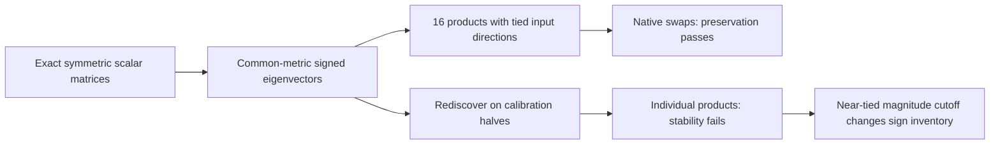

# Research update — 2026-09-21 00:27 UTC

A symmetric tied-reader program passes native swap preservation with half the untied baseline's stored input coefficients. Its individual products are still not consistently recovered across calibration splits. A signed-eigenvalue cutoff diagnosis explains part of that instability without changing the failed criterion.

## Structural assumption and exact target

For each fixed output reader, the exact midpoint scalar matrix satisfies K=K transpose. Its two inputs n and m are both in the residual coordinate space. This symmetry applies to (n,m); it is not symmetry between midpoint coordinates and the differently sized previous-channel-product coordinates p. Computing m=Dprev p remains upstream.

The tied approximation is

$$
\widehat t_g(n,m)=\sum_{j=1}^{r}\epsilon_{gj}
(v_{gj}^\top n)(v_{gj}^\top m)-\mu_g,
\qquad \epsilon_{gj}\in\{-1,+1\}.
$$

One direction is stored once and evaluated on both inputs. Define the trace-balanced common calibration moment

$$
M=\tfrac12\left(\frac{\mathbb E[nn^\top]}{\operatorname{tr}\mathbb E[nn^\top]}
+\frac{\mathbb E[mm^\top]}{\operatorname{tr}\mathbb E[mm^\top]}\right).
$$

With a small ridge and S squared equal to the regularized M, diagonalize S K S, retain the r largest absolute eigenvalues, and absorb their magnitudes into v. This is a signed symmetric spectral baseline under a common input metric. It is different from both independent marginal weighting and the exact joint lifted moment.

The full signed decomposition reproduces K within 2.1e-12. Archived teacher matrices reproduce native calibration scalars within 8.3e-8. Keeping four terms per feature gives 16 products and 18,432 stored direction coefficients. There are still 36,864 linear coefficient multiplications because each direction is evaluated on two inputs. Sixteen routing signs, four means, and the unchanged writers are additional.

## Accuracy and native swaps

At 16 products, common-moment calibration scalar error is 10.4%, versus 39.9% for isotropic tied factors and 7.18% for the larger untied baseline. Native same-token swaps give:

| Joint centered effect error | Untied confirmed baseline | Shared-input refit | Tied spectral program |
|---|---:|---:|---:|
| FineWeb | 6.45% | 7.77% | 7.73% |
| Code | 6.22% | 7.72% | 7.43% |

The tied program passes the unchanged all-feature and 1.25-times-baseline joint preservation bars on reused diagnostic panels. Its worst individual swap error is 14.5%. It has not received fresh confirmation or a separate removal test. It saves storage, while the shared-input refit also saves projection arithmetic; neither is unconditionally better across all costs.

## Conditional product stability fails

The follow-up holds the four output definitions fixed and rediscovers their tied directions using the same four complementary calibration-document partitions as before. It compares signed rank-one contribution tensors, allowing permutations and the irrelevant sign of v itself. This is narrower than the earlier test that rediscovered output features.

The criterion required every matched contribution-tensor cosine to exceed 0.9. It fails. Some split/feature combinations exceed 0.95 throughout, but others have weak matches; the fourth output feature fails in every partition. Fixed-feature behavioral fidelity does not establish stable constituent products.

A subsequent CPU diagnosis finds that the positive/negative inventory selected by magnitude truncation changes. For the fourth output feature, the full calibration's fourth and fifth eigenvalues differ in absolute magnitude by only 0.5%. One half of each partition selects three positive and one negative term, while the other selects two positive and two negative terms. No permutation can match the two inventories as four identical signed contributions.

This is a magnitude-cutoff issue, not equality of the signed eigenvalues, and does not explain every weak match. A larger or sign-constrained block may avoid this particular truncation switch, but has not been evaluated. The registered stability failure remains.

The larger confirmed program, shared-input graph and tied-reader program remain distinct cost–accuracy baselines. Semantic selectivity and stable discovery of constituent computations remain open. Next structural alternatives should treat close signed modes as explicit blocks or constrain sign allocation, rather than silently interpreting whichever term lies just above a truncation boundary as a unique circuit.

Receipts: `MIDPOINT_TIED_READERS_V1.json/.pt`, `MIDPOINT_TIED_SWAP_V1.json`, `MIDPOINT_TIED_STABILITY_V1.json`, `MIDPOINT_SIGNED_CUTOFF_V1.json` under `direct_tensor_match`.
