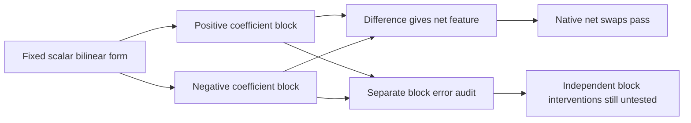

# Research update — 2026-09-21 00:35 UTC

Grouping signed products into low-rank coefficient blocks gives a more consistent object across calibration splits. With three terms per sign, the resulting 24-product program also preserves native swap accuracy. Independent manipulation of the eight signed blocks remains untested, and their prediction errors are uneven.

## Stable blocks versus stable products

For each of the four fixed scalar output features, split the symmetric bilinear matrix into positive and negative spectral blocks under the common calibration metric:

$$
K_g\approx K_{g,+}-K_{g,-},\qquad
K_{g,\pm}=\sum_{j=1}^{r}v_{g,\pm,j}v_{g,\pm,j}^{\top}.
$$

Each block contributes a scalar n transpose K m. Positive refers to the coefficient matrix being positive semidefinite; the scalar amplitude can be negative because n and m differ.

We compare complete block matrices across calibration halves, rather than requiring their individual rank-one products to match. The block comparison is a normalized Frobenius inner product after applying the fixed full-calibration input metric. It is invariant to internal changes of product basis that preserve the block.

Four complementary document partitions are reused. Output feature definitions are held fixed, so this is conditional stability of the input computation. It does not repair the earlier failure to rediscover all four output features independently.

| Fixed sign allocation per feature | Products | Input coefficients | Calibration error | Individual product stability | Signed block consistency |
|---|---:|---:|---:|---|---|
| Two positive, two negative | 16 | 18,432 | 22.9% | Fail | Pass |
| Three positive, three negative | 24 | 27,648 | 6.9% | Fail | Pass |

The criteria were every individual contribution cosine>0.9, every signed block cosine>0.95, and calibration error at most1.25 times the confirmed7.18% baseline. Two-per-sign fails accuracy badly, particularly feature2, and is not promoted. Three-per-sign passes the accuracy and block criteria; its weakest block cosine is about0.954, while some individual product matches fall near0.20.

This supports investigating blocks as reusable units, not declaring the underlying products unique or meaningful.

## Native net-feature validation

The 24-product candidate passes the existing native same-token swap screen on reused FineWeb and code panels:

| Joint centered effect error | Confirmed 16-product baseline | Three-per-sign candidate |
|---|---:|---:|
| FineWeb | 6.45% | 6.44% |
| Code | 6.22% | 5.59% |

All individual feature criteria also pass. These edits act on each positive-minus-negative net feature and on the four net features together. They do not validate separate edits of the eight signed blocks.

The candidate stores25% fewer input coefficients than the untied baseline but uses50% more products and projection arithmetic. It is a cost–accuracy alternative, not an unconditional simplification across every cost measure. It has not received new-document confirmation.

## Eight-block extraction and redteam audit

A CPU successor explicitly exported all eight block amplitudes and their writers, plus full spectral teacher blocks. Their signed sum reproduces the scalar teacher matrices within2.1e-12; centered net amplitudes replay within8.3e-8. Positive and negative blocks for a feature have opposite writers along the same output direction. Eight computations therefore do not mean eight independent output directions.

Comparing each rank-three block with its full spectral teacher reveals larger errors than the net-feature test suggests. The worst block has52.0% calibration error relative to its centered variation. About72% of that squared error is a constant offset mismatch. Correcting each student's calibration mean reduces the worst error to27.5%, while other block errors range from3.2% to14.2%.

Mean correction uses the original calibration inputs and weight-derived block functions. It changes removal relative to zero, but cancels exactly in donor-minus-recipient swaps. Opposing block errors can also cancel in the net feature; measured centered error correlations range from0.225 to0.528. Consequently, neither block-matrix consistency nor accurate net swaps proves faithful independent block effects.

Next, independent block interventions can test whether these conditionally consistent computations transfer as reusable units. The weaker blocks may need adaptive widths or joint refitting; any change must retain the failed low-width results and account for the additional cost. Semantic selectivity and stable output discovery remain open.

Receipts: `MIDPOINT_SIGN_BALANCED_V1.json`, `MIDPOINT_SIGN_BLOCK3_V1.json`, `MIDPOINT_BLOCK3_SWAP_V1.json`, `MIDPOINT_SIGNED_BLOCK_EXPORT_V1.json`, and `MIDPOINT_BLOCK_ERROR_AUDIT_V1.json` under `direct_tensor_match`.
