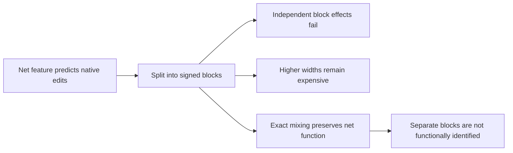

# Research update — 2026-09-21 00:43 UTC

Independent manipulation rejects the current signed blocks as faithful compact units. Net edits remain accurate, but two individual positive blocks are poorly predicted. Increasing spectral widths is expensive and still misses the calibration target. An exact algebraic control also shows that the positive/negative split is not identified by the net computation alone.

## Native intervention result

The shared evaluator now supports an explicit number of features, dense weight-derived teacher blocks, and removal or same-token swap interventions. Default four-feature behavior remains available. The eight-block program uses its own calibration means; teacher amplitudes use full spectral-block means. Recipients are positions16–255, with native final normalization and softcapping retained.

| Centered effect error | FineWeb removal | FineWeb swap | Code removal | Code swap |
|---|---:|---:|---:|---:|
| Positive block of feature0 | 42.4% | 28.8% | 35.1% | 34.4% |
| Positive block of feature2 | 52.5% | 37.7% | 9.5% | 13.4% |
| All eight blocks jointly | 4.7% | 6.4% | 3.2% | 5.6% |

All-block fidelity fails the registered error<30% and cosine>0.95 criteria. Joint fidelity passes. The joint same-token native effect energy matches the previous net-feature implementation within2.1e-8 relative error, supporting the instrument check. These results do not establish task-specific semantic effects.

## Adaptive widths do not cheaply fix the problem

A calibration-only rule selects the first spectral width from3 through16 achieving at most10% centered block prediction error. It uses the same rule for all eight blocks and no held outputs. Selected widths are

$$
(12,3,3,3,16,6,3,3).
$$

This totals49 products,56,448 direction coefficients and112,896 projection multiplications. Block4 still has21.7% calibration error at the16-term cap. The larger candidate is not sent to native validation or promoted. Stable coefficient geometry has not supplied cheap independently predictive subcomputations.

## An exact ambiguity of the signed blocks

Let a net coefficient matrix be represented as

$$
K=PP^\top-NN^\top.
$$

For any scalar t, define

$$
P'=\cosh(t)P+\sinh(t)N,\qquad
N'=\sinh(t)P+\cosh(t)N.
$$

Then

$$
P'P'^\top-N'N'^\top=PP^\top-NN^\top.
$$

This preserves the number of columns and products, while changing the two block functions. On the actual rank-three candidate, the executed control preserves each net feature within4.2e-15. At t=0.7, some centered positive-block activations change by over400%, and one old/new activation cosine is approximately0.012. The full net function is unchanged.

The fixed-metric spectral orthogonality constraint chooses a particular split, but function matching and rank constraints alone do not choose it. Conditional split consistency under one procedure is weaker than intrinsic identification.

## Focused literature check and next direction

Block-term decomposition directly represents a shared output vector multiplying a low-rank bilinear form. Domanov and De Lathauwer provide uniqueness and computational results for rank-(1,L,L) terms under stated conditions; these are not blanket guarantees for arbitrary fitted blocks. Our paired positive/negative writers are proportional, and the explicit ambiguity above prevents importing a generic uniqueness conclusion. [Primary paper](https://arxiv.org/abs/1808.02423).

For the next model, the relevant form is

$$
T_{oij}\approx\sum_g W_{og}(A_gB_g^\top)_{ij},
$$

with learned output groupings and no forced positive/negative split. Alternating least-squares algorithms exist for block-term models, but degeneracy is also possible. [Authors' algorithm and implementation page](https://tensorlabplus.net/papers/delathauwer2008btd.html).

This should be fitted to the original weight-derived tensor in the chosen output subspace, before imposing independent per-output low ranks. Fitting a teacher already constructed from four output-sharing blocks would risk rediscovering structure that our approximation manufactured. The known toy blocks can validate recovery; the native tensor remains the scientific test. This focused search supplements, rather than replaces, the scheduled01:37 mathematical review.

The confirmed composite-feature program remains the operational baseline. The signed-block failure is preserved; no stable semantic circuit is claimed.

Receipts: `MIDPOINT_INDEPENDENT_BLOCKS_V1.json`, `MIDPOINT_ADAPTIVE_BLOCKS_V1.json`, `MIDPOINT_SIGNED_BLOCK_GAUGE_V1.json` under `direct_tensor_match`.
