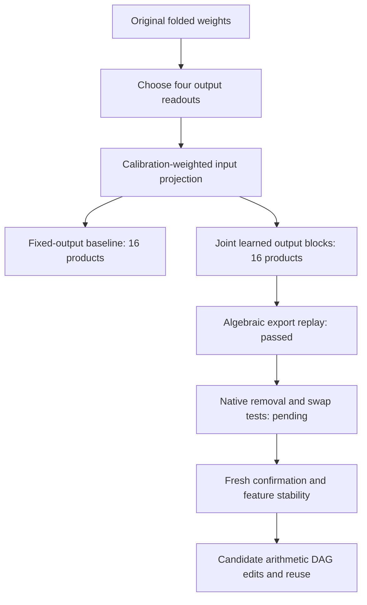

# Research update — 2026-09-21 00:51 UTC

The strongest confirmed result remains the 16-product, four-feature midpoint program. The newest result is a modest improvement from jointly learning output-sharing blocks. It has passed algebraic export checks, but has not yet undergone native-model intervention tests.

## What is being reconstructed?

Let $m$ be the previous MLP's polynomial residual contribution, $h$ the final MLP input, and $n=h-m/2$. For the homogeneous bilinear part $B$, the retained source-dependent contribution is

$$
B(h)-B(h-m)=D[(Ln)\odot(Rm)+(Rn)\odot(Lm)].
$$

This includes the source self-term and its cross terms with the remaining residual state. Actual normalization remains explicit. Four scalar output readouts define four matrices $K_g$, with amplitudes $n^\top K_gm$. We are simplifying this selected computation, not the full network or all vocabulary-output directions.

## Confirmed progress and limitations

- The original 16-product replacement passed fresh-panel joint swap tests: relative centered-logit effect error 5.71% on FineWeb and 5.43% on related local code. Joint removal errors were 5.91% and 4.61%. These are errors in intervention effects, not token prediction error or whole-model replacement error.
- Sharing input projections reduced stored input coefficients from 36,864 to 18,688 at the same product count. This passed reused-panel swap checks, but lacks fresh confirmation.
- Fitting with the exact empirical joint feature moment improved an eight-product candidate's reused-panel swap errors from 10.84% to 9.09% on FineWeb and 12.73% to 10.15% on code. It still failed our preservation threshold relative to the 16-product baseline.
- Splitting positive and negative blocks did not produce reliable independent units. Individual native intervention errors reached 52.5%, despite a good joint reconstruction. An exact algebraic transformation also preserves the net function while substantially changing those blocks. Reconstruction alone does not identify them.

## New joint block-term fit

A block is a sum of products sharing one learned output direction:

$$
\widehat T_{gij}=\sum_{b=1}^{4}W_{gb}\sum_{\ell=1}^{4}A_{ib\ell}B_{jb\ell}.
$$

Unlike the previous independent output fits, this jointly learns $W$. The target is the original weight-derived four-readout tensor, before independently truncating its output slices. Both arms use a shared 32-dimensional basis on each input mode; the omitted weighted tensor norm is 0.4996%.

| Metric | Fixed output groups | Learned output groups |
|---|---:|---:|
| Products | 16 | 16 |
| Full relative weighted coefficient error | 0.9938% | 0.8982% |
| Calibration scalar reconstruction error | 7.1984% | 6.2369% |

The coefficient metric uses separable calibration second moments. It is not isotropic Frobenius error, the full empirical joint-moment metric, or native intervention error. Calibration improvement is not held-out evidence.

Eight fits used three random seeds at two learning rates plus two starts from the fixed-group baseline. The best fit started from that baseline at Adam learning rate 0.003. Random restarts disagreed substantially about block identity (one matched block cosine was 0.147). The learned output map is well conditioned, with condition number 2.26. Exported product evaluation matches its dense matrices to relative error $4.95\times10^{-15}$; the output-coordinate change preserves the write to $1.89\times10^{-16}$.

## Five planted controls

Separate blocks were recovered nearly exactly in successful restarts. Generic dense blocks reached 0.31% error with matched block cosines above 0.9998. Nearly collinear outputs were harder (best error 2.53%). Shared-input and proportional-output controls could fit almost exactly while recovering different blocks, deliberately demonstrating non-identifiability. Learning rate and initialization materially changed outcomes; low loss alone is insufficient.

The next discriminating test is a matched native intervention comparison of fixed and learned output groupings. Joint effects are directly comparable; individual feature labels changed and must be interpreted in their new basis. The current evidence supports compact functional approximations, not stable semantic circuits or a completed general DAG search.
