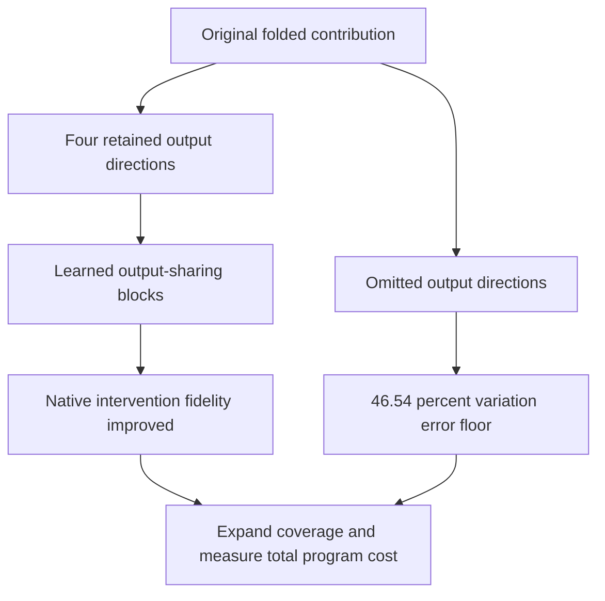

# Native block-term comparison and full-output coverage — 2026-09-21 00:57 UTC

Jointly learning output-sharing blocks improved native intervention fidelity at a fixed 16-product budget. All registered checks passed on the reused FineWeb/code panels. This is a useful functional improvement, not evidence that the learned blocks are identified semantic units.

| Joint centered-logit effect relative error | Fixed groups | Learned groups |
|---|---:|---:|
| FineWeb removal | 5.65% | 5.23% |
| FineWeb same-token swap | 6.48% | 6.21% |
| Code removal | 4.34% | 2.78% |
| Code same-token swap | 6.24% | 5.13% |

The native joint teacher effects agree across the changed output coordinates to relative energy discrepancy 5.1e-14. All learned individual same-token effects meet error <30% and cosine >0.95. Individual labels differ between the arms, so their errors do not establish a comparison of identical individual features. No fitting used these intervention panels, but the panels have been reused to compare candidates; fresh confirmation is still required.

## The larger limitation is output coverage

A successor CPU audit reconstructed the entire calibration folded-output variation, keeping its mean and explicitly including directions outside the selected four-output subspace. With vocabulary centering and before final normalization/softcap:

| Relative error against full variation | Fixed groups | Learned groups |
|---|---:|---:|
| Full replacement error | 46.97% | 46.86% |
| Error from omitted output directions alone | 46.54% | 46.54% |
| Approximation within retained directions | 6.37% | 5.52% |

The squared errors add because the retained and omitted components are orthogonal in this output metric; numerical cross terms are about 1e-17. Thus improving the four retained features barely changes full-function fidelity. The four-direction subspace captures about 78.3% of calibration variation energy; this is not 78.3% of model behavior or capability.

The next broader test should increase output coverage and price the resulting program, while continuing to compare decompositions and shared computation graphs. Further polishing only these four output coordinates cannot establish a compact replacement of the full folded contribution. Current programs also retain upstream source computations and explicit normalization, so their product counts are not whole-model runtime claims.

Artifacts: `MIDPOINT_BTD_NATIVE_V1.json`, the two native raw result files, and `MIDPOINT_BTD_COVERAGE_V1.json`. The goal remains active: stable feature identity, broader output coverage, general graph search, reuse and composition, and external OOD evidence are incomplete.
