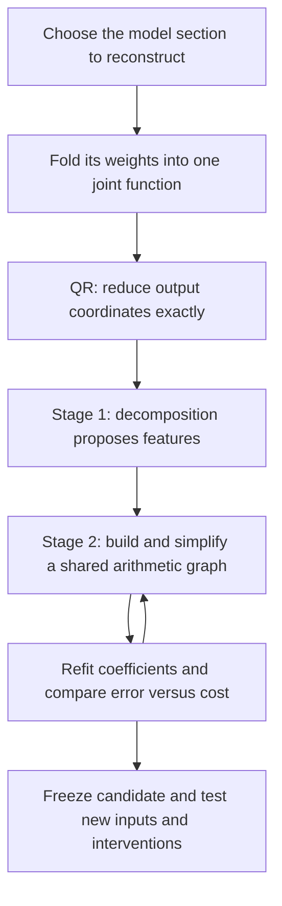
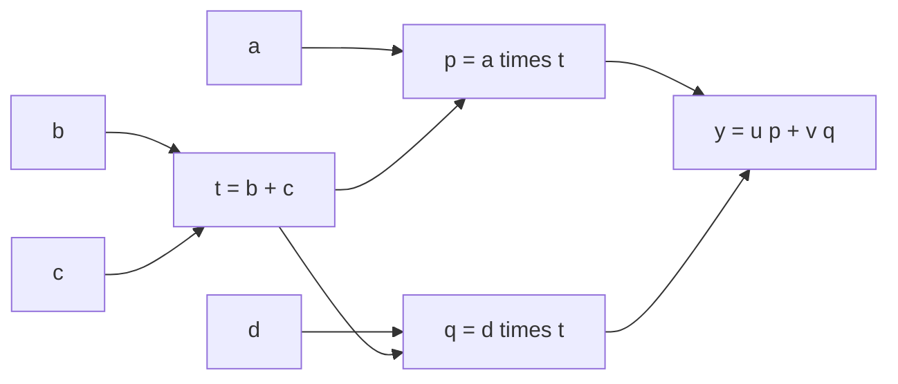

**Overall review: from folded weights to a smaller arithmetic program**

Rewritten 21 September 2026, 19:07 UTC. Results through the completed wide-dictionary Gaussian functional comparison. The existing filename is retained so earlier links still work.

**We are still pursuing the two-stage approach you remember.** First, use tensor decompositions to propose useful features. Then convert those features into an arithmetic graph and simplify it, allowing intermediate computations to be reused. QR reduces the output coordinates before either stage.

The results so far are useful but incomplete: we have working fitting and graph-editing tools, positive controls on known toy structures, and a full-last-MLP compression baseline. **We have not yet found a substantially simpler circuit that reliably preserves the native computation and its intervention behavior.** The general Tucker/HT-to-flexible-graph search remains unfinished.

This report explains the trajectory. The linked experiment records supply the details.

**1. The intended pipeline**

| Term | Meaning in this project |
|---|---|
| Folding | Combine weights, or substitute one computation into another, to study their joint function. |
| Coefficient tensor | An array specifying the coefficients of a polynomial. We usually work with it implicitly. |
| Feature | A scalar intermediate value: a projection, product, or combination of products. It need not correspond to one semantic concept. |
| Rank / width | How many intermediate directions or features a representation permits. |
| Arithmetic circuit / DAG | A graph of linear combinations and products; a computed value can feed several later nodes. |
| Reconstruction error | The discrepancy from a specified target, measured in a specified geometry or on specified inputs. Different errors below are not interchangeable. |

**2. What we reconstruct, and why QR helps**

For the last bilinear MLP, write its projected polynomial contribution as

$$
F(x)=UD\big[(Lx)\odot(Rx)\big].
$$

Here $x$ has 1,152 coordinates. $L$ and $R$ each produce 4,608 linear projections, $\odot$ multiplies corresponding projections, $D$ writes their products into the residual stream, and $U$ maps that stream to 50,304 vocabulary coordinates.

Your proposal was to reduce $UD$ directly. The implementation can equivalently start with a thin QR of $U$:

$$
U=Q R_U,\qquad Q^\top Q=I,\qquad C=R_U D.
$$

We then fit the smaller-output function

$$
\widetilde F(x)=C\big[(Lx)\odot(Rx)\big],\qquad F(x)=Q\widetilde F(x).
$$

For a replacement in the same output subspace,

$$
\|F(x)-Q\widehat{\widetilde F}(x)\|_2
=\|\widetilde F(x)-\widehat{\widetilde F}(x)\|_2.
$$

Thus we optimize 1,152 output coordinates instead of 50,304 without losing Euclidean accuracy. **QR is exact preprocessing; it does not itself simplify the MLP's products.**

The joint tensor being fitted is

$$
T_{vij}=\frac12\sum_k C_{vk}
\left(L_{ki}R_{kj}+L_{kj}R_{ki}\right),
\qquad
\widetilde F_v(x)=\sum_{i,j}T_{vij}x_i x_j.
$$

It is third order because it has three indices, but its function is quadratic. Substituting two pure bilinear layers gives a quartic function and an order-five tensor: one output index and four input indices.

RMSNorm and softcapping remain explicit operations. A polynomial formed by composing two MLPs while omitting the intervening normalization is a defined research target, not the full model's exact forward function.

**3. What the two stages are supposed to contribute**

Stage 1 asks: **which intermediate computations make the joint function compact?** A Tucker candidate is

$$
s=P^\top x,\qquad
h_g=\sum_{p,q}G_{gpq}s_p s_q,\qquad
\widehat{\widetilde F}=Wh.
$$

$P$ supplies input features; $G_{gpq}$ weights the interaction of features $p$ and $q$ inside computed feature $g$; $W_{:,g}$ gives that feature's output effect. Few features and few nonzero interactions are different constraints. A dense low-rank quadratic form can also be cheap, so entry sparsity alone is not the right cost measure.

HT extends this into a tree of bilinear computations: linear features become quadratic features, which combine into quartic features, and so on. Its tree groups tensor slots; each leaf can still read the full input. Ordinary HT seeks a compact tensor representation. Our final graph allows broader sharing across branches and depths.

Stage 2 asks: **can we compute these features more economically together?** For example,

$$
y=u(ab+ac)+v(db+dc)
$$

can be rewritten as

$$
t=b+c,\qquad p=at,\qquad q=dt,\qquad y=up+vq.
$$

This uses two products instead of four. A shared computation is charged once. We also count additions and stored coefficients, so expensive dense projections cannot hide behind a small product count.

Implemented edits now include exact sharing, approximate merging with refitting, product deletion, replacing a feature with a combination of peers, and simplifying the readout. **These are components of the intended search, not a completed general-purpose graph optimizer.**

**4. What actually happened after adopting this direction**

The experiments branched into three targets. This distinction was obscured by the earlier report.

| Branch | Target | Main finding |
|---|---|---|
| Local two-layer circuits | Selected measurements and output components | Sharing produces some savings, but fidelity and transfer remain limiting. |
| Full last MLP | All 4,608 products of the final MLP and their output effects | A useful pruning/refitting baseline exists; intervention accuracy remains inadequate. |
| Two-layer quartic path | The pure degree-four MLP16→MLP17 contribution | Small dictionaries lack capacity; wider fits improve training much more than transfer. |

MLP16 and MLP17 are the final two blocks, numbered from zero.

**First: we checked the algorithms on planted structure.** Five-family suites included independent products, shared inputs, shared outputs, squares, and cancellation. Some representations recover all families with enough fitting; other parameterizations still miss families from random starts despite succeeding near the planted solution. In one quadratic suite, nine of ten runs recovered the function below 1% error; graph deletion reached the planted product budget in four of five selected examples. In the newer quartic dictionary suite, long Adam runs recovered six of ten starts, covering four of five families. Adam outperformed Muon in those particular tests. These are distinct suites, not contradictory scores for one experiment.

The graph operators also pass planted sharing tests and reject examples where nearly identical features carry an important downstream difference. That provides evidence against simple implementation errors. It does not establish easy optimization or recovery of uniquely meaningful features. [Quadratic controls](research_update_2026-09-21_1742_learned_features_and_graph_refitting.md) · [Quartic controls](../../direct_tensor_match/WIDE_NATIVE_QUARTIC_INTERPRETATION_V1.md).

**Second: some narrow Tucker hypotheses were ruled out mathematically.** For 10% coefficient error on the full last-MLP tensor, matrix-unfolding spectra require input rank at least 1,089 and output rank at least 1,088 out of 1,152 dimensions. With activation-covariance weighting, those separate lower bounds become 416 and 818. These are necessary conditions, not a promise that those ranks suffice.

So the answer to “did Tucker fail because we assumed too small a rank?” is **yes for some tested narrow full-tensor choices**. No optimizer can overcome those bounds. But this does not rule out a broad sparse arithmetic program, and it is not a general failure theorem for HT. [Rank evidence](../../direct_tensor_match/FULL_TENSOR_MODE_INTERPRETATION_V1.md).

**Third: local graph savings did not become a faithful full replacement.** One selected two-layer calculation saved about 15.7% of source arithmetic but retained failures against competing baselines. Later edits reduced an archived approximate quartic program from 24 to 18 products, but incurred 27.1% calibration error relative to that approximation. Those edits were rejected. Reducing the cost of an already approximate program does not demonstrate fidelity to the native model. [Local result](research_update_2026-09-21_1451_local_graph_fidelity_pass.md) · [Graph results](research_update_2026-09-21_1841_graph_search_and_native_capacity.md).

**Fourth: the full-last-MLP baseline gave us a meaningful comparison.** Retaining 3,686 native products, refitting their writers, and adding an affine correction removes 20.0% of products and 11.7% of stored coefficients. The correction's cost is included. This baseline inherits the original input directions; it is not a newly discovered feature dictionary.

| Same-budget last-MLP replacement | FineWeb natural effect error | Code natural effect error | Intervention cohorts passing the 10% limit |
|---|---:|---:|---:|
| Prune native products and refit | 4.44% | 2.12% | 0 / 4 |
| Learn directions, covariance + response objective | 6.64% | 2.78% | 0 / 4 |
| Add an isotropic coefficient penalty | 4.21% | 2.07% | 1 / 4 |
| Later finite-response objective | 4.20% | 2.05% | 1 / 4 |

Natural effect error measures logit discrepancy relative to the original MLP's contribution, with downstream normalization and softcapping evaluated. Intervention tests swap an upstream MLP contribution and recompute the downstream path. They test a stronger requirement than ordinary forward agreement.

The lesson is that learning directions can improve the fitting score while worsening behavior. The mixed objectives recover modest improvements, but three intervention cohorts still fail. Follow-ups use the same already opened evaluation documents, so they are diagnostic comparisons, not independent confirmation. [Mixed-objective comparison](../../direct_tensor_match/FULL_QUADRATIC_MULTIGEOMETRY_INTERPRETATION_V1.md) · [Finite-response follow-up](../../direct_tensor_match/FULL_QUADRATIC_FINITE_RESPONSE_INTERPRETATION_V1.md).

**Fifth: expanding the quartic dictionary revealed a transfer problem.** A readout of all products of $m$ quadratic features has at most $m(m+1)/2$ output directions. On the cached native quartic targets, reaching 1% error requires at least 414–430 output directions, hence at least 29 quadratic features under this architecture. This motivated trying 32 rather than four features.

| Quartic dictionary, inherited initialization | Fitting-panel error after 1,000 steps | Second-panel error |
|---|---:|---:|
| Four quadratic features | 6.15% | 12.93% |
| 32 quadratic features | 2.16% | 15.05% |

More capacity helped fitting but did not improve transfer. The 32-feature program uses 656 products and 903,168 stored coefficients. Its target still excludes residual cross terms, biases, and intervening normalization. These percentages are polynomial-output errors and cannot be compared directly to the last-MLP logit errors above. [Capacity and graph scope](research_update_2026-09-21_1841_graph_search_and_native_capacity.md) · [Wider fits](../../direct_tensor_match/WIDE_NATIVE_QUARTIC_INTERPRETATION_V1.md).

**5. Did direct weight-based matching help?**

It made the joint fits practical and supplied useful global constraints. It has not yet solved the discovery problem.

The latest controlled comparison holds the learned 32-feature quartic dictionary fixed and changes only how its output weights are fitted:

| Output-weight objective | Second-panel functional error |
|---|---:|
| Fit empirical function values | 15.05% |
| Match isotropic coefficient tensor | 54.38% |
| Match second-moment-weighted coefficient tensor | 21.44% |
| Match exact second-moment Gaussian functional loss | 19.44% |

The coefficient objectives improved their own scores and passed numerical checks, but worsened function matching on these inputs. Activation information helps relative to isotropic matching, yet does not beat the empirical baseline. These are weight-based readout fits of a **data-informed dictionary**, not end-to-end weight-only discovery. A separate random-dictionary/isotropic control is fully weight-only and reconstructs almost none of the panel output. [Recorded comparison](../../direct_tensor_match/WIDE_QUARTIC_WEIGHT_READOUT_V1.json).

A follow-up included the complete Gaussian functional moments. It improved the activation-informed result to **19.44%**, but still missed the empirical baseline. Its predicted feature-moment geometry differs from the calibration panel by **21.76%**, even after correcting overall scale, compared with **8.47%** between the two empirical panels. Exact Gaussian algebra therefore does not establish that the Gaussian law fits these model inputs. [Gaussian comparison and moment audit](../../direct_tensor_match/WIDE_QUARTIC_GAUSSIAN_INTERPRETATION_V1.md).

Why can those results coexist? Coefficient Frobenius error, covariance-shaped coefficient error, and expected functional error weight discrepancies differently. Quadratic functional loss involves fourth-order input moments; quartic loss involves eighth-order moments. Covariance alone needs extra distributional assumptions to determine them. Better optimization of one metric need not improve another.

The next capacity checks separate output fitting from missing input information. Even an oracle output fit on the second panel cannot reduce the fixed wide dictionary below **7.58%**. Its input readers also miss substantial isotropic local sensitivity. But that conclusion depends on geometry: optimal 256-reader derivative-error floors are **19.13% / 15.45%** under isotropic perturbations, versus **3.76% / 2.92%** under centered activation covariance. Uncentered weighting gives still smaller floors because about **96%** of its derivative energy comes from the mean direction. These are local derivative bounds, not natural prediction errors or identified circuits. [Capacity checks and the covariance correction](../../direct_tensor_match/QUARTIC_READER_RANK_INTERPRETATION_V1.md).

**6. Where the original plan stands**

| Piece | Status |
|---|---|
| Joint folding and exact QR reduction | Implemented. |
| Direct fitting with and without activation information | Implemented; objective choice materially changes results. |
| Controlled decomposition and graph-edit tests | Working, with both successes and retained failures. |
| General HT/Tucker initialization followed by flexible graph search | Partial implementation. |
| Shared computation that beats fair native baselines while preserving interventions | Not established. |
| Stable, interpretable, reusable semantic circuit units | Not established by this branch. |

“Full coverage” in the old title meant accounting for the entire **chosen target**, including error outside the fitted subspace. It did not mean the whole model was decomposed. “Shared baselines” meant competitors were also allowed to reuse computations, so our graph would not win merely against a duplicated implementation.

The remaining research question is whether we can combine adequate capacity, a functional objective that transfers, and graph edits that produce real savings. The evidence separates three obstacles: ranks that cannot represent the target, optimization that fails even on known structure, and fitting objectives that disagree with the behavior we want to preserve. They require different remedies; calling all three “Tucker/HT failed” hides what we learned.
