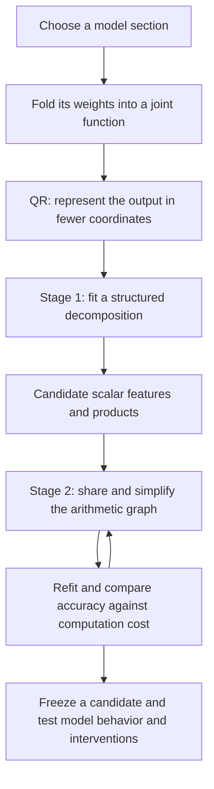
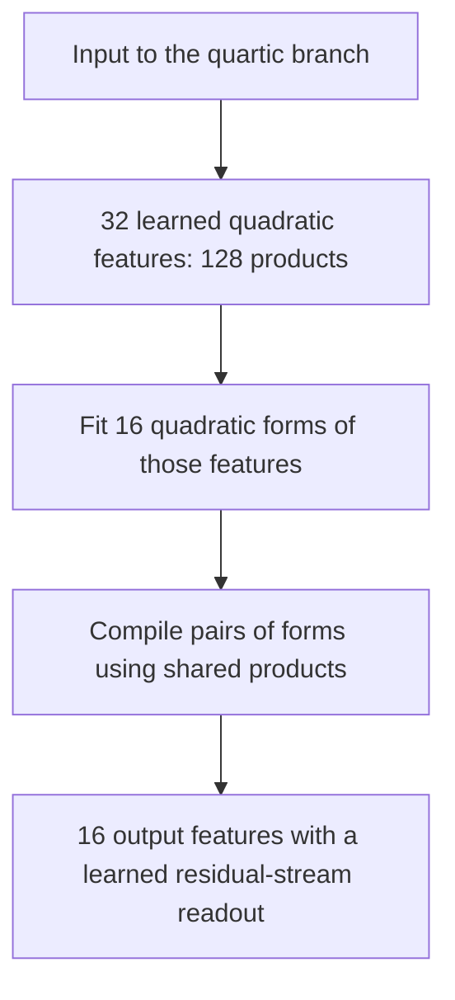

**Overall review: what happened to the decomposition → arithmetic-circuit plan?**

Rewritten 21 September 2026, 20:05 UTC, covering results through 19:56 UTC. The filename stays the same so existing links work.

**Yes—we are still following the two-stage plan you remember.** Fold a section of the model into one function, use a decomposition to find useful intermediate features, then simplify their computation into a graph that shares work. QR reduces the output coordinates before fitting.

We have made progress on both stages, but have not completed the general search procedure or found a validated, interpretable replacement circuit. The clearest recent success is a concrete quartic program reduced from **656 to 384 products**, with far fewer stored coefficients. That graph preserves its fitted parent very accurately; the parent itself still approximates the original model computation imperfectly. Model-level validation of this latest graph remains outstanding.

**The plan, in one picture**

The important distinction is between **finding a compact approximation** and **computing that approximation more cheaply**. Stage 1 can introduce approximation error. An exact stage-2 rewrite preserves that error; it does not repair it.

**1. What folding and QR do**

A bilinear MLP forms two sets of linear projections, multiplies corresponding entries, and writes the results back into the residual stream:

$$
B(x)=D\big[(Lx)\odot(Rx)\big].
$$

Here $x$ has 1,152 coordinates, and $L$ and $R$ each produce 4,608 scalar projections. Each paired multiplication is one **product**. With the unembedding $U$, its projected contribution is

$$
F(x)=UD\big[(Lx)\odot(Rx)\big].
$$

**Folding** means combining these weights so we study the joint function, rather than compressing each matrix independently. Earlier linear output projections can also be absorbed into $L$ and $R$.

You proposed QR on $UD$. The implementation uses a thin QR on $U$ and then folds in $D$:

$$
U=Q R_U,\qquad Q^\top Q=I,\qquad C=R_U D.
$$

We fit

$$
\widetilde F(x)=C\big[(Lx)\odot(Rx)\big],
\qquad F(x)=Q\widetilde F(x).
$$

This reduces 50,304 vocabulary coordinates to 1,152 output coordinates. Within this output subspace, Euclidean error is preserved exactly:

$$
\|F(x)-Q\widehat{\widetilde F}(x)\|_2
=\|\widetilde F(x)-\widehat{\widetilde F}(x)\|_2.
$$

QR therefore makes fitting cheaper without discarding output information. **It does not reduce the number of MLP products**, and this error identity applies before nonlinear downstream operations.

The **joint tensor** is simply the coefficient array for this quadratic function:

$$
T_{vij}=\frac12\sum_k C_{vk}
\left(L_{ki}R_{kj}+L_{kj}R_{ki}\right),
\qquad
\widetilde F_v(x)=\sum_{i,j}T_{vij}x_i x_j.
$$

“Third order” means three indices: one output and two inputs. It does **not** mean degree three. Composing two pure bilinear layers instead gives degree four and an order-five coefficient tensor. We generally compute contractions implicitly rather than store these enormous arrays.

**2. The two decomposition stages**

**Stage 1 proposes useful features.** For example, symmetric Tucker writes

$$
s=P^\top x,\qquad
h_g=\sum_{p,q}G_{gpq}s_p s_q,\qquad
\hat F=Wh.
$$

| Object | Meaning |
|---|---|
| $s_p$ | A learned scalar linear feature of the input. |
| $s_p s_q$ | An interaction between two features. |
| $G_{gpq}$ | How strongly that interaction contributes to computed feature $h_g$. |
| $h_g$ | A quadratic feature assembled from interactions. |
| $W_{:,g}$ | That feature’s output effect. |

Tucker limits the sizes of these feature dictionaries. Sparse Tucker additionally encourages few interactions. **HT—hierarchical Tucker—organizes such combinations into a tree:** linear features become quadratic features, then quartic features, and so on. Its branches group tensor input slots, not necessarily disjoint coordinates of $x$.

**Stage 2 simplifies the resulting program.** A DAG is a directed acyclic computation graph: once a value is computed, several later operations can reuse it. For example,

$$
y=u(ab+ac)+v(db+dc)
$$

can become

$$
t=b+c,\qquad p=at,\qquad q=dt,\qquad y=up+vq.
$$

That uses two products instead of four. Similar sharing can occur among quadratic intermediates in a quartic program. We count each shared product once, but also count additions and stored coefficients, including dense projections.

Implemented pieces include exact sharing, approximate merging with refitting, product deletion, feature substitution, and structured readout simplification. **We do not yet have a complete general Tucker/HT-to-arbitrary-DAG optimizer.** The experiments have tested particular structured families and particular graph edits.

A feature is a scalar computation, not automatically a semantic concept. Several unrelated conditions may share the same output effect. Neither sparsity nor output sharing establishes monosemanticity.

**3. What happened during the exploration**

The work split into three scopes. This was the main source of confusion in the previous report.

| Scope | What is reconstructed | What it tells us |
|---|---|---|
| Selected local circuits | Particular components or output measurements | Whether sharing and refitting work on manageable subproblems. |
| Full final MLP | All 4,608 products and their output effects | Whether a proposed decomposition beats a fair whole-layer baseline. |
| Two-layer quartic branch | The pure degree-four contribution through MLP16 and MLP17 | Whether hierarchical features and deeper sharing can give a smaller program. |

Blocks are numbered from zero. The quartic branch is **not the entire two-block computation**: residual cross terms, biases, attention and normalization must remain accounted for separately.

**First, the toy tests separated coding failures from difficult optimization.** Five-family suites included independent products, shared inputs, shared outputs, squares and cancellation. Known solutions and numerical replay checks validate the basic machinery. Random starts are less reliable: in the wider quartic suite, long Adam runs recovered six of ten starts across four of five families. Adam did better than Muon in those tests; that is not a universal optimizer ranking. Some planted graph edits succeed while deliberately harmful merges are rejected. [Toy and wider-fit evidence](../../direct_tensor_match/WIDE_NATIVE_QUARTIC_INTERPRETATION_V1.md).

**Second, some narrow Tucker choices were genuinely too small.** In the folded Euclidean coefficient metric, reaching 10% error on the full final-MLP tensor requires input rank at least 1,089 and output rank at least 1,088. These are separate necessary bounds from matrix unfoldings. Activation-covariance weighting lowers them to 416 and 818. An optimizer cannot rescue a rank below those bounds.

This rules out particular small dense Tucker representations, not sparse high-rank programs or HT in general. The original 4,608-product network is itself an example of structured computation with broad tensor ranks. [Rank evidence and costs](../../direct_tensor_match/FULL_TENSOR_MODE_INTERPRETATION_V1.md).

**Third, we established a full-layer baseline instead of comparing only against weak decompositions.** Keep 3,686 original products, refit their output weights, and add an affine correction. Including the correction, that saves 20.0% of products and 11.7% of stored coefficients. Natural logit-effect errors are 4.44% on FineWeb and 2.12% on code. However, all four intervention cohorts fail the 10% error criterion. Later learned/mixed-objective versions improve some numbers but still pass only one of four cohorts. Ordinary forward agreement is easier than preserving changed-input behavior. [Full-layer comparison](../../direct_tensor_match/FULL_QUADRATIC_FINITE_RESPONSE_INTERPRETATION_V1.md).

**Fourth, wider quartic decompositions improved fitting more than transfer.** After 1,000 steps, expanding from four to 32 quadratic features reduced fitting-panel error from 6.15% to 2.16%, but second-panel error worsened from 12.93% to 15.05%. More capacity was useful, but did not by itself solve the generalization problem. [Wider-fit evidence](../../direct_tensor_match/WIDE_NATIVE_QUARTIC_INTERPRETATION_V1.md).

**4. Did direct matching from the weights help?**

It gave us working joint objectives, exact readout solves and useful impossibility checks. **It has not yet yielded the best transferable approximation simply by minimizing tensor error.**

Holding the learned 32-feature quartic dictionary fixed, changing only its output-weight objective gave:

| Fitting objective | Second-panel polynomial-output error |
|---|---:|
| Empirical function values | 15.05% |
| Unweighted coefficient matching | 54.38% |
| Second-moment-weighted coefficient matching | 21.44% |
| Exact Gaussian functional loss with that second moment | 19.44% |

Activation information helps here, but these weight-based readout fits do not beat empirical fitting. The dictionary itself was learned using data, so these rows are not all end-to-end weights-only discovery. A separate random-dictionary, unweighted control also performed poorly. [Weight matching](../../direct_tensor_match/WIDE_QUARTIC_WEIGHT_READOUT_V1.json) · [Gaussian functional comparison](../../direct_tensor_match/WIDE_QUARTIC_GAUSSIAN_INTERPRETATION_V1.md).

The distinction matters: **coefficient error and function error are different objectives**. Quartic function error depends on eighth-order input moments. A covariance matrix alone does not specify those moments without additional assumptions. Exact optimization of a Gaussian surrogate does not make the actual model inputs Gaussian.

Subsequent fits added local derivative matching—agreement about how outputs change when inputs change. This produced a more useful parent for the latest graph work, while retaining a tradeoff between value accuracy and sensitivity accuracy. [Joint value/derivative fit](../../direct_tensor_match/QUARTIC_JOINT_READOUT_INTERPRETATION_V1.md).

**5. The clearest recent two-stage result**

We now have a specific instance of the plan, rather than only proposed graph edits:

Start with 32 quadratic features, each formed from four products of linear projections. The original readout uses all 528 distinct pairs of those features: 128 + 528 = 656 products.

We then fit a readout restricted to 16 shared output directions. Each receives a quadratic form of the 32 features. Finally, the compiler shares products between pairs of those forms.

| Program | Products | Stored floating-point coefficients |
|---|---:|---:|
| Unconstrained joint-fit parent | 656 | 903,168 |
| 16-output fit, separate quadratic forms | 640 | 330,240 |
| Same 16-output function, paired shared computation | **384** | **322,048** |

The final graph also stores 768 integer indices. These prices include the learned dense projections; the common unembedding and external normalization/background are outside the comparison.

There are **two different accuracy questions**:

- **Did the graph rewrite preserve the fitted function?** Yes: measured relative output discrepancy is below $6\times10^{-7}$ on both opened panels.
- **Does that fitted function match the original quartic target?** Approximately: its errors are **8.28% and 13.61%** on those panels. These are polynomial-output errors, not language-model error rates.

The eight-output primary fit failed its specified fidelity test; the 16-output secondary fit did better. We retained that failure. The initial sharing compiler also missed its product budget because one numerically difficult pair required a fallback. Changing equivalent coordinates fixed that pair while keeping the original numerical tolerance.

This is meaningful arithmetic compression, but it is not yet a validated causal circuit or demonstrated whole-model speedup. The next test installs the frozen program into the model’s actual quartic-branch replacement interface and compares it with both its parent and a much cheaper 26-product baseline. [Exact graph result](../../direct_tensor_match/PAIRED_ROOT_INTERPRETATION_V2.md) · [Native validation plan](../../direct_tensor_match/PAIRED_ROOT_BRANCH_PLAN_V1.md).

**6. What to take away from the direction so far**

The two-stage idea remains viable, and now has one substantial concrete sharing result. The hard part is simultaneously getting a small program, faithful behavior on new inputs and interventions, and understandable, stable intermediate features. No candidate from this branch has established all three.

The next decision should come from the native comparison: does the 384-product program preserve behavior sufficiently better than the 26-product alternative to justify its cost? Separately, the wider search still needs to combine decomposition proposals with more flexible graph edits and refitting.

For clarity, the old title’s **“full coverage”** meant accounting for the entire chosen target, including error outside a fitted subspace. It did not mean we had decomposed the whole model. **“Shared baselines”** meant giving competitors the same opportunity to reuse computations, rather than claiming savings against an unnecessarily duplicated baseline.

**Evidence and metric guide**

The links above lead to the experiment interpretations, numerical artifacts, controls and implementation. This is a synthesis of existing experiments, not a new run. The latest quartic comparisons use already opened panels; they are diagnostic evidence, not independent final OOD confirmation. Full-layer logit-effect errors, quartic polynomial errors, coefficient Frobenius errors and derivative errors have different targets and denominators and should not be ranked against one another.
