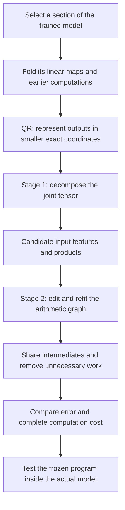
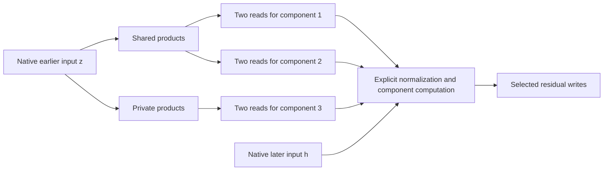

# Overall review: folding weights, decomposing tensors, then simplifying circuits

Rewritten **21 September 2026, 07:38 UTC**. Results checked through the fresh-panel and product-stability artifacts available at 07:36 UTC. This replaces the previous report at the same filename so existing links continue to work.

**The plan you remember is still the plan: use a tensor decomposition to discover useful computations, then simplify and refit the arithmetic program containing them. QR reduces the output coordinates before those two stages.**

There has been real progress on smaller programs and shared computations. We have not built the full general Tucker/HT-to-arbitrary-circuit search. The strongest practical results currently come from output-sharing decompositions and restricted graph edits. We also found that a good weight-space fit can be a poor approximation inside the actual model, and that accurate fitted programs can disagree about their individual internal features.

This review separates the **broad layer-contribution experiment** from the later **selected-feature experiment**. Their product counts and errors refer to different targets and should not be compared directly.

## 1. The intended pipeline

**Folding** substitutes existing computations into one another. **Decomposition** finds another representation of the resulting function. An **arithmetic circuit** is a program of linear combinations and products. Its **DAG**—directed acyclic graph—allows an intermediate to be computed once and used in several places.

The endpoint is a smaller executable program. A human-readable interpretation of its variables is a further hypothesis to test; neither sparsity nor low rank guarantees that interpretation.

## 2. QR: what it does and what we implemented

For one bilinear MLP,

$$
B(x)=D\big[(Lx)\odot(Rx)\big],\qquad
F(x)=UB(x).
$$

Here $x$ has 1,152 coordinates, $Lx$ and $Rx$ each have 4,608 coordinates, $\odot$ multiplies corresponding entries, $D$ writes back to the residual stream, and $U$ maps to 50,304 vocabulary coordinates.

Your suggestion was QR on $UD$. Our implementation factors the unembedding first:

$$
U=Q R_U,\qquad Q^\top Q=I,\qquad C=R_U D.
$$

We then fit

$$
\widetilde F(x)=C\big[(Lx)\odot(Rx)\big],
\qquad F(x)=Q\widetilde F(x).
$$

This reduces the output dimension being optimized from 50,304 to 1,152. It is exact for this linear output map:

$$
\|F(x)-Q\widehat{\widetilde F}(x)\|_2^2
=\|\widetilde F(x)-\widehat{\widetilde F}(x)\|_2^2.
$$

**QR itself does not reduce the products or discover a circuit.** Selecting fewer output directions afterward is a separate approximation. RMSNorm, attention normalization and the final logit softcap remain explicit operations; this equation does not remove them.

## 3. Stage one: decompositions propose the building blocks

The folded quadratic function is represented by a **joint order-three tensor**:

$$
\widetilde F_v(x)=\sum_{i,j}T_{vij}x_i x_j,
\qquad
T_{vij}=\frac12\sum_k C_{vk}
\left(L_{ki}R_{kj}+L_{kj}R_{ki}\right).
$$

“Joint” means matching the function of all three factors together, rather than compressing each matrix independently. “Order three” counts tensor indices: one output and two inputs. The polynomial degree is two. Implicit contractions let us fit this object without storing all its entries.

A shared-input Tucker decomposition writes

$$
s=P^\top x,\qquad
h_g=\sum_{p,q}G_{gpq}s_p s_q,\qquad
\widehat y=Wh.
$$

| Term | Meaning |
|---|---|
| $s_p$ | Learned scalar input feature |
| $s_p s_q$ | Interaction between two features |
| $G_{gpq}$ | Weight of that interaction in computed feature $h_g$ |
| $h_g$ | A sum of interactions sharing an output effect |
| $W_{:,g}$ | That feature's output direction |

Small widths mean few features; a sparse core means few interactions. A dense quadratic form can also be cheap if it factors into a few products, so entry sparsity is only one possible structural assumption.

Folding two pure bilinear layers produces degree four, hence an order-five coefficient tensor:

$$
f_v(x)=\sum_{i,j,k,l}H_{vijkl}x_i x_j x_k x_l.
$$

**Hierarchical Tucker (HT)** organizes this as a tree of smaller bilinear computations: linear features make quadratic features, which make quartic outputs. Its tree groups tensor slots; each leaf may still read the whole input vector. Residual paths and biases also produce lower-degree terms.

The intended final DAG is more general than that tree. It can reuse an intermediate across branches and depths. We can also keep a compact, unsymmetrized coefficient representation: because every input slot receives the same $x$, different coefficient tensors can compute exactly the same polynomial.

## 4. Stage two: simplify the program, then refit it

Suppose stage one proposes

$$
y=u(ab+ac)+v(db+dc).
$$

An arithmetic rewrite gives

$$
t=b+c,\qquad p=at,\qquad q=dt,\qquad y=up+vq.
$$

The program now computes two products instead of four, and reuses $t$. Its constituent conditions remain explicit: a sum is not automatically Boolean OR or a single semantic concept.

Our implemented graph work includes sharing products, removing connections or products, assigning different capacities to different components, and jointly refitting surviving coefficients and feature directions. In the latest refit, the linear output coefficients are solved analytically at each step while Adam optimizes input directions.

**General search over arbitrary new intermediates and graph topologies is still incomplete.** The tests below demonstrate particular useful edits, not that complete system.

## 5. First result: a cheaper broad folded contribution

The first practical large approximation used an **output-sharing block model**: 256 output directions, each receiving four bilinear products. This served stage one's candidate-generation role, although it was not a general Tucker/HT implementation.

Its target was a selected source-dependent contribution involving the last two MLPs. It covered more than a single feature, but less than the full model. Normalization and the precise intervention boundary matter.

| Program for this broad target | Products | Stored coefficients |
|---|---:|---:|
| Initial compressed program | 1,024 | 2,671,616 |
| Simplified graph | **512** | **2,654,208** |

On the frozen comparison panel, the relative error in the native logit effect improved from **28.21% to 26.11% on FineWeb**, and **23.62% to 21.36% on code**. Context-dependent interaction errors remained much larger, around 52% and 38%.

This supports a useful product reduction at similar storage. It does not establish an accurate replacement for the whole computation or a runtime speedup; projections, additions and producing the inputs also cost work.

**“Full coverage” in the old title meant scoring the entire selected contribution**, including output directions the approximation omitted. It did not mean the full model, or that every proposed approach had been completed.

Covariance-informed fitting helped this broad target: full-output variation error fell from 65.7% to 28.0% on FineWeb and 50.8% to 18.0% on code compared with the isotropic fit. Both arms already used a calibration-selected output basis, so this was not a completely data-free versus data-based comparison.

## 6. Why we narrowed to selected features—and what that bought us

The broad approximation remained inaccurate, but it suggested smaller candidate computations worth examining. We therefore studied selected scalar features and folded the preceding MLP into their input reads. Each selected feature needs two quadratic reads:

$$
q_a(z)=z^\top Q_a z,\qquad q_b(z)=z^\top Q_b z.
$$

Here $z$ is the preceding MLP's normalized input. These are **two selected outputs of that MLP**, not its entire output vector.

For one pair, an exact shared construction reduced source products from 4,608 native channels to **1,152**, compared with 2,304 for separate spectral decompositions. Mixed products such as $(u+v)(u-v)$ and $uv$ enabled the saving. Independent matrix reconstruction and executable replay checks passed.

This explains **“shared baselines”**: compare our new approximation against an existing program that already exploits sharing, not only against the original channel layout. Otherwise we could overstate our contribution.

We then expanded to three selected components, requiring six quadratic reads. A single global shared dictionary helped two components but harmed the third. The successful response was a nonuniform graph:

After pruning and continuous refitting:

| Program for the three selected components | Products | Stored coefficients | Component errors on previously opened states |
|---|---:|---:|---|
| Three separate pair programs | 768 | 897,804 | 3.06%, 2.76%, 11.94% |
| Shared first two; private third | **512** | **897,804** | **2.65%, 2.48%, 11.94%** |

This is a concrete realization of the two-stage idea: propose products, edit their sharing structure, then refit the resulting program. The third branch is preserved, rather than dropped to improve the aggregate score.

Fresh native-model checks are encouraging but incomplete. On each of two new panels, all 72 comparisons passed the requirement that graph error be at most 1.10 times baseline error. Each panel included 32 FineWeb documents and 16 code files, individual and combined components, and several intervention/subgroup comparisons.

Both panels nevertheless failed one absolute accuracy requirement: the third component at FineWeb continuation sites. The first panel's error was **16.73% against a 15% cap**. Enlarging the third branch in both graph and baseline gave **16.01% on the second panel**, still a failure. That second comparison used 576 versus 832 products at matched coefficient storage. The failing branch has identical error in graph and baseline.

These are two different capacity settings on different panels, not two identical replications. They support the relative sharing benefit, but not complete circuit adoption.

## 7. Did direct weight optimization work? Why did some decompositions fail?

**It works as an optimization method; it has not consistently optimized the behavior we ultimately care about.** We should distinguish three explanations.

| Issue | Evidence | Interpretation |
|---|---|---|
| Restricted representation | In one fixed rank-16 Gaussian quartic family, a lower bound was 8.02%, above the 7.22% target | That particular target was impossible in that family. It does not rule out higher ranks or general DAGs. |
| Optimization difficulty | Planted recoverable targets sometimes needed longer schedules or another restart | A failed fit alone does not prove the structure is absent. |
| Wrong or insufficient metric | A quartic coefficient fit improved from 80.86% to 13.97%, while native-function error worsened from 37.71% to 48.97% | Matching weights under one geometry need not preserve the normalized native computation. |

Small Tucker/HT fits did not deliver the desired compact accuracy. **We do not have a single established explanation that “Tucker failed because its assumed rank was too low.”** The rank certificate above concerns one later restricted experiment, not every Tucker or HT run.

Five planted structural families, dense reconstruction checks, gradient checks and executable replay have helped distinguish bugs from genuine misses. Tested Adam settings often outperformed the tested Muon settings, but learning rate, schedule, budget and restart mattered; this is not a universal optimizer ranking.

The paper-inspired weight-matching route is therefore useful, but covariance weighting is not automatically the paper's full functional metric. Quadratic-output squared error generally depends on fourth moments; quartic-output squared error can require eighth moments. Exact coefficient error, Gaussian probe error and native intervention error must be reported separately.

There is another limitation: **the individual learned products are unstable across nearby starts and learning rates**, even when fitted functions are relatively close. The latest alignment audit accounts for permutation and factor scaling and still fails its stability criterion. We have a smaller program, but cannot yet claim its particular internal products are uniquely recovered semantic features.

## 8. What is established and what remains

| Established | Still unresolved |
|---|---|
| Exact folded representations and QR output coordinates | General Tucker/HT-to-arbitrary-DAG search |
| Direct weight fitting with tested objectives | A metric that consistently predicts native fidelity |
| Exact local shared-product baselines | Accurate broad replacements at small cost |
| Useful graph edits followed by continuous refitting | Stable, interpretable internal feature identities |
| Fewer products at matched coefficient storage | Standalone circuits that generate their own upstream inputs |
| Fresh relative-baseline checks for selected components | All absolute fidelity requirements and full semantic validation |

The research direction remains justified by the arithmetic savings. The next scientific questions are whether those savings survive all relevant behaviors, and which groups of computations remain stable enough to interpret. The current programs still consume native intermediate inputs; simplifying their local arithmetic does not close their upstream dependencies.

## Evidence and further detail

- Broad comparison: [1,024 to 512 products](research_update_2026-09-21_0256_private_linear_spaces.md).
- Local exact construction: [shared-product baselines](research_update_2026-09-21_0451_exact_shared_products.md).
- Optimization failures: [quartic metric mismatch](research_update_2026-09-21_0524_joint_quartic_metric_failure.md) and [rank limits](research_update_2026-09-21_0554_rank_limits_and_input_geometry.md).
- Graph construction: [mixed products and graph reuse](research_update_2026-09-21_0707_mixed_products_and_graph_reuse.md).
- Latest refit: [fit results](../../direct_tensor_match/PROFILED_PARTIAL_GRAPH_FIT_V1.json) and [independent audit](../../direct_tensor_match/PROFILED_PARTIAL_GRAPH_AUDIT_V1.json).
- Fresh checks: [panel one](../../direct_tensor_match/PARTIAL_GRAPH_FRESH_NATIVE_V1.json), [capacity comparison](../../direct_tensor_match/PRIVATE_GRAPH_CAPACITY_V1.json), and [panel two](../../direct_tensor_match/PARTIAL_GRAPH_FRESH_NATIVE_V2.json).
- Internal-feature limitation: [product stability audit](../../direct_tensor_match/PROFILED_PRODUCT_STABILITY_V1.json).

**Data qualification:** historical FineWeb caches contain chunks without retained document identities; separate cache rows do not establish independent documents. The older broad and fitting results therefore have weaker independence evidence than the later document-identified panels. Previously opened fitting diagnostics are labeled above. This rewrite summarizes existing artifacts and adds no new experiment.
