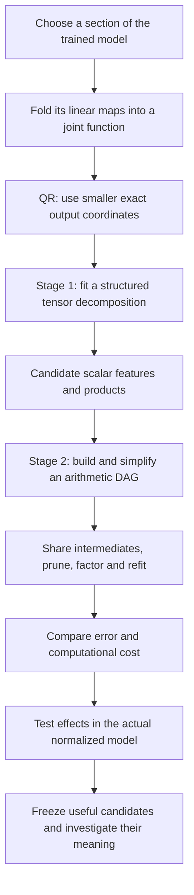
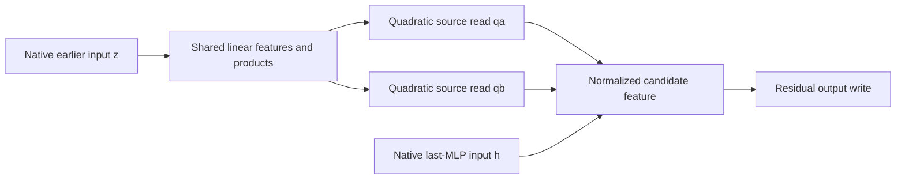

# Overall review: from folded weights to a smaller arithmetic circuit

Rewritten **21 September 2026, 05:16 UTC**, covering completed results through the 05:04 report. This replaces “full coverage and shared baselines” at the same link. It is an overview of the research direction, not another experiment log.

**Yes—the two-stage approach you remember is still the intended approach.** First, use a tensor decomposition to find useful features and products. Second, turn those into an arithmetic graph and simplify the graph, allowing computations to be shared.

**We have working pieces of both stages, but not the complete general search.** The strongest large-scale approximation so far came from an output-sharing bilinear decomposition, followed by specific sharing, pruning and refitting operations. We have not demonstrated a general Tucker/HT initialization followed by unrestricted arithmetic-circuit search.

There are three main results to keep in mind:

- **A broad approximation became cheaper:** a 1,024-product approximation was replaced by a 512-product graph with similar storage and somewhat better measured fidelity. Significant errors remain.
- **One feature became a concrete research candidate:** a continuation-related product was connected back to the original weights and tested behaviorally. It still depends on inputs supplied by the native model.
- **That feature's two upstream reads have a better exact baseline:** shared mixed products compute them with 1,152 source products, versus 4,608 native channel products or 2,304 products from separate spectral decompositions. This does not simplify the entire model.

## 1. The plan, with each stage's job made explicit

**Folding** means substituting or combining existing computations. **Decomposition** means expressing the resulting function using a different, ideally smaller set of components. An **arithmetic circuit** is a program of linear combinations and multiplications. Its graph is a **DAG**—a directed acyclic graph—so one computed value can be reused by several later operations.

These are distinct jobs. QR changes coordinates. A decomposition proposes computations. Graph optimization changes how those computations are organized and reused. Behavioral tests establish whether the replacement preserves the effects we care about.

## 2. What happened to QR on “unembedding → MLP output”?

A bilinear MLP computes

$$
B(x)=D\big[(Lx)\odot(Rx)\big],
$$

where $x$ has 1,152 coordinates, $L$ and $R$ each produce 4,608 scalar reads, $\odot$ multiplies matching reads, and $D$ writes the products into the residual stream. The unembedding $U$ maps that stream to 50,304 vocabulary coordinates.

The folded output contribution is

$$
F(x)=UD\big[(Lx)\odot(Rx)\big].
$$

Your proposal was to compress $UD$ with QR. The implementation uses the closely related exact construction

$$
U=QR_U,\qquad Q^\top Q=I,\qquad C=R_UD.
$$

We optimize the smaller function

$$
\widetilde F(x)=C\big[(Lx)\odot(Rx)\big],
\qquad F(x)=Q\widetilde F(x).
$$

**The output width becomes 1,152 instead of 50,304, without approximation.** For replacements in this output space,

$$
\|F(x)-\widehat F(x)\|_2
=
\|\widetilde F(x)-\widehat{\widetilde F}(x)\|_2.
$$

This makes fitting cheaper; it does not itself reduce the number of bilinear products. Selecting still fewer output directions later is an additional, lossy approximation.

The equality concerns the linear output contribution. RMSNorm, Q/K normalization and final logit softcapping remain explicit operations when testing the actual model.

## 3. Stage one: what the tensor decomposition is supposed to discover

The folded quadratic function has a joint coefficient tensor

$$
\widetilde F_v(x)=\sum_{i,j}T_{vij}x_ix_j,
$$

$$
T_{vij}=\frac12\sum_k C_{vk}
\left(L_{ki}R_{kj}+L_{kj}R_{ki}\right).
$$

It is **order three** because it has three indices: output, input, input. Its polynomial degree is **two**, not three. We can optimize against this object using contractions of its factors, without storing every tensor entry.

A shared-input Tucker model would write

$$
s=P^\top x,\qquad
h_g=\sum_{p,q}G_{gpq}s_ps_q,\qquad
\widehat y=Wh.
$$

| Symbol | Meaning |
|---|---|
| $s_p$ | One learned scalar input feature |
| $s_ps_q$ | A product of two input features |
| $G_{gpq}$ | The coefficient of that product in computed feature $h_g$ |
| $h_g$ | A combination of products that can be reused |
| $W_{:,g}$ | The output direction affected by $h_g$ |

A low **rank** or small intermediate width restricts how many directions the model can use. A sparse **core** $G$ restricts which feature pairs interact. These are different constraints. A dense quadratic form can also be cheap if it factors into only a few products of linear forms.

If we substitute two pure bilinear layers, the function becomes quartic:

$$
f_v(x)=\sum_{i,j,k,l}H_{vijkl}x_ix_jx_kx_l.
$$

This is an **order-five tensor**. HT represents it hierarchically: linear features become quadratic features, which combine into quartic outputs. Its tree groups tensor input slots; each leaf may still read the entire vector $x$. A general DAG additionally permits reuse across branches and depths.

**Why did small Tucker/HT fits look unsuccessful?** They left high error at the tested ranks, structures and optimization budgets. That is not a proof that these model families cannot represent the target. Unrestricted Tucker is expressive enough. The relevant question is whether a *small* representation exists in the chosen metric, and whether optimization finds it. Capacity limits, metric choice, insufficient optimization and bugs must be tested separately.

## 4. What we actually fitted at useful scale

The practical route kept one preceding MLP's output as an intermediate variable instead of immediately expanding everything into a quartic tensor.

Let $h$ be the last MLP's input and $m$ the preceding MLP's polynomial residual contribution, including its residual scale. Set $n=h-m/2$. For the polynomial map $B$,

$$
\boxed{
B(h)-B(h-m)
=D\big[(Ln)\odot(Rm)+(Rn)\odot(Lm)\big].
}
$$

This captures the source contribution's self-interaction and its interactions with the rest of the input. The implementation divides both intermediate inputs by the original recipient's RMS denominator. Thus the target is a precisely defined contribution, not the effect of deleting an upstream MLP and rerunning every downstream operation.

The useful fit used **256 output directions, with four bilinear products assigned to each direction: 1,024 products total**. This is an **output-sharing block decomposition**. It is an implementation of the first stage's purpose, though it is not the general sparse Tucker/HT pipeline originally proposed.

### What “full coverage” meant

It meant **scoring reconstruction against the entire selected source-dependent contribution**, including output directions the approximation omitted. Earlier favorable scores covered only four selected output directions.

It did **not** mean that we reconstructed the full model, obtained zero error, or finished all proposed baselines. “Full-contribution evaluation” is the clearer phrase.

### Did weight-based optimization and covariance help?

Yes, within this target and comparison. With the same calibration-selected output basis, changing from an isotropic coefficient metric to a covariance-informed metric gave:

| Relative full-output variation error; lower is better | Isotropic fit | Covariance-informed fit |
|---|---:|---:|
| FineWeb | 65.7% | **28.0%** |
| Repository code | 50.8% | **18.0%** |

An **isotropic coefficient metric** weights input directions uniformly. A **covariance-informed metric** emphasizes directions according to their observed second-order variation. Both fits here already used a data-informed output basis, so this is not a wholly data-free versus data-based comparison.

This supports the weight-matching direction. It does not isolate a particular paper's optimizer as the reason for improvement. Also, input covariance alone is not the paper's full moment operator: matching quadratic outputs under a data distribution generally involves fourth moments. Coefficient error, Gaussian probe error and native behavioral error must remain separate scores.

## 5. Stage two: what arithmetic-graph simplification has done

The intended advantage is reuse. For example,

$$
y=u(ab+ac)+v(db+dc)
$$

can be evaluated as

$$
t=b+c,\qquad p=at,\qquad q=dt,\qquad y=up+vq.
$$

That uses two products instead of four. The shared sum $t$ is computed once. It means a combined contribution from $b$ and $c$; it is not automatically a Boolean OR or a single semantic concept.

**Implemented so far:** sharing input projections, shared output corrections, product pruning, continuous refitting, different product allocations across output directions, and local refactoring of groups of products. Later work also found exact sharing between two upstream quadratic forms.

**Still unimplemented as a general system:** automatically proposing arbitrary new intermediate sums/products, searching alternative hierarchies, and sharing computations across arbitrary depths. The second stage currently consists of targeted edits and algebraic constructions.

The broad approximation results are:

| Program | Products | Stored weights | What the comparison establishes |
|---|---:|---:|---|
| Earlier compressed baseline | 1,024 | 2,671,616 | Starting approximation, not the exact model |
| Smaller-storage graph | 512 | 1,291,264 | Roughly half the storage, with some fidelity loss |
| Later matched-storage graph | 512 | 2,654,208 | Half the products, similar storage, somewhat better fidelity |

On the later graph's frozen comparison panel:

| Relative native-effect error | 1,024-product baseline | 512-product graph |
|---|---:|---:|
| FineWeb whole-contribution swap | 28.21% | **26.11%** |
| Code whole-contribution swap | 23.62% | **21.36%** |
| FineWeb context-dependent interaction | 52.49% | **52.13%** |
| Code context-dependent interaction | 39.62% | **38.45%** |

An **effect error** compares the replacement's change in logits with the native change, normalized by the native effect's norm. It is not a fraction of incorrectly predicted tokens. The context test isolates dependence on deviations from the calibration mean.

The reduction in products is real, but the remaining interaction errors are large. Small average next-token-loss changes did not certify faithful interactions. Nor do product counts establish runtime savings: dense projections, stored coefficients and upstream input production also cost something.

## 6. Why the later reports switched to one feature and its upstream inputs

The broad approximation gave us candidate computations to inspect. One product was associated with alphabetic continuation:

$$
\phi=(a^\top n-\alpha)(b^\top m-\beta),
\qquad y=w\phi.
$$

On 32 unused FineWeb documents, removing it increased next-token loss by **0.12555 nats at continuation sites**, versus approximately zero at spaced-word sites. A matched-size control writer had a weaker effect. This is evidence for a candidate behavior, not guaranteed monosemanticity.

We then checked the original weights projected onto its output direction. The learned product aligned with the native operator's leading covariance-weighted component with cosine **0.99995**. That grounds the feature in the trained weights. However, the native rank-one coefficient error was still **31.5%** in the covariance metric and **95.5%** in the isotropic metric.

The next question was: **can we compute its inputs more simply too?** Folding the preceding MLP into its two source reads gives

$$
q_a(z)=z^\top Q_a z,\qquad q_b(z)=z^\top Q_b z.
$$

Here $z$ is the preceding MLP's normalized input. These are two quadratic functions of the original weights, not the whole previous layer.

Small approximate shared dictionaries reduced storage, but a donor-robustness test retained a failure. An exact construction then exposed a stronger baseline:

| Exact representation of the same two source reads | Source products |
|---|---:|
| Original MLP channel products, with both readouts folded in | 4,608 |
| Separate full spectral decompositions | 2,304 |
| Shared mixed-product construction | **1,152** |

The new construction permits products such as $(u+v)(u-v)$ and $uv$, shared between the two outputs. Restricting everything to a common set of squares was unnecessarily restrictive. Original-coordinate reconstruction and native intervention replay passed numerical checks.

**This is an exact simplification of two selected reads.** It still takes native $z$ and $h$ as inputs. The table excludes their producers, the common RMS computation and the final feature product. It is therefore a useful component baseline, not a fourfold whole-model speedup.

## 7. The latest finding: sharing two reads does not guarantee broader reuse

We tested whether that exact shared product dictionary could also supply four additional source reads. It could not meet the registered accuracy targets, even after solving the fixed-dictionary least-squares problem accurately.

A revealing result was **4.98% error for the combined three-mode output, but 43.96% error for the third mode individually**. The leading mode dominated the aggregate score. A small combined error therefore cannot justify manipulating each constituent as a faithful circuit.

Adding private low-rank corrections improved the third-mode error to **28.01%**, still above the 15% target. This motivates fitting the composed function jointly rather than separately approximating its ingredients.

An exact differentiable loss for a composed quartic numerator is now implemented and checked against explicitly constructed tensors. Forty toy fits covered five planted structures, two optimizers, two learning rates and two starts. Every structure had a recovering fit. At the tested 400-step budget, Adam at learning rate 0.05 recovered 9/10 fits; Muon at 0.05 recovered 5/10. Neither recovered a fit at 0.01 under the same threshold and budget.

That shows the objective works on these toys and that optimization settings matter. **The reviewed results do not yet show a trained-model improvement from this new joint quartic fit.**

## 8. Where this leaves the original proposal

| Part of the proposal | Current status |
|---|---|
| Fold weights and use exact QR output coordinates | Implemented |
| Match structured replacements to joint folded functions | Implemented for several restricted families |
| Use Tucker/HT as general candidate generators | Explored; not the source of a completed general pipeline |
| Simplify candidates with graph edits and refitting | Implemented for specific edit families |
| Share upstream intermediate computations | Demonstrated exactly for two selected quadratic reads |
| Reuse those computations broadly across other features | Tested; current dictionary misses accuracy targets |
| Optimize arbitrary arithmetic DAGs | Still a proposed extension |
| Obtain compact, interpretable circuits independent of native inputs | Not established |

The evidence supports continuing the two-stage direction, with stronger baselines and more careful component-level scoring. The most useful change in understanding is that **a good low-rank tensor fit, a cheap arithmetic program, and a faithful behavioral circuit are three separate achievements**. We have partial successes in each, but have not yet joined them into the full result.

## Supporting reports

Read these only for experiment-level details:

- [Broad graph comparison and separate input spaces](research_update_2026-09-21_0256_private_linear_spaces.md).
- [Local graph refitting and an optimization correction](research_update_2026-09-21_0320_joint_graph_refactor.md).
- [Continuation candidate](research_update_2026-09-21_0346_continuation_candidate.md) and [connection to original weights](research_update_2026-09-21_0356_original_weight_grounding.md).
- [Small upstream shared programs and the retained donor failure](research_update_2026-09-21_0431_shared_source_circuit.md).
- [Exact mixed-product construction and fair baselines](research_update_2026-09-21_0451_exact_shared_products.md).
- [Broader reuse failure and verified joint quartic objective](research_update_2026-09-21_0504_reuse_limits_and_joint_fit.md).

The broad graph comparison used 32 FineWeb documents and 16 repository Python files with programs frozen before evaluation. Continuation confirmation used a different 32-document panel. The exact source construction was replayed on reused data; the later reuse screen used calibration states. Those are different levels of evidence. This rewrite summarizes completed work and adds no model experiment.
