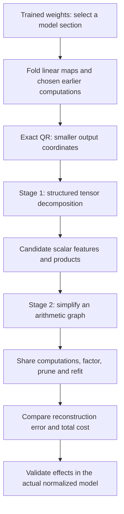
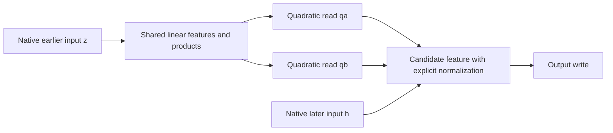

# From folded weights to a smaller arithmetic program: overall review

Rewritten **21 September 2026, 06:29 UTC**. This reviews the direction you proposed and the documented results through **05:54 UTC**, rather than presenting another incremental experiment log. The filename is retained so existing links keep working.

**Your remembered plan is correct: first discover computations with a tensor decomposition; then simplify their arithmetic graph, including shared computations.** QR makes the output coordinates smaller before either stage. It is an exact preprocessing step, not the circuit-discovery step.

We have implemented useful restricted versions of both stages. We have **not** completed a general system that starts with Tucker/HT and automatically searches arbitrary arithmetic circuits.

The strongest results are:

- A broad folded-contribution approximation went from **1,024 products to 512**, at similar storage and slightly better fidelity. It still has substantial reconstruction errors.
- For **two selected quadratic input reads**, an exact algebraic construction needs **1,152 shared products**, versus **4,608 native channel products**. This is a local exact simplification, not compression of the whole model.
- Direct optimization against folded weights works computationally, but **a better tensor score has not reliably produced a better native circuit**. Later experiments separated objective mismatch, overfitting and a specific rank limit.

## 1. The original plan and where each operation belongs

**Folding** combines existing maps, or substitutes one computation into another. **Decomposition** represents the resulting function with different components. An **arithmetic circuit** is a program of linear combinations and products. A **DAG** is its directed acyclic graph: one intermediate value can feed several later computations without being recomputed.

The intended endpoint is a small executable program for a specified section of the model. Interpretable scalar features would be valuable, but neither low rank nor sparsity guarantees that each feature has one semantic meaning.

## 2. QR on the unembedding and MLP output: implemented and exact

Our bilinear MLP has the form

$$
B(x)=D\big[(Lx)\odot(Rx)\big].
$$

Here $x$ has 1,152 coordinates; $L$ and $R$ each produce 4,608 scalar features; $\odot$ multiplies corresponding features; and $D$ maps those products back to the residual stream. The unembedding $U$ maps residual vectors to 50,304 vocabulary coordinates.

After folding the output maps, the function is

$$
F(x)=UD\big[(Lx)\odot(Rx)\big].
$$

You suggested QR on $UD$. Our implementation instead uses

$$
U=QR_U,\qquad Q^\top Q=I,\qquad C=R_UD,
$$

and fits

$$
\widetilde F(x)=C\big[(Lx)\odot(Rx)\big],
\qquad F(x)=Q\widetilde F(x).
$$

**We optimize 1,152 output coordinates instead of 50,304 without losing information in this linear output map.** Because $Q$ is an isometry,

$$
\|F(x)-\widehat F(x)\|_2
=
\|\widetilde F(x)-\widehat{\widetilde F}(x)\|_2.
$$

This does not reduce the number of products. Later keeping only a subset of output directions is a separate, approximate step. RMSNorm and final logit softcapping also remain explicit: the equality above is for the linear output contribution, not for the entire normalized model.

## 3. Stage one: what Tucker and HT are meant to discover

The folded quadratic function defines one **joint tensor**:

$$
\widetilde F_v(x)=\sum_{i,j}T_{vij}x_ix_j,
\qquad
T_{vij}=\frac12\sum_k C_{vk}
\left(L_{ki}R_{kj}+L_{kj}R_{ki}\right).
$$

“Joint” means we fit the function represented by all the factors together, rather than compressing $C,L,R$ independently. **Order three** means three tensor indices—output, input, input. The polynomial degree is two. We can calculate losses through factor contractions without materializing every entry of $T$.

Shared-input Tucker proposes

$$
s=P^\top x,\qquad
h_g=\sum_{p,q}G_{gpq}s_ps_q,\qquad
\widehat y=Wh.
$$

| Object | What it represents |
|---|---|
| $P$ | Learned input directions |
| $s_p$ | A scalar input feature |
| $G_{gpq}$ | How much product $s_ps_q$ contributes to computed feature $h_g$ |
| $h_g$ | A combination of products |
| $W_{:,g}$ | The output effect shared by those products |

Small intermediate widths limit the number of features. A sparse core $G$ limits interactions. These are different kinds of simplicity: a dense core slice might still be cheap if it factors into a few products of linear combinations.

Substituting two pure bilinear layers gives a degree-four function with an **order-five tensor**:

$$
f_v(x)=\sum_{i,j,k,l}H_{vijkl}x_ix_jx_kx_l.
$$

**Hierarchical Tucker (HT)** represents that tensor as smaller bilinear computations arranged in a tree: linear features combine into quadratic features, then into quartic outputs. Its hierarchy groups tensor slots, not necessarily coordinate subsets; every leaf can read the same full $x$. Residual paths introduce lower-degree terms too.

Standard HT targets compression. Sparse cores and shared features are additional objectives. A general DAG can reuse an intermediate across different branches or depths, beyond the sharing built into a fixed HT tree.

**The small Tucker/HT fits did not establish a sufficiently accurate compact solution.** That is not evidence that unrestricted Tucker/HT cannot represent the function. The meaningful question is whether a small representation exists under the chosen constraints and whether our optimizer finds it. Later tests provide a specific rank obstruction, described below, rather than a blanket explanation for every earlier failure.

## 4. What we actually used for the broad approximation

At useful scale, the practical decomposition was an **output-sharing block model**: 256 output directions, each receiving four bilinear products, for 1,024 products total. It fulfills stage one's purpose of proposing computations, but it is not a completed general Tucker/HT pipeline.

The target was a selected source-dependent contribution involving the last two MLPs. Write $h$ for the last MLP input, $m$ for the preceding MLP's polynomial residual contribution, and $n=h-m/2$. For the polynomial map,

$$
B(h)-B(h-m)
=D\big[(Ln)\odot(Rm)+(Rn)\odot(Lm)\big].
$$

Keeping $m$ as an intermediate avoids immediately expanding the entire composition into a quartic tensor. The implemented normalized target uses the original recipient's RMS denominator. It is not equivalent to deleting the earlier MLP and rerunning the whole downstream model.

**“Full coverage” meant evaluating against this entire selected contribution**, including omitted output directions. Earlier scores had covered only four selected directions. It did not mean full-model reconstruction or complete coverage of every proposed method. I will call it **full-contribution evaluation**.

### Did covariance-informed weight fitting help?

For this broad target, yes:

| Relative full-output variation error; lower is better | Isotropic fit | Covariance-informed fit |
|---|---:|---:|
| FineWeb | 65.7% | **28.0%** |
| Code | 50.8% | **18.0%** |

An isotropic coefficient metric treats input directions uniformly. Covariance weighting changes their relative importance using observed input variation. Both arms already used a calibration-selected output basis, so this was not a wholly data-free versus data-based comparison.

This supports directly fitting folded weights. It does **not** establish that we implemented the paper's complete moment operator or that one optimizer caused the gain. Input covariance alone does not determine general quadratic-output error, which depends on fourth moments; quartic-output squared error can require eighth moments.

## 5. Stage two: what graph simplification has actually achieved

The intended saving is exemplified by

$$
y=u(ab+ac)+v(db+dc).
$$

Instead of four products, compute

$$
t=b+c,\qquad p=at,\qquad q=dt,\qquad y=up+vq.
$$

There are two products, and $t$ is shared. Its constituent conditions should remain explicit; their sum need not be one semantic concept or Boolean OR.

Our implemented edits include sharing projections, pruning products, refitting coefficients, reallocating products across output directions, and local algebraic refactoring. **Automatically introducing arbitrary intermediate computations and searching arbitrary graph topologies remains unfinished.**

| Program | Products | Stored weights |
|---|---:|---:|
| Starting compressed baseline | 1,024 | 2,671,616 |
| Later graph at similar storage | **512** | **2,654,208** |

On their frozen comparison panel:

| Relative native-effect error | Starting baseline | Later graph |
|---|---:|---:|
| FineWeb whole-contribution swap | 28.21% | **26.11%** |
| Code whole-contribution swap | 23.62% | **21.36%** |
| FineWeb context-dependent interaction | 52.49% | **52.13%** |
| Code context-dependent interaction | 39.62% | **38.45%** |

Effect error compares the replacement's logit change with the native logit change, normalized by the native effect's norm. It is not a token error rate. The context test isolates dependence on deviations from the calibration mean.

**This is a real reduction in products at similar storage, with a modest fidelity improvement.** The interaction errors remain large. Product counts alone also do not establish runtime savings: projections, additions and producing the program's inputs still cost something.

## 6. Why the work then narrowed to one feature's inputs

The broad decomposition also proposed individual features. One continuation-related candidate had the form

$$
\phi=(a^\top n-\alpha)(b^\top m-\beta),\qquad y=w\phi.
$$

On a reserved 32-chunk FineWeb panel, removing it increased loss by 0.12555 nats at continuation sites, versus approximately zero at spaced-word sites. A control output direction had a weaker effect. Its learned product also aligned closely with a leading component extracted from the original weights. This makes it a candidate worth studying, not an established monosemantic circuit.

We asked whether its **two input reads** could themselves be computed more cheaply. Folding the preceding MLP into those reads gives

$$
q_a(z)=z^\top Q_a z,\qquad q_b(z)=z^\top Q_b z,
$$

where $z$ is the preceding MLP's normalized input. These are two selected quadratic forms, not the whole preceding layer.

We found an exact shared-product construction:

| Exact program for the same two reads | Source products |
|---|---:|
| Native MLP channels with folded readouts | 4,608 |
| Separate spectral decompositions | 2,304 |
| Shared mixed products | **1,152** |

Allowing mixed products such as $(u+v)(u-v)$ and $uv$ improves on restricting both reads to common squares. Matrix reconstruction and native replay checks passed.

**This is the strongest exact local simplification so far.** The program still consumes native $z$ and $h$. The counts exclude their producers, normalization and the final feature product. It is not a fourfold whole-model speedup.

“Shared baselines” referred to this fairer comparison: a new approximate circuit should compete against exact programs that already exploit sharing, not just against the original channel layout.

## 7. What the subsequent failures taught us

The experiments moved from “can two reads share products?” to “can the same dictionary serve more features, and can joint fitting repair its misses?” These are stricter questions.

| Test | Result | What we learned |
|---|---|---|
| Reuse the two-read dictionary for additional reads | Combined output error 4.98%, but third component error **43.96%** | A dominant component can hide an individually unfaithful feature. |
| Jointly optimize a composed quartic tensor | Covariance coefficient error **80.86% → 13.97%**, while native-function error **37.71% → 48.97%** | A better coefficient match can optimize the wrong geometry for native behavior. |
| Fit the function on a small native sample | Almost perfect training fit, poor evaluation transfer | Changing the objective alone can introduce overfitting. |
| Optimize exact Gaussian numerator error at rank 16 per source | **9.03% → 8.98%**, native evaluation about **40%** | The Gaussian surrogate and native behavior still differ. |

Independent coefficient and executable-program audits reproduced the joint-fit failure. It was not dismissed as “the optimizer failed,” nor treated as definitive evidence against the research direction.

For the Gaussian experiment, a mathematical lower bound gave **8.02%**, above the requested **7.22%** target. Thus that target is impossible **within the tested family: two rank-16 quadratic factors with fixed affine terms and this Gaussian metric**. It says nothing comparable about unrestricted DAGs. Increasing rank to 128 improved native evaluation error to 28.38%, still above the 15% target.

Optimization budget also matters. Five planted structural toy families supplied known recoverable targets. In the quartic coefficient sweep, Adam at learning rate 0.05 recovered 9/10 runs versus Muon's 5/10 at the tested 400-step budget; neither recovered at 0.01 under that budget. In later Gaussian toys, two initial failures recovered after increasing the budget from 400 to 2,000 steps. These are controlled comparisons, not a universal optimizer ranking.

The covariance estimated from only 24 training chunks also described the evaluation geometry poorly. Expanding calibration while holding the target and capacity fixed was the next registered comparison at the report cutoff.

## 8. Where the two-stage proposal stands

| Part | Status |
|---|---|
| Exact folding and QR output coordinates | Implemented |
| Fit structured replacements directly against folded functions | Implemented for several families |
| General Tucker/HT candidate-generation pipeline | Incomplete; the broad success used output-sharing blocks |
| Graph simplification and continuous refitting | Implemented for selected edit families |
| Exact shared upstream computations | Demonstrated for two selected reads |
| Broad sharing across components | Current tested dictionary misses fidelity targets |
| Arbitrary arithmetic-DAG search | Proposed, not implemented generally |
| Small standalone circuits with verified semantics | Not established; native input dependencies remain |

The next useful comparison is whether better-calibrated metrics and shared intermediate features improve **each constituent's fidelity at matched cost**. Both stages remain relevant: decompositions discover building blocks; graph optimization decides whether organizing and sharing those blocks makes the complete computation cheaper.

## Evidence and reading order

These reports contain the detailed methods and linked result artifacts:

1. [Broad 1,024-to-512 product comparison](research_update_2026-09-21_0256_private_linear_spaces.md) and [local graph refitting](research_update_2026-09-21_0320_joint_graph_refactor.md).
2. [Continuation candidate](research_update_2026-09-21_0346_continuation_candidate.md), [original-weight grounding](research_update_2026-09-21_0356_original_weight_grounding.md), and [exact shared-product baselines](research_update_2026-09-21_0451_exact_shared_products.md).
3. [Reuse limits and toy checks](research_update_2026-09-21_0504_reuse_limits_and_joint_fit.md).
4. [Joint coefficient-fit failure](research_update_2026-09-21_0524_joint_quartic_metric_failure.md), [functional overfitting](research_update_2026-09-21_0534_functional_moments_and_overfitting.md), and [rank limits and input geometry](research_update_2026-09-21_0554_rank_limits_and_input_geometry.md).

**Evidence qualification:** the historical FineWeb cache contains token chunks, potentially several per document, without retained document identities. Its row separation does not prove document independence. One exact training/evaluation prefix duplicate was found and excluded from the later seven-prefix diagnostic. Earlier document-level and cross-document claims need document-identified replication. Numerical point results are retained, with this narrower interpretation.

The broad graph comparison used 32 FineWeb chunks and 16 code files; the continuation test used a separate reserved chunk panel. Later fitting diagnostics reused calibration states or previously opened evaluation prefixes. These are different evidence levels and do not constitute one uniformly fresh confirmation. This rewrite adds no new model experiment.
