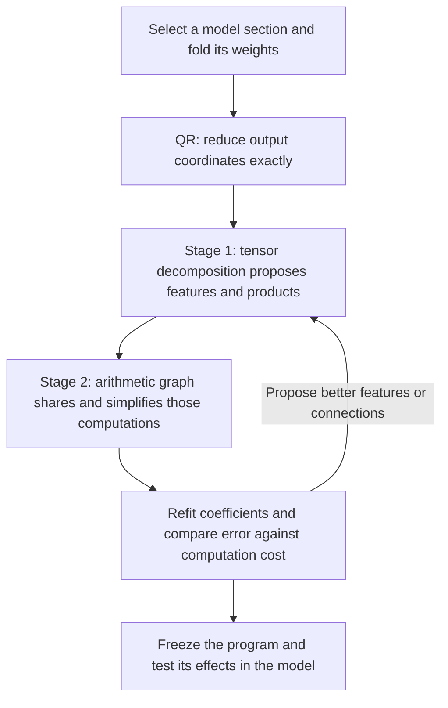
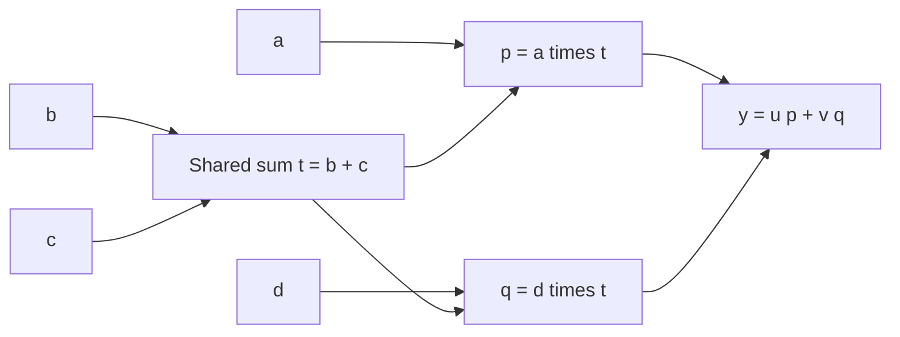
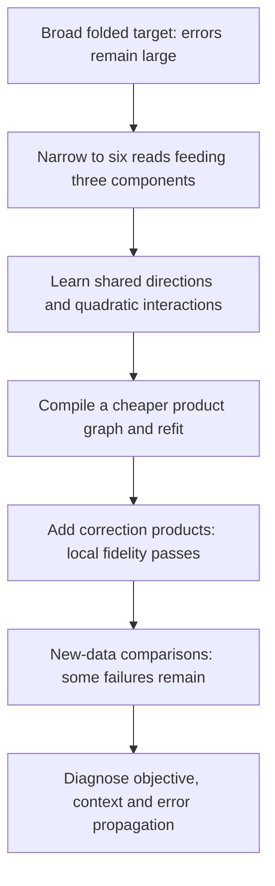

**From folded weights to a smaller arithmetic program: overall review**

Rewritten 21 September 2026, 16:10 UTC. Completed results covered through 16:02 UTC. The old filename is retained so existing links work.

**The plan you remember is still the intended direction:** first use a tensor decomposition to discover useful computations; then turn those computations into a graph that can share work, simplify it, and refit it. QR reduces the output coordinates before either stage.

We have implemented the QR reduction, direct tensor-fitting objectives, and several restricted forms of shared arithmetic graphs. On a small model-derived target, we obtained a graph with **15.7% fewer source multiplications** that passes our local reconstruction limits. It still fails some comparisons on new data. **We have not obtained an accurate replacement for the full folded section, or completed a general Tucker/HT-to-arbitrary-circuit search.**

The previous report mixed that overall story with many local experiments. In particular, “full coverage” described how we measured a selected target's error; it did not mean that the full model had been decomposed.

**The original proposal, end to end**

The output we want is a small program whose intermediate variables can be inspected and reused. A tensor decomposition supplies candidate building blocks. The final program need not retain the decomposition's original layout.

| Term | Meaning in this project |
|---|---|
| **Folding** | Algebraically combine consecutive computations so their joint function can be studied. |
| **Tensor** | An array of polynomial coefficients, possibly represented implicitly through factors. |
| **Feature** | A scalar intermediate value: a linear projection, product, or combination of products. |
| **Rank / width** | How many intermediate directions or channels a factorization allows. |
| **Arithmetic circuit / DAG** | An acyclic program of linear combinations and products. Multiple consumers can use the same computed value. |
| **Baseline** | A competing program used to judge whether our error and cost are actually better. |

**Where QR and the joint tensor fit**

For one bilinear MLP followed by an unembedding, the polynomial contribution is

$$
F(x)=UD\big[(Lx)\odot(Rx)\big].
$$

Here $x$ has 1,152 coordinates; $L$ and $R$ each produce 4,608 projections; $\odot$ multiplies corresponding projections; $D$ writes the products into the residual stream; and $U$ maps the residual stream to 50,304 vocabulary logits.

Your suggestion was to compress the output coordinates of $UD$. The implementation factors $U$ first, then folds its remaining factor into $D$:

$$
U=Q R_U,\qquad Q^\top Q=I,\qquad C=R_U D,
$$

$$
\widetilde F(x)=C\big[(Lx)\odot(Rx)\big],
\qquad F(x)=Q\widetilde F(x).
$$

We can therefore fit 1,152 output coordinates instead of 50,304, with exactly the same Euclidean reconstruction error:

$$
\|F(x)-Q\widehat{\widetilde F}(x)\|_2
=\|\widetilde F(x)-\widehat{\widetilde F}(x)\|_2.
$$

**QR is exact preparation.** It does not itself reduce the number of bilinear products or discover a circuit. This equality concerns the polynomial output before subsequent nonlinear operations.

The resulting joint tensor is

$$
\widetilde F_v(x)=\sum_{i,j}T_{vij}x_i x_j,
$$

$$
T_{vij}=\frac12\sum_k C_{vk}
\left(L_{ki}R_{kj}+L_{kj}R_{ki}\right).
$$

It is **order three** because it has three indices: one output index and two input indices. Its polynomial is **degree two**. We optimize the combined tensor rather than independently compressing $C,L,R$, because their contractions can expose cancellations and shared structure. Implicit contractions avoid storing every tensor entry.

Folding two pure bilinear layers produces a degree-four polynomial with an **order-five** coefficient tensor: one output index and four input indices. Residual paths add lower-degree terms. RMSNorm, attention normalization, and logit softcapping remain explicit operations; the complete normalized model is not a fixed polynomial.

**Stage 1: propose computations with a decomposition**

The shared-input Tucker proposal is

$$
s=P^\top x,\qquad
h_g=\sum_{p,q}G_{gpq}s_p s_q,\qquad
\widehat{\widetilde F}=Wh.
$$

The columns of $P$ define linear features $s_p$. The **core** $G$ says which pairs of features interact to form each $h_g$. The column $W_{:,g}$ specifies that feature's output effect. A sparse core uses few interactions; a narrow core uses few channels. Those are different constraints.

**Hierarchical Tucker (HT)** represents a tensor as a tree of smaller bilinear computations. For a quartic target, it can propose quadratic features and then products of those quadratic features. Its tree groups tensor slots, not necessarily subsets of input coordinates: all four input slots can receive the same full vector $x$.

We also tried related factorizations, including **output-sharing block terms**: several products contribute to one common output direction. The implemented research is broader than standard Tucker, but it is not a completed general HT implementation and search.

**Stage 2: turn those computations into a cheaper graph**

A graph allows a computation to be performed once and reused. For example,

$$
y=u(ab+ac)+v(db+dc)
$$

can become

$$
t=b+c,\qquad p=at,\qquad q=dt,\qquad y=up+vq.
$$

This uses two products instead of four. Tucker could find this particular shared sum by changing its input basis. The proposed graph stage extends that freedom to intermediate computations at different depths, including repeated quadratic features in a quartic function.

We have implemented restricted shared-product layouts, conversion to executable graphs, pruning, and coefficient/direction refitting. **We have not implemented the full proposed search over arbitrary graph edits and connections.** Counting nonzero tensor entries alone would miss some savings: a dense quadratic form can have a cheap low-rank implementation, and a reused product should be charged once.

**What actually happened after we adopted this direction**

There were three main phases.

**First, broad folded fits showed that simplification was possible but accuracy was inadequate.** For a selected last-two-MLP contribution, one simplification reduced products from 1,024 to 512. FineWeb logit-effect reconstruction error improved from 28.21% to 26.11%, and code error from 23.62% to 21.36%. These are errors in reproducing the selected effect, not language-model error rates. Stored coefficients barely decreased: 2.672 million to 2.654 million. Halving nonlinear products did not halve the whole computation.

**Second, we narrowed the target to diagnose the problem.** Most recent experiments reconstruct **six quadratic measurements from MLP16 feeding three selected components in MLP17**. A measurement, called a *read*, has the form

$$
q_j(z)=z^\top Q_jz.
$$

Each downstream component combines two reads, along with residual and normalization context. The replacement still receives intermediate information from the original model. This is a local compression experiment, not an extracted token-to-output circuit.

**Third, we improved this smaller graph and tested whether the improvements transferred.** Allowing features to be shared by pairs of components helped more than forcing all components to use one shared dictionary. Dense fits could be accurate but expensive; compiling them into cheap products lost accuracy; refitting recovered some of it. Adding correction products eventually met the local fidelity requirements.

**The strongest local result—and its limits**

Increasing the correction dictionary produced the following tradeoff:

| Added correction products | Saving in source multiplications | Local reconstruction outcome |
|---|---:|---|
| 14 | 20.05% | Fails |
| 32 | 18.49% | Values and derivatives pass; coefficient limit narrowly fails |
| 64 | **15.71%** | **All registered local reconstruction limits pass** |

The last graph uses 1,121,568 source multiplications versus 1,330,560 in the original comparison program. It contains 1,120 nonlinear products and stores 1,131,980 floating-point coefficients. Source multiplications include projections and product weighting; these counts exclude common downstream work and are not measured whole-model speedups.

The original goal of at least 20% savings remains unmet. The 15.7% result is a less aggressive point on the cost–accuracy curve.

Its coefficient error is **7.63% in covariance-shaped coordinates** but **57.74% in original coordinates**. Its three component-value errors on the examined states are **1.73%, 2.17%, and 8.35%**. These are different metrics: success in a geometry informed by activations is not uniformly accurate weight reconstruction. Exported execution, derivatives, and FP32 replay were checked.

We froze this graph and evaluated two new panels totaling 64 FineWeb documents and 32 code files. Both panels passed the absolute logit-effect error limits, but both retained some failures against similarly priced alternatives. Pooling left two failures against the covariance-shaped baseline: the graph had 13.7% and 10.6% more error in two code/component-three comparisons, above the allowed 10% disadvantage. Uncertainty intervals crossed that threshold; the point-estimate failures remain, and pooling does not erase individual-panel failures.

[Local fit and cost](../../direct_tensor_match/TWO_READ_CORRECTION_FRONTIER64_V1.json) · [Execution and baseline audit](../../direct_tensor_match/FRONTIER64_EXPORT_AUDIT_V1.json) · [Fresh-panel comparison](../../direct_tensor_match/FRONTIER_REPLICATION_COMPARISON_V1.json).

**What the subsequent diagnostics added**

The failures already occur in the scalar computations before final normalization and softcapping. They are not solely an output-processing artifact.

We then made part of the residual computation consistent with the approximate reads, rather than supplying the original residual projection. That stricter interface exposed an absolute error failure: 16.94% in one FineWeb comparison, against a 15% limit. It still receives native normalization and other context, so it is not full extraction either.

Two attempted repairs have not solved transfer:

| Attempt | What improved | What happened in the model |
|---|---|---|
| Add a direction chosen to reduce worst-case read error over a bounded input set | The targeted mathematical bound passed; a random-direction control failed. | The absolute failure remained at 16.79%, and some relative comparisons worsened. |
| Refit using natural source/context pairs, or all combinations of calibration sources and contexts | Both reduced their fitting objectives. | The same absolute comparison worsened to 18.17% and 17.81%, respectively. Neither candidate was accepted. |

These follow-ups reused already examined panels. They are diagnostics, not independent fresh validations. An initially stalled optimization was identified as a numerical scaling problem, repaired, and retained in the record rather than counted as a structural impossibility.

The latest concrete question is calibration coverage: those fits used 448 positions from seven historical 64-token prefixes, whereas evaluation covers positions 16–255 in 256-token contexts. A position-stratified check was launched to test that mismatch. This report does not claim that longer contexts explain the failures.

[Residual-interface explanation](../../direct_tensor_match/GENERATED_RESIDUAL_INTERPRETATION_V1.md) · [Worst-case repair and transfer](../../direct_tensor_match/ROBUST_TRANSFER_INTERPRETATION_V1.md) · [Source/context fitting and transfer](../../direct_tensor_match/INTERCHANGE_TRANSFER_INTERPRETATION_V1.md).

**Did direct weight optimization help? Was Tucker simply given too little rank?**

Direct weight matching helped us fit the joint computation and distinguish representation limits from optimizer problems. In one earlier local study, learning feature directions reduced covariance-shaped coefficient error from 37.47% to 8.22%. Exact conditional coefficient solves also made several restricted fits more reliable.

But a better coefficient objective has not reliably implied better model behavior. In one quartic experiment, coefficient error improved from 80.86% to 13.97% while native-function error worsened from 37.71% to 48.97%.

There are three distinct failure modes:

| Failure mode | Evidence | Implication |
|---|---|---|
| Insufficient allowed structure | Lower bounds rule out some frozen input spans at the required accuracy. | More optimization cannot repair those particular fixed layouts. |
| Difficulty finding available structure | Toy recovery changes sharply with initialization, parameterization and search width. | A failed fit does not establish that the representation is incapable. |
| Wrong proxy for the desired behavior | Better coefficient or fitting-state errors can worsen transfer. | Evaluate the composed computation as well as its tensor approximation. |

So the explanation is not simply “we chose a Tucker rank and the Frobenius error was high.” These experiments also do not establish that general Tucker or HT cannot work.

Both weight-only and activation-informed objectives have been used. For quadratic functions, exact expected squared error depends on **fourth-order input moments**—the second moment of the lifted quadratic features. An ordinary input covariance matrix alone does not determine that loss without additional distributional assumptions. The distinction matters when interpreting covariance-shaped results.

Controlled examples support the two-stage idea in a restricted setting. With shared input spaces supplied, Adam and Muon each recovered all five planted cases using the better of two starts; initially learning the shared spaces as well recovered none. Algebraic proposals plus a wider candidate search and refitting recovered all five noisy functions, but only four passed the internal-feature identity test at 1% noise. These five recent cases belong to one sharing family, not five different architectural baselines. There is no established universal optimizer winner.

[Controlled examples and native follow-up](research_update_2026-09-21_1345_algebraic_proposals_and_refitting.md) · [Earlier broad experiments](research_update_2026-09-21_0738_decomposition_detailed_review.md).

**What the old report's labels meant**

**“Full coverage”** meant accounting for error across the selected reconstruction target, including error outside the fitted subspace. It did not mean decomposing the whole network or completing both stages.

**“Shared baselines”** meant that the competing programs also reuse computations. We should not claim a saving merely by comparing against an unnecessarily duplicated program. Recent stronger baselines share work within each pair of reads and fit within the candidate's arithmetic and storage budgets. Optimization effort is not matched: the candidate received more adaptive functional fitting.

**Where the original plan stands now**

| Piece of the plan | Status |
|---|---|
| Exact QR and folded polynomial targets | Implemented. |
| Direct fitting in weight-only and activation-informed geometries | Implemented; their behavioral limitations are now clearer. |
| Decomposition as a source of useful features | Demonstrated in restricted toys and local model fits. |
| General HT initialization and broad arithmetic-graph search | Incomplete. |
| A cheaper local program with acceptable examined-state reconstruction | Achieved at 15.7% source-cost saving. |
| Reliable transfer, full folded replacement, and interpretable reusable circuits | Not achieved. |

The immediate task is to explain and repair the local transfer gap without merely improving another training metric. The broader task remains the one you proposed: use decompositions to propose computations, allow graph optimization to reorganize and share them, and demonstrate a favorable error–cost tradeoff on the larger folded function. Stable feature identity and semantic meaning require separate evidence; sharing an output effect does not make a feature one concept.
