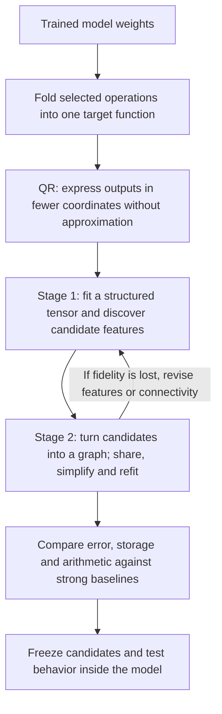
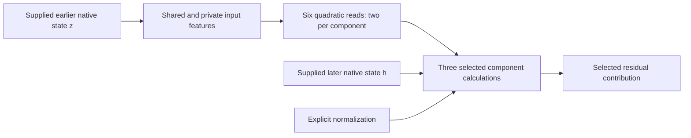

# Folding → tensor decomposition → a simpler arithmetic circuit

Overall review rewritten **21 September 2026, 13:07 UTC**. The original filename is retained so existing links still work. This replaces the earlier experiment-by-experiment account with the trajectory since the two-stage proposal.

**Your recollection is right. The proposal was to fold the weights together, use QR to reduce the output coordinates exactly, discover useful features with a tensor decomposition, and then simplify those features into a shared arithmetic program. We have implemented and tested parts of that pipeline. We have not completed a general Tucker/HT-to-circuit search or found a faithful, cheaper replacement for the full folded section.**

The most important development is that the experiments narrowed. Broad folded fits were still inaccurate, so we moved to a smaller diagnostic problem: **six quadratic measurements feeding three selected components**. Most recent reports are about that problem. There we have evidence that better feature sharing helps the tensor fit, but turning the fit into a sufficiently cheap and accurate program remains unresolved.

**The original plan, in one picture**

A **feature** here is a computed scalar, such as a linear projection or a sum of products. A **dictionary** is a collection of such features. A **shared feature** is computed once and consumed in several places; a **private feature** is available to just one component. None of these terms implies that the feature has a single human-readable meaning.

**What folding and QR actually do**

One bilinear MLP followed by the linear unembedding computes

$$
F(x)=UD\big[(Lx)\odot(Rx)\big].
$$

The input $x$ has 1,152 coordinates. The matrices $L$ and $R$ each produce 4,608 scalar projections. The symbol $\odot$ multiplies corresponding projections. The matrix $D$ writes those products into the residual stream; $U$ maps the residual stream to 50,304 vocabulary outputs.

Folding contracts these maps so we study the **combined function**, rather than independently compressing $U$, $D$, $L$ and $R$.

You proposed QR on $UD$. The implementation factors $U$ first, then folds the remaining factor into $D$:

$$
U=Q R_U,\qquad Q^\top Q=I,\qquad C=R_U D,
$$

$$
\widetilde F(x)=C\big[(Lx)\odot(Rx)\big],\qquad F(x)=Q\widetilde F(x).
$$

This lets us fit **1,152 output coordinates instead of 50,304**, with exact Euclidean error preservation:

$$
\|F(x)-Q\widehat{\widetilde F}(x)\|_2
=\|\widetilde F(x)-\widehat{\widetilde F}(x)\|_2.
$$

QR is a preparation step. It does not eliminate any products or establish a simpler circuit. RMSNorm, attention normalization and the final logit softcap remain explicit operations; the error equality above concerns the linear output map.

**Stage 1: find useful intermediate computations**

The folded single-layer function has a joint coefficient tensor:

$$
\widetilde F_v(x)=\sum_{i,j}T_{vij}x_i x_j,
\qquad
T_{vij}=\frac12\sum_k C_{vk}
\left(L_{ki}R_{kj}+L_{kj}R_{ki}\right).
$$

“Order three” means **three indices: output, input, input**. The function is quadratic, not cubic. The tensor is implicit: we can calculate losses by contracting its factors without allocating every entry.

A Tucker decomposition approximates it by

$$
s=P^\top x,\qquad
h_g=\sum_{p,q}G_{gpq}s_p s_q,\qquad
\widehat{\widetilde F}=Wh.
$$

| Object | What it means |
|---|---|
| $P$ | Learned input directions; its columns define the scalar features $s_p$. |
| $G$ | Interaction coefficients. $G_{gpq}$ weights product $s_p s_q$ inside feature $h_g$. |
| $W$ | Output directions; column $g$ describes the output effect of $h_g$. |
| Width/rank | How many directions the chosen representation permits. Smaller widths cost less but restrict what it can fit. |

Two pure bilinear layers produce a quartic function with an **order-five tensor**: one output index and four input indices. Residual paths add lower-degree terms. Hierarchical Tucker (HT) represents this through a tree of smaller bilinear computations—linear features combine into quadratic features, which combine into quartic outputs. Its tree groups tensor slots; it need not partition the input coordinates.

Tucker and HT supply candidate computations. Low rank alone does not select sparse, interpretable features or the cheapest program. Repeated inputs also matter: different coefficient tensors can represent the same polynomial when every input slot receives the same $x$.

**Stage 2: simplify the computation, allowing reuse**

Suppose a decomposition gives

$$
y=u(ab+ac)+v(db+dc).
$$

We can rewrite this as

$$
t=b+c,\qquad p=at,\qquad q=dt,\qquad y=up+vq.
$$

There are now two scalar products instead of four, and $t$ is computed once. Tucker could discover this particular linear basis change. The intended graph stage also permits sharing of *computed quadratic or higher-degree features*, across branches and depths.

An **arithmetic circuit**, or computation **DAG**, is that program of linear combinations and products. The intended search alternates structural edits with coefficient refitting. It charges each reused node once, while also charging for dense projections and output maps. Fewer product nodes alone do not establish lower total arithmetic.

We have implemented specific shared-product graphs, algebraic rewrites, pruning and joint refitting. **We have not implemented the full general search over arbitrary DAGs initialized by Tucker or HT.** The useful broad initial fit was an output-sharing block decomposition: several products contribute to each output direction. It was not the endpoint of a complete HT pipeline.

**How the research moved from the proposal to today's experiments**

| Step | What we tried | What we learned |
|---|---|---|
| Broad folded target | Fit a selected contribution involving the last two MLPs, then simplify its products. | Products fell from 1,024 to 512, but the result was still inaccurate and storage barely fell. |
| Smaller diagnostic target | Reconstruct six quadratic reads feeding three selected components. | We could test sharing, optimizers and exact algebra much more directly. This changed the scope of the experiments. |
| Shared versus private features | Reuse some computations while leaving others component-specific. | Sharing helped the first two components; forcing too much sharing damaged the third. |
| Stronger baselines | Compare with programs that already share work, including similar-storage alternatives. | Early gains in product count did not consistently survive full cost and behavioral comparisons. |
| Better feature layouts | Let features be shared by pairs of components, rather than requiring one dictionary shared by all three. | Tensor fitting improved. The dense representation remained too expensive. |
| Compile and refit the cheap graph | Convert those forms into reusable products and improve their coefficients jointly. | Much of the lost accuracy was recovered, but the graph still failed the fidelity requirements. |

For the broad target, simplification changed native logit-effect error from **28.21% to 26.11% on FineWeb** and **23.62% to 21.36% on code**. Storage changed only from **2.672M to 2.654M coefficients**. Halving the products was useful, but did not deliver a faithful reconstruction or a large storage reduction.

The later local problem has this interface:

Each read has the form $q_j(z)=z^\top Q_j z$. These are selected scalar measurements, **not the entire MLP output**. The program still receives intermediate states from the original model. It is therefore a conditional reconstruction, not an extracted circuit that starts from tokens.

**The clearest recent result: better tensor fit, then a circuit-conversion gap**

Allowing pairwise feature sharing improved covariance-shaped coefficient error from **7.918% to 7.577%** in a matched continuation comparison. In the separate weight-only objective, error improved from **51.117% to 49.082%**. Changing who shares features helped under both objectives.

Here is what then happened to the primary covariance-shaped candidate. These rows concern the same local target; lower error is better.

| Representation | Covariance-shaped coefficient error | Component 3 value error | Source multiplications |
|---|---:|---:|---:|
| Original pair-program baseline | 7.031% | 8.81% | 1,330,560 |
| Dense pairwise-shared tensor fit | **7.577%** | 10.55% | 1,548,240 |
| First cheap graph conversion | 11.150% | 14.21% | **1,047,648** |
| Cheap graph after alternating exact updates | **7.994%** | **10.93%** | **1,047,648** |
| Required limits | At most 7.734% | At most 9.69% | At most 1,064,448 |

The dense fit meets the coefficient limit but exceeds the arithmetic budget and misses component fidelity. The refined graph saves **21.26% of source multiplications**, but still misses fidelity. It also misses the value limits for components 1 and 2. These are operation counts for the selected source computation, not measured whole-model speedups.

The subsequent fit let private input directions move outside the previously chosen subspaces. **It did not improve on the warm-start solution:** both warm fits selected step zero as their best checkpoint. Random starts did not beat them; one also failed the compiler's numerical reconstruction check. This is a failed optimization attempt, not proof that moving directions cannot help. These latest measurements use previously examined states, not a new behavioral test set.

A separate numerical lower bound gives a more specific negative conclusion: within the frozen pair input spaces, this private-branch structure cannot reach the coefficient requirement. Its lower bound is **7.798%**, above the **7.734%** limit. Allowing private directions anywhere lowers the bound to **7.174%**, which leaves success possible but does not establish attainability. Neither bound rules out other graph structures.

**Did weight matching and the paper's metric idea help?**

Yes. Direct tensor matching made the folded function an optimization target, allowed exact conditional coefficient solves, and exposed errors hidden by individual-matrix compression. Jointly learning directions reduced one earlier fixed-direction graph's covariance error from **37.47% to 8.22%**. That is real progress, even though the resulting graph still lost important baseline comparisons.

We have used two main error geometries:

| Metric | What it emphasizes |
|---|---|
| Weight-only coefficient error | Tensor coefficients in the original input coordinates. |
| Covariance-shaped coefficient error | A reweighted tensor geometry informed by calibration activations. |

They are not interchangeable. A small error in one can coexist with a large error in the other. A mixed objective has also been tested. Covariance information helped some behavioral comparisons, but no tested geometry was best for every component and domain.

The paper's $M$ should be understood in the appropriate lifted feature space. For quadratic outputs, expected squared functional error depends on fourth-order input moments; raw input covariance alone does not specify it without further assumptions. Our covariance-shaped loss should not be described as exact expected text-distribution error.

**Why “Tucker/HT failed because we assumed too little rank” is incomplete**

There are three different failure modes, and we have seen evidence of each:

| Failure mode | Evidence and implication |
|---|---|
| Insufficient representation | Some fixed layouts have error lower bounds above their requirements. More optimizer steps cannot rescue those layouts. |
| Optimization failure | Random fitting sometimes misses planted toy programs that the representation can express exactly. Optimizer, initialization and parameterization matter. |
| Wrong metric for model behavior | A quartic fit reduced coefficient error from 80.86% to 13.97% while native-function error worsened from 37.71% to 48.97%. |

Muon beat Adam in several toy comparisons, but not universally across representations. For the latest private-direction parameterization, the better of two restarts recovered **four of five** planted targets with Muon and **two of five** with Adam under the tested schedule. That did not translate into improvement on the native warm start. We cannot label every native miss a rank limit or every toy success a validated native optimizer.

Positive results also need checks. For example, an apparent storage saving required packing tensor views that retained unused backing memory. Shared-branch identity changed substantially across starts even when the total functions nearly agreed. Useful sharing does not yet establish a uniquely identified or monosemantic feature.

**What the baselines and “full coverage” wording meant**

“Full coverage” meant accounting for the entire **chosen target**, including residual error outside a fitted subspace. It did not mean that we had decomposed the full model. “Shared baselines” meant comparison programs that already reuse computations, so our method must improve on something stronger than an unnecessarily duplicated implementation.

On the latest fresh behavioral panel for earlier, wider graphs—32 FineWeb documents and 16 code files—all three fitting geometries passed the aggregate absolute limits, but **none passed every relative comparison against the baselines**. The newer local candidates above have not superseded that result with fresh validation.

The research direction remains the same: use decompositions to propose useful computations, then optimize a program that can reuse them. The evidence now says that **the graph stage must be allowed to revise feature directions and sharing patterns**, and that conversion into a cheap program needs its own fidelity test. The unresolved deliverable is a program that wins on total cost while retaining behavior; stable semantics and extraction from tokens are further requirements.

**Links to the supporting detail**

- [Earlier detailed review](research_update_2026-09-21_0738_decomposition_detailed_review.md): broad folding results and historical experiments.
- [Cost-matched baselines](research_update_2026-09-21_1020_cost_matched_pair_baselines.md) and [fresh behavioral comparisons](research_update_2026-09-21_1037_fresh_metric_transfer.md).
- [Joint fitting and feature identity](research_update_2026-09-21_1132_joint_graph_fit_and_identity.md).
- [Pairwise sharing and the conversion gap](research_update_2026-09-21_1237_stage_one_gain_and_graph_conversion_gap.md).
- [Alternating refinement and scoped rank bounds](research_update_2026-09-21_1256_private_forms_and_input_span_limits.md).
- [Completed private-direction fit](../../direct_tensor_match/FREE_PRIVATE_NATIVE_V1.json): subsequent to the running-status statement in the 12:56 report.

All percentages above are reconstruction errors, not language-model accuracy. Coefficient, component-value and logit-effect errors measure different objects; comparisons are meaningful within their stated target and metric.
