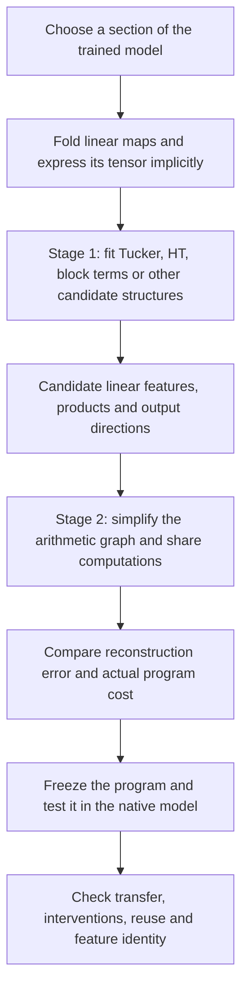
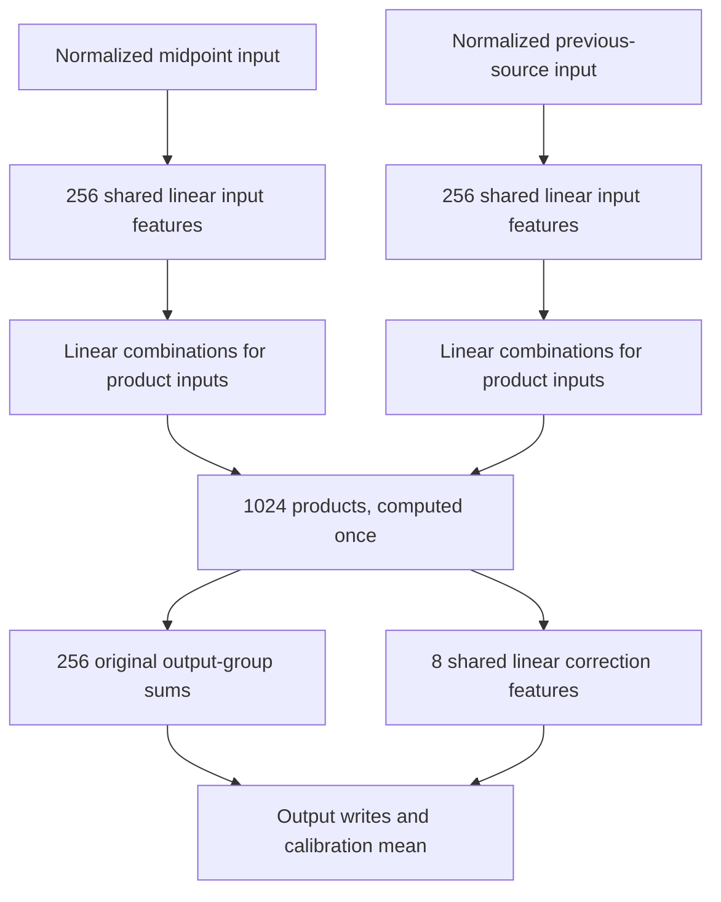

# Overall review: from tensor decomposition to shared arithmetic graphs

Rewritten 21 September 2026, 01:27 UTC. This replaces the incremental experiment log previously at this path.

**Your original two-stage idea is still the direction:** first use tensor decompositions to discover useful computations; then simplify their arithmetic graph, allowing computations to be shared. We now have a concrete example of that pipeline that approximates a selected folded section of the model. We do **not** yet have a general automatic graph-search system or a set of identified semantic circuits.

The strongest progress is that a weight-derived decomposition can be converted into a graph, improved with a small shared correction, and made substantially smaller by sharing its input projections. Native-model tests show useful fidelity, with meaningful remaining error. The initial Tucker/HT experiments did not establish that those methods are incapable of finding circuits.

## 1. What we set out to do

For the 18-block model, the residual width is 1,152, the bilinear width is 4,608, and the vocabulary has 50,304 tokens. A bilinear MLP computes

$$
B(x)=D[(Lx)\odot(Rx)].
$$

Each row of $L$ or $R$ reads one scalar feature from $x$. The elementwise product $\odot$ multiplies corresponding features. The columns of $D$ specify where those products write into the residual stream.

The proposed workflow was:

A **tensor decomposition** proposes how to build the function. An **arithmetic graph**, or DAG, records which linear combinations and products are actually computed, and which later computations reuse them. A **circuit**, in the stronger sense we want, needs additional evidence about its behavior and interventions. A compact graph alone is not that evidence.

## 2. Where QR and folding enter

Let $U$ be the unembedding: the matrix mapping residual vectors to vocabulary logits. Before final nonlinear operations, the MLP's projected contribution is

$$
F(x)=UD[(Lx)\odot(Rx)].
$$

Our implementation uses the thin QR factorization

$$
U=Q R_U,\qquad Q^\top Q=I,
$$

and folds $R_U$ into the MLP output matrix:

$$
\widetilde D=R_U D,\qquad
F(x)=Q\underbrace{\widetilde D[(Lx)\odot(Rx)]}_{\widetilde F(x)}.
$$

We can therefore work with 1,152 reduced output coordinates instead of 50,304 vocabulary coordinates. This step is **exact**: multiplying by the fixed $Q$ restores the linear vocabulary-space contribution, and preserves Euclidean error. Directly QR-factorizing $UD$, as you proposed, is another way to express this output-space reduction; the implementation here QR-factorizes $U$ and then contracts with $D$.

**QR is not the lossy decomposition.** Choosing only 4 or 256 output directions later is a separate approximation. Those two operations were too easy to confuse in the earlier report.

We can also fold earlier linear output projections into $L$ and $R$. If an input is assembled as $x=Ez$, its contribution becomes

$$
\widetilde F(z)=\widetilde D[(LEz)\odot(REz)].
$$

This defines an **order-three tensor**: one output index and two input indices. “Order three” counts indices; the function is quadratic, not cubic. We evaluate and contract this tensor implicitly rather than allocate its enormous dense array.

Substituting a previous bilinear computation into those input features produces quartic terms and an **order-five tensor**. We explored that route too. RMS normalization, attention normalization and softcapping remain explicit operations; these are not folded into a fixed polynomial tensor.

## 3. What happened in the decomposition stage

We tested planted toy structures, optimizer choices, learning rates, restarts and different notions of reconstruction error. We then tried quadratic and quartic structures on trained weights, including sparse Tucker-style cores, CP/product sums, shared quadratic features and hierarchical constructions.

A Tucker-style candidate has the form

$$
s=P^\top z,\qquad
h_g=\sum_{p,q}G_{gpq}s_ps_q,\qquad
y=Wh.
$$

Here $s_p$ are learned input features, $G$ specifies their interactions, and $W$ gives each computed feature's output effect. HT extends the organization into a hierarchy over tensor input slots. A general DAG additionally permits reuse across branches.

**There was no single “Tucker/HT failed” result.** The experiments exposed several different issues:

- **Optimization:** representable toy functions sometimes fitted poorly from one initialization or learning rate, then recovered under a different fit. A bad endpoint is not a rank lower bound.
- **Choice of structure:** a function cheap as a shared computation can be expensive in a flat product representation or an unfavorable hierarchy.
- **Choice of error metric:** matching every coefficient equally can spend capacity on directions that matter little on model states. Conversely, fitting a data-weighted metric does not establish global coefficient accuracy.
- **Feature identity:** different decompositions can compute almost the same function while assigning different meanings to their intermediate variables. Sparse or low-rank representations do not resolve this automatically.

The global quartic fits were not sufficiently good or economical to yield the desired circuits. We therefore retained intermediate computations and worked on a more tractable folded path, rather than claiming a successful decomposition of the fully expanded network.

## 4. Which folded function are we working on now?

The current target is the part of the **last bilinear MLP** that depends on the previous MLP's polynomial residual contribution.

Let $h$ be the last MLP's input, and let $m$ be that previous contribution. The target is

$$
B(h)-B(h-m).
$$

An early approach concentrated on the previous contribution's self-interaction. But its cross-interactions with the rest of the residual stream also matter. The midpoint identity retains all of them:

$$
n=h-\frac{m}{2},
$$

$$
\boxed{
B(h)-B(h-m)
=D[(Ln)\odot(Rm)+(Rn)\odot(Lm)].
}
$$

This is bilinear in the intermediate vectors $n$ and $m$. It lets us retain the earlier computation instead of expanding every quartic coefficient. In evaluation, both inputs receive the appropriate native normalization scaling; the recipient residual context and final nonlinear operations remain native.

**Scope:** this is a complete source-dependent contribution within the last MLP. It is not the entire model, and it still needs the upstream model to supply $n$ and $m$.

## 5. Why the report switched from four features to “full coverage”

Initially we reconstructed four selected output features very well. A 16-product program reproduced their joint native swap effects with roughly 5–6% error on a new panel.

That result was real, but its target was limited. The four output directions omitted 46.5% of the calibration variation norm of the whole folded contribution. Good reconstruction of those four features was not a good reconstruction of everything.

We then expanded to 256 output directions and counted the error from **all omitted directions**. That is what the old title meant by “full coverage.” It should have said **evaluation against the full folded contribution**. The representation still omits directions and is approximate.

The current stage-one initializer is an **output-sharing block decomposition**, not an end-to-end HT fit: choose an output basis, then use a rank-four matrix factorization for the bilinear form associated with each output direction. This is one of the candidate structures in the broader Tucker/block-term family.

At four products per output direction, this gives 1,024 products. With the same selected output basis, changing the input-fitting metric made a large difference:

| Full folded-output variation error | Isotropic input metric | Calibration-weighted input metric |
|---|---:|---:|
| FineWeb diagnostic panel | 65.7% | 28.0% |
| Related-code diagnostic panel | 50.8% | 18.0% |

These errors are measured before the final native normalization and softcap. They are not token error rates or intervention errors.

**Your covariance suggestion helped.** We explored both isotropic objectives and calibration-informed moments, including a paired-input moment in earlier smaller experiments. The latest program also uses calibration data for output refitting. Its discovery starts from weights, but it is not data-free. Both columns above use the same calibration-selected output basis; this is a comparison of input metrics, not an entirely data-free method against a data-informed one.

## 6. What we have actually implemented from stage two

The current candidate starts with 1,024 learned products, originally arranged in 256 groups of four. Each group shares an output direction. We have tested concrete graph changes rather than treating that grouping as permanent.

**First, let individual products write beyond their original groups.** An unconstrained output refit overfitted. Regularizing the refit toward zero also lost useful structure. Regularizing toward the original weight-derived writers worked better.

**Second, compress the useful correction into shared features.** Eight linear combinations of the existing products retained the correction's benefit. Each product is computed once and feeds both its original group and the correction. No new products are required.

**Third, share the input projections.** The latest experiment finds common input subspaces from contractions of the joint tensor, taking both the other input factors and output writers into account. This is more informed than compressing each matrix independently.

The graph now has this structure:

The eight correction features are continuous linear combinations of products. They are not automatically eight interpretable concepts.

| Executable graph | Products | Weight coefficients |
|---|---:|---:|
| Products with grouped output writers | 1,024 | 2,654,208 |
| Add eight shared correction features | 1,024 | 2,671,616 |
| Also share 256 input features on each side | 1,024 | 1,426,432 |

Means are accounted for separately. These counts cover the folded section, not upstream computation or the whole model. The latest graph cuts weight storage by about 47% relative to the corrected graph. A small CPU benchmark also ran faster, but we have not established whole-model or GPU speedup.

**What remains missing from stage two:** a general search that proposes arbitrary graph edits, changes topology, merges intermediate computations across depths and jointly refits them. We have tested selected edits and exported executable graphs. We have not built the full automatic search procedure you proposed.

## 7. What the native-model tests say

There are two distinct questions:

- **Replacement:** if we substitute the approximation, how much does next-token cross-entropy increase? Lower is better; zero would preserve the native loss on that panel.
- **Intervention:** if we remove or swap the computation, how closely does the approximation reproduce the native logit change? This is a relative error in the change, not in the original logits.

For the corrected graph **before input sharing**, we froze its weights and tested new documents: 32 FineWeb documents and 16 previously unused top-level Python files from this repository.

| New-panel result | FineWeb | Related local code |
|---|---:|---:|
| Replacement cross-entropy increase, nats/token | 0.0101 | 0.0253 |
| Full-contribution removal-effect error | 22.29% | 15.53% |
| Full-contribution same-token swap-effect error | 28.17% | 26.10% |

The correction lowered code replacement loss from 0.0374 to 0.0253 nats/token. The registered confirmation checks passed. The code panel is not broad external OOD, and pretraining overlap is unknown.

The **new input-sharing graph** has so far been tested on the older reused diagnostic panels. Its swap errors were 31.28% on FineWeb and 27.17% on code, within the registered 5% relative degradation allowance against the larger graph on those same panels. It passed that preservation test, but has not received its own fresh-panel confirmation. Its FineWeb result remains above the earlier 30% absolute intervention threshold.

Do not compare the early 5–6% figure directly with these 28–31% figures: the former concerned four selected output features; the latter includes the entire varying folded contribution.

## 8. What the shared baselines taught us

We also tried retaining native channels and refitting their output writers, instead of learning new factors. At the same 1,024-product budget, that baseline looked better on calibration data but transferred worse in native interventions. Regularization helped without reversing the comparison.

This is why the report contains negative results: they prevent us from mistaking a good training fit for a useful circuit. Likewise, splitting a good combined computation into positive and negative components produced unreliable individual interventions, and exact algebraic controls showed that different components could implement the same total function.

Our current conclusion is therefore specific:

**Decomposition has supplied useful building blocks, and several graph edits have improved their fidelity or cost. Covariance information and weight-anchored fitting helped. We have not shown that the resulting features are uniquely identified, monosemantic, reusable across arbitrary contexts, or composable with other replacements.**

The next work should test the smaller shared-input graph beyond reused panels, pursue graph changes that save products as well as projections, and establish the behavioral meaning and selective manipulability of intermediate features. Merely getting another low reconstruction error would not complete the goal.

## Evidence and further detail

This is the overall review. Individual measurements and caveats are retained in:

- [Fresh corrected-graph confirmation](research_update_2026-09-21_0121_frozen_graph_confirmation.md).
- [Full-coverage sweep results](../../direct_tensor_match/MIDPOINT_COVERAGE_SWEEP_V1.json).
- [Weight-anchored output refit](../../direct_tensor_match/MIDPOINT_PRODUCT_REFIT_NATIVE_V1.json).
- [Shared-input graph results](../../direct_tensor_match/MIDPOINT_SHARED_GRAPH_NATIVE_V1.json).

The full research objective remains open. The current object is a compact, partially validated arithmetic approximation of a defined folded path—not yet the final interpretable circuit discovery system.
