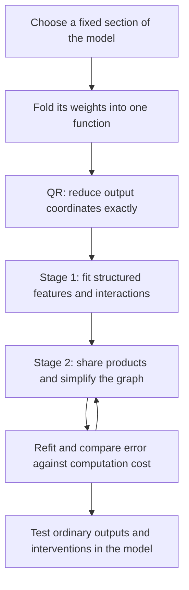
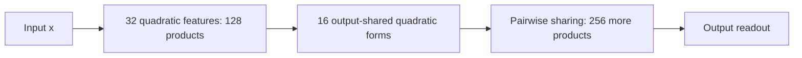

**Overall review: from folded weights to a smaller arithmetic circuit**

Rewritten 21 September 2026, 21:08 UTC. Covers the change of direction to direct tensor matching and the completed results through 20:54 UTC on 21 September. This replaces the previous narrative at the same path.

**Your recollection is right: the intended approach has two stages.** First, fit a structured decomposition to a folded section of the model. Second, turn its features into an arithmetic graph and simplify that graph by sharing computations. QR reduces the output coordinates before either stage.

We have working examples of both stages, including a quartic program reduced from **656 to 384 products**. However, the broad proposal—automatically searching over arbitrary reusable arithmetic circuits—is only partly implemented. The smaller program still has **19–29% error in the tested model-level intervention responses**, against a 10% target. We have demonstrated useful compression, but have not established a faithful, interpretable replacement circuit.

**What exactly are we reconstructing?**

A bilinear MLP computes

$$
B(x)=D\big[(Lx)\odot(Rx)\big].
$$

Here $x$ is the residual input, $L$ and $R$ produce two sets of scalar projections, $\odot$ multiplies corresponding projections, and $D$ writes those products back into the residual stream. This model has residual width 1,152 and 4,608 paired products per MLP. The unembedding $U$ maps residual coordinates to 50,304 vocabulary coordinates.

Folding the unembedding through the MLP gives the joint function

$$
F(x)=UD\big[(Lx)\odot(Rx)\big].
$$

We fit this combined computation, so cancellation or shared structure can be discovered across the original matrices. Earlier linear contributions can also be folded into the input projections: if $x=Ez$, replace $L,R$ by $LE,RE$.

Your proposal was to take QR of $UD$. The implementation takes a thin QR of $U$ and then multiplies in $D$:

$$
U=Q R_U,\qquad Q^\top Q=I,\qquad C=R_U D.
$$

The function we optimize is then

$$
\widetilde F(x)=C\big[(Lx)\odot(Rx)\big],
\qquad F(x)=Q\widetilde F(x).
$$

This uses 1,152 output coordinates instead of 50,304. It preserves Euclidean reconstruction error within that output subspace exactly:

$$
\|F(x)-Q\widehat{\widetilde F}(x)\|_2
=\|\widetilde F(x)-\widehat{\widetilde F}(x)\|_2.
$$

**QR is an exact change of output coordinates.** It makes fitting cheaper; it does not itself remove any MLP products. The identity is for the polynomial output before downstream nonlinear operations.

The “full third-order tensor” is the coefficient array of this quadratic function:

$$
T_{aij}=\frac12\sum_k C_{ak}
\left(L_{ki}R_{kj}+L_{kj}R_{ki}\right),
\qquad
\widetilde F_a(x)=\sum_{i,j}T_{aij}x_i x_j.
$$

“Order three” means three tensor indices: one output and two inputs. The polynomial has **degree two**. Substituting one pure bilinear layer into another produces degree four, with an **order-five** coefficient tensor:

$$
F_a(x)=\sum_{i,j,k,l}H_{aijkl}x_i x_j x_k x_l.
$$

The calculations generally use implicit contractions, avoiding storage of the enormous expanded tensor. RMSNorm, attention normalization and the logit softcap remain explicit operations. A pure quartic branch is only one part of the actual two-block computation.

**What each of the two stages contributes**

Stage 1 proposes useful scalar computations. A symmetric Tucker model has the form

$$
s=P^\top x,\qquad
h_g=\sum_{p,q}G_{gpq}s_p s_q,\qquad
\widehat{\widetilde F}=Wh.
$$

| Term | Meaning |
|---|---|
| $s_p$ | A learned linear feature of the input. |
| $s_p s_q$ | A product of two features. |
| $G_{gpq}$ | The weight of that product in computed feature $h_g$. |
| $h_g$ | A quadratic feature assembled from products. |
| $W_{:,g}$ | The output direction affected by that feature. |

Tucker restricts dictionary sizes; sparse Tucker additionally restricts interactions. Hierarchical Tucker (HT) factors a tensor through a tree of smaller bilinear computations. For our repeated-input polynomial, those computations can produce linear, quadratic and quartic features. The tree groups tensor **slots**; every leaf may still use the full input vector.

Stage 2 treats those computations as a program. A **DAG**, or directed acyclic graph, lets the same intermediate value feed multiple later operations. For example,

$$
y=u(ab+ac)+v(db+dc)
$$

can be evaluated as

$$
t=b+c,\qquad p=at,\qquad q=dt,\qquad y=up+vq.
$$

The four feature products become two, with $t$ computed once and reused. The same principle can share quadratic intermediates inside quartic computations. Dense projections still cost additions and stored coefficients, so saving products alone is not a complete cost comparison.

**Implemented:** structured feature fitting, exact sharing, several merge/deletion/substitution edits with refitting, and a compiler that shares products between quadratic forms. **Still incomplete:** a general search that freely changes the whole graph, its feature directions, hierarchy and reuse patterns. The latest successful example uses a restricted hierarchy and a specialized sharing compiler, rather than the complete proposed search.

A scalar feature can combine several conditions that share an output effect. Neither a sparse graph nor a shared output direction establishes a single human-readable meaning.

**How the research direction developed**

The previous report mixed three scopes. Their numbers answer different questions:

| Scope | Purpose |
|---|---|
| Selected local components | Develop and check individual graph edits. |
| Full final MLP | Compare against the complete 4,608-product computation. |
| Pure quartic branch through MLP16 and MLP17 | Test deeper feature composition and sharing. |

MLP indices start at zero. The latest 656-to-384 result concerns the third row, not the whole model or the full two-block function.

**First, we tested the machinery on known structures.** Five-family toy suites included independent products, shared inputs, shared outputs, squares and cancellation. Known-solution replay, gradient checks and deliberately bad edits help separate implementation errors from optimization failures. Random-start recovery remains imperfect. Adam performed better than Muon in the relevant tested suites, so recent native pilots used Adam; this does not establish a universal optimizer ranking. [Toy and wider-fit evidence](../../direct_tensor_match/WIDE_NATIVE_QUARTIC_INTERPRETATION_V1.md).

**Second, we checked whether small Tucker models had enough capacity.** Some did not. For the full final-MLP tensor in the folded Euclidean coefficient metric, 10% error requires input rank at least **1,089** and output rank at least **1,088**. These are separate necessary bounds from matrix unfoldings, not just high errors from an unsuccessful optimization run. Historical activation-covariance weighting changes the bounds to **416** and **818**.

This explains why very narrow dense Tucker fits could fail even with a good optimizer. It does not rule out sparse high-rank circuits or HT generally. The original MLP is already a compact product program despite broad tensor ranks. [Rank bounds and dense-core costs](../../direct_tensor_match/FULL_TENSOR_MODE_INTERPRETATION_V1.md).

**Third, we strengthened the comparison baselines.** For the full MLP, keeping 3,686 original products and refitting the readout with an affine correction saves 20% of products and 11.7% of coefficients. Ordinary logit-effect errors are 4.44% on FineWeb and 2.12% on code, yet all four intervention cohorts fail the 10% response-error criterion. This established an important difficulty: matching normal outputs does not guarantee that changed-input behavior is preserved. [Full-layer evidence](../../direct_tensor_match/FULL_QUADRATIC_FINITE_RESPONSE_INTERPRETATION_V1.md).

**Fourth, we moved the deeper fits toward response matching and broader calibration.** Simply increasing the quartic dictionary from four to 32 quadratic features improved training much more than transfer. Later we trained on both function values and changes under input interventions, then expanded calibration from 2,048 to 6,144 states. With the same 32-feature program, second-panel value error improved from **11.44% to 8.99%**, and two held donor-pair response errors improved from about **19–20% to 15%**. This used more data and fitting compute, not a larger final program. [Expanded-calibration evidence](../../direct_tensor_match/QUARTIC_EXPANDED_STATE_INTERPRETATION_V1.md).

**Did direct weight matching and covariance help?**

Direct matching gave us usable joint objectives, exact subproblem solutions and the rank bounds above. But the choice of error metric matters substantially. In an earlier comparison holding the learned quartic dictionary fixed:

| Readout-fitting objective | Second-panel polynomial-output error |
|---|---:|
| Empirical function values | 15.05% |
| Unweighted coefficient matching | 54.38% |
| Second-moment-weighted coefficient matching | 21.44% |
| Gaussian functional loss using that second moment | 19.44% |

Data-informed geometry helped the coefficient-based methods, but did not make them outperform empirical fitting. The dictionary was already learned from data, so these are not four independent end-to-end weights-only discovery runs. [Weight-matching results](../../direct_tensor_match/WIDE_QUARTIC_WEIGHT_READOUT_V1.json) · [Gaussian comparison](../../direct_tensor_match/WIDE_QUARTIC_GAUSSIAN_INTERPRETATION_V1.md).

A covariance matrix describes second moments. Squared quadratic reconstruction error involves fourth moments; squared quartic error involves eighth moments. Covariance can define a useful weighted coefficient metric or a Gaussian surrogate, but does not completely specify functional error on actual model inputs.

**The current concrete two-stage result**

The latest parent program computes 32 quadratic features, each using four products of learned linear projections. It then uses all 528 distinct pairs of those features:

$$
q_i(x)=\sum_{k=1}^{4}(u_{ik}^\top x)(v_{ik}^\top x),
\qquad
\widehat F(x)=\sum_{i\le j}c_{ij}q_i(x)q_j(x).
$$

Here each $c_{ij}$ is an output vector. The cost is $32\times4+528=656$ products.

We restrict the output combinations to 16 directions, making 16 quadratic forms of the $q_i$. Then we compile pairs of those forms using shared products:

| Program | Products | Stored floating-point coefficients |
|---|---:|---:|
| Improved parent | 656 | 903,168 |
| Compressed shared graph | **384** | **322,048** |

The graph also stores 768 integer indices. This saves about **41% of products and 64% of coefficients** relative to the parent. Common external model operations are excluded from both prices; this is not a measured whole-model speedup.

There are two separate operations here. **Restricting the output rank is approximate. Compiling the resulting forms into shared products preserves that fitted function numerically**, with relative FP32 replay discrepancy below $9\times10^{-7}$. The tiny compiler discrepancy is not the error against the original model.

We compressed the same parent with both an exact coefficient metric and an empirical value/response metric. The empirical version preserves second-panel polynomial values better: **9.12% error**, versus the parent's **8.99%** and coefficient-compressed version's **14.80%**. Its original-calibration error nonetheless rises from 3.24% to 4.29%, failing the registered relative-fidelity limit. [Compression evidence](../../direct_tensor_match/EXPANDED_ROOT_COMPRESSION_INTERPRETATION_V1.md).

**What happens when we test the compressed graph inside the model?**

The latest screen changes only the input to the pure quartic branch, keeping the recipient normalization denominator and other branches fixed. Half strength interpolates halfway toward a donor input; full strength uses the donor input. Final normalization and softcapping are evaluated normally.

These numbers measure relative error in the resulting **change in logits**, aggregated over the tested positions. Lower is better; they are not next-token error rates.

| Test | Cheap 26-product baseline | 656-product parent | 384-product empirical graph |
|---|---:|---:|---:|
| FineWeb, half strength | 42.55% | 29.42% | 29.37% |
| FineWeb, full strength | 28.41% | 24.04% | 24.09% |
| Code, half strength | 36.28% | 20.97% | 21.24% |
| Code, full strength | 31.59% | 18.99% | 19.23% |

The smaller graph closely preserves its improved parent and beats the cheap baseline on these responses. **Every cell still fails the absolute 10% target.** The combined relative acceptance test also fails: on code, the graph adds 0.01577 to ordinary cross-entropy loss versus 0.01228 for the parent, a difference of 0.00349 exceeding the allowed 0.002 margin. Numerical replay and zero-edit controls pass. The coefficient-compressed graph performs worse, with response errors of roughly 23–31%. [Latest native results](../../direct_tensor_match/EXPANDED_ROOT_NATIVE_V1.json).

These are diagnostics on already opened panels, not untouched OOD confirmation. They show a useful compression tradeoff while retaining significant functional error. Stable semantic features, selective removal and reusable causal components remain unestablished.

**How to read the old title**

“Full coverage” meant accounting for error across the entire chosen target, including directions outside a fitted subspace. It did not mean that we had decomposed the whole model. “Shared baselines” meant letting comparison programs reuse intermediate computations too, so our claimed savings were not against unnecessarily duplicated work.

The next research question is whether better features and graph edits can close the response gap at a useful cost. Further simplification of an inaccurate parent alone will not do that. Feature interpretation must describe constituent conditions and test them, rather than assigning one semantic label to each shared output feature.

**Reproducibility notes**

This report synthesizes existing experiments; it does not launch a new fit. The latest parent uses 32 quadratic features with four products each, 300 Adam steps and four training donor families. Its 6,144 calibration states come from 96 FineWeb prefixes at positions 0–63; those include 95 distinct prefix strings. The second polynomial panel has 2,048 states. Exact prefix overlap was checked, but document-disjointness and untouched historical status are not certified.

The latest native screen uses 16 FineWeb and 16 code prefixes, context length 256 and positions 16–254, with the next prefix as donor at the same position. Each candidate's intervention effect subtracts its own unedited baseline. The separate ordinary cross-entropy check measures damage from installing the candidate before intervention. This is a conditional quartic-branch test, not a complete upstream-source swap.

[Parent fit and settings](../../direct_tensor_match/QUARTIC_EXPANDED_STATE_PLAN_V1.md) · [Capture provenance](../../direct_tensor_match/QUARTIC_CAPTURE_COVERAGE_AUDIT_V1.json) · [Compression plan](../../direct_tensor_match/EXPANDED_ROOT_COMPRESSION_PLAN_V1.md) · [Native thresholds and protocol](../../direct_tensor_match/EXPANDED_ROOT_NATIVE_PLAN_V1.md).
