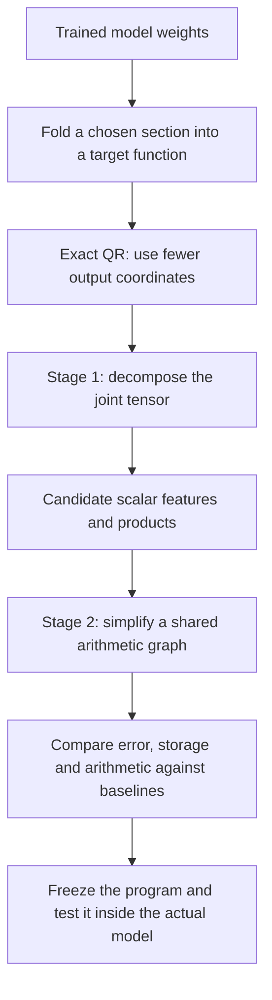
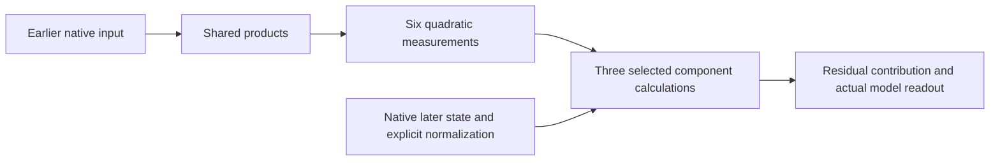

# Overall review: from folded weights to a simpler arithmetic program

Rewritten **21 September 2026, 10:42 UTC**, covering completed results through 10:37 UTC. This replaces the earlier “full coverage and shared baselines” explanation; the filename stays the same so existing links work. This is a synthesis of existing experiments, not a new experiment.

**Your recollection is correct. The proposal has two stages: use a tensor decomposition to discover useful computations, then simplify those computations in an arithmetic graph that permits reuse. QR is an exact preparation step.**

We have implemented and tested restricted versions of both stages. They have produced smaller programs for selected computations. We have **not** completed a general Tucker/HT-to-arbitrary-graph search, or found a faithful, standalone circuit for the whole folded section.

The investigation moved from a broad folded target to a smaller target because the broad fits remained inaccurate. Much of the recent reporting concerns that smaller target. This distinction is essential for interpreting the results.

**The original plan, in one picture**

A **feature** here means a computed scalar. An **arithmetic graph**, also called a circuit or DAG, is a program of linear combinations and products in which one computed value can be reused. Neither term implies a human-readable concept.

**What folding and QR actually do**

For one bilinear MLP, the contribution after a linear unembedding is

$$
F(x)=UD\big[(Lx)\odot(Rx)\big].
$$

The input $x$ has 1,152 coordinates. The matrices $L,R$ each produce 4,608 scalar projections, $\odot$ multiplies corresponding projections, $D$ writes those products into the residual stream, and $U$ maps the residual stream to 50,304 vocabulary coordinates.

Folding means treating these operations as **one function to reconstruct**, instead of compressing each matrix independently. This lets the fit exploit cancellations and common output effects across matrices.

Your suggestion was to QR-factor the combined output map $UD$. Our implementation factors $U$ first:

$$
U=Q R_U,\qquad Q^\top Q=I,\qquad C=R_U D.
$$

We then fit the smaller-output function

$$
\widetilde F(x)=C\big[(Lx)\odot(Rx)\big],
\qquad F(x)=Q\widetilde F(x).
$$

This uses 1,152 output coordinates rather than 50,304. For any replacement in that output space,

$$
\|F(x)-Q\widehat{\widetilde F}(x)\|_2
=
\|\widetilde F(x)-\widehat{\widetilde F}(x)\|_2.
$$

**QR is exact. It reduces the size of the fitting problem, but does not itself remove products.** The equality is for the linear readout. Final RMSNorm and logit softcapping still need to be evaluated explicitly.

**Stage 1: what the tensor decomposition is supposed to discover**

The joint quadratic function has coefficients

$$
\widetilde F_v(x)=\sum_{i,j}T_{vij}x_i x_j,
$$

$$
T_{vij}=\frac12\sum_k C_{vk}
\left(L_{ki}R_{kj}+L_{kj}R_{ki}\right).
$$

This tensor has **order three** because it has three indices: one output and two inputs. The function has **degree two** because each term multiplies two input coordinates. We can fit it through implicit contractions without materializing every entry.

A Tucker decomposition proposes the following computation:

$$
s=P^\top x,\qquad
h_g=\sum_{p,q}G_{gpq}s_p s_q,\qquad
\widehat{\widetilde F}=Wh.
$$

| Object | Interpretation |
|---|---|
| $s_p$ | A learned linear input feature. |
| $s_p s_q$ | A candidate interaction between two features. |
| $G_{gpq}$ | How much that interaction contributes to computed feature $h_g$. |
| $h_g$ | A sum of interactions that share an output effect. |
| $W_{:,g}$ | That feature's output direction. |

Folding through **two** pure bilinear layers gives a quartic function: degree four, with an order-five coefficient tensor. Residual paths and biases also contribute lower-degree terms. **Hierarchical Tucker (HT)** represents the high-order tensor through a tree of smaller bilinear computations: linear features become quadratic features, then quartic features. Each leaf may read the full input; the tree groups tensor slots, not necessarily disjoint coordinate groups.

Tucker/HT proposes a compact organization. Low rank alone does not guarantee sparse interactions, interpretable features, or the cheapest program.

**Stage 2: what the arithmetic graph adds**

Suppose a decomposition produces

$$
y=u(ab+ac)+v(db+dc).
$$

A graph can rewrite this as

$$
t=b+c,\qquad p=at,\qquad q=dt,\qquad y=up+vq.
$$

There are now **two products instead of four**, and both branches reuse $t$. At greater depth, a shared node can itself be a quadratic computation. The graph stage should discover such reuse, remove unnecessary terms, and refit the remaining coefficients.

That broader search is only partly implemented. We have working arithmetic-graph representations, sharing, restricted edits and continuous refitting. Much of the model work fits particular shared-product architectures directly. It is **not yet an automated system that takes any Tucker/HT fit and searches arbitrary alternative programs**.

We also distinguish three costs: nonlinear product nodes, stored coefficients, and total arithmetic. A dense projection can be expensive even if the graph contains few product nodes.

**What happened after we adopted this direction**

The important changes were in the *target being fitted* and the *strength of the comparison*:

| Step | What we did | What we learned |
|---|---|---|
| Check the fitting machinery | Tested five planted structural families, restarts and optimizers. | Recovery depends on structure and optimization settings; no universal Adam/Muon winner was established. |
| Fit a broad folded contribution | Decomposed and simplified a selected contribution involving the last two MLPs. | Sharing reduced cost, but reconstruction remained substantially inaccurate. |
| Isolate a smaller problem | Focused on three selected scalar components and their six quadratic source measurements. | Sharing became more successful and easier to diagnose. |
| Strengthen the comparisons | Compared with programs that already share products and with near-equal-storage alternatives. | Some apparent savings survived; more aggressive compression lost too much accuracy. |
| Examine the error metric | Compared native-coordinate, covariance-shaped and mixed fitting objectives. | The metric changes which behaviors are preserved; no choice dominated across domains. |

The broad-target result reduced **1,024 products to 512**, with stored coefficients falling from 2.672M to 2.654M. Native logit-effect error improved from **28.21% to 26.11% on FineWeb**, and **23.62% to 21.36% on code**. That is a real improvement, but still a poor reconstruction for a faithful replacement.

The smaller study fits **six scalar quadratic measurements**, used in pairs by three later components. It does not fit every output of an MLP. The component calculations still receive a native later state and retain explicit normalization:

Consequently, these are **conditional programs with supplied intermediate inputs**, not standalone circuits that compute their inputs from tokens.

**The main local results, without mixing their scopes**

An early local program reduced **768 products to 512 at the same 897,804 stored coefficients**. On previously examined states, the three component errors changed from **3.06%, 2.76%, 11.94%** to **2.65%, 2.48%, 11.94%**. The first two components benefited from sharing; the third retained its private computation.

Fresh comparisons supported that relative saving, but a difficult third-component condition still exceeded the absolute error limit. A subsequent **399-product** program compressed more aggressively and failed important comparisons against both the separate program and the earlier shared program. It was not accepted as an improvement.

The latest study increased capacity and tested three fitting metrics. Each shared graph uses **592 products and 1,342,028 coefficients**. Each independent-pair baseline uses **1,152 products and 1,340,940 coefficients**. The storage is nearly equal.

On a fresh panel of 32 FineWeb documents and 16 code files:

| Latest shared graph | Absolute accuracy failures, out of 72 | Comparisons failing against either matched baseline |
|---|---:|---:|
| Mixed fitting objective | **0** | **10** |
| Native-isotropic objective | **0** | **15** |
| Covariance-shaped objective | **0** | **13** |

The absolute requirements allow 15% error for natural/hybrid effects and 20% for changes. The relative requirement allows at most 10% more error than each baseline. Passing the first does not imply passing the second.

The mixed graph improves the difficult component on FineWeb relative to the covariance-only graph, but is worse on code. For one code intervention, its error is **2.32% versus 1.62%** for the covariance baseline: low in absolute terms, but materially worse than the comparison program.

**The product reduction is not a demonstrated speedup.** At this wider setting, counting dense projections and readouts gives the shared graph 528 more scalar multiplications than the pair baseline. Fewer nonlinear product nodes remain a structural result; total arithmetic tells a different story.

**Why the decompositions struggled**

There is no single established explanation that “Tucker failed because the assumed rank was wrong.” We found three distinct problems:

1. **Restricted capacity.** Some chosen widths and structures provably cannot reach the desired coefficient error. For example, the 399-product architecture's common input span implies at least **27.81% native-isotropic coefficient error**. That bound concerns this architecture and metric, not every possible arithmetic graph.
2. **Optimization.** Restarts and parameterizations matter. Planted controls, gradient checks and independent reconstruction checks help distinguish an optimizer failure from a representation limit.
3. **Mismatch between the fitting objective and model behavior.** One quartic fit improved coefficient error from **80.86% to 13.97%** while native-function error worsened from **37.71% to 48.97%**. Better coefficient fitting did not imply better behavioral reconstruction.

An important reporting correction followed: some recent local “coefficient errors” of 7–9% used **calibration-shaped input coordinates**. The corresponding native-isotropic error was around 60%. Both measurements were valid, but they answer different questions and should never have been presented without the geometry label.

**Did direct weight matching and the paper's metric idea help?**

Yes: direct matching made joint fitting, controlled comparisons and error diagnostics possible. It helped produce smaller programs. It has not yet yielded a uniformly faithful, interpretable replacement.

A native-isotropic coefficient loss weights coefficient directions uniformly in the original input coordinates. A covariance-shaped loss changes that geometry using calibration information. A mixed loss balances them. Actual output error can require more information: for a quadratic function it depends on **fourth-order input moments**, so raw input covariance alone does not determine it. The paper's lifted metric $M$ is broader than simply inserting a covariance matrix.

The latest fresh tests show why this matters: a metric that helps one domain can hurt another. More calibration and lower training error also did not consistently fix transfer.

**Where this leaves the original proposal**

We have evidence for useful local decomposition and sharing. We still need a general second-stage graph search, broader faithful reconstruction, stable identification of the learned features, and extraction without supplied native intermediate states.

“Full coverage” in the old title meant testing every part of the **selected target**, including difficult components. It did not mean decomposing the full model. “Shared baselines” meant comparing against alternatives that already reuse computations. Neither phrase described a completed version of the entire two-stage proposal.

The central unresolved question is whether graph search can find a substantially simpler computation **while preserving the individual components and their behavior across inputs**, rather than merely lowering one coefficient norm or the number of product nodes.

**Supporting reports**

- [Detailed earlier review](research_update_2026-09-21_0738_decomposition_detailed_review.md): broad targets, historical methods and results.
- [Fresh comparison of 399, 512 and 768 products](research_update_2026-09-21_0910_fresh_group_and_constituent_interventions.md).
- [Metric correction and direct component fitting](research_update_2026-09-21_1000_component_loss_and_metric_correction.md).
- [Matched-storage baselines and total arithmetic](research_update_2026-09-21_1020_cost_matched_pair_baselines.md).
- [Two-geometry fitting results](research_update_2026-09-21_1033_two_geometry_fit_results.md).
- [Latest fresh tests and uncertainty checks](research_update_2026-09-21_1037_fresh_metric_transfer.md), including frozen plans, result files and independent audits.

All percentages here are reconstruction errors, not language-model accuracy. Coefficient error, component-value error and native logit-effect error measure different objects.
