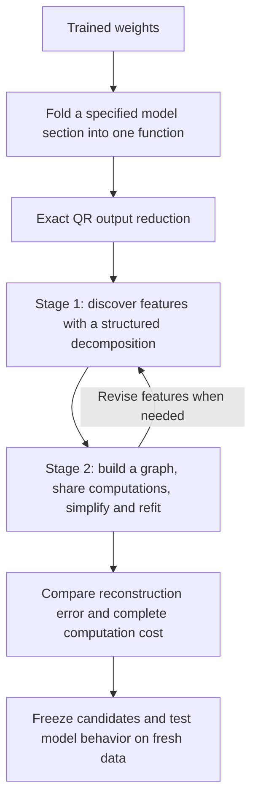
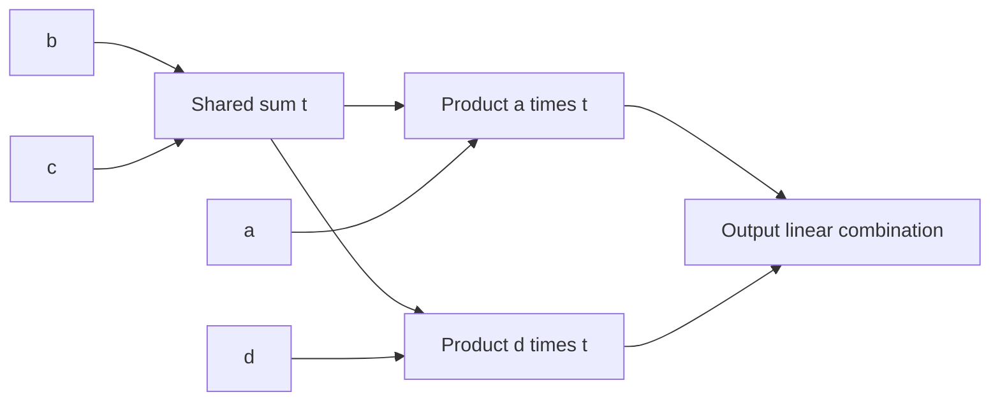

**From folded weights to a smaller program: overall research review**

Rewritten 21 September 2026, 15:15 UTC; results through 15:09 UTC. This replaces the “full coverage and shared baselines” account, retaining its filename so existing links work. It summarizes the direction and completed results rather than listing every experiment.

**Your recollection is correct: the intended method has two stages.** First, fit a structured tensor to discover useful intermediate computations. Second, turn those computations into an arithmetic graph, simplify it, and refit it. QR prepares the output coordinates before either stage.

**Where we are now:** QR is implemented. Structured decomposition and particular graph simplifications work, including on controlled examples. A smaller model-derived graph now passes our local reconstruction requirements while using **15.7% fewer source multiplications** than its original comparison program. However, it still loses some fresh-data comparisons against a stronger, similarly priced baseline.

**We have not completed a general Tucker/HT-to-arbitrary-circuit search or obtained a faithful replacement for the full folded section.** The recent success concerns six quadratic measurements feeding three selected components. That change of scope was too easy to miss in the previous report.

| Part of the original plan | Current status |
|---|---|
| Fold weights and use QR to reduce the output coordinates | Implemented; QR preserves the chosen pre-nonlinearity function exactly. |
| Fit structured tensors to propose features | Implemented for several restricted families; the general HT route remains incomplete. |
| Convert features into a shared arithmetic graph and refit | Implemented for particular graph structures and edits; arbitrary graph search remains incomplete. |
| Obtain a smaller, accurate full folded replacement | Not achieved. The latest passing reconstruction is a smaller diagnostic. |
| Establish reusable, understandable circuits | Not achieved; approximation accuracy alone does not establish feature meaning or identity. |

**What we are decomposing, and where QR fits**

For one bilinear MLP, the contribution read through the unembedding is

$$
F(x)=UD\big[(Lx)\odot(Rx)\big].
$$

Here $x$ is the 1,152-dimensional input, $L$ and $R$ produce 4,608 projections each, $\odot$ multiplies corresponding projections, $D$ writes the products back into the residual stream, and $U$ maps that stream to 50,304 vocabulary coordinates. **Folding** means contracting these weights to study their combined computation.

Your suggested QR of $UD$ reduces the output coordinates without approximating the function. The implementation takes an equivalent route: factor $U$ first, then multiply its remaining factor into $D$:

$$
U=Q R_U,\qquad Q^\top Q=I,\qquad C=R_U D,
$$

$$
\widetilde F(x)=C\big[(Lx)\odot(Rx)\big],\qquad F(x)=Q\widetilde F(x).
$$

We optimize in **1,152 output coordinates instead of 50,304**. Because $Q$ has orthonormal columns,

$$
\|F(x)-Q\widehat{\widetilde F}(x)\|_2
=\|\widetilde F(x)-\widehat{\widetilde F}(x)\|_2.
$$

This is an exact change of output coordinates, not a discovered circuit or a reduction in product count. The equality applies before nonlinear output operations. RMSNorm, attention normalization and the final logit softcap remain explicit.

The folded quadratic function defines the **joint order-three tensor**

$$
\widetilde F_v(x)=\sum_{i,j}T_{vij}x_i x_j,
\qquad
T_{vij}=\frac12\sum_k C_{vk}
\big(L_{ki}R_{kj}+L_{kj}R_{ki}\big).
$$

“Order three” counts the indices—one output and two inputs. The polynomial has degree two. We can match this tensor through contractions of its factors without storing all its entries.

Substituting another bilinear computation into $x$ produces degree-four terms and an order-five tensor. Residual paths also produce lower-degree terms. This is the deeper folded target; it is substantially harder than the single-layer quadratic case.

**Stage 1: discover candidate features**

The Tucker proposal is

$$
s=P^\top x,\qquad
h_g=\sum_{p,q}G_{gpq}s_p s_q,\qquad
\widehat{\widetilde F}=Wh.
$$

| Term | Meaning |
|---|---|
| Input feature $s_p$ | A learned scalar projection of the input. |
| Computed feature $h_g$ | A weighted sum of products of input features. |
| Core $G$ | The coefficients specifying which products make each computed feature. |
| Output direction $W_{:,g}$ | The output effect of one computed feature. |
| Rank or width | The number of directions/channels allowed in the representation. |

**Hierarchical Tucker (HT)** arranges smaller bilinear computations in a tree: linear features become quadratic features, which can become quartic features. Its tree groups tensor slots; each leaf can still inspect the full input vector. Sparsity must be added explicitly, and low rank does not guarantee interpretable features.

These are proposals for organizing computation. The experiments also use **output-sharing block decompositions**, in which several products contribute to one output direction. That family supplied useful broad fits; the work has not been a completed standard HT pipeline.

**Stage 2: simplify and share the computation**

An **arithmetic circuit**, represented as a directed acyclic graph (DAG), is a program of linear combinations and products. A **shared** intermediate is computed once and used by multiple consumers; a **private** intermediate serves one consumer.

For example,

$$
y=u(ab+ac)+v(db+dc)
$$

can be evaluated as

$$
t=b+c,\qquad p=at,\qquad q=dt,\qquad y=up+vq.
$$

That uses two products instead of four. The broader graph proposal also allows reuse of quadratic and higher-degree features, across branches and depths. After editing the graph, jointly refitting its coefficients can recover lost accuracy.

We have implemented particular shared-product graphs, algebraic conversions, pruning and refitting. **General graph search—with arbitrary node insertion, merging, regrouping and reuse—is still incomplete.** Counting sparse tensor entries is not a substitute: a dense rank-one quadratic form may be cheap, and a shared product should be charged only once. Dense projections, additions and stored coefficients also have costs.

**What happened when we tried this on the model**

The broad fits did not give a sufficiently accurate small program. We therefore narrowed the target to understand where the method was breaking:

| Phase | Actual target and result | What it established |
|---|---|---|
| Broad folding and simplification | A selected last-two-MLP contribution: products fell from 1,024 to 512. FineWeb logit-effect error improved from 28.21% to 26.11%; code error from 23.62% to 21.36%. | Product simplification was possible, but reconstruction remained poor. Storage barely changed: 2.672M to 2.654M coefficients. |
| Local diagnostic | Six quadratic measurements, grouped into three selected components. | A smaller setting for studying shared features, numerical fitting and executable cost. It is not the full MLP or full folded tensor. |
| More flexible sharing | Features could be shared by pairs of components instead of by all three. | Better tensor fits, but the initial dense computation exceeded the cost budget. |
| Compile and refit a cheaper graph | Convert the forms to explicit reusable products, then optimize directions and coefficients. | Much of the conversion error was recovered. The cheaper graph still failed fidelity requirements. |
| Algebraic feature proposals | Derive candidate groups from pairs of quadratic forms, then refit. | Successful controlled examples; the native-model comparison still favored the earlier initialization. |
| Allow a somewhat larger correction dictionary | Add products and alternate fits of the two reads entering each component. | A graph with 64 added products passes local reconstruction at 15.7% source-cost saving. |
| Freeze that graph and test two new panels | Evaluate FineWeb and code without changing its coefficients. | All absolute error checks pass, but some relative baseline comparisons fail. |

The local target computes reads $q_j(z)=z^\top Q_jz$. These feed three downstream component calculations with explicit normalization. It receives intermediate states from the original model; **it is not an extracted token-to-output program**.

**The latest result, in plain terms**

A **read** here is a scalar quadratic measurement,

$$
q_j(z)=z^\top Q_jz.
$$

There are six reads, used in pairs to compute three downstream scalar components. The graph tries to share work across these reads. The original model still supplies the intermediate inputs and normalization context. Thus the experiment asks, “Can we compute these particular measurements more cheaply while preserving their downstream effects?” It does not yet ask the replacement to compute everything from tokens.

The early cheap graph reduced source arithmetic by about 21%, but its approximation was too inaccurate. We added correction products and refitted their coefficients. Holding one read fixed makes the other read's conditional fit convex; alternating these fits improves the joint result but does not prove a global optimum.

| Added correction products | Source multiplications | Saving versus original pair program | Local reconstruction result |
|---|---:|---:|---|
| 14 | 1,063,818 | 20.05% | Fails |
| 32 | 1,084,608 | 18.49% | Passes values and derivatives; narrowly fails the coefficient-error limit |
| 64 | 1,121,568 | **15.71%** | **Passes all registered local reconstruction limits** |

The original comparison program uses 1,330,560 source multiplications. The passing graph has 1,120 nonlinear products in total and stores 1,131,980 floating-point coefficients. Projections also require multiplications, so product count and total arithmetic are different measures. These counts exclude common downstream work and are **not measured whole-model speedups**.

The original goal of at least 20% savings still failed. The 15.7% result is a separately evaluated cost–accuracy tradeoff, with the same reconstruction limits.

For the passing graph:

- Covariance-shaped coefficient error is **7.628%**.
- Original-coordinate coefficient error is **57.737%**.
- The three downstream component errors are **1.727%, 2.174%, and 8.346%** on the examined states.

These percentages measure different things. The first two compare tensor coefficients in different input geometries; the third compares component values. None is language-model prediction accuracy. The large original-coordinate error means that passing the activation-informed checks does not imply a uniformly accurate tensor approximation. “Passing” means satisfying registered tolerances, including comparisons to an already approximate baseline.

Actual exported graph execution, derivatives and FP32 replay were checked. We also constructed two stronger comparison programs that already share work within each pair of reads. Each fits within the candidate's arithmetic and storage budgets; one uses original-coordinate geometry and one uses covariance-shaped geometry. The graph passes the examined-state component and derivative comparisons against both. **Optimization effort is not matched:** the candidate received adaptive functional fitting that these baselines did not.

[Fit and cost results](../../direct_tensor_match/TWO_READ_CORRECTION_FRONTIER64_V1.json) · [Export checks and baseline comparisons](../../direct_tensor_match/FRONTIER64_EXPORT_AUDIT_V1.json).

**What happened on fresh data**

We froze the graph and tested two new panels, totaling 64 FineWeb documents and 32 code files. A **natural** test uses the original state. A **donor-hybrid** test replaces the selected source contribution with one from a different document at a matching token. A **change** test checks the difference between those effects.

Each panel has 72 checks spanning components, intervention types, token cohorts and domains. Both panels pass every absolute error limit. Both also retain relative failures against the similarly priced baselines. Passing an absolute limit therefore does not establish that the proposed graph improves on the alternative program.

In the pooled results, two relative failures remain against the covariance-shaped baseline, both for component three on code at positions followed by a whitespace-prefixed word:

| Test | Graph error / baseline error | Required maximum |
|---|---:|---:|
| Natural effect | 1.137 | 1.10 |
| Donor-hybrid effect | 1.106 | 1.10 |

A ratio of 1.137 means 13.7% more error than the baseline. Both pooled confidence intervals cross the 1.10 threshold, so the size of the disadvantage remains uncertain; the registered point-estimate failures remain failures. Pooling does not erase the individual-panel failures.

A follow-up on those already examined code files finds the same failures in the scalar component **before** final normalization and logit softcapping. The endpoint is therefore not what introduces these threshold failures. Some error is shared between natural and hybrid states and cancels when taking their difference. This is a diagnostic observation, not a new independent validation or proof of a constant bias.

**The current conclusion is a useful local compression result with incomplete transfer, not an accepted circuit.** [Fresh replication comparison](../../direct_tensor_match/FRONTIER_REPLICATION_COMPARISON_V1.json) · [Source-error diagnosis](../../direct_tensor_match/FRONTIER_SCALAR_INTERPRETATION_V1.md).

**What the controlled examples taught us**

Optimizer failure and representation failure are different. When shared input spaces were supplied, an improved parameterization let both Adam and Muon recover all five planted cases using the better of two starts. Asking them to discover the shared spaces as well initially recovered none. The target functions had not become unrepresentable; the search had become harder.

Algebraic proposals followed by graph refitting made the two-stage idea work on those controlled problems. With sixteen candidates retained per search width, all five cases passed coefficient recovery at zero noise and at 1% injected noise. At 1% noise, only four passed the internal shared-subspace identity requirement. Four candidates per width gave worse recovery than sixteen.

**These recent five cases are instances of one planted sharing family, not five distinct architectural baselines.** They support this mechanism, not general recovery of arbitrary circuits. They also show that accurate outputs do not uniquely identify the internal features. [Toy results and controls](research_update_2026-09-21_1345_algebraic_proposals_and_refitting.md).

**Did direct weight matching help? Why did Tucker/HT not simply solve it?**

Direct weight matching helped substantially: it provided joint objectives and exact conditional coefficient solves. In an earlier local experiment, learning feature directions reduced covariance-shaped coefficient error from **37.47% to 8.22%**. That is an improvement in fitting, not a validated final circuit.

We have explored both original-coordinate coefficient error and covariance-shaped error. The latter uses activation information and can prioritize relevant directions, but neither reliably predicts every downstream behavior. One quartic experiment improved coefficient error from **80.86% to 13.97%** while native-function error worsened from **37.71% to 48.97%**.

The paper's moment matrix belongs in the appropriate lifted feature space. For quadratic functions, expected squared output error depends on fourth-order input moments. Our covariance-shaped loss should therefore not be called exact expected error on text merely because it uses input covariance.

The evidence points to three separate obstacles:

- **Restricted structure:** some frozen feature spaces have error lower bounds above the required limit. More optimizer steps cannot fix those particular layouts.
- **Difficult optimization:** parameterization, initialization, regularization and search width change whether known toy structure is recovered. Some failed runs were numerical or implementation failures and were retained as such.
- **Mismatch between coefficient error and behavior:** a better tensor score can still yield worse downstream outputs, especially through normalization and composition.

Consequently, “we assumed too little Tucker rank” is not a sufficient account. Nor do these results rule out Tucker, HT or more general shared circuits.

**What “full coverage” and “shared baselines” meant**

“Full coverage” referred to accounting for error across the entire **chosen reconstruction target**, including outside the fitted subspace. It did not mean that we had decomposed the full model or completed the proposed pipeline.

“Shared baselines” are comparison programs that already reuse computations. Beating a deliberately duplicated implementation would overstate the gain. We compare against stronger programs and track reconstruction, stored coefficients and arithmetic separately; some comparisons match storage rather than every cost simultaneously.

The local reconstruction milestone has now been reached at a smaller cost saving. **Fresh relative validation remains unresolved, and extending the method back to the broader folded target remains a separate task.** Stable feature identity, semantic interpretation and selective manipulation still need separate evidence. A sum of conditions sharing an output direction need not be one human-readable concept.

Supporting detail: [historical broad results](research_update_2026-09-21_0738_decomposition_detailed_review.md), [cost comparisons](research_update_2026-09-21_1020_cost_matched_pair_baselines.md), [conversion gap](research_update_2026-09-21_1237_stage_one_gain_and_graph_conversion_gap.md), [parameterization and feature discovery](research_update_2026-09-21_1320_parameterization_and_shared_feature_discovery.md), and [algebraic proposals with completed native follow-up](research_update_2026-09-21_1345_algebraic_proposals_and_refitting.md).

**How this changes the next step**

The two-stage direction is still the organizing plan. The experiments show that decomposition can supply useful features, but translating those features into cheap reusable arithmetic is a separate optimization problem. More width improves fidelity at a real computational cost; allowing pairwise sharing can help where forcing every component to share one dictionary fails; initialization and parameterization strongly affect recovery.

The next local question is which read errors and cancellations cause the retained code failures. The broader question is whether graph edits can recover that accuracy at a competitive cost and then scale back to the larger folded function. General HT initialization, broad graph-topology search, optimizer-matched baselines, and stable interpretable features remain unfinished parts of the original proposal. They should not disappear from the research agenda merely because the small diagnostic is easier to optimize.
