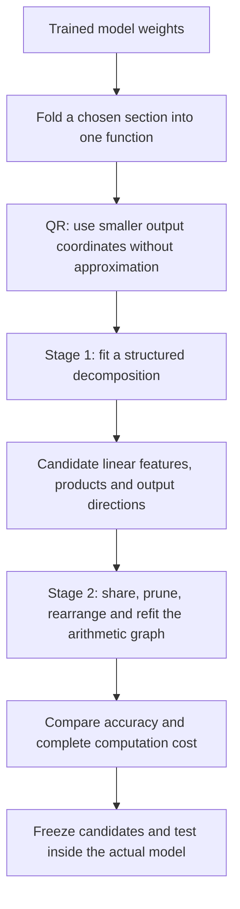
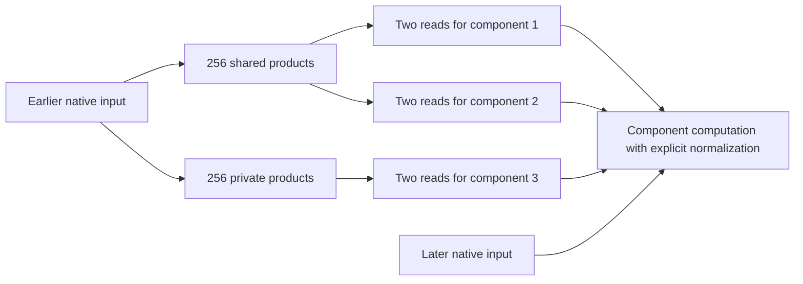

# From folded weights to smaller arithmetic circuits: overall research review

Rewritten **21 September 2026, 08:40 UTC**. This is the overall account of the two-stage decomposition direction, replacing the confusing “full coverage and shared baselines” report. The filename stays the same so existing links work. This report summarizes completed experiments; the rewrite adds no experiment.

**We have demonstrated useful arithmetic savings, but we have not yet recovered a complete, reliably interpretable circuit.** The clearest result is a program for three selected model components that uses **512 products instead of 768, at the same coefficient storage**, with similar or better measured accuracy. Some fresh accuracy checks still fail, and different fits can use different internal products to perform almost the same computation.

The plan you remember is correct: **first use a decomposition to propose computations, then optimize the arithmetic graph that uses them.** QR is an exact preparation step before those stages. What follows explains how far we actually got.

## The plan, in one picture

| Term | Meaning here |
|---|---|
| Folding | Substitute computations and multiply adjacent linear maps to describe a chosen model section jointly. |
| Tensor decomposition | Represent that function through a smaller collection of features and interactions. |
| Arithmetic circuit | An executable program of linear combinations and multiplications. |
| DAG | A directed acyclic graph: a computed value can be reused by several later operations. |
| Baseline | An alternative program for **the same target**, against which we compare accuracy and cost. |

A simpler program need not have one human-readable concept per variable. A feature can combine several conditions because they have the same output effect.

## What QR contributes

For one bilinear MLP followed by the unembedding, the polynomial contribution is

$$
F(x)=UD\big[(Lx)\odot(Rx)\big].
$$

Here $x$ has 1,152 coordinates; $Lx$ and $Rx$ each have 4,608 coordinates; $D$ writes their elementwise products back into the residual stream; and $U$ maps that stream to 50,304 vocabulary coordinates.

You proposed QR on $UD$. The implementation instead factors $U$ first:

$$
U=Q R_U,\qquad Q^\top Q=I,\qquad C=R_U D.
$$

We optimize the smaller-output function

$$
\widetilde F(x)=C\big[(Lx)\odot(Rx)\big],\qquad F(x)=Q\widetilde F(x).
$$

This replaces 50,304 output coordinates with 1,152 while preserving Euclidean reconstruction error for this linear readout. **It does not yet remove any multiplications.** Truncating the output space further is a separate approximation.

These equations describe the polynomial contribution. RMSNorm, attention normalization and the final softcap remain explicit parts of native-model evaluation.

## Stage one: what decomposition is supposed to discover

The quadratic function above has a **joint order-three tensor**:

$$
\widetilde F_v(x)=\sum_{i,j}T_{vij}x_i x_j,
\qquad
T_{vij}=\frac12\sum_k C_{vk}
\left(L_{ki}R_{kj}+L_{kj}R_{ki}\right).
$$

“Order three” means three indices—one output and two inputs. The polynomial has degree two. “Joint” means we match the resulting function, rather than compressing $C$, $L$ and $R$ independently. We can compute matching losses through contractions without materializing the enormous tensor.

A Tucker candidate takes the form

$$
s=P^\top x,\qquad
h_g=\sum_{p,q}G_{gpq}s_p s_q,\qquad
\widehat y=Wh.
$$

The $s_p$ are learned linear features. Each $h_g$ combines products of them. The column $W_{:,g}$ specifies the output effect of that combination. Narrow feature dictionaries and sparse interactions are different constraints; we explored more than one kind of simplicity.

Folding two pure bilinear layers produces a quartic function, with one output index and four input indices: an **order-five tensor**. Hierarchical Tucker (HT) represents such a tensor as a tree of smaller bilinear computations. It can propose quadratic intermediates that combine into quartic outputs without storing the expansion. Its tree groups tensor slots, each of which may receive the same full input vector. Residual paths add lower-degree terms.

**What was implemented:** direct tensor fitting, planted controls, optimizer comparisons, and several structured families. The most useful larger-model results came from **output-sharing blocks**—several products contributing to a common output direction—and shared-product models. A general Tucker/HT discovery system is still incomplete.

## Stage two: what the graph adds

A decomposition might propose

$$
y=u(ab+ac)+v(db+dc).
$$

A graph can rewrite it as

$$
t=b+c,\qquad p=at,\qquad q=dt,\qquad y=up+vq.
$$

Now there are two products instead of four, and both use the same stored value $t$. The same idea can share quadratic intermediates inside deeper computations.

We have implemented restricted versions of this stage: share products between outputs, prune products or connections, give different branches different capacities, and jointly refit directions and coefficients. Some refits solve the output coefficients analytically while Adam optimizes the input directions.

**We have not completed an unrestricted search over arbitrary arithmetic DAGs.** Product count also does not measure total runtime: dense projections, additions, stored coefficients and producing the graph's inputs all matter.

## What happened experimentally

### First we tried a broad folded contribution

We approximated a selected contribution involving the last two MLPs. This was broader than an individual feature, but was never the full model.

| Program for this broad target | Products | Stored coefficients |
|---|---:|---:|
| Initial output-sharing decomposition | 1,024 | 2,671,616 |
| Simplified graph | **512** | **2,654,208** |

On the frozen comparison panel, error in the native logit effect improved from **28.21% to 26.11% on FineWeb**, and **23.62% to 21.36% on code**. Those errors were still substantial. The result supports cheaper arithmetic at similar storage, not a sufficiently faithful broad replacement.

Covariance-informed fitting also helped in a separate broad-target comparison. It weights input directions using activation statistics instead of treating all directions equally. However, those experiments already used some calibration information in selecting the output basis; “isotropic” did not mean the entire pipeline was data-free.

### Then we examined smaller selected computations

Because the broad fit remained inaccurate, we studied three selected scalar components more closely. Each needs two quadratic measurements of the earlier MLP input:

$$
q_a(z)=z^\top Q_a z,\qquad q_b(z)=z^\top Q_b z.
$$

Thus this target has **six scalar quadratic outputs**, not the full MLP output. The later component computation still uses native intermediate inputs and explicit normalization.

First we constructed stronger exact baselines. For one pair of measurements, sharing reduced source products from 4,608 native channels to **1,152**, versus 2,304 for separate spectral constructions. That matters: comparing only against the original channel layout would overstate the benefit of a new decomposition.

Next we fitted approximate programs for all three components. Sharing everything hurt the third component, so we retained a private branch for it and shared products between the first two:

| Program for these three components | Products | Coefficients | Component errors on previously examined states |
|---|---:|---:|---|
| Three separate pair programs | 768 | 897,804 | 3.06%, 2.76%, 11.94% |
| Shared first two; private third | **512** | **897,804** | **2.65%, 2.48%, 11.94%** |

**This is our clearest working example of the two-stage idea:** change the sharing structure, then refit, obtaining fewer products at equal coefficient storage. These numbers cannot be compared directly with the broad-target table: the functions being reconstructed are different.

Fresh native-model panels supported the relative comparison: the graph stayed within the allowed 10% degradation relative to its baseline in all 72 comparisons on each of two panels. But an absolute requirement still failed. The third component's FineWeb continuation error was **16.73% against a 15% cap**. Increasing its capacity in both graph and baseline gave **16.01% on another panel**, still above the cap. The failing private branch is identical in the graph and its baseline.

We therefore have evidence for the sharing benefit, not a fully validated circuit.

## Why this was not simply “Tucker failed because the rank was too small”

There are three distinct problems:

| Problem | What the experiments show |
|---|---|
| Too little representational capacity | One restricted rank-16 quartic family had a proven error floor above its target. That does not rule out higher ranks or different graphs. |
| Failure to find an available solution | Planted structures sometimes required a different restart or optimization schedule. A failed fit is not proof that the structure is absent. |
| Optimizing an insufficient error metric | A quartic coefficient error fell from 80.86% to 13.97%, while native-function error worsened from 37.71% to 48.97%. |

Direct weight optimization **did help**: it produced fitted programs, useful shared computations and controlled comparisons. It did not eliminate the distinction between matching coefficients and matching model behavior. Input covariance helps select a geometry, but by itself does not specify all higher moments needed for general polynomial functional error.

Five planted structural families and reconstruction, gradient and execution checks were used to investigate bugs and optimization failures. Tested Adam configurations often worked better than tested Muon configurations; there is no established universal winner.

## The most recent finding: repeatability and accuracy are separate

Different fits can reproduce similar functions using substantially different individual products. A checked rewrite changed 158 important products with only **1.86% change in the fitted tensor**; deleting those products instead caused **70.81% change**. They were doing useful work, but their particular representation was not fixed.

Larger groups of products were more repeatable. We found that the least accurately recovered group had very little weight in the ordinary coefficient loss. Giving weak output combinations more weight made all four fitted groups repeatable across the tested restarts: minimum cosine agreement **0.996**.

However, that fit worsened the first two component errors to **5.14% and 3.59%**, failing the relative-baseline requirement. Agreement between restarts is not agreement with the original model. These latest checks reused previously examined states; they are not new fresh behavioral validation.

## Where the direction stands

| Part of the plan | Current status |
|---|---|
| Exact folding and QR preparation | Implemented for the studied targets. |
| Direct structured weight fitting | Implemented across several families and objectives. |
| Decomposition followed by graph simplification | Demonstrated for restricted sharing, pruning and refitting edits. |
| General Tucker/HT-to-arbitrary-DAG search | Incomplete. |
| Fewer products at comparable storage | Demonstrated on both broad and selected targets. |
| Accurate, stable, interpretable, standalone circuits | Not established; accuracy failures and native-input dependencies remain. |

The next research question is how to obtain the arithmetic savings **while preserving weak but relevant computations and making the recovered features repeatable**. A broader shared dictionary covering all six quadratic reads is a prepared next comparison, not a completed result.

Finally, the old title was misleading. **“Full coverage” meant evaluating the entire selected target, including omitted output directions. “Shared baselines” meant comparing against alternatives that already reuse computations. Neither meant that the full model or the full research plan was covered.**

## Evidence and optional technical detail

- [Earlier detailed overview](research_update_2026-09-21_0738_decomposition_detailed_review.md): additional equations, qualifications and links to the broad and fresh-panel results.
- [Exact shared baselines](research_update_2026-09-21_0451_exact_shared_products.md) and [graph construction](research_update_2026-09-21_0707_mixed_products_and_graph_reuse.md).
- [Refit results](../../direct_tensor_match/PROFILED_PARTIAL_GRAPH_FIT_V1.json), [fresh panel one](../../direct_tensor_match/PARTIAL_GRAPH_FRESH_NATIVE_V1.json), and [fresh panel two](../../direct_tensor_match/PARTIAL_GRAPH_FRESH_NATIVE_V2.json).
- [Quartic metric failure](research_update_2026-09-21_0524_joint_quartic_metric_failure.md) and [rank limits](research_update_2026-09-21_0554_rank_limits_and_input_geometry.md).
- [Product freedom and weak output combinations](research_update_2026-09-21_0821_product_freedom_and_weak_contrasts.md).
- Latest output-weighting experiment: [fit](../../direct_tensor_match/SOURCE_OUTPUT_BALANCE_FULL_V1.json) and [independent execution and stability audit](../../direct_tensor_match/OUTPUT_BALANCE_PROGRAM_AUDIT_V1.json).

Historical cache chunks did not retain document identities, so their independence evidence is weaker than that of the later document-identified panels. Reported coefficient errors, component-value errors and native logit-effect errors measure different objects; none should be substituted for another.
