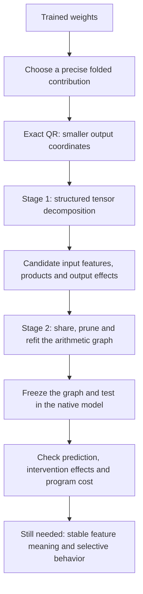

# Overall review: QR → tensor decomposition → arithmetic circuits

Rewritten 21 September 2026, 03:06 UTC. This replaces the “full coverage and shared baselines” report in place, so its existing link still works. It reviews the direction since the two-stage proposal, including the latest completed frozen comparison.

**Your remembered plan is right. First, simplify the output coordinates with exact QR and decompose a folded tensor to find candidate computations. Second, turn those candidates into an arithmetic graph, then share, remove and refit computations.** The goal is an understandable circuit, not merely a low-rank tensor.

We have implemented parts of both stages. The strongest current results come from an **output-sharing bilinear decomposition followed by specific graph edits**. We have not implemented general arithmetic-circuit search, and we have not shown that the learned features are stable semantic units.

Two useful results have emerged: an earlier graph halved products and approximately halved stored weights at a modest fidelity cost; a newer graph halves products at approximately unchanged storage and improves the measured intervention errors. Both approximate one defined model contribution. Neither replaces the whole model, and context-specific interaction errors remain substantial.

## 1. The original plan and what each step means

A bilinear MLP reads two sets of scalar features, multiplies corresponding features, then writes the products back into the residual stream:

$$
B(x)=D[(Lx)\odot(Rx)].
$$

Here $x\in\mathbb R^{1152}$ is the input; $L,R\in\mathbb R^{4608\times1152}$ are input readers; $D\in\mathbb R^{1152\times4608}$ is the output writer; and $\odot$ means elementwise multiplication. The unembedding $U\in\mathbb R^{50304\times1152}$ maps residual vectors to vocabulary coordinates.

**Folding** contracts adjacent linear maps or substitutes earlier computations into later ones. **Decomposition** approximates the resulting joint function using a chosen structure. An **arithmetic circuit** is an executable graph of linear combinations and products. In a directed acyclic graph, or **DAG**, one intermediate can feed several later computations and is charged only once.

| Part of the proposal | What we have now |
|---|---|
| Exact output reduction | Implemented using QR of the unembedding. |
| Tensor decomposition as a source of computations | Tested several structures; the current useful initializer shares output directions across bilinear products. |
| Graph simplification | Implemented shared projections, shared output corrections, product removal, coefficient refitting and rank allocation. |
| Arbitrary graph search | Not implemented: no general search over new sums, alternative hierarchies and reuse at arbitrary depths. |
| Interpretable circuits | Not established. Good reconstruction does not identify the meanings of individual nodes. |

## 2. QR: an exact change of coordinates before fitting

The vocabulary-space contribution of a bilinear layer is

$$
F(x)=UD[(Lx)\odot(Rx)].
$$

Your proposal was to QR-factorize $UD$. The implementation instead factorizes $U$ and then contracts its smaller factor with $D$:

$$
U=QR_U,\qquad Q^\top Q=I,\qquad C=R_UD.
$$

We fit the reduced output

$$
\widetilde F(x)=C[(Lx)\odot(Rx)],\qquad F(x)=Q\widetilde F(x).
$$

The working output width becomes **1,152 rather than 50,304**, and this step loses no information:

$$
\|Q(\widetilde F-\widehat{\widetilde F})\|_2
=\|\widetilde F-\widehat{\widetilde F}\|_2.
$$

Selecting fewer output directions *after* QR is a separate, lossy approximation. Final normalization and logit softcapping are explicit native operations; the equality above concerns the linear output coordinates.

## 3. Stage one: Tucker, HT, and the joint tensor

A single bilinear layer defines the joint tensor

$$
\widetilde F_v(x)=\sum_{i,j}T_{vij}x_ix_j,
\qquad
T_{vij}=\frac12\sum_k C_{vk}(L_{ki}R_{kj}+L_{kj}R_{ki}).
$$

“Order three” counts its indices: output $v$, input $i$, input $j$. The function is **quadratic**, not cubic. We want to factor this joint object, because independent matrix compression can miss cancellations and shared computations.

A Tucker representation proposes

$$
s=P^\top x,\qquad h_g=\sum_{p,q}G_{gpq}s_ps_q,\qquad \hat y=Wh.
$$

The columns of $P$ are learned input directions. The core entry $G_{gpq}$ weights product $s_ps_q$ inside computed feature $h_g$. Column $W_{:,g}$ is that feature's output effect. Sparse $G$ means few interactions; it does not guarantee a single human-readable meaning for each feature.

Substituting one pure bilinear layer into another produces a quartic function and an **order-five tensor**, with one output and four input indices. Hierarchical Tucker, or **HT**, represents its contractions as a tree: linear features combine into quadratic features, which combine into quartic outputs. The tree groups tensor slots; each slot can receive the same full vector $x$. A shared DAG additionally allows intermediate computations to be reused across branches.

**We did not prove that Tucker or HT fails in principle.** Broad trained-weight fits at the tested capacities had high reconstruction error. Five planted structural baselines and optimizer/rate/restart tests showed why we must distinguish insufficient capacity, an unsuitable factorization, optimization failure and the choice of error metric. There was no universal optimizer winner. Unrestricted Tucker is expressive enough; an economical, discoverable representation is the unresolved issue.

### Did direct weight matching help?

It supplied usable computations, especially when fitting used calibration covariance to emphasize directions the model actually encounters. On the later folded target, holding the selected output basis fixed, covariance-weighted input fitting reduced full-output variation error:

| Evaluation domain | Isotropic input fitting | Covariance-weighted fitting |
|---|---:|---:|
| FineWeb | 65.7% | 28.0% |
| Related repository code | 50.8% | 18.0% |

These are reconstruction errors before final native nonlinearities. Both candidates used a calibration-selected output basis, so this is not a wholly data-free versus data-informed comparison. It also does not isolate the paper's optimizer as the cause of improvement. Matching coefficients and matching behavior under a data distribution are different objectives.

## 4. The narrower folded target that became tractable

Rather than expand every upstream coefficient into a huge quartic tensor, we retained an earlier MLP output as an intermediate input.

Let $h$ be the last MLP's input and $m$ the preceding MLP's polynomial residual contribution, including its residual scaling. We reconstruct the part of the last bilinear MLP depending on that source:

$$
B(h)-B(h-m).
$$

Define the midpoint $n=h-m/2$. Then exactly

$$
\boxed{B(h)-B(h-m)
=D[(Ln)\odot(Rm)+(Rn)\odot(Lm)].}
$$

This includes the source's self-interaction and its cross-interactions with the remaining residual input. It is bilinear in the intermediate vectors $n,m$. Substituting the upstream computation of $m$ would increase polynomial degree again.

The implementation uses the **original recipient's normalization denominator** for both vectors. It does not remove the upstream MLP and recompute the entire network or its normalization. The upstream model still supplies the inputs; the replacement simplifies this specified downstream contribution.

**“Full coverage” meant evaluating against this entire source-dependent contribution, including error from omitted output directions.** It did not mean complete model coverage or exact reconstruction. Earlier results evaluated only four selected output directions and therefore had an easier target. I will call the later setup **full-contribution evaluation**.

## 5. Stage two: what graph simplification actually did

The initial useful graph chose 256 output directions and fitted four bilinear products for each direction: **1,024 products total**. This is an output-sharing block decomposition, rather than a successful end-to-end HT fit.

We then made concrete graph changes:

- **Refit output writes.** Products could contribute outside their initial output groups. Unconstrained refitting overfitted; anchoring writes to their weight-derived values transferred better.
- **Share computations.** A correction used eight shared linear combinations of existing products. Shared input projections reduced repeated stored coefficients.
- **Remove products and refit.** Joint selection reduced the dictionary to 512 products and refitted their output writes.
- **Allocate capacity unevenly.** Later candidates gave different output directions different numbers of products, and the two input roles different linear feature spaces.

The idea is the same as rewriting

$$
y=u(ab+ac)+v(db+dc)
$$

as

$$
t=b+c,\qquad p=at,\qquad q=dt,\qquad y=up+vq.
$$

The rewritten graph computes two products instead of four and reuses $t$. This illustrates the intended search; it is not a claim that the current software automatically discovers arbitrary identities of this kind.

We count stored coefficients as well as products. A dense linear projection has a cost, and a repeated intermediate is charged once. Halving variable products alone does not establish a twofold runtime improvement.

## 6. Results: two distinct 512-product candidates

There are now two different outcomes, which should not be conflated.

**A. Smaller-storage candidate.** The earlier graph reduced 1,024 products to 512 and stored weights from 2,671,616 to 1,291,264: **51.7% fewer weight coefficients**. On its frozen confirmation panel, swap-effect error rose from 28.43% to 29.28% on FineWeb and from 25.09% to 25.98% on code. It passed the registered relative-preservation check. The FineWeb bootstrap interval crossed the absolute 30% threshold, so that threshold is not a firm population bound.

**B. Newer, approximately matched-storage candidate.** Subsequent diagnostics showed that aggressive sharing could damage interactions. The newer graph keeps 512 products but spends more coefficients on separate linear spaces and uneven rank allocation. Its 2,654,208 weights are approximately the same storage as the original 1,024-product graph—not another 52% reduction.

Both programs in the following comparison were frozen before constructing a new panel of 32 FineWeb documents and 16 repository Python files. No fitting occurred on this panel.

| Latest frozen comparison | Earlier 1,024-product graph | Newer 512-product graph |
|---|---:|---:|
| Stored weight coefficients | 2,671,616 | 2,654,208 |
| FineWeb replacement loss, nats/token | 0.00839 | 0.00644 |
| Code replacement loss, nats/token | 0.01918 | 0.01894 |
| FineWeb whole-contribution swap error | 28.21% | 26.11% |
| Code whole-contribution swap error | 23.62% | 21.36% |
| FineWeb source-only error | 23.26% | 22.67% |
| Code source-only error | 20.33% | 19.18% |
| FineWeb context-only error | 52.49% | 52.13% |
| Code context-only error | 39.62% | 38.45% |

**Lower is better throughout.** Replacement loss is added next-token cross-entropy after installing the approximation. Intervention error measures disagreement with the native change in vocabulary-centered logits, relative to the native effect's norm; it is not a percentage of incorrectly predicted tokens.

A whole-contribution swap interchanges the contribution between matched-token contexts. A source-only test changes $m$ while holding midpoint input $n$ fixed. A context-only test isolates the interaction with $n-\bar n$, where $\bar n$ is the calibration mean. Holding $n$ fixed is an interface test, not holding every original residual source fixed.

The newer graph passed the registered checks and improved all eight domain-by-intervention point estimates, including removal errors omitted from the table. **The large context-only errors remain a failure of fidelity despite that improvement.** A subsequent paired bootstrap supports the within-panel intervention improvement; the small code replacement-loss improvement is uncertain. See the [follow-up analysis](research_update_2026-09-21_0313_shared_product_merge.md). Local code is related evaluation material, not broad external OOD evidence.

## 7. What this changes about the research direction

The two-stage approach has produced smaller executable approximations and useful lessons about where structure matters. Output coverage, products per output, shared input directions and linear-feature allocation are distinct choices; improving one can worsen another. Wider output coverage alone did not solve the interaction error. Equal private ranks also performed worse than adaptive allocation.

The remaining gap is substantive: **we have a compressed computation, but not yet an identified set of understandable circuits.** Individual features can change under equivalent parameterizations even when the combined function stays fixed. Good replacement loss and aggregate swaps can conceal poor context-dependent behavior.

The original proposal remains broader than the implementation. The next research questions are whether more general graph edits can expose reusable intermediates, and whether those intermediates have stable identities and selective behavioral effects. Further rank reduction alone would not answer them.

## Evidence and technical notes

- [Earlier smaller-storage graph: frozen confirmation and bootstrap](research_update_2026-09-21_0140_pruned_graph_confirmation.md).
- [Why aggregate tests concealed conditional errors](research_update_2026-09-21_0212_conditional_native_limits.md).
- [Adaptive interaction allocation and negative results](research_update_2026-09-21_0235_adaptive_allocation.md).
- [Separate linear spaces: construction and diagnostic comparison](research_update_2026-09-21_0256_private_linear_spaces.md). Its “confirmation pending” statement describes its publication time; the table above includes the subsequent completed run.
- [Latest frozen results](../../direct_tensor_match/MIDPOINT_PRIVATE_CONFIRMATION_V1.json), [panel and input hashes](../../direct_tensor_match/MIDPOINT_PRIVATE_CONFIRMATION_PANELS_V1.json), and [eight-comparison arithmetic audit](../../direct_tensor_match/MIDPOINT_PRIVATE_CONFIRMATION_REVIEW_AUDIT_V1.json).
- [Covariance comparison](../../direct_tensor_match/MIDPOINT_COVERAGE_SWEEP_V1.json).

The latest FineWeb panel uses skip11000 documents 64–95; code uses the first 16 eligible tracked `mechdecomp` Python files after excluding prior panel paths and exact token prefixes. Evaluation uses 256-token contexts. Attempts to draw enough unused top-level and `jacclust` files failed before model evaluation; the pool was changed before observing outcomes. Pretraining overlap is unknown.

The newer graph allocates its linear branch ranks as 344 for the midpoint role and 40 for the source role, alongside 512 bilinear products. Graphs were fitted using earlier calibration material and frozen by hash before the new panel. Weight counts exclude upstream model computation; additional serialized mean/constant entries are 2,688 for the newer graph and 2,176 for the earlier graph. They are not whole-model memory or latency measurements.

The implementation is in `direct_tensor_match/midpoint_program.py`; native execution and frozen comparison are in `bilinear_quotient/ops/run_direct_midpoint_full_replace_v1.py` and `run_direct_midpoint_private_confirmation_v1.py`. This rewrite audits existing outputs; it launches no new model run.
