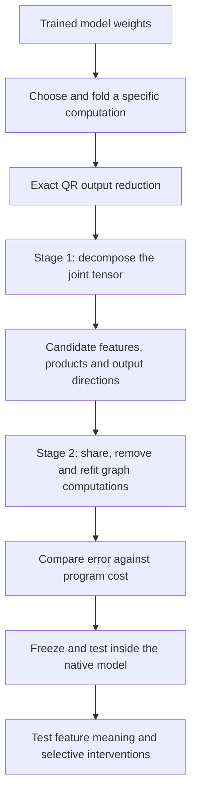
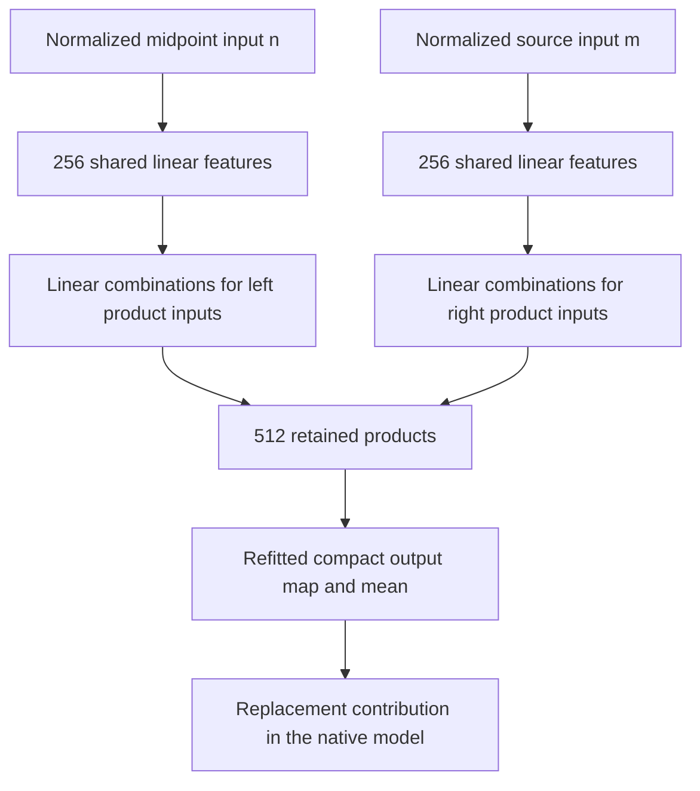

# Overall review: folding → decomposition → arithmetic circuits

Updated 21 September 2026. Results through the 01:40 UTC confirmation report. This replaces the earlier “full coverage and shared baselines” write-up with an overview of the research direction.

**Your remembered plan is correct: first decompose a folded model computation; then simplify the resulting arithmetic graph. QR removes redundant output coordinates before either stage.** We have implemented a restricted version of that pipeline and obtained a smaller executable approximation. We have not yet implemented general arithmetic-circuit search or established interpretable identities for its features.

The latest concrete result is a reduction from **1,024 to 512 products and about 52% fewer weight coefficients**, with a modest loss of fidelity on new documents. These savings concern one folded contribution inside the model. The remaining intervention error is approximately 26–29%, so this is useful progress rather than an exact replacement.

## 1. The plan, with the terms defined

A bilinear MLP computes

$$
B(x)=D\big[(Lx)\odot(Rx)\big].
$$

Here $x$ is the input residual vector; rows of $L$ and $R$ read scalar features; $\odot$ multiplies corresponding features; and $D$ writes their products back into the residual stream. The unembedding $U$ maps residual coordinates to vocabulary coordinates.

**Folding** means contracting adjacent linear maps or substituting an earlier computation into a later one. **Decomposition** means finding a smaller structured representation of the resulting function. An **arithmetic circuit**, represented as a directed acyclic graph (DAG), specifies the linear combinations and products we actually compute. A shared intermediate is computed once and used by multiple consumers.

We have reached native-model testing for specific graph simplifications. Stable feature meaning and a general graph-edit search remain unfinished.

## 2. QR is an exact preparation step

The linear vocabulary-space contribution is

$$
F(x)=UD\big[(Lx)\odot(Rx)\big].
$$

The implementation factorizes the unembedding, then folds its smaller factor into the MLP output:

$$
U=Q R_U,\qquad Q^\top Q=I,
$$

$$
\widetilde D=R_U D,\qquad
F(x)=Q\widetilde F(x),\qquad
\widetilde F(x)=\widetilde D\big[(Lx)\odot(Rx)\big].
$$

This changes the working output width from **50,304 vocabulary coordinates to 1,152 residual-sized coordinates**, without approximation. In particular,

$$
\|Q(\widetilde F-\widehat{\widetilde F})\|_2
=\|\widetilde F-\widehat{\widetilde F}\|_2.
$$

Your proposal to QR-factorize $UD$ directly has the same purpose. Our implementation uses QR of $U$, followed by contraction with $D$.

**Later selecting only 4 or 256 output directions is lossy; QR itself is not.** The exact statement concerns this linear contribution. Final normalization and logit softcapping still need native-model evaluation.

## 3. Stage one: what tensor are we decomposing?

For one bilinear layer, the reduced function has a joint coefficient tensor

$$
\widetilde F_v(x)=\sum_{i,j}T_{vij}x_i x_j,
$$

$$
T_{vij}=\frac12\sum_k\widetilde D_{vk}
\big(L_{ki}R_{kj}+L_{kj}R_{ki}\big).
$$

It is **order three** because it has three indices: one output index and two input indices. Its function is quadratic, not cubic. Decomposing this joint tensor lets cancellations and shared structure across all three matrices influence the fit.

A Tucker candidate writes

$$
s=P^\top x,\qquad
h_g=\sum_{p,q}G_{gpq}s_p s_q,\qquad
y=Wh.
$$

The columns of $P$ define input features; the core $G$ specifies which feature pairs interact; the columns of $W$ specify the output effects. Sparse $G$ means few interactions. It does not guarantee interpretable features.

Substituting a second pure bilinear layer gives a quartic function with an **order-five tensor**: one output index and four input indices. Hierarchical Tucker (HT) organizes its contractions as a tree of smaller bilinear computations. Its tree groups tensor slots, which can all receive the same full input vector. A DAG goes further by allowing intermediate computations to be reused across branches.

### Did Tucker or HT fail?

**We did not establish that Tucker or HT cannot represent the useful structure.** We tested particular widths, parameterizations, optimizers and objectives. Some trained-weight fits had large reconstruction error; the broad quartic experiments did not produce a sufficiently accurate, economical program.

The important distinctions are:

| Possible cause of a poor fit | What we learned |
|---|---|
| Too little capacity or an unsuitable factorization | A compact computation need not have a compact representation under the chosen ranks and grouping. |
| Optimization failure | Toy recovery depended on initialization and optimization settings; a poor endpoint is not a proof of insufficient rank. |
| An unsuitable error metric | Low coefficient error and good behavior on actual model states are different objectives. |
| Ambiguous intermediate features | Similar total functions can have very different internal decompositions. |

We ran five planted structural baselines and optimizer/rate/restart experiments. They supported testing multiple structures and fits, rather than declaring one universal optimizer or interpreting every negative result as a structural impossibility.

## 4. The tractable folded target we moved to

Instead of fully expanding the quartic tensor, we retained an earlier intermediate contribution.

Let $h$ be the last MLP's input and $m$ the preceding MLP's polynomial residual contribution, including its relevant residual scaling. The target is the part of the last bilinear MLP depending on that source:

$$
B(h)-B(h-m).
$$

With $n=h-m/2$, an exact identity gives

$$
\boxed{
B(h)-B(h-m)
=D\big[(Ln)\odot(Rm)+(Rn)\odot(Lm)\big].
}
$$

This includes both the source's self-interaction and its cross-interactions with the remaining input. It is bilinear in the intermediate vectors $n$ and $m$, avoiding immediate expansion of every upstream coefficient.

In evaluation, $n$ and $m$ use the original recipient's normalization denominator. We keep normalization explicit. This identity does **not** mean we recompute normalization after subtracting $m$, or ablate the whole upstream MLP and recompute the network.

**The upstream model still supplies these vectors. We are simplifying a defined contribution inside the last MLP, not replacing the whole model.**

### What “full coverage” meant

The earliest strong result concerned only **four selected output features**. Their 16-product approximation had roughly 5–6% joint swap-effect error, but those four directions omitted substantial output variation.

We then used 256 output directions and evaluated error against **the full source-dependent contribution, including omitted directions**. That was called “full coverage.” It did not mean exact reconstruction, all model layers, or all possible circuits. The clearer phrase is **full-contribution evaluation**.

## 5. What actually supplied the current candidate?

The current initializer is an **output-sharing block decomposition**, rather than an end-to-end HT fit:

1. Choose 256 output directions.
2. Approximate each direction's bilinear form using four products of learned linear features.
3. Assemble the resulting 1,024 products into an executable graph.

Covariance information helped substantially. Holding the selected output basis fixed, calibration-weighted input fitting reduced full-output variation error from **65.7% to 28.0% on FineWeb**, and **50.8% to 18.0% on related code**, compared with isotropic input fitting.

Those are output reconstruction errors before final native nonlinearities, not intervention errors. Both fits used a calibration-selected output basis; this comparison does not isolate an entirely data-free method against a data-informed one.

Thus the weight-matching direction has produced useful candidate computations, especially with data-informed metrics. We do not have a controlled result attributing the entire improvement to the paper's optimization method alone.

## 6. Stage two: which graph simplifications have we done?

We have implemented specific edits and refits:

| Step | Change and reason |
|---|---|
| Refit output writes | Let products contribute beyond their initial output groups. Unconstrained fitting overfitted; regularizing toward the original weight-derived writes worked better. |
| Share the output correction | Express the useful correction through eight shared linear combinations of existing products. No additional products were needed. |
| Share input projections | Read 256 common input features on each side, then combine them into product inputs. This reduced stored coefficients. |
| Remove products and refit | Select a smaller product dictionary jointly and refit its output writes, accounting for output storage as well as input storage. |

The latest graph is:

After product removal, the refitted output map replaces the earlier explicit group-plus-correction layout. The final graph need not preserve the initializer's grouping.

**This is a restricted realization of your second stage.** We have not implemented a general search over arbitrary shared sums, cross-depth reuse, alternative hierarchies and graph topology. Nor have we established that the retained nodes are semantic units.

## 7. Latest results: smaller program, measured fidelity cost

Both programs below were frozen before testing on the same new panel: 32 FineWeb documents and 16 additional Python files from this repository.

“Replacement loss” is the increase in next-token cross-entropy after substituting the approximation. “Swap-effect error” measures how closely it reproduces the native logit change when the contribution is interchanged between matched-token contexts. Lower is better for both.

| Metric | Corrected 1,024-product graph | Simplified 512-product graph |
|---|---:|---:|
| Stored weight coefficients | 2,671,616 | 1,291,264 |
| FineWeb replacement loss, nats/token | 0.01178 | 0.01253 |
| Code replacement loss, nats/token | 0.02561 | 0.02719 |
| FineWeb swap-effect error | 28.43% | 29.28% |
| Code swap-effect error | 25.09% | 25.98% |

The smaller graph uses **half the products and 51.7% fewer weight coefficients**. Its intervention errors increased by less than the registered 5% relative allowance. These counts exclude upstream computation and account for means separately; they do not establish whole-model acceleration.

The absolute 30% intervention-error check passed on point estimates. However, the smaller graph's FineWeb bootstrap interval is **28.51–30.09%**, crossing that threshold. The code panel is related local source, not broad external validation. These qualifications matter when assessing how strong the result is.

The earlier four-feature 5–6% errors and these full-contribution 26–29% errors have different targets and should not be compared as a regression.

## 8. What the baselines and negative results tell us

Retaining native channels and refitting their writes was an alternative to learning new factors. At the same 1,024-product budget, that baseline fitted calibration data better but transferred worse in native interventions. Training error alone therefore did not select the better program.

Other experiments found that a good combined approximation could have unreliable individual component interventions. Algebraic controls showed that internal components can change while their total function stays fixed. This is a warning about **feature identification**, not simply reconstruction quality.

The current evidence supports three conclusions:

- Decomposition can supply useful building blocks for this folded target.
- Shared projections, output corrections and product removal can make their graph smaller while largely preserving its measured behavior.
- Reconstruction and compression alone have not supplied stable, interpretable, selectively manipulable circuits.

The next substantive step is to broaden graph search and test intermediate-feature identity and interventions. Further compression is useful, but does not by itself answer the circuit-discovery question.

Subsequent conditional tests found a larger remaining gap than aggregate swaps suggested: isolating the context-dependent interaction produced errors around40–56%. Later adaptive rank allocation and separate linear feature spaces improved the cost–fidelity tradeoff, but did not remove that gap. See the [conditional limitations](research_update_2026-09-21_0212_conditional_native_limits.md) and [same-cost private-space comparison](research_update_2026-09-21_0256_private_linear_spaces.md). The newer candidate is frozen for confirmation; it does not supersede the independently tested earlier result yet.

## Supporting records

- [Latest frozen 512-product confirmation and uncertainty](research_update_2026-09-21_0140_pruned_graph_confirmation.md).
- [Product selection and removal](research_update_2026-09-21_0136_product_removal.md).
- [Earlier corrected-graph confirmation](research_update_2026-09-21_0121_frozen_graph_confirmation.md).
- [Output-basis and input-metric sweep](../../direct_tensor_match/MIDPOINT_COVERAGE_SWEEP_V1.json).
- [Weight-anchored output-refit results](../../direct_tensor_match/MIDPOINT_PRODUCT_REFIT_NATIVE_V1.json).
- [Shared-input graph results](../../direct_tensor_match/MIDPOINT_SHARED_GRAPH_NATIVE_V1.json).
