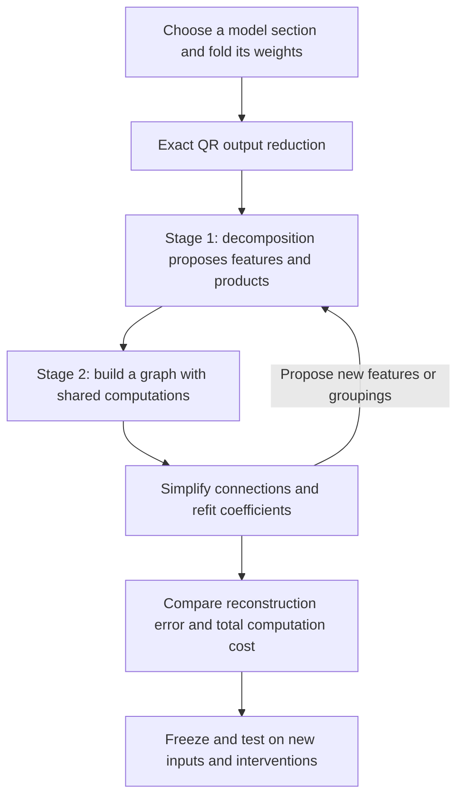
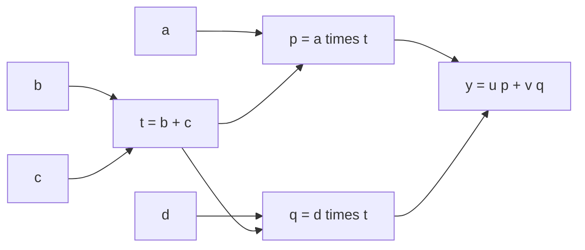

**Overall review: folded weights → tensor decomposition → shared arithmetic circuits**

Rewritten 21 September 2026, 18:04 UTC. Includes the completed learned-direction and mixed-objective follow-ups available at this review. The original filename is retained so existing links still work.

**The two-stage plan you remember is still the research direction.** First, fit a tensor decomposition to the joint computation of a section of the model. Second, turn its features into an arithmetic graph, then simplify and refit that graph while allowing computations to be shared. QR is an exact output-coordinate reduction that makes the fitting cheaper.

The main outcome so far is **a useful compression baseline, plus evidence about why simpler representations fail**. We have not yet found a replacement that passes all the reconstruction and intervention tests, or completed the general Tucker/HT-to-arbitrary-graph optimizer.

Three different targets appeared in the updates. Keeping them separate makes the trajectory easier to follow:

| Target | What we actually simplify | Where it stands |
|---|---|---|
| Selected two-layer computations | A few quadratic measurements from MLP16 feeding selected MLP17 components | Shared arithmetic saves about 15.7% of the measured source cost, but transfer failures remain. |
| Full last-MLP polynomial | All 4,608 products and their output effects in MLP17 | A 3,686-product replacement gives a useful natural-input baseline; intervention failures remain. |
| General folded section | A two-layer or deeper computation, represented by a freely edited shared graph | The intended destination; only restricted versions of the search are implemented. |

MLP16 and MLP17 use zero-based numbering: they are the last two of the model’s 18 blocks. “Full” in the second row means the entire last MLP polynomial, not the entire language model.

**The plan, from beginning to end**

| Term | Meaning here |
|---|---|
| Folding | Substitute or contract consecutive computations to study their combined function. |
| Tensor | The polynomial’s array of coefficients, which we can manipulate implicitly without storing the full array. |
| Feature | A scalar intermediate computation, such as a linear projection or a sum of products. It need not have one human-readable meaning. |
| Rank or width | The number of intermediate directions allowed in a decomposition. |
| Arithmetic circuit / DAG | An acyclic graph of linear combinations and products, with the same intermediate value available to multiple consumers. |
| Baseline | A competing representation against which we compare accuracy and cost. |

**What we fold, and what QR does**

For one bilinear MLP, the polynomial contribution projected through the unembedding is

$$
F(x)=UD\big[(Lx)\odot(Rx)\big].
$$

Here $x\in\mathbb R^{1152}$; $L,R\in\mathbb R^{4608\times1152}$ form two sets of linear projections; $\odot$ multiplies them channel by channel; $D\in\mathbb R^{1152\times4608}$ writes back to the residual stream; and $U\in\mathbb R^{50304\times1152}$ maps to vocabulary coordinates.

We can also fold earlier output projections into the input: if $x=Ez$, replace $L,R$ with $LE,RE$. This remains quadratic in the intermediate coordinates $z$. Substituting the computations that produced those coordinates can increase the degree.

Your suggested QR reduction factors $UD$. Our implementation can instead factor $U$ first:

$$
U=Q R_U,\qquad Q^\top Q=I,\qquad C=R_U D.
$$

Then

$$
\widetilde F(x)=C\big[(Lx)\odot(Rx)\big],
\qquad F(x)=Q\widetilde F(x).
$$

This reduces the fitted output from 50,304 vocabulary coordinates to 1,152 coordinates, without changing Euclidean reconstruction error:

$$
\left\|F(x)-Q\widehat{\widetilde F}(x)\right\|_2
=\left\|\widetilde F(x)-\widehat{\widetilde F}(x)\right\|_2.
$$

QR does not remove products or identify features. It removes redundant output coordinates. The equality applies to this polynomial contribution; final RMSNorm and logit softcapping still need to be evaluated explicitly in behavioral tests.

The **joint third-order tensor** is

$$
T_{vij}=\frac12\sum_k C_{vk}
\left(L_{ki}R_{kj}+L_{kj}R_{ki}\right),
\qquad
\widetilde F_v(x)=\sum_{i,j}T_{vij}x_i x_j.
$$

“Third order” means three indices: output $v$, input $i$, input $j$. The function is degree two. We fit this joint object because cancellations and shared effects can emerge only after the factors are combined.

Two pure bilinear layers give degree four and an order-five coefficient tensor. Residual paths and biases introduce lower-degree terms. Normalization and softcapping are explicit operations outside this polynomial description.

**Stage 1: discover candidate computations**

A shared-input Tucker model has the form

$$
s=P^\top x,\qquad
h_g=\sum_{p,q}G_{gpq}s_p s_q,\qquad
\widehat{\widetilde F}=Wh.
$$

The columns of $P$ are learned input directions. The core entry $G_{gpq}$ says how much product $s_p s_q$ contributes to feature $h_g$. Column $W_{:,g}$ is that feature’s output effect.

We can make this representation narrow, sparse, or both. These choices express different hypotheses: few directions, few interactions, or both. A dense low-rank quadratic form can also be cheap to compute, so counting nonzero core entries alone is insufficient.

**Hierarchical Tucker (HT)** organizes a larger tensor as a tree of smaller bilinear computations. For a quartic function, it can form quadratic features and then multiply those features. Its tree groups tensor slots: every leaf can still inspect the full input vector. Our broader proposal allows those intermediate computations to be shared across branches, producing a DAG rather than requiring a fixed tree.

**Stage 2: simplify the program, including reuse**

For example, a decomposition might propose

$$
y=u(ab+ac)+v(db+dc).
$$

A graph rewrite exposes the shared sum:

$$
t=b+c,\qquad p=at,\qquad q=dt,\qquad y=up+vq.
$$

There are now two distinct products instead of four. The same principle can share quadratic intermediates inside deeper computations. Each shared computation is charged once, but its linear projections, additions, and stored coefficients also count.

The intended search alternates discrete edits—merge, split, introduce, remove, or regroup computations—with continuous coefficient fitting. **We have tested restricted versions of this procedure, not a general search over arbitrary arithmetic graphs.**

**What happened after adopting this direction**

**First, we tested whether the machinery could recover known structure.** The recent five-family suite planted independent products, shared input directions, shared output directions, squares, and cancelling terms. This tests fitting code and optimization separately from whether the trained model actually contains the assumed structure.

With exact output-weight solves and longer Adam fitting, a width-six model recovered nine of ten runs, covering all five families at least once. “Recovered” here means both coefficient and response errors below 1%; it does not mean the learned internal variables matched the planted ones uniquely. A restricted graph stage then tried deleting products and refitting: four of five selected family examples reached the planted four-product budget while retaining those error limits. The cancellation example remained at six products. Adam was stronger in this particular suite; earlier parameterizations gave different results, so there is no universal optimizer verdict. [Toy and graph experiments](research_update_2026-09-21_1742_learned_features_and_graph_refitting.md).

**Second, local two-layer searches found some savings, but exposed composition problems.** Much of the work simplified six quadratic measurements from MLP16 feeding three selected MLP17 components. A measurement is a scalar function such as $q_j(z)=z^\top Q_jz$.

Allowing shared directions, shared products and correction terms saved 15.7% of measured source arithmetic. More aggressive versions around 20% saving failed reconstruction requirements. The accepted local fit had 7.63% covariance-shaped coefficient error but 57.74% error in the original coordinates. It passed absolute reconstruction limits on new panels while retaining failures against similarly priced baselines. Refitting improved training losses without reliably improving transfer. These results concern the selected computations, not the entire folded tensor. [Local result](research_update_2026-09-21_1451_local_graph_fidelity_pass.md).

**Third, we checked whether narrow Tucker fits were failing for mathematical reasons.** Exact matrix-unfolding spectra provide necessary rank bounds for the full last-MLP tensor:

| Reconstruction geometry | Necessary input rank | Necessary output rank |
|---|---:|---:|
| Folded Euclidean coefficients, 10% relative error | 1,089 | 1,088 |
| Activation-covariance-weighted coefficients, 10% relative error | 416 | 818 |

There are 1,152 available residual directions. Each number is a separate necessary bound; using both ranks does not guarantee the desired error.

This answers the earlier “was the assumed rank too small?” question: **yes, some narrow full-tensor Tucker choices cannot achieve the desired coefficient error, regardless of the optimizer.** It does not establish that HT in general fails, or that a broad sparse graph cannot be cheap. A small subspace and a cheap arithmetic program are different requirements. [Rank evidence](../../direct_tensor_match/FULL_TENSOR_MODE_INTERPRETATION_V1.md).

**Fourth, we established a baseline that covers the full last MLP.** We retained 3,686 of its 4,608 native products, refit the output weights, and added an affine correction matching the teacher’s value and gradient at the calibration mean. The correction costs coefficients and is included in the accounting.

This removes 20.0% of products and saves 11.7% of stored coefficients. It keeps the inherited input directions, so it is pruning and refitting rather than discovery of a new feature dictionary. On an initially fresh panel of 32 FineWeb documents and 16 code files, its natural logit-effect error was 4.44% and 2.12%, respectively. Its worst FineWeb document reached 21.82%, so the average conceals uneven accuracy. [Baseline evaluation](../../direct_tensor_match/FULL_CHANNEL_FRESH_INTERPRETATION_V1.md).

**Fifth, learning new directions showed that the fitting objective matters.** We next allowed both input factors to move, solving for output weights during fitting. All the following replacements have the same 3,686-product and 14,067,072-coefficient budget, including the affine correction.

| Full-layer replacement | FineWeb natural effect error | Code natural effect error | Full-path intervention cohorts passing the 10% error limit |
|---|---:|---:|---:|
| Original pruning/refitting baseline | 4.44% | 2.12% | 0 of 4 |
| Learned directions: covariance + response fitting | 6.64% | 2.78% | 0 of 4 |
| Learned directions: add an isotropic tensor penalty | **4.21%** | **2.07%** | **1 of 4** |
| Learned directions: isotropic tensor objective alone | 8.41% | 6.77% | 0 of 4 |

“Natural effect error” compares the replacement’s logit discrepancy with the original MLP’s logit contribution, through actual downstream normalization and softcapping. It is not a language-model error rate.

The intervention test swaps a preceding-MLP source contribution between examples while holding recipient attention fixed, then recomputes the last MLP and downstream output. Its four primary cohorts are FineWeb/code crossed with continuation/spaced-word tokens. This is a different, harder requirement than matching ordinary forward outputs.

The first learned-direction fit improved its training errors but worsened these behavioral results. Adding a global isotropic penalty restrained that drift: the mixed candidate improved all three fitting metrics over the fixed-product candidates and slightly improved natural-output fidelity. However, its full-path intervention errors were **14.06%, 11.08%, 11.88%, and 8.45%**. Three remain above the 10% limit. Its average cross-entropy changes were +0.00430 nats/token on FineWeb and +0.00018 on code.

These later candidates were tested on the **same, already opened panel**, not new independent confirmation data. The learned-direction fits ran for 100 steps and do not establish convergence. Even the “isotropic-only” fit retained a data-informed initialization, parameter coordinates and affine correction; only its fitting objective was weight-only. None of these replacements is adopted as a faithful causal circuit. [Latest comparison and records](../../direct_tensor_match/FULL_QUADRATIC_MULTIGEOMETRY_INTERPRETATION_V1.md).

**Did the paper-inspired weight matching help?**

Yes: direct joint-tensor fitting, implicit contractions, and exact coefficient solves made the experiments practical and exposed which restrictions were limiting. We tested both weight-only and activation-informed geometries. But lower fitting error has not consistently produced better behavior or clearer internal features.

There are three distinct causes of failure:

| Cause | What would establish it? | What we found |
|---|---|---|
| Insufficient representation | A bound showing the chosen ranks or span cannot fit the target. | Established for some narrow full-tensor and frozen local layouts. |
| Optimization failure | The same representation succeeds with a better solver, initialization, or parameterization. | Seen in controlled toys; a stalled numerical fit was also repaired. |
| Objective mismatch | Better tensor or training-state fit worsens the desired evaluation. | Seen in native transfer and in the reconstruction/intervention tradeoff. |

Adam and Muon have both recovered planted examples under favorable parameterizations; we have no universal optimizer winner. Toy recovery also does not imply that the trained model has the assumed structure.

The covariance distinction matters. A weighted coefficient norm changes which directions matter. Exact expected squared error for a quadratic function generally depends on **fourth-order input moments**. Input covariance alone specifies that functional loss only with additional distributional assumptions. We should not call all of these objectives the same error measure.

**Why the previous title was confusing**

The old title was misleading without its scope. **Full coverage** meant accounting for all error in a *selected target*, including what lay outside the fitted subspace. It did not mean the whole network had been decomposed. The full-layer baseline really does target the entire last MLP polynomial, but still not the entire model.

**Shared baselines** means competitors are also allowed to reuse computations. Otherwise, we could appear to win just by comparing our shared graph against an unnecessarily duplicated implementation. Compare both total arithmetic and stored coefficients at a stated error, not just product counts.

**Where this leaves the two-stage plan**

| Part of the original plan | Current status |
|---|---|
| Exact folding and QR output reduction | Implemented. |
| Joint tensor fitting with and without activation information | Implemented, with distinct metrics recorded. |
| Decomposition proposals and restricted graph simplification | Tested on toys and local native targets; product deletion/refitting reaches the planted budget in four of five selected toy examples. |
| General HT initialization followed by arbitrary graph search | Incomplete. |
| Useful full-layer compression baseline | Available. Learned-direction follow-ups modestly improve natural reconstruction, but full-path intervention failures remain. |
| Identified, reusable circuits with selective causal effects | Not established by this decomposition work. |

The next substantive test is whether fitting the composed two-MLP path, including normalization, on artificial inputs propagated through the preceding weights gives a better reconstruction objective. That experiment is proposed, not completed. The broader missing step remains graph search that can introduce and share intermediate computations at different depths, and then beat these baselines on both cost and behavior.
