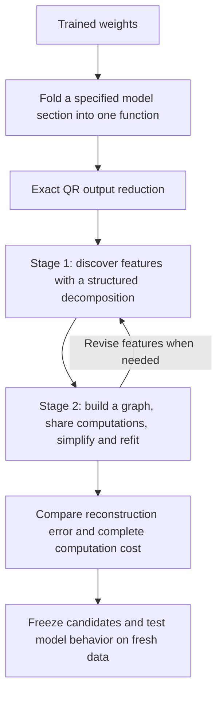
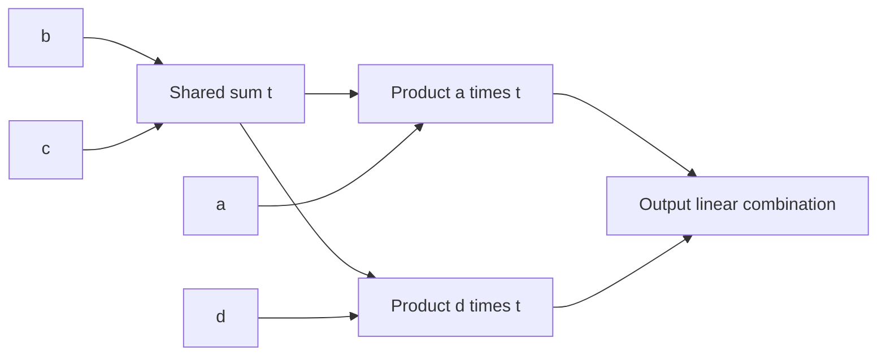

**From folded weights to a smaller program: overall research review**

Rewritten 21 September 2026, 14:15 UTC. This replaces the “full coverage and shared baselines” account, retaining its filename so existing links work. It summarizes the direction and completed results rather than listing every experiment.

**Your recollection is correct: the intended method has two stages.** First, fit a structured tensor to discover useful intermediate computations. Second, turn those computations into an arithmetic graph, simplify it, and refit it. QR prepares the output coordinates before either stage.

We have made progress on both stages, particularly on controlled examples. **We have not yet produced a faithful, cheaper replacement for the full folded section, or completed a general Tucker/HT-to-arbitrary-circuit search.** Most recent experiments address a smaller diagnostic problem. That scope change was too easy to miss in the previous report.

**What we are decomposing, and where QR fits**

For one bilinear MLP, the contribution read through the unembedding is

$$
F(x)=UD\big[(Lx)\odot(Rx)\big].
$$

Here $x$ is the 1,152-dimensional input, $L$ and $R$ produce 4,608 projections each, $\odot$ multiplies corresponding projections, $D$ writes the products back into the residual stream, and $U$ maps that stream to 50,304 vocabulary coordinates. **Folding** means contracting these weights to study their combined computation.

Your suggested QR of $UD$ reduces the output coordinates without approximating the function. The implementation takes an equivalent route: factor $U$ first, then multiply its remaining factor into $D$:

$$
U=Q R_U,\qquad Q^\top Q=I,\qquad C=R_U D,
$$

$$
\widetilde F(x)=C\big[(Lx)\odot(Rx)\big],\qquad F(x)=Q\widetilde F(x).
$$

We optimize in **1,152 output coordinates instead of 50,304**. Because $Q$ has orthonormal columns,

$$
\|F(x)-Q\widehat{\widetilde F}(x)\|_2
=\|\widetilde F(x)-\widehat{\widetilde F}(x)\|_2.
$$

This is an exact change of output coordinates, not a discovered circuit or a reduction in product count. The equality applies before nonlinear output operations. RMSNorm, attention normalization and the final logit softcap remain explicit.

The folded quadratic function defines the **joint order-three tensor**

$$
\widetilde F_v(x)=\sum_{i,j}T_{vij}x_i x_j,
\qquad
T_{vij}=\frac12\sum_k C_{vk}
\big(L_{ki}R_{kj}+L_{kj}R_{ki}\big).
$$

“Order three” counts the indices—one output and two inputs. The polynomial has degree two. We can match this tensor through contractions of its factors without storing all its entries.

Substituting another bilinear computation into $x$ produces degree-four terms and an order-five tensor. Residual paths also produce lower-degree terms. This is the deeper folded target; it is substantially harder than the single-layer quadratic case.

**Stage 1: discover candidate features**

The Tucker proposal is

$$
s=P^\top x,\qquad
h_g=\sum_{p,q}G_{gpq}s_p s_q,\qquad
\widehat{\widetilde F}=Wh.
$$

| Term | Meaning |
|---|---|
| Input feature $s_p$ | A learned scalar projection of the input. |
| Computed feature $h_g$ | A weighted sum of products of input features. |
| Core $G$ | The coefficients specifying which products make each computed feature. |
| Output direction $W_{:,g}$ | The output effect of one computed feature. |
| Rank or width | The number of directions/channels allowed in the representation. |

**Hierarchical Tucker (HT)** arranges smaller bilinear computations in a tree: linear features become quadratic features, which can become quartic features. Its tree groups tensor slots; each leaf can still inspect the full input vector. Sparsity must be added explicitly, and low rank does not guarantee interpretable features.

These are proposals for organizing computation. The experiments also use **output-sharing block decompositions**, in which several products contribute to one output direction. That family supplied useful broad fits; the work has not been a completed standard HT pipeline.

**Stage 2: simplify and share the computation**

An **arithmetic circuit**, represented as a directed acyclic graph (DAG), is a program of linear combinations and products. A **shared** intermediate is computed once and used by multiple consumers; a **private** intermediate serves one consumer.

For example,

$$
y=u(ab+ac)+v(db+dc)
$$

can be evaluated as

$$
t=b+c,\qquad p=at,\qquad q=dt,\qquad y=up+vq.
$$

That uses two products instead of four. The broader graph proposal also allows reuse of quadratic and higher-degree features, across branches and depths. After editing the graph, jointly refitting its coefficients can recover lost accuracy.

We have implemented particular shared-product graphs, algebraic conversions, pruning and refitting. **General graph search—with arbitrary node insertion, merging, regrouping and reuse—is still incomplete.** Counting sparse tensor entries is not a substitute: a dense rank-one quadratic form may be cheap, and a shared product should be charged only once. Dense projections, additions and stored coefficients also have costs.

**What happened when we tried this on the model**

The research narrowed in response to imperfect broad fits:

| Phase | Actual target and result | What it established |
|---|---|---|
| Broad folding and simplification | A selected last-two-MLP contribution: products fell from 1,024 to 512. FineWeb logit-effect error improved from 28.21% to 26.11%; code error from 23.62% to 21.36%. | Product simplification was possible, but reconstruction remained poor. Storage barely changed: 2.672M to 2.654M coefficients. |
| Local diagnostic | Six quadratic measurements, grouped into three selected components. | A smaller setting for studying shared features, numerical fitting and executable cost. It is not the full MLP or full folded tensor. |
| More flexible sharing | Features could be shared by pairs of components instead of by all three. | Better tensor fits, but the initial dense computation exceeded the cost budget. |
| Compile and refit a cheaper graph | Convert the forms to explicit reusable products, then optimize directions and coefficients. | Much of the conversion error was recovered. The cheaper graph still failed fidelity requirements. |
| Algebraic feature proposals | Derive candidate groups from pairs of quadratic forms, then refit. | Successful controlled examples; the native-model comparison still favored the earlier initialization. |

The local target computes reads $q_j(z)=z^\top Q_jz$. These feed three downstream component calculations with explicit normalization. It receives intermediate states from the original model; **it is not an extracted token-to-output program**.

**The main native result, with the comparison spelled out**

The following rows refer to that same local target. “Covariance-shaped coefficient error” measures tensor reconstruction in an activation-informed geometry. “Component 3 error” measures one downstream scalar calculation on examined states. Neither is language-model accuracy.

| Representation | Covariance-shaped coefficient error | Component 3 value error | Multiplications in the selected source computation |
|---|---:|---:|---:|
| Original pair-program baseline | 7.031% | 8.81% | 1,330,560 |
| Dense pairwise-shared fit | 7.577% | 10.55% | 1,548,240 |
| First cheap graph conversion | 11.150% | 14.21% | 1,047,648 |
| Latest controlled refit, inherited initialization | **7.893%** | **10.67%** | **1,047,648** |
| Required limits | At most 7.734% | At most 9.69% | At most 1,064,448 |

The latest graph saves **21.26% of these source multiplications**, but fails reconstruction requirements. The dense fit is more accurate in coefficient space but too expensive. This is the central remaining gap between fitting a tensor and obtaining an acceptable simpler program. The table shows representative limits; acceptance also checks other components, original-coordinate error and derivatives.

The algebraically proposed initialization, given the same native refitting budget, finished at **8.194%** covariance-shaped error, worse than **7.893%** from the inherited graph. Both compiled successfully. A good toy initialization has therefore not yet become a better native circuit. [Completed native comparison](../../direct_tensor_match/PENCIL_JOINT_REFIT_V1.json).

These latest graph results use already examined states. Earlier candidates received fresh FineWeb/code comparisons, but none passed every relative baseline comparison. The latest graph has no new fresh/OOD validation establishing success.

**What the controlled examples taught us**

Optimizer failure and representation failure are different. When shared input spaces were supplied, an improved parameterization let both Adam and Muon recover all five planted cases using the better of two starts. Asking them to discover the shared spaces as well initially recovered none. The target functions had not become unrepresentable; the search had become harder.

Algebraic proposals followed by graph refitting made the two-stage idea work on those controlled problems. With sixteen candidates retained per search width, all five cases passed coefficient recovery at zero noise and at 1% injected noise. At 1% noise, only four passed the internal shared-subspace identity requirement. Four candidates per width gave worse recovery than sixteen.

**These recent five cases are instances of one planted sharing family, not five distinct architectural baselines.** They support this mechanism, not general recovery of arbitrary circuits. They also show that accurate outputs do not uniquely identify the internal features. [Toy results and controls](research_update_2026-09-21_1345_algebraic_proposals_and_refitting.md).

**Did direct weight matching help? Why did Tucker/HT not simply solve it?**

Direct weight matching helped substantially: it provided joint objectives and exact conditional coefficient solves. In an earlier local experiment, learning feature directions reduced covariance-shaped coefficient error from **37.47% to 8.22%**. That is an improvement in fitting, not a validated final circuit.

We have explored both original-coordinate coefficient error and covariance-shaped error. The latter uses activation information and can prioritize relevant directions, but neither reliably predicts every downstream behavior. One quartic experiment improved coefficient error from **80.86% to 13.97%** while native-function error worsened from **37.71% to 48.97%**.

The paper's moment matrix belongs in the appropriate lifted feature space. For quadratic functions, expected squared output error depends on fourth-order input moments. Our covariance-shaped loss should therefore not be called exact expected error on text merely because it uses input covariance.

The evidence points to three separate obstacles:

- **Restricted structure:** some frozen feature spaces have error lower bounds above the required limit. More optimizer steps cannot fix those particular layouts.
- **Difficult optimization:** parameterization, initialization, regularization and search width change whether known toy structure is recovered. Some failed runs were numerical or implementation failures and were retained as such.
- **Mismatch between coefficient error and behavior:** a better tensor score can still yield worse downstream outputs, especially through normalization and composition.

Consequently, “we assumed too little Tucker rank” is not a sufficient account. Nor do these results rule out Tucker, HT or more general shared circuits.

**What “full coverage” and “shared baselines” meant**

“Full coverage” referred to accounting for error across the entire **chosen reconstruction target**, including outside the fitted subspace. It did not mean that we had decomposed the full model or completed the proposed pipeline.

“Shared baselines” are comparison programs that already reuse computations. Beating a deliberately duplicated implementation would overstate the gain. We compare against stronger programs and track reconstruction, stored coefficients and arithmetic separately; some comparisons match storage rather than every cost simultaneously.

The remaining milestone is concrete: **a compiled shared program that meets fidelity requirements while reducing total cost against a strong baseline, followed by fresh behavioral validation.** Stable feature identity, semantic interpretation and selective manipulation still need separate evidence. A sum of conditions sharing an output direction need not be one human-readable concept.

Supporting detail: [historical broad results](research_update_2026-09-21_0738_decomposition_detailed_review.md), [cost comparisons](research_update_2026-09-21_1020_cost_matched_pair_baselines.md), [conversion gap](research_update_2026-09-21_1237_stage_one_gain_and_graph_conversion_gap.md), [parameterization and feature discovery](research_update_2026-09-21_1320_parameterization_and_shared_feature_discovery.md), and [algebraic proposals with completed native follow-up](research_update_2026-09-21_1345_algebraic_proposals_and_refitting.md).
