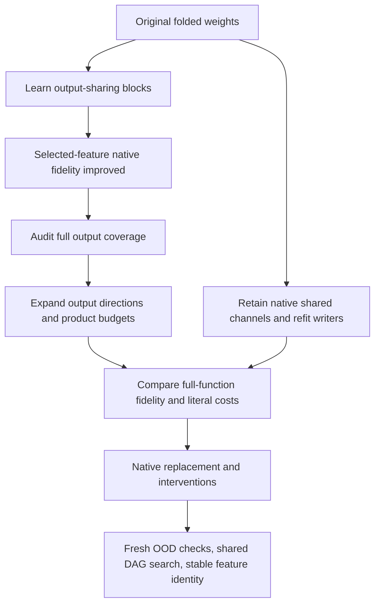

# Folding and decomposition update — 2026-09-21 01:04 UTC

We have a validated improvement from jointly fitting output-sharing blocks. The larger finding is that our earlier four-output experiments covered only part of the folded function. The current work expands that coverage and compares against a simpler baseline that reuses the model's existing computations.

**Updated at 01:07 UTC:** the coverage sweep and full native replacement test have finished. Results are in the addendum below; the earlier sections preserve the experiment rationale. The shared-channel baseline still has calibration results only.

## The function we are simplifying

For the homogeneous bilinear portion of the final MLP,

$$
B(x)=D[(Lx)\odot(Rx)],
$$

let $h$ be its input and $m$ the previous MLP's polynomial residual contribution. Define the midpoint $n=h-m/2$. Then

$$
B(h)-B(h-m)
=D[(Ln)\odot(Rm)+(Rn)\odot(Lm)].
$$

This is the complete contribution involving that source within the final bilinear numerator: it includes both its self-interaction and cross-interactions with the remaining residual input. It is bilinear in the intermediate coordinates $n,m$. Substituting the earlier computations would produce a higher-degree expression.

We keep the native normalization denominator explicit; the evaluated $n,m$ coordinates already include that denominator. Final residual context, RMS normalization and logit softcapping remain native operations. Supplying these intermediate states still requires the upstream model. This is not an ablation or replacement of the entire previous MLP.

An **output direction** is a fixed vector describing where a scalar feature writes in residual or reduced-logit space. A **product** multiplies two learned scalar input projections. An **output-sharing block** combines several products that use one output direction. None of these definitions implies a human-interpretable concept.

## Completed: learning output groups helps native interventions

We fitted the original weight-derived four-readout tensor jointly, allowing its output directions to change. Both arms use 16 products. The learned model has the form

$$
\widehat T_{gij}
=\sum_{b=1}^{4}W_{gb}\sum_{\ell=1}^{4}A_{ib\ell}B_{jb\ell}.
$$

The fitted tensor's weighted coefficient error fell from 0.994% to 0.898%; calibration scalar reconstruction error fell from 7.20% to 6.24%. More importantly, the subsequent native-model test improved all four joint comparisons:

| Joint centered-logit intervention error | Fixed output groups | Learned output groups |
|---|---:|---:|
| FineWeb removal | 5.65% | 5.23% |
| FineWeb same-token swap | 6.48% | 6.21% |
| Code removal | 4.34% | 2.78% |
| Code same-token swap | 6.24% | 5.13% |

An intervention error compares the predicted logit change with the native computation's logit change. It is not token prediction error. These panels have been reused for diagnostics; fresh confirmation is still required. The joint native reference is invariant under the changed output coordinates, verified to relative energy discrepancy $5.1\times10^{-14}$.

The learned blocks also passed the registered individual swap-fidelity screen. However, random restarts disagreed about block identity, and individual labels change between fits. We have improved a computation, not identified unique semantic units.

## Completed: full-function coverage is the dominant limitation

The selected four output directions omit **46.54% of the calibration variation norm** of the full vocabulary-centered folded contribution. Their retained energy is about 78.3%; norm error and energy fraction are different quantities.

| Full calibration variation error | Fixed output groups | Learned output groups |
|---|---:|---:|
| Including omitted output directions | 46.97% | 46.86% |
| Omitted-direction floor alone | 46.54% | 46.54% |

Thus the improvement inside four features hardly changes full-function error. We must expand output coverage instead of treating excellent selected-feature fidelity as a full replacement.

## Running: broader output coverage and full native replacement

The active sweep fits **4, 16, 64 and 256 output directions**, with **1, 4 or 16 products per direction**, comparing isotropic coefficient error with a separable calibration second-moment metric. The target is the original folded weights; the output basis and moments use calibration data only. Evaluation includes omitted directions and uses reused FineWeb/code panels.

At 256 outputs and four products each, the candidate uses 1,024 products. Counting input projections and residual output writers, its proposed implementation uses 2,654,208 weight coefficients: 6 times fewer than the direct native midpoint representation. Its linear coefficient multiplications are 10 times fewer. These are arithmetic counts for this section, not measured runtime or whole-model speedups.

I implemented an exact grouped evaluator that replaces dense product-to-group bookkeeping with grouped sums and precontracts the residual writer. Its toy replay error is $2.01\times10^{-16}$. Native artifact replay and timing remain to be checked.

The queued native test compares:

- The calibration-mean predictor.
- Exact projections onto 64 and 256 output directions.
- The corresponding fitted rank-four programs.

It measures replacement cross-entropy change and full-contribution removal/swap errors. Exact projections isolate the cost of omitted output directions from imperfect product reconstruction.

## New completed calibration baseline: reuse native channels

Independent output fits may duplicate useful computations. As a comparison, retain a subset of native channel computations,

$$
p_k(n,m)=(L_kn)(R_km)+(R_kn)(L_km),
$$

and refit their output writers jointly to the entire folded output. Each channel contains two products, with its readers shared across the two inputs. This baseline does not impose a low-dimensional output subspace.

I compared correlation-based channel selection with random selection and solved the output least-squares problem using the empirical joint moment of the original calibration features. This is a data-informed baseline with fixed native readers, not random-initialized feature discovery.

| Retained channels | Products | Correlation selection: calibration full-variation error | Random selection |
|---|---:|---:|---:|
| 128 | 256 | 29.66% | 62.37% |
| 512 | 1,024 | 18.33% | 24.47% |
| 1,024 | 2,048 | 10.59% | 13.20% |

At 512 channels it uses the same 1,024-product budget as the 256-output/rank-four candidate, with 1,769,472 weight coefficients. **These numbers are training/calibration results only.** The higher-width fits can overfit; held-out and native intervention performance are untested. The comparison motivates evaluating retained native sharing before claiming that a newly learned decomposition is economical.

## What this changes about the research direction

The evidence supports direct optimization and covariance-aware metrics as useful tools. It does not establish that unrestricted Tucker or HT failed, that the fitted blocks are monosemantic, or that low reconstruction error identifies a unique circuit. Previous signed-block tests explicitly demonstrated that a good sum can conceal unreliable individual components.

The next decision depends on the running coverage and native replacement results, followed by a held-out test of the shared-channel baseline. General DAG editing, cross-branch reuse, circuit composition and stable semantic identity remain unfinished. The broader goal remains active.

## Evidence files

- `direct_tensor_match/MIDPOINT_BTD_NATIVE_V1.json`: completed native comparison.
- `direct_tensor_match/MIDPOINT_BTD_COVERAGE_V1.json`: four-output coverage audit.
- `direct_tensor_match/MIDPOINT_CHANNEL_REFIT_V1.json`: completed calibration baseline.
- `direct_tensor_match/MIDPOINT_COVERAGE_COSTS_V1.json`: explicit arithmetic accounting.
- `direct_tensor_match/MIDPOINT_COVERAGE_PLAN_V1.md`: running coverage sweep.
- `direct_tensor_match/MIDPOINT_FULL_REPLACE_PLAN_V1.md`: queued full native test.

All paths above are relative to `basis_aligned/polynomial_causal/`. Status is as observed at the report timestamp; pending results are not inferred from calibration fits.

## 01:07 UTC addendum: broader results are now complete

The 256-output, four-products-per-output program uses 1,024 products. Covariance-weighted fitting materially outperformed isotropic fitting under the full functional metric:

| Full folded-output variation error | Isotropic | Covariance-weighted | Exact output-projection floor |
|---|---:|---:|---:|
| FineWeb | 65.70% | 28.02% | 23.31% |
| Code | 50.84% | 17.97% | 14.79% |

All registered coverage-sweep checks passed. These are pre-final-normalization errors and remain distinct from native behavior.

| Native full-contribution metric | FineWeb | Code |
|---|---:|---:|
| Replacement CE increase, nats/token | 0.00958 | 0.04257 |
| Full removal-effect relative error | 23.88% | 16.10% |
| Full same-token swap-effect relative error | 31.15% | 26.71% |
| Exact256-output projection swap error | 27.10% | 22.91% |

The instrument passed and replacement CE stayed below the registered 0.05 threshold on both panels. **The intervention gate failed:** FineWeb swap error was 31.15%, exceeding the preregistered 30% bar. This is not a promoted circuit. Exact output projection passes that bar, so both omitted-output error and product approximation matter.

For context, the calibration-mean replacement adds 0.13849 nats/token on FineWeb and 0.87762 on code. The broader learned program substantially improves on that baseline, but low CE does not establish faithful interventions, stable identities, or composition.

A successor CPU check replayed the actual exported256-output program through the grouped evaluator on original calibration positions and passed below1e-12 relative error. This validates the exact rewrite, not measured speed. The next outstanding comparison is held-out/native evaluation of the shared-channel baseline at the same product budget.

## 01:11 UTC addendum: shared-channel baseline and regularization

The equal-product native comparison has finished. The shared native-channel baseline does not outperform the learned256-output program, despite its better calibration reconstruction.

| Full same-token swap error | Learned256-output program | Shared channels | Shared channels + ridge |
|---|---:|---:|---:|
| FineWeb | 31.15% | 40.64% | 38.63% |
| Code | 26.71% | 35.29% | 33.05% |

Code replacement CE increases are0.04257,0.07990 and0.06768 nats/token respectively. Both channel versions fail the0.05 code threshold. Instrument checks pass. Regularization helps but does not reverse the comparison.

Ridge0.1 was selected using complementary16-document halves of the original calibration panel: mean conditional validation error fell from42.41% to34.67%. Channel selection used the full calibration panel, so this is conditional output-fit validation rather than an independent validation of channel selection. No held native outcomes selected the penalty.

The successor experiment exposes all1,024 learned products individually and refits their output writes, allowing them to escape the original256 output groups. This instantiates the proposed graph edit of splitting an output-shared feature. It increases output-weight storage and does not yet save products. Initial conditional calibration validation warns of severe overfitting: unregularized average error295.6%, reduced to42.9% with ridge0.1. Native testing is pending. A useful next control is regularizing around the original weight-derived writers rather than around zero, preserving their prior structure while fitting residual errors.

## 01:15 UTC addendum: a weight-anchored graph correction helps

The zero-centered output refit discarded useful weight-derived structure. Penalizing departure from the original writers instead, with penalty10 selected by conditional calibration-document validation, improved native results at the same1,024product count:

| Metric | Original grouped writers | Dense anchored correction |
|---|---:|---:|
| FineWeb swap error | 31.15% | 30.55% |
| Code swap error | 26.71% | 26.37% |
| FineWeb replacement CE added | 0.00958 | 0.00955 |
| Code replacement CE added | 0.04257 | 0.03032 |

The relative-improvement and CE checks pass, but FineWeb remains above the earlier absolute30% intervention bar. We do not promote this as a completed circuit.

A successor computation compresses the output correction into shared linear features of the existing products. For product vector $p$, the write becomes the original grouped write plus $(p^\top A_r)B_r^\top$. This retains all1,024products and adds only linear combinations. Rank8 adds17,408coefficients, bringing weight storage to2,671,616; its conditional calibration error is18.92%. An exact flat-versus-graph replay passed below1e-12. Rank8/32 native tests are queued with a rank0 mean-only control. The broader contribution is moving from a decomposition into a graph with reusable corrections; feature semantics and identification remain unproved.
