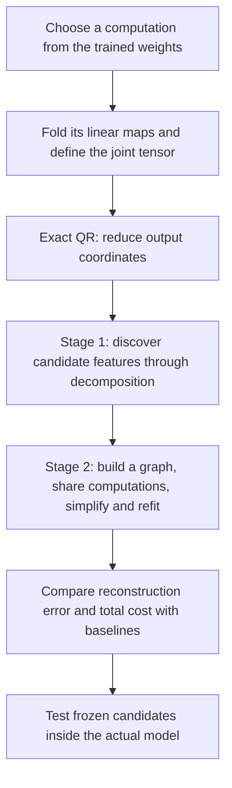
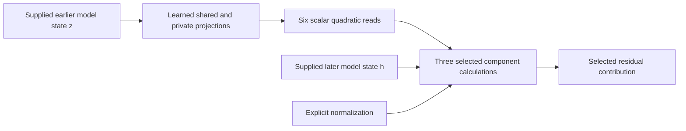

# From folded weights to a simpler circuit: the overall research review

Rewritten **21 September 2026, 11:53 UTC**. This is an overview of the two-stage research direction and its results, including the completed 11:32 joint-fit study and subsequent toy controls. The original filename is retained so existing links work.

**Your recollection is right: the plan is QR preparation → tensor decomposition → arithmetic-circuit simplification. We have working pieces and useful local results, but have not completed the general two-stage search or recovered a faithful circuit for the full folded section.**

The main development since that proposal was a change of scale. Broad folded fits remained inaccurate, so we moved to a smaller problem where we could isolate why sharing helped or failed. Recent reports mostly describe that smaller problem. Their results should not be read as results for an entire MLP, much less the full model.

**The plan you remember**

| Term | Meaning in this project |
|---|---|
| Folding | Compose selected operations algebraically so we fit their combined function. |
| Joint tensor | Coefficients of that combined function, rather than any one weight matrix. |
| Feature | A computed scalar: a linear projection, product, or sum of products. It need not have one semantic meaning. |
| Rank or width | The number of intermediate directions allowed by a particular decomposition. It controls capacity and cost. |
| Arithmetic circuit / DAG | A program of linear combinations and products, with a computed value reused wherever needed. |
| Baseline | An alternative program for the same target against which we compare both error and cost. |

**Preparation: what QR does to unembedding × MLP output**

For one bilinear MLP followed by a linear unembedding, our target is

$$
F(x)=UD\big[(Lx)\odot(Rx)\big].
$$

Here $x$ has 1,152 coordinates; $L$ and $R$ each produce 4,608 projections; $\odot$ multiplies corresponding projections; $D$ writes the products into the residual stream; and $U$ maps that stream to 50,304 vocabulary coordinates.

Your suggested construction was to factor the combined output map $UD$. The implementation instead factors $U$ first, then absorbs the remaining factor into $D$:

$$
U=Q R_U,\qquad Q^\top Q=I,\qquad C=R_U D,
$$

$$
\widetilde F(x)=C\big[(Lx)\odot(Rx)\big],
\qquad F(x)=Q\widetilde F(x).
$$

We fit 1,152 output coordinates rather than 50,304. Because $Q$ preserves lengths,

$$
\left\|F(x)-Q\widehat{\widetilde F}(x)\right\|_2
=
\left\|\widetilde F(x)-\widehat{\widetilde F}(x)\right\|_2.
$$

This step is exact for this linear readout. **QR makes the optimization smaller; it does not itself remove any MLP products.** RMSNorm, Q/K normalization and the final logit softcap remain explicit operations. The equality above does not bypass their effects on actual model behavior.

**Stage 1: propose intermediate computations by decomposing the tensor**

For the single-layer target, write

$$
\widetilde F_v(x)=\sum_{i,j}T_{vij}x_i x_j,
\qquad
T_{vij}=\frac12\sum_k C_{vk}
\big(L_{ki}R_{kj}+L_{kj}R_{ki}\big).
$$

This is an **order-three tensor**: one output index and two input indices. Its function is **degree two**. “Third-order” does not mean a cubic function. We can evaluate reconstruction losses through contractions of the factors without storing every tensor entry.

A shared-input Tucker fit proposes

$$
s=P^\top x,\qquad
h_g=\sum_{p,q}G_{gpq}s_p s_q,\qquad
\widehat{\widetilde F}=Wh.
$$

The learned directions $P$ define input features $s_p$. The core entry $G_{gpq}$ says how much the product $s_p s_q$ contributes to feature $h_g$. The column $W_{:,g}$ gives that feature's output effect. Several unrelated conditions can share an output effect; this does not establish that $h_g$ represents one concept.

Folding two pure bilinear layers produces a degree-four function with an order-five tensor. Residual paths and biases also introduce lower degrees. **Hierarchical Tucker (HT)** organizes the higher-order tensor as a tree of smaller bilinear computations, for example

$$
q_a(x)=\sum_{p,q}A_{apq}s_p s_q,\qquad
r_b(x)=\sum_{p,q}B_{bpq}s_p s_q,\qquad
\hat F_v(x)=\sum_{a,b}C_{vab}q_a(x)r_b(x).
$$

The tree groups tensor slots; each leaf can read the full input. Small internal ranks make it compact. Sparse cores encourage fewer interactions. Neither condition guarantees the cheapest arithmetic program.

**Stage 2: simplify the program, including reuse across branches**

A decomposition might yield

$$
y=u(ab+ac)+v(db+dc).
$$

The circuit can instead compute

$$
t=b+c,\qquad p=at,\qquad q=dt,\qquad y=up+vq.
$$

That uses two products instead of four, with $t$ computed once. At greater depth, the reused value could itself be quadratic. Tucker can already find this particular linear change of basis; the broader graph stage permits reuse at arbitrary depths and across branches.

The intended search alternates graph edits—merge, factor, prune, add an intermediate—with continuous refitting. Its score should account for reconstruction error, distinct products, additions and stored coefficients. A dense projection still costs work even if it eliminates product nodes.

**What we actually implemented:** output-sharing decompositions, executable shared-product graphs, selected graph edits, private paths for difficult components, and joint refitting. **What remains incomplete:** a general system that takes Tucker/HT candidates and searches arbitrary arithmetic DAGs. The most useful large initial fit was an output-sharing block model, not a completed general HT pipeline.

**What happened in the experiments**

| Phase | Target and action | Result and interpretation |
|---|---|---|
| Broad folded fit | A selected source-dependent contribution involving the last two MLPs; initialize with 256 output directions receiving four products each. | Graph simplification reduced 1,024 products to 512. Native logit-effect error improved, but remained too large for a faithful replacement. |
| Smaller diagnostic problem | Fold the preceding MLP into the two input reads of selected scalar components. | Exact pair constructions demonstrated that output sharing can reduce products. This gave us a stronger baseline and a tractable problem. |
| Sharing across components | Fit six quadratic reads feeding three selected components. | Sharing helped two components; the third often needed private capacity. Aggressive global sharing failed. |
| Stronger cost and behavioral comparisons | Compare against already-shared programs and nearly equal-storage pair programs; test FineWeb and code. | Fewer products did not consistently mean lower total arithmetic or better behavior. |
| Joint fitting of shared and private directions | Optimize the restricted graph's linear directions together, rather than freezing them after construction. | Large improvement over the fixed-direction graph, but no consistent win over comparable baselines. |

For the **broad target**, product count halved while storage barely changed: 2.672M to 2.654M coefficients. Relative error in its native logit effect went from **28.21% to 26.11% on FineWeb** and **23.62% to 21.36% on code**. This is evidence for useful simplification, but not an accurate reconstruction of the full selected contribution.

The smaller target looks like this:

Each quadratic read is $q_j(z)=z^\top Q_j z$. Two reads feed each selected component. These are a few measurements of the earlier MLP's output, **not its entire output vector**. The component program still receives native intermediate states, so it is a conditional reconstruction rather than a circuit extracted all the way from tokens.

**The results that matter most**

An early local graph used **512 products instead of 768 at the same storage**. Component errors changed from 3.06%, 2.76%, 11.94% to 2.65%, 2.48%, 11.94%. The first two benefited; the third retained a private computation. A more aggressive 399-product graph failed important baseline comparisons.

A later, wider 592-product graph was compared with 1,152-product pair programs at almost equal storage. On a fresh panel of 32 FineWeb documents and 16 code files, all three fitting geometries passed the aggregate absolute error limits. **None passed every relative comparison against the baselines.** The mixed objective had 10 failing comparisons, the native-isotropic objective 15, and the covariance-shaped objective 13. The mixed graph helped the difficult component on FineWeb relative to covariance-only fitting but hurt it on code. These are the latest fresh behavioral tests; the subsequent results below use already examined states.

The **latest completed native-weight fit** learns a shared dictionary of 128 linear features together with private projections for each component pair. The graph topology stays fixed. Its primary covariance-shaped result is:

| Error being measured | Fixed directions | Jointly learned directions | Nearly equal-cost pair baseline |
|---|---:|---:|---:|
| Component 1 | 13.62% | **2.41%** | 2.81% |
| Component 2 | 10.41% | **2.44%** | 2.50% |
| Component 3 | 47.90% | 13.53% | **11.34%** |
| Covariance-shaped coefficients | 37.47% | **8.22%** | 8.94% |
| Native-isotropic coefficients | 99.45% | **61.34%** | 63.68% |

Joint optimization clearly helped. The third component still lost to the comparable baseline, and the fit failed its original fidelity requirements against a larger baseline. This graph stores about 997,000 coefficients versus 995,000 for the nearly equal-cost baseline. It also uses slightly more source arithmetic and more nonlinear products. It is not a uniformly cheaper or more accurate replacement.

There is an additional identification problem: two covariance-fit starts have complete-source tensor cosine **0.9991**, but shared-branch tensor cosine only **0.3273**. They approximate almost the same overall function while assigning different work to the shared branch. The difference persists after accounting for internal basis changes. A useful branch is not automatically a stably identified feature.

**Why this is not simply “Tucker/HT failed because rank was too low”**

Three issues need separate diagnoses:

| Issue | What the evidence shows |
|---|---|
| Representation too restricted | Some specific width/layout choices have coefficient-error lower bounds above their targets. This rules out those choices, not Tucker/HT or all DAGs. |
| Optimization fails to recover available structure | Toy targets generated by an exactly representable graph can still be missed from random initialization. More steps, optimizer choice and subspace guidance matter. |
| Fitting error measures the wrong thing for deployment | One quartic fit improved coefficient error from 80.86% to 13.97%, while native-function error worsened from 37.71% to 48.97%. |

For the current whole-block graph, Muon recovered all five planted targets within 1% after 1,800 steps; Adam recovered three under the compared setting. But a follow-up topology allowing direct shared-times-private products proved harder: unrestricted fitting recovered only three of five, even after longer schedules and L-BFGS polishing. Constraining directions to input subspaces derived from the target weights improved recovery to **four of five**. That supports the motivation for decomposition before graph fitting, but is a toy result: exact low-rank input supports are available there and not directly available for the full-rank native forms. The new topology has not yet produced a native optimization result.

Independent loss, gradient, coefficient reconstruction and execution checks help separate implementation errors from approximation failures. We also found and corrected a storage-accounting problem: tensor views retained unused backing storage. Packing them preserved every value. Negative and positive results both require these checks.

**Did direct weight optimization and covariance information help?**

Yes, in specific ways. Direct weight matching lets us fit the composed function and measure its residual without relying only on text samples. The latest joint-fit improvement above is concrete evidence that optimizing the directions matters.

The metric determines which errors the optimizer prioritizes. **Native-isotropic coefficient error** treats original-coordinate tensor directions uniformly. **Covariance-shaped coefficient error** changes that geometry using calibration information. A mixed objective balances the two. These are different quantities: an 8% covariance-shaped error and a 61% native-isotropic error can describe the same program.

Covariance-informed fitting improved the broad target's measured full-output variation error from 65.7% to 28.0% on FineWeb and 50.8% to 18.0% on code compared with the isotropic fit. Both fits already used a calibration-selected output basis, so that comparison was not completely data-free versus data-informed discovery.

The paper's lifted metric $M$ is broader than raw input covariance. For quadratic functions, expected squared output error depends on fourth-order input moments. Covariance alone does not determine it without additional assumptions. Our metric experiments helped, but no tested geometry preserved every component and domain best.

**Where the original direction stands**

| Part of the proposal | Current status |
|---|---|
| Exact folding and QR output coordinates | Working. |
| Joint tensor fitting under structural constraints | Working for several restricted representations; compact fidelity remains difficult. |
| Decomposition candidates converted into shared computations | Working in specific constructions and edits. |
| General Tucker/HT-to-arbitrary-DAG search | Incomplete. |
| Consistent improvement over strong baselines at comparable cost | Not established. |
| Stable semantic features and a standalone extracted circuit | Not established. |

The next scientific question is whether better candidate subspaces and graph connectivity can preserve the difficult components at lower total cost. The toy evidence motivates that investigation; it does not yet answer it for the model.

The old phrases **“full coverage”** and **“shared baselines”** obscured this trajectory. Full coverage meant scoring the entire *chosen target*, including omitted directions—not decomposing the whole model. Shared baselines meant comparing against programs that already reuse computations—not that the full proposed graph search was complete.

**Evidence and deeper reading**

- [Detailed earlier review](research_update_2026-09-21_0738_decomposition_detailed_review.md): broad target, exact pair constructions and historical failure diagnoses.
- [Matched storage and arithmetic](research_update_2026-09-21_1020_cost_matched_pair_baselines.md) and [fresh behavioral comparisons](research_update_2026-09-21_1037_fresh_metric_transfer.md).
- [Fixed-direction graph and storage correction](research_update_2026-09-21_1109_overlapping_local_reader_graph.md).
- [Joint fitting, comparable baselines and identity checks](research_update_2026-09-21_1132_joint_graph_fit_and_identity.md).
- [Mixed-topology random-fit controls](../../direct_tensor_match/TOY_OVERLAP_OPTIMIZER_CROSS_V2.json), [polishing results](../../direct_tensor_match/OVERLAP_TOY_POLISH_V1.json), and [weight-derived support controls](../../direct_tensor_match/SUPPORT_GUIDED_TOY_V1.json).

Percentages here are reconstruction errors, not language-model accuracy. Coefficient error, component-value error and native logit-effect error refer to different objects and should be compared only within their stated metric and target.
