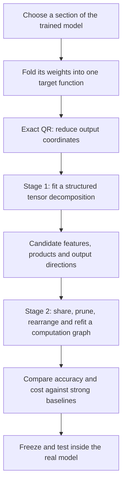
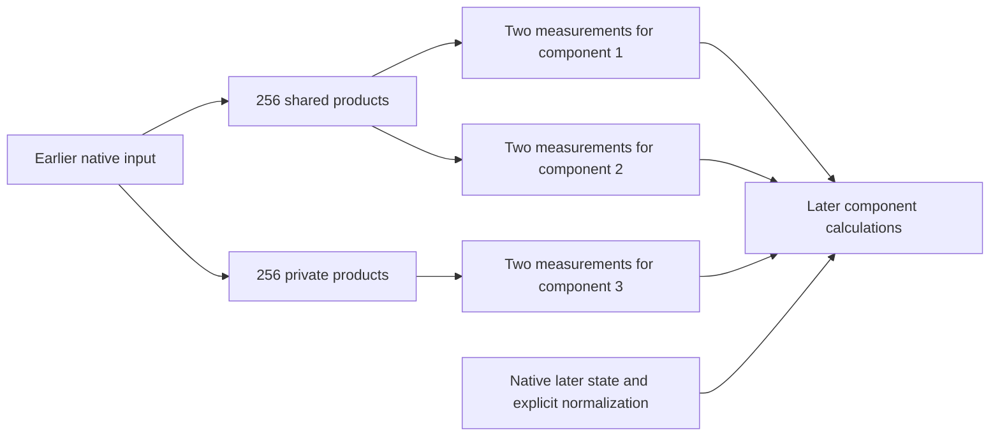

# Overall review: folding → decomposition → arithmetic circuits

Rewritten **21 September 2026, 09:40 UTC**. Covers the research direction and completed evidence through the 09:34 report on 21 September. This is a synthesis, not a new experiment. The filename is retained so existing links still work.

**Your recollection is right: the intended approach has two stages. First, a tensor decomposition proposes useful computations. Second, an arithmetic graph reuses and simplifies those computations. QR is an exact preparation step before either stage.**

We have demonstrated parts of this approach: directly fitting folded weights, reducing multiplication counts through sharing, and refitting the resulting programs. We have **not** completed a general Tucker/HT-to-arbitrary-graph search, or established a faithful, standalone, interpretable circuit for the full folded section. The most convincing savings so far concern a smaller, selected computation.

The previous title obscured that distinction. “Full coverage” meant checking the **entire selected target**, including parts a truncated fit could omit. It did not mean the full model. “Shared baselines” meant comparing against alternatives that already reuse computations, rather than only against the original network's channel layout.

**The intended pipeline**

| Term | Meaning in this report |
|---|---|
| Folding | Compose adjacent operations to describe one joint function. Substituting an earlier nonlinear computation can increase polynomial degree. |
| Feature | A computed scalar: a linear projection, product, or sum of products. It need not correspond to one semantic concept. |
| Tensor | The coefficients of a multilinear expression. Its **order** counts indices; polynomial **degree** counts input factors. |
| Arithmetic circuit / DAG | An acyclic program of linear combinations and products, in which a computed value can feed several consumers. |
| Baseline | Another implementation of the **same target**, compared using the same error definition and cost accounting. |

**1. What we fold, and why QR comes first**

For one bilinear MLP followed by unembedding, the polynomial contribution is

$$
F(x)=UD\big[(Lx)\odot(Rx)\big].
$$

Here $x\in\mathbb R^{1152}$; $L$ and $R$ produce 4,608 scalar projections; $\odot$ multiplies them pairwise; $D$ writes the products into the residual stream; and $U$ maps that stream to 50,304 vocabulary logits.

Your proposal was to factor the combined output map $UD$. The implementation uses the closely related exact construction

$$
U=Q R_U,\qquad Q^\top Q=I,\qquad C=R_U D.
$$

It then fits

$$
\widetilde F(x)=C\big[(Lx)\odot(Rx)\big],
\qquad F(x)=Q\widetilde F(x).
$$

This reduces the optimized output dimension from 50,304 to 1,152. Because $Q$ preserves lengths,

$$
\|F(x)-Q\widehat{\widetilde F}(x)\|_2
=
\|\widetilde F(x)-\widehat{\widetilde F}(x)\|_2.
$$

**QR changes coordinates without approximation; it does not itself reduce the number of products.** Further output truncation would be an approximation. The equality concerns this linear readout, not error after final normalization and softcapping.

RMSNorm, attention normalization and softcapping remain explicit operations. We are simplifying a specified polynomial section, not declaring the entire transformer polynomial.

**2. Stage one: discover candidate computations**

The joint quadratic coefficient tensor is

$$
\widetilde F_v(x)=\sum_{i,j}T_{vij}x_i x_j,
\qquad
T_{vij}=\frac12\sum_k C_{vk}
\left(L_{ki}R_{kj}+L_{kj}R_{ki}\right).
$$

It is **order three**: one output index and two input indices. “Joint” means fitting this composed function, rather than independently compressing its three matrices. Implicit contractions let us evaluate coefficient losses without storing every tensor entry.

A Tucker model proposes

$$
s=P^\top x,\qquad
h_g=\sum_{p,q}G_{gpq}s_p s_q,\qquad
\widehat y=Wh.
$$

Here $s_p$ are linear input features, $G_{gpq}$ weights the product of features $p,q$ inside computed feature $h_g$, and $W_{:,g}$ is that feature's output effect. A small dictionary, a sparse interaction core, and low-rank quadratic forms are different notions of simplicity.

Folding two pure bilinear layers gives degree four and an **order-five** tensor. Hierarchical Tucker (HT) organizes its computation into a tree: linear features combine into quadratic features, which combine into quartic outputs. Residuals and biases also produce lower-degree terms. The tree groups tensor slots, not disjoint coordinate subsets: every leaf may read the same full input vector.

The implemented exploration includes direct tensor fitting and several structural families. The more useful model results came from **output-sharing blocks**—several products with a common output direction—and shared-product fits. They are restricted instances of the larger proposal, not a completed general HT discovery system.

**3. Stage two: optimize the program, including reuse**

Suppose stage one gives

$$
y=u(ab+ac)+v(db+dc).
$$

A graph can compute

$$
t=b+c,\qquad p=at,\qquad q=dt,\qquad y=up+vq.
$$

That uses two products instead of four. Both consumers reuse the same $t$. At greater depth, the reused node could itself be quadratic. Ordinary HT does not automatically merge equivalent computations across separate branches.

Our implemented edits include sharing products across outputs, pruning, adding private capacity to a difficult branch, and refitting input directions and output coefficients. Some fits solve output coefficients analytically while Adam updates directions. The unrestricted search over arbitrary graph topologies remains unfinished.

We count products and stored coefficients separately. Fewer products at equal storage is meaningful, but dense linear projections and additions still cost work; it is not a measured runtime speedup.

**4. What happened: broad fit → smaller targets → stronger tests**

The investigation narrowed because fitting a broad folded contribution remained inaccurate. These are different experiment scopes, not successive scores for one unchanged target.

| Scope | Main completed result | Interpretation |
|---|---|---|
| Broad selected contribution involving the last two MLPs | Graph simplification reduced 1,024 products to 512; storage fell slightly, from 2.672M to 2.654M coefficients. Native logit-effect error improved from 28.21% to 26.11% on FineWeb and 23.62% to 21.36% on code. | Useful arithmetic savings, but still substantial error. This was not the whole model. |
| Three selected scalar components | Sharing reduced 768 products to 512 at the same 897,804 coefficients. | The clearest local sharing improvement; accuracy qualifications below. |
| More aggressive sharing of those components | A 399-product graph used 896,198 coefficients. | Further savings, but fresh tests failed comparisons against stronger baselines. |

For the three-component target, each component uses two quadratic measurements of an earlier native input $z$. Thus we fit **six scalar quadratic outputs**, not all outputs of an MLP. The later component calculation still receives a native intermediate state and uses explicit normalization.

On previously examined states, the separate programs' component errors were **3.06%, 2.76%, 11.94%**. The 512-product shared program gave **2.65%, 2.48%, 11.94%**. The first two improved; the third branch stayed identical.

Fresh native tests supported that relative saving, but did not establish full accuracy. Each of two panels passed all 72 comparisons against its matched separate baseline under the allowed 10% relative degradation. An absolute continuation-error limit still failed for component three: **16.73% against a 15% cap**. Enlarging the private branch in both programs on another panel gave **16.01%**, still failing; that second comparison used larger programs in both arms.

The more aggressive 399-product graph was tested against **both** the separate and earlier shared programs. Its combined effect had low absolute error, yet it failed **11 of 18** relative comparisons for the combined effect and retained individual-component failures. Therefore the smaller graph has not displaced the stronger 512-product comparison program.

These programs are conditional on native intermediate inputs. They are not standalone circuits reconstructed from tokens.

**5. Why the failures do not mean “Tucker cannot work”**

We need to distinguish capacity, optimization, and the objective being optimized.

| Possible problem | Evidence and limit |
|---|---|
| The chosen representation is too small | A restricted rank-16 quartic family had an error floor above its target. That is a limitation of that family and budget, not a general impossibility result for Tucker, HT or DAGs. |
| Optimization misses an available solution | Planted controls exposed restart and schedule sensitivity. Five structural families and optimizer comparisons were tested; they do not establish a universal Adam/Muon winner. |
| The loss rewards the wrong approximation | In one quartic experiment, coefficient error improved from **80.86% to 13.97%**, while native-function error worsened from **37.71% to 48.97%**. |

Thus direct weight optimization helped produce better coefficient fits and smaller programs, but a good coefficient fit did not guarantee faithful model behavior. Reconstruction, gradient and execution checks were used to distinguish implementation failures from retained negative results.

**6. What covariance and the more recent work add**

The key distinction is between matching polynomial coefficients and matching outputs on relevant inputs. For quadratic functions, output error depends on fourth-order input moments; input covariance alone does not determine it unless additional distributional assumptions hold.

The recent work therefore combines a coefficient penalty with empirical error in quadratic measurements:

$$
E=E_{\mathrm{coefficients}}
+\lambda E_{\mathrm{quadratic\ outputs\ on\ calibration\ states}}.
$$

The coefficient term retains a constraint beyond the observed states. Increasing $\lambda$ emphasizes the calibration distribution, which can improve relevant accuracy but can also overfit. This extends the metric investigation motivated by your paper; it is not a completed implementation of every proposed graph-search step.

With the 399-product graph's directions fixed, increasing calibration from 1,536 to 16,384 states improved the primary fit's third-component error on the previously examined evaluation states from **15.41% to 14.91%**. The coefficient-only control was **16.09%**. But the separate baseline was **11.94%**: our relative requirement permits at most **13.14%**, so the new fit still fails it.

This is evidence that the fitting metric and calibration coverage matter. It is not fresh validation: those additional inputs had already been used for covariance estimation. The 09:34 report registers direction fitting under this richer objective, but contains no completed result for that step.

There is also an identification problem. Different fits can approximate the same function with different internal products. Larger groups can be more repeatable, but making them repeatable has sometimes worsened fidelity. A scalar feature that combines several conditions with a shared output effect is legitimate; its sparsity does not establish one human-readable meaning.

**What we can currently conclude**

The original two-stage idea remains the research direction. We have demonstrated restricted decomposition-and-graph improvements, with the strongest evidence being fewer products at comparable storage for selected computations. We have not yet combined broad coverage, strong accuracy, stable feature identity, and standalone extraction in one result.

The next substantive hurdle is to preserve the difficult components while retaining the sharing savings, then validate a frozen candidate against both separate and shared baselines. Completing a general graph search is still distinct from that local fitting work.

**Evidence and optional detail**

- [Detailed earlier review](research_update_2026-09-21_0738_decomposition_detailed_review.md): broad-target experiments and technical background.
- [Exact shared baselines](research_update_2026-09-21_0451_exact_shared_products.md) and [local graph construction](research_update_2026-09-21_0707_mixed_products_and_graph_reuse.md).
- [Fresh tests of the 512-product program](research_update_2026-09-21_0748_stable_functions_unstable_products.md).
- [Fresh comparison of 399, 512 and 768 products](research_update_2026-09-21_0910_fresh_group_and_constituent_interventions.md).
- [Quartic coefficient versus function error](research_update_2026-09-21_0524_joint_quartic_metric_failure.md) and [restricted rank limits](research_update_2026-09-21_0554_rank_limits_and_input_geometry.md).
- [Covariance and polynomial metrics](research_update_2026-09-21_0917_covariance_and_lifted_polynomial_metrics.md), [small-pool overfitting](research_update_2026-09-21_0926_empirical_polynomial_metric_readout.md), and [expanded calibration](research_update_2026-09-21_0934_expanded_moment_calibration.md).

**Later metric clarification (10:00):** Recent local “coefficient” errors use calibration-shaped input coordinates, not isotropic native coordinates. The [direct-component and geometry audit](research_update_2026-09-21_1000_component_loss_and_metric_correction.md) measures both and finds a substantial gap. This does not alter the earlier broad-target results or remove any failed behavioral requirement.

All percentages above describe reconstruction error, not language-model accuracy. Coefficient error, component-value error and native logit-effect error measure different objects. Historical cache chunks lack document identities; later fresh panels have stronger independence checks.
