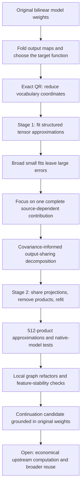

# From tensor decomposition to arithmetic circuits: overall research review

Rewritten 21 September 2026, 04:12 UTC. This replaces the old “full coverage and shared baselines” report at the same link. It summarizes the research direction and reviewed results through the 03:56 report; subsequent experiments are outside this review.

**The plan you remember is still the plan:** first use the trained weights to discover candidate computations through tensor decomposition; then simplify those computations as an arithmetic circuit, allowing shared intermediates and refitting after edits.

**We have made progress in both stages, but have not implemented the full proposed search.** The useful large approximation currently comes from an output-sharing bilinear decomposition, followed by targeted graph edits. It is not the result of a successful general HT-to-arbitrary-DAG pipeline. We have also found one continuation-related feature and checked that it corresponds closely to a leading component of an original-weight operator.

The broad lesson is that **simple under the model's input distribution can be very different from simple in global coefficient space**. Covariance information helped substantially. Accurate average predictions also proved easier to preserve than all context-dependent interactions.

## The whole trajectory at a glance

## 1. What are we trying to simplify?

A bilinear MLP computes

$$
B(x)=D[(Lx)\odot(Rx)].
$$

Here $x$ is a 1,152-dimensional input. The matrices $L$ and $R$ each read 4,608 scalar features; $\odot$ multiplies corresponding pairs; $D$ writes those products back into the residual stream. The unembedding $U$ maps residual vectors to 50,304 vocabulary coordinates.

**Folding** combines adjacent maps to expose their joint computation. **Decomposition** finds a smaller structured representation of that joint function. An **arithmetic circuit** is an executable graph of linear combinations and products. A **DAG** is a directed acyclic graph: a computed value can feed multiple consumers without being recomputed.

Our goal is both computational simplicity and eventual interpretability. Few products alone do not guarantee meaningful features, and few tensor parameters do not automatically imply a cheap executable circuit.

## 2. QR makes the output coordinates smaller; it does not discover the circuit

The starting function is

$$
F(x)=UD[(Lx)\odot(Rx)].
$$

You proposed QR on $UD$. The implementation uses QR on $U$, then folds its smaller factor into $D$:

$$
U=QR_U,\qquad Q^\top Q=I,\qquad C=R_UD.
$$

We therefore fit

$$
\widetilde F(x)=C[(Lx)\odot(Rx)],\qquad F(x)=Q\widetilde F(x).
$$

This changes the working output width from **50,304 to 1,152 without losing information**. Because $Q$ has orthonormal columns,

$$
\|F-\widehat F\|_2=\|\widetilde F-\widehat{\widetilde F}\|_2.
$$

Any later restriction to fewer output directions is a separate, lossy step. RMS normalization and final logit softcapping remain explicit operations; this equality concerns the linear output map.

## 3. Stage one proposes features by matching the joint tensor

The reduced bilinear layer defines

$$
\widetilde F_v(x)=\sum_{ij}T_{vij}x_ix_j,
\qquad
T_{vij}=\frac12\sum_k C_{vk}(L_{ki}R_{kj}+L_{kj}R_{ki}).
$$

This is an **order-three tensor** because it has three indices: one output and two inputs. Its function is quadratic, not cubic. Factoring this joint object can expose cancellations that separate compression of $C,L,R$ would miss.

Tucker proposes a representation such as

$$
s=P^\top x,\qquad h_g=\sum_{pq}G_{gpq}s_ps_q,\qquad \widehat y=Wh.
$$

| Object | Interpretation |
|---|---|
| $s_p$ | A learned scalar input feature |
| $s_ps_q$ | A candidate interaction |
| $G_{gpq}$ | How much that interaction contributes to computed feature $h_g$ |
| $W_{:,g}$ | The output effect shared by the terms in $h_g$ |

A feature can collect unrelated conditions with a shared output effect. Sparsity does not establish monosemanticity.

Folding two pure bilinear layers all the way back gives a quartic function: an **order-five tensor**, with one output and four input indices. **Hierarchical Tucker (HT)** organizes its contractions as a tree of smaller bilinear computations. That tree groups tensor slots, not necessarily subsets of input coordinates. A general circuit can additionally share computations across branches or depths.

### Why did the early small decompositions look unsuccessful?

They left high reconstruction error at the tested capacities. That does **not** prove Tucker or HT cannot represent the function. We needed to distinguish:

- Too little rank or too restrictive a structure.
- Optimization that had not found a good fit.
- An error metric emphasizing directions rarely used by the model.
- An implementation error.

Five planted structural baselines and optimizer, learning-rate and restart sweeps supplied checks on these possibilities. Adam and Muon did not produce a universal winner. Later, longer optimization resolved one apparent feature-instability result, showing why negative results need auditing.

## 4. The practical target became one complete source-dependent contribution

Instead of expanding all upstream computations into a huge quartic tensor, we kept the preceding MLP's output as an intermediate input.

Let $h$ be the last MLP's input, and $m$ the preceding MLP's polynomial residual contribution, including its residual scale. Define $n=h-m/2$. Then

$$
\boxed{
B(h)-B(h-m)
=D[(Ln)\odot(Rm)+(Rn)\odot(Lm)].
}
$$

This exactly includes both the source's self-interaction and its interactions with the other input contributions. It is still bilinear in the intermediate variables $n,m$.

In the model implementation, both are divided by the **original recipient's RMS denominator**. This specifies a fixed polynomial contribution; it is not an upstream ablation followed by recomputing every downstream normalization.

**This is what “full coverage” meant:** we measured error against this entire chosen contribution, including outputs our approximation omitted. Earlier favorable errors covered only four selected output directions. It did not mean full-model coverage, exact reconstruction, or a completed research program. “Full-contribution evaluation” is a clearer name.

### Did direct weight fitting and covariance help?

Yes, in this scoped comparison. Holding the calibration-selected output basis fixed, using input covariance rather than an isotropic input metric reduced full-output variation error:

| Evaluation material | Isotropic fit | Covariance-informed fit |
|---|---:|---:|
| FineWeb | 65.7% | 28.0% |
| Repository code | 50.8% | 18.0% |

Lower is better. These are reconstruction errors before final native nonlinearities. Both fits already used a data-informed output basis. This supports covariance-informed weight matching, but does not isolate a particular paper's optimizer as the cause or demonstrate fully data-free discovery.

## 5. Stage two simplified the program, with limited kinds of edits

The useful initial decomposition used **256 output directions with four products per direction: 1,024 products**. Different products could share an output effect. This is an output-sharing block decomposition.

We then shared input projections, added shared output corrections, removed products and refitted coefficients. Later fits allocated different numbers of products to different output directions and gave the two input roles separate linear feature spaces.

The broader intended graph search includes rewrites like

$$
u(ab+ac)+v(db+dc)
$$

into

$$
t=b+c,\qquad p=at,\qquad q=dt,\qquad y=up+vq.
$$

There are now two products instead of four, and the shared sum $t$ is computed once. More generally, we want this freedom for quadratic and higher-degree intermediates too.

**Implemented:** specific sharing, pruning, refitting and local joint-product refactors. **Still absent:** a general search over arbitrary intermediate sums, products, alternative hierarchies and cross-depth reuse.

We count stored coefficients as well as distinct products. Dense projections cost something, so halving products does not imply halving memory or runtime.

## 6. What do the baselines and results actually say?

The main executable baseline is the **earlier 1,024-product approximation**, not the exact original model. The exact native contribution remains the reference for fidelity. Toy planted functions separately check whether a method can recover known structure.

Two different 512-product graphs answer different questions:

| Candidate | Products | Stored weights | Main result |
|---|---:|---:|---|
| Earlier approximation baseline | 1,024 | 2,671,616 | Reference compressed program |
| Smaller-storage graph | 512 | 1,291,264 | About half the weights, with modest fidelity loss |
| Later matched-storage graph | 512 | 2,654,208 | Half the products, similar storage, better measured fidelity |

The smaller-storage graph's swap-effect error rose from **28.43% to 29.28%** on FineWeb and **25.09% to 25.98%** on code, on its own frozen confirmation panel.

The later matched-storage graph was compared with the baseline on a separate new panel:

| Relative native-effect error; lower is better | Baseline: 1,024 products | Later graph: 512 products |
|---|---:|---:|
| FineWeb whole-contribution swap | 28.21% | 26.11% |
| Code whole-contribution swap | 23.62% | 21.36% |
| FineWeb context-dependent interaction | 52.49% | 52.13% |
| Code context-dependent interaction | 39.62% | 38.45% |

An effect error compares the approximation's change in vocabulary-centered logits with the native change, normalized by the native effect's norm. It is not a percentage of wrong tokens. The context test isolates dependence on deviations of $n$ from its calibration mean.

**The graph improved, but substantial interaction errors remain.** Native next-token loss increased by only 0.00644 nats/token on FineWeb and 0.01894 on code for the later graph. Those small average changes do not cancel the roughly 52% and 38% context-effect errors. Weight counts also exclude the upstream model that supplies the graph's inputs.

Local graph searches supplied useful negative results: a registered strong two-products-to-one merge target failed, with matrix-rank bounds ruling it out for the tested pair family. Joint eight-to-six refitting improved a local approximation, but missed its registered improvement target. These are limits of those edits and targets, not proofs that a more general arithmetic circuit cannot be smaller.

## 7. A later result connects one learned feature back to the original weights

After checking which features survived changes in the fitting metric, one product became a behavioral candidate:

$$
u=a^\top n-\alpha,\qquad v=b^\top m-\beta,\qquad y=wuv.
$$

On 32 unused FineWeb documents, removing it increased next-token loss by **0.12555 nats at alphabetic continuation sites**, versus approximately zero at spaced-word sites. A matched-size control writer had a weaker effect. The contrast also remained in a smaller comparison matching current-token identity.

“Continuation” here is an operational token condition: an alphabetic prefix followed by a token beginning with an ASCII letter without preceding whitespace. It is not a complete linguistic account of word boundaries.

We then projected the **original folded weights** onto the candidate's output direction. In the covariance-weighted metric, the learned product's direction has cosine **0.99995** with that native operator's globally optimal rank-one component. Thus this is more than a behavior of an arbitrary approximate graph.

But the leading component captures **90.1% of squared coefficient energy**, which still leaves **31.5% relative norm error**. Under the isotropic metric, the best rank-one fit leaves **95.5% error**. The same operator is much simpler in the covariance-informed geometry than globally.

This is a promising candidate, not a completed extracted circuit. Its upstream readers fold exactly into quadratic forms, but those forms require hundreds of directions for good isotropic reconstruction. Native inputs and normalization remain dependencies; economical upstream extraction and broader reusable behavior remain unresolved.

## What we have learned, and what remains

The two-stage direction has yielded smaller executable approximations, concrete evidence that covariance changes the useful structure, and one behaviorally supported feature tied back to original weights. It has not yet yielded a generally discovered, compact, independently executable set of interpretable circuits.

The key remaining questions are whether broader graph edits can expose reusable intermediate computations, whether those computations retain stable identities across fits and metrics, and whether their inputs can themselves be produced economically while preserving native effects.

## Detailed evidence

These are supporting experiment reports, rather than prerequisites for following the review:

- [Smaller-storage graph and its confirmation](research_update_2026-09-21_0140_pruned_graph_confirmation.md).
- [Why aggregate accuracy concealed conditional errors](research_update_2026-09-21_0212_conditional_native_limits.md).
- [Separate input spaces and the later graph](research_update_2026-09-21_0256_private_linear_spaces.md), with [frozen comparison results](../../direct_tensor_match/MIDPOINT_PRIVATE_CONFIRMATION_V1.json).
- [Pairwise graph merges and their limits](research_update_2026-09-21_0313_shared_product_merge.md).
- [Joint graph refitting and the optimization correction](research_update_2026-09-21_0320_joint_graph_refactor.md).
- [Feature stability across fits](research_update_2026-09-21_0332_stable_groups_native.md).
- [Fresh continuation-behavior confirmation](research_update_2026-09-21_0346_continuation_candidate.md).
- [Original-weight grounding, metric comparison and upstream fold](research_update_2026-09-21_0356_original_weight_grounding.md).

The later large-graph comparison used 32 FineWeb documents and 16 repository Python files, with programs frozen before evaluation. The continuation confirmation used a different 32-document FineWeb panel. Local code is limited transfer evidence; pretraining overlap is unknown. This rewrite summarizes existing artifacts and launches no new model experiment.
