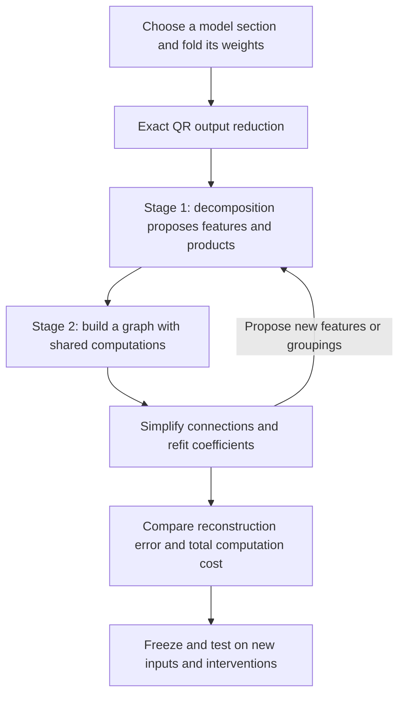
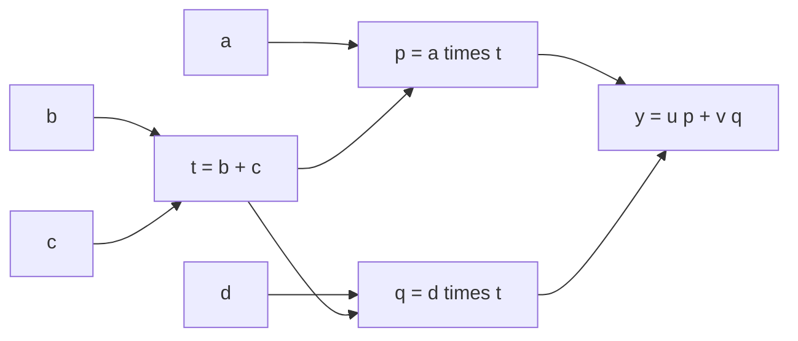

**Overall review: folded weights → tensor decomposition → shared arithmetic circuits**

Rewritten 21 September 2026, 17:01 UTC. Covers completed results through 16:57 UTC. The original filename is retained so existing links still work.

**The two-stage plan you remember is still the research direction.** First, fit a tensor decomposition to the joint computation of a section of the model. Second, turn its features into an arithmetic graph, then simplify and refit that graph while allowing computations to be shared. QR is an exact output-coordinate reduction that makes the fitting cheaper.

We have implemented the exact folding and output reduction, several decomposition families, and restricted shared-graph searches. We have **not completed a general Tucker/HT-to-arbitrary-graph optimizer**. The experiments have produced two distinct results:

- A **small shared graph spanning selected computations in two MLPs** saves 15.7% of the measured source arithmetic. It passes local reconstruction checks but still has transfer failures.
- A **new baseline for the entire last MLP’s polynomial** removes 20% of its products. With an affine correction, it saves 11.7% of the counted coefficients and reproduces the layer’s logit effect with 4.44% error on new FineWeb documents and 2.12% on new code files. It is a compression baseline, not an identified semantic circuit.

Neither result establishes that we have found the simple, reusable, selectively manipulable circuits we ultimately want.

**The plan, from beginning to end**

| Term | Meaning here |
|---|---|
| Folding | Substitute or contract consecutive computations to study their combined function. |
| Tensor | The polynomial’s array of coefficients, which we can manipulate implicitly without storing the full array. |
| Feature | A scalar intermediate computation, such as a linear projection or a sum of products. It need not have one human-readable meaning. |
| Rank or width | The number of intermediate directions allowed in a decomposition. |
| Arithmetic circuit / DAG | An acyclic graph of linear combinations and products, with the same intermediate value available to multiple consumers. |
| Baseline | A competing representation against which we compare accuracy and cost. |

**What we fold, and what QR does**

For one bilinear MLP, the polynomial contribution projected through the unembedding is

$$
F(x)=UD\big[(Lx)\odot(Rx)\big].
$$

Here $x\in\mathbb R^{1152}$; $L,R\in\mathbb R^{4608\times1152}$ form two sets of linear projections; $\odot$ multiplies them channel by channel; $D\in\mathbb R^{1152\times4608}$ writes back to the residual stream; and $U\in\mathbb R^{50304\times1152}$ maps to vocabulary coordinates.

We can also fold earlier output projections into the input: if $x=Ez$, replace $L,R$ with $LE,RE$. This remains quadratic in the intermediate coordinates $z$. Substituting the computations that produced those coordinates can increase the degree.

Your suggested QR reduction factors $UD$. Our implementation can instead factor $U$ first:

$$
U=Q R_U,\qquad Q^\top Q=I,\qquad C=R_U D.
$$

Then

$$
\widetilde F(x)=C\big[(Lx)\odot(Rx)\big],
\qquad F(x)=Q\widetilde F(x).
$$

This reduces the fitted output from 50,304 vocabulary coordinates to 1,152 coordinates, without changing Euclidean reconstruction error:

$$
\left\|F(x)-Q\widehat{\widetilde F}(x)\right\|_2
=\left\|\widetilde F(x)-\widehat{\widetilde F}(x)\right\|_2.
$$

QR does not remove products or identify features. It removes redundant output coordinates. The equality applies to this polynomial contribution; final RMSNorm and logit softcapping still need to be evaluated explicitly in behavioral tests.

The **joint third-order tensor** is

$$
T_{vij}=\frac12\sum_k C_{vk}
\left(L_{ki}R_{kj}+L_{kj}R_{ki}\right),
\qquad
\widetilde F_v(x)=\sum_{i,j}T_{vij}x_i x_j.
$$

“Third order” means three indices: output $v$, input $i$, input $j$. The function is degree two. We fit this joint object because cancellations and shared effects can emerge only after the factors are combined.

Two pure bilinear layers give degree four and an order-five coefficient tensor. Residual paths and biases introduce lower-degree terms. Normalization and softcapping are explicit operations outside this polynomial description.

**Stage 1: discover candidate computations**

A shared-input Tucker model has the form

$$
s=P^\top x,\qquad
h_g=\sum_{p,q}G_{gpq}s_p s_q,\qquad
\widehat{\widetilde F}=Wh.
$$

The columns of $P$ are learned input directions. The core entry $G_{gpq}$ says how much product $s_p s_q$ contributes to feature $h_g$. Column $W_{:,g}$ is that feature’s output effect.

We can make this representation narrow, sparse, or both. These choices express different hypotheses: few directions, few interactions, or both. A dense low-rank quadratic form can also be cheap to compute, so counting nonzero core entries alone is insufficient.

**Hierarchical Tucker (HT)** organizes a larger tensor as a tree of smaller bilinear computations. For a quartic function, it can form quadratic features and then multiply those features. Its tree groups tensor slots: every leaf can still inspect the full input vector. Our broader proposal allows those intermediate computations to be shared across branches, producing a DAG rather than requiring a fixed tree.

**Stage 2: simplify the program, including reuse**

For example, a decomposition might propose

$$
y=u(ab+ac)+v(db+dc).
$$

A graph rewrite exposes the shared sum:

$$
t=b+c,\qquad p=at,\qquad q=dt,\qquad y=up+vq.
$$

There are now two distinct products instead of four. The same principle can share quadratic intermediates inside deeper computations. Each shared computation is charged once, but its linear projections, additions, and stored coefficients also count.

The intended search alternates discrete edits—merge, split, introduce, remove, or regroup computations—with continuous coefficient fitting. **We have tested restricted versions of this procedure, not a general search over arbitrary arithmetic graphs.**

**What happened after adopting this direction**

**1. Broad fits were too inaccurate, so we narrowed the target to understand why.** Early simplification of a selected two-MLP contribution reduced 1,024 products to 512, but logit-effect error remained about 26% on FineWeb and 21% on code. Storage barely decreased. Fewer products alone did not make it a good replacement.

Much of the subsequent work therefore targeted six quadratic measurements from MLP16 feeding three selected components in MLP17. A measurement, or *read*, is simply $q_j(z)=z^\top Q_jz$. This was a diagnostic subproblem, not the full folded tensor.

**2. Shared graphs helped this local problem, but the strongest affordable version still has transfer failures.** Learning directions, allowing pairwise sharing, compiling products, and adding correction terms produced the 15.7% arithmetic saving. More aggressive versions near 20% saving failed reconstruction requirements.

The successful local fit has 7.63% covariance-shaped coefficient error but 57.74% coefficient error in the original coordinates. On new panels, it passes absolute effect-error limits but retains failures against similarly priced baselines. Subsequent refits improved fitting losses without reliably improving transfer. A numerical scaling bug was repaired; longer contexts alone did not explain the failures.

The lesson is that both the chosen metric and the supplied residual context matter. An accurate local approximation can still misrepresent the composed computation. [Local result](research_update_2026-09-21_1451_local_graph_fidelity_pass.md) · [Transfer diagnostics](../../direct_tensor_match/INTERCHANGE_TRANSFER_INTERPRETATION_V1.md).

**3. We returned to the full tensor and obtained an optimizer-independent explanation for some low-rank failures.** Exact unfolding spectra give necessary rank bounds. For 10% relative coefficient error in folded Euclidean coordinates, the full last-MLP target requires input rank at least **1,089** and output rank at least **1,088**, out of 1,152 available directions.

With activation-covariance weighting, the corresponding necessary ranks are **416 input** and **818 output**. These are separate lower bounds, not a guarantee that those two ranks jointly achieve 10% error.

Thus, some narrow Tucker fits fail because their allowed subspaces are too small, regardless of optimizer. This does **not** rule out a broad but sparse arithmetic circuit, alternative HT groupings, or a different functional metric. [Full-tensor bounds](../../direct_tensor_match/FULL_TENSOR_MODE_INTERPRETATION_V1.md).

**4. A simpler full-layer baseline now works reasonably well on natural inputs.** We retained 3,686 of the native 4,608 products, refit their output weights using the covariance-shaped objective, and optionally added an affine correction that matches the teacher’s value and gradient at the calibration mean. This is pruning and refitting an existing program; it is not new feature discovery.

The frozen programs were tested on 32 new FineWeb documents and 16 new code files:

| Full last-MLP replacement | Product reduction | Stored coefficient saving | FineWeb effect error | Code effect error |
|---|---:|---:|---:|---:|
| Retained products + refitted output weights | 20.0% | 20.0% | 5.29% | 3.57% |
| Same products + affine correction | 20.0% | 11.7% | 4.44% | 2.12% |

Here **effect error** is the norm of the replacement-induced logit discrepancy divided by the norm of the original MLP’s logit contribution, measured through the actual downstream normalization and softcap. It is not a language-model error rate. Savings concern the counted polynomial representation, not whole-model runtime.

The corrected program slightly worsens average cross-entropy: +0.00426 nats/token on FineWeb and +0.00144 on code. Its worst FineWeb document has 21.82% effect error, so the aggregate result is not uniform accuracy. The replacement requires the original model’s normalized last-MLP input; it is not a standalone token-to-output model. [Frozen export and fresh results](../../direct_tensor_match/FULL_CHANNEL_FRESH_INTERPRETATION_V1.md).

**5. Good output reconstruction does not establish preservation of internal computations.** When we perturb corresponding retained native product channels, the refitted program has 15.94% aggregate discrepancy in their output responses. Dropped channels make a map that assigns them no replacement intervention particularly inaccurate.

Partially anchoring the output weights to their original values improves these intervention responses while worsening natural-input reconstruction. This reveals an objective tradeoff, not a universal impossibility: a circuit may legitimately use different internal variables from the original neurons. We still need to identify and test that correspondence. [Intervention audit](../../direct_tensor_match/FULL_CHANNEL_INTERVENTION_INTERPRETATION_V1.md).

**Did the paper-inspired weight matching help?**

Yes: direct joint-tensor fitting, implicit contractions, and exact coefficient solves made the experiments practical and exposed which restrictions were limiting. We tested both weight-only and activation-informed geometries. But lower fitting error has not consistently produced better behavior or clearer internal features.

There are three distinct causes of failure:

| Cause | What would establish it? | What we found |
|---|---|---|
| Insufficient representation | A bound showing the chosen ranks or span cannot fit the target. | Established for some narrow full-tensor and frozen local layouts. |
| Optimization failure | The same representation succeeds with a better solver, initialization, or parameterization. | Seen in controlled toys; a stalled numerical fit was also repaired. |
| Objective mismatch | Better tensor or training-state fit worsens the desired evaluation. | Seen in native transfer and in the reconstruction/intervention tradeoff. |

Adam and Muon have both recovered planted examples under favorable parameterizations; we have no universal optimizer winner. Toy recovery also does not imply that the trained model has the assumed structure.

The covariance distinction matters. A weighted coefficient norm changes which directions matter. Exact expected squared error for a quadratic function generally depends on **fourth-order input moments**. Input covariance alone specifies that functional loss only with additional distributional assumptions. We should not call all of these objectives the same error measure.

**What “full coverage” and “shared baselines” meant**

The old title was misleading without its scope. **Full coverage** meant accounting for all error in a *selected target*, including what lay outside the fitted subspace. It did not mean the whole network had been decomposed. The newer full-layer result above really does target the entire last MLP polynomial, but still not the entire model.

**Shared baselines** means competitors are also allowed to reuse computations. Otherwise, we could appear to win just by comparing our shared graph against an unnecessarily duplicated implementation. Compare both total arithmetic and stored coefficients at a stated error, not just product counts.

**Where this leaves the two-stage plan**

| Part of the original plan | Current status |
|---|---|
| Exact folding and QR output reduction | Implemented. |
| Joint tensor fitting with and without activation information | Implemented, with distinct metrics recorded. |
| Decomposition proposals and restricted graph simplification | Tested on toys and local native targets. |
| General HT initialization followed by arbitrary graph search | Incomplete. |
| Useful full-layer compression baseline | Available, with new-document evaluation and explicit limits. |
| Identified, reusable circuits with selective causal effects | Not established by this decomposition work. |

The useful next comparison is whether learned decompositions and graph edits can outperform the new full-layer baseline while yielding intermediate computations whose roles survive behavioral and intervention tests. That is the remaining purpose of the two stages: discover useful computations, then reorganize and share them into a simpler program.
