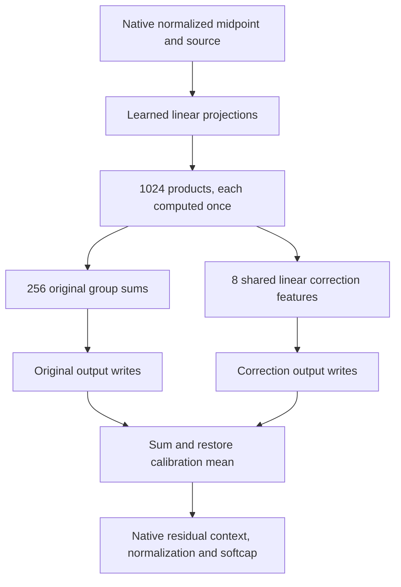

# Frozen graph confirmation — 2026-09-21 01:21 UTC

The 1,024-product program with eight shared linear correction features passed its registered confirmation checks on new documents. This strengthens the evidence for a compact approximation of the full selected folded contribution. It does not establish uniquely identified or semantic circuits.

## What was frozen and tested

The program reuses each learned product in its original output group and in eight additional linear combinations. Input factors, output writers and calibration means were frozen by file hashes before evaluation. No refitting used the new panel.

There are 32 new FineWeb documents from the cached skip11000 region, plus 16 previously unused top-level Python files from this repository. The archive-file pool was exhausted, so construction initially failed before model evaluation. The source pool changed to top-level files before any new-panel outputs were observed. Prior source paths and exact token-prefix overlaps were excluded. The new code panel is related local code, not broad external OOD; pretraining overlap is unknown.

The reference is the entire varying previous-MLP-source-dependent contribution inside the final bilinear layer. Its calibration mean and upstream native source states remain explicit. Final residual context, RMS normalization and softcapping are evaluated natively.

| New-panel native metric | Original grouped program | Graph with eight shared corrections |
|---|---:|---:|
| FineWeb replacement CE added, nats/token | 0.01015 | 0.01007 |
| Code replacement CE added, nats/token | 0.03740 | 0.02526 |
| FineWeb full removal-effect error | 22.98% | 22.29% |
| Code full removal-effect error | 16.11% | 15.53% |
| FineWeb full same-token swap-effect error | 28.40% | 28.17% |
| Code full same-token swap-effect error | 26.19% | 26.10% |

All registered checks passed: frozen artifacts/instrument checks; full intervention errors below30% and replacement CE increases below0.05 on both domains; at least10% code CE improvement over the original grouped program. The observed code CE increase is approximately32.5% lower. This remains nonzero damage relative to the native model.

Earlier reused-panel FineWeb swap error was30.76%, above the same30% threshold. The fresh result does not erase that failure. It shows that performance varies across panels and confirms the direction of the correction's gain; it does not establish a universal bound.

## The graph and its cost

Let $p\in\mathbb R^{1024}$ contain products of learned linear input features. Let $H$ group each consecutive four products into one of256 original features. The corrected output is

$$
\hat y=(p-\mu_p)^\top H W^\top
      +(p-\mu_p)^\top A_8 B_8^\top+\mu_y.
$$

The same products feed both branches. The correction introduces eight reusable linear features, not eight new products. The program has2,671,616 weight coefficients, plus explicit means, and1,024 distinct products. This excludes upstream source generation and normalization. Exact structured-versus-flat replay was checked separately. Arithmetic savings are not measured whole-model runtime savings.

## Sparsity follow-up and next priority

A successor CPU analysis pruned the product inputs of each correction feature, then refitted a small8-by8 mixing matrix on original calibration data. Keeping128 product inputs per feature gave18.44% error relative to the correction alone;512 gave4.44%. These are not full-model errors or held-out results. Even aggressive pruning saves less than1% of total weights because these corrections are already small.

The more consequential next simplification is sharing the large input projections across the1,024 products. That targets most of the program's storage and arithmetic, rather than optimizing the already-small correction. It must preserve full-function fidelity and native interventions. General discrete graph search, stable feature identity, semantic interpretation and composition across replacements remain unfinished.

Evidence: `MIDPOINT_GRAPH_CONFIRMATION_V1.json`, its frozen panel manifest and program hashes, and `MIDPOINT_SPARSE_CORRECTION_V1.json` in `direct_tensor_match`. The goal remains active.
