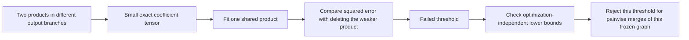

# Testing a concrete arithmetic-graph edit: merge products across output branches

21 September 2026, 03:13 UTC.

We implemented a small piece of the proposed second stage: replace two products from different output branches with one shared product. The registered screen failed, and a subsequent lower-bound calculation shows that more optimization cannot rescue its particular threshold on the frozen graph. This narrows which graph edits are worth pursuing; it does not rule out arithmetic-circuit simplification.

## What was being edited?

The current 512-product graph contains terms of the form

$$
y_k=w_k(a_k^\top n_c)(b_k^\top m_c),
$$

where $n_c=n-\bar n$ and $m_c=m-\bar m$ are centered input roles, $a_k,b_k$ are scalar-feature readers, and $w_k$ is a vector of output effects. Its constant and linear branches remain fixed.

For two terms from different output directions, we proposed

$$
w_1(a_1^\top n_c)(b_1^\top m_c)
+w_2(a_2^\top n_c)(b_2^\top m_c)
\approx w(a^\top n_c)(b^\top m_c).
$$

This saves one variable product and allows the remaining product to write into both original output directions. When the input products are identical, the rewrite is exact with $w=w_1+w_2$. With unrelated products, sharing may cost too much error.

The loss is a coefficient norm weighted by independent centered calibration covariances for the two input roles and vocabulary-centered output geometry. It is not native logit-intervention error. The teacher in this test is the frozen approximation, not the original full model.

## Result and redteam check

We tested the 2,048 cross-output pairs with greatest absolute input-product cosine. Each fit used eight starts and 40 alternating updates. The registered target was at least 16 disjoint pairs whose **squared reconstruction error** was at most half the squared error of deleting the weaker original term.

| Check | Result |
|---|---|
| Planted identical input products with distinct output directions | Exact shared-product recovery, zero error |
| Planted products orthogonal in all three modes | Best approximation matches deleting the weaker term |
| Selected trained-graph merges meeting the registered threshold | **0; prediction failed** |
| Best fitted squared-error/deletion ratio | 0.53743 |
| All cross-output pairs examined by subsequent lower bounds | 130,247 |
| Best lower-bound/deletion ratio over all those pairs | 0.51631 |
| Pairs whose lower bound permits the 0.5 threshold | **0** |

No edited graph was adopted. A zero combined-edit error in the screen artifact means that **no edits were selected**, not that an exact compressed graph was found.

## Why this is more informative than an optimizer failure

A pair of three-factor products lies in at most a $2\times2\times2$ coefficient space. We construct that small tensor exactly from factor Gram matrices. A single shared product has rank one in every matrix unfolding. Consequently,

$$
\min_{\operatorname{CP\ rank}(\widehat T)=1}
\|T-\widehat T\|_F^2
\geq
\max_{s=1,2,3}\sigma_2(T_{(s)})^2,
$$

where $T_{(s)}$ is the matrix obtained by putting mode $s$ on one side and the other two modes on the other side. Only two singular values can be nonzero for this pair tensor. The inequality follows by relaxing the tensor rank-one requirement to matrix rank one separately in each unfolding. CP rank-one and unfolding conventions follow [Kolda and Bader](https://www.kolda.net/publication/TensorReview.pdf); the pairwise bound here is our direct application of matrix low-rank approximation.

We evaluated the bounds for every eligible pair, including those omitted by the initial cosine selection. A direct SVD check on 128 tiny tensors agreed with the Gram formula to $1.84\times10^{-16}$ relative to the largest checked energy. Increasing optimization to 32 starts and 100 updates on the 16 most promising lower-bound pairs did not change the best achieved result.

Thus a different initialization cannot bring any of these pair merges below the registered 0.5 threshold in this metric. The bound is numerically well separated from that threshold. It is not a certificate about arbitrary changes to multiple products, refitting the remaining graph, different metrics, or polynomial identities involving repeated input slots.

The useful next edit must change more than this pair-to-one restriction—for example, jointly refactor several output branches while allowing the other coefficients to adapt. The current null should prevent spending a large optimizer sweep on the same restricted problem.

## Fresh-confirmation uncertainty update

Separately, the completed frozen private512-versus-original1024 comparison now has a 10,000-draw paired document bootstrap. Whole-contribution swap-error intervals for the newer graph are **25.26–26.92% on FineWeb** and **20.79–21.90% on code**. All eight intervention-error ratio intervals lie below one. The code replacement-loss difference interval crosses zero, so its small point-estimate improvement is uncertain.

Context-only error remains high: intervals are **49.09–55.45%** and **36.85–40.27%**. These are descriptive intervals on this panel and fixed donor mapping; donor reuse couples documents, and the bootstrap does not model that dependence. They do not establish broad OOD validity, feature identity, or selective semantic interventions.

## Reproduction

All new calculations used CPU float64 with two Torch threads; no new model forward pass was needed. The frozen inputs and calibration rows are unchanged. The two full ambient input modes are never materialized as a joint tensor.

- `direct_tensor_match/shared_product_merge.py`: reusable local three-mode rank-one fit and planted controls.
- `direct_tensor_match/screen_shared_product_merge.py`: predeclared screen and cross-edit contraction accounting.
- `direct_tensor_match/audit_shared_product_merge_bound.py`: all-pairs lower bounds and stronger optimization audit.
- [Screen result](../../direct_tensor_match/MIDPOINT_SHARED_PRODUCT_MERGE_SCREEN_V1.json).
- [All-pairs bound result](../../direct_tensor_match/MIDPOINT_SHARED_PRODUCT_MERGE_BOUND_V1.json).
- [Frozen comparison bootstrap](../../direct_tensor_match/MIDPOINT_PRIVATE_BOOTSTRAP_V1.json).

The overall circuit objective remains open: a compact graph still needs extraction, selective manipulation, reuse and stable identification under meaningful task controls.
