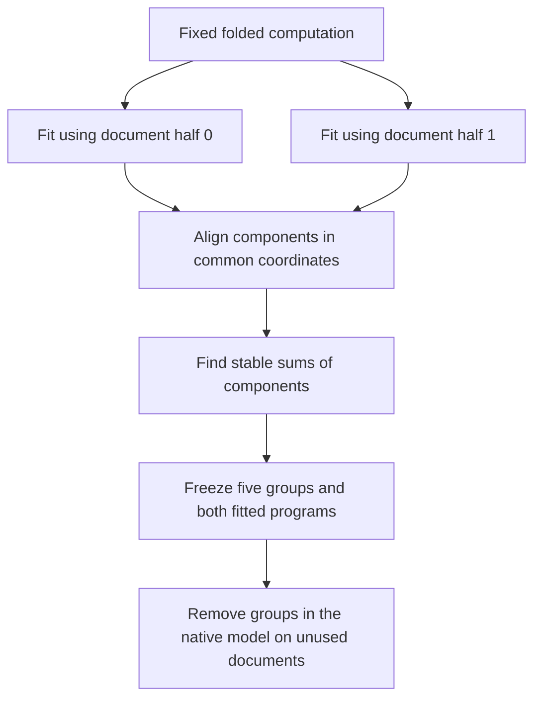

# Stable groups can be better intervention units than individual products

21 September 2026, 03:32 UTC.

**We found a pair of learned products whose sum is substantially more stable than either product, and that advantage survived removal tests inside the model on unused documents.** This is progress toward choosing reliable computational units. It is not yet a semantic circuit: we have not established what information the group represents or which intended behavior it selectively controls.

The complete five-group test failed its registered threshold because one individual group exceeded 10% disagreement. The passing groups and the failure are retained below.

## What was held fixed, and what changed?

We kept the same local folded computation and six-product architecture from the joint-refactor experiment. We changed only the fitting metric: covariance from all 32 calibration documents, covariance from the first 16, covariance from the other 16, or isotropic inputs. The output metric remained vocabulary-centered in every case.

Each fit received eight initializations and 12,000 ALS sweeps. Comparing components requires a common coordinate system: independently whitened coordinates are not directly comparable. We mapped all fitted factors back before comparing them.

The full original candidate and neighborhood selection had used all calibration documents. Therefore, these split fits are **conditional sensitivity tests**, not independent discoveries from two untouched corpora.

## Functions transferred better than individual components

The two document-half fits increased reconstruction error on the opposite half by only **1.28% and 1.17%** relative to that half's own fit. Their whole-function difference was approximately 1.03% of the local target norm in the common full-calibration metric.

Individual components were less consistent. Minimum matched tensor cosine was **0.896**, failing the registered 0.95 requirement. An additional 2,000 ALS sweeps changed each winning solution by less than $10^{-6}$ in minimum matched component cosine. Unlike the earlier finite-step disagreement, this discrepancy persisted after the convergence check.

The isotropic fit differed more from the covariance-weighted fit: minimum component cosine was 0.221 in the common covariance geometry. It had approximately 14% higher reconstruction error in that geometry. Different objectives can select different approximations; this is not evidence that either objective was implemented incorrectly.

## Grouping exposed a more stable computation

We then explored all subsets and partitions of the six matched products. The exploratory criterion was at most 10% relative function change in both common covariance and isotropic input geometries. We used the smaller group norm across the two fits as the denominator, so a larger-amplitude fit could not hide disagreement.

The finest qualifying partition had five groups: four individual products and one sum of two products.

For the paired components, the individual function changes were **83.3% and 72.4%**, while their sum changed by **6.45%** in the covariance geometry. The coefficient changes in the two components had cosine **−0.9956**: they largely offset each other. This is redistribution between components, not disappearance of the combined computation.

This grouping was discovered using the two splits. Its native test was registered only after grouping and freezing; the results below use new documents.

## Frozen native removal test

We evaluated 16 unused FineWeb documents, at positions 16–255 in 256-token contexts. Each group's residual write was removed from the original model's final residual state. Final RMSNorm and softcapping were evaluated normally. The two fitted programs were frozen and hash-checked before evaluation.

The measurement compares **the removal effect produced by one fitted definition with the removal effect produced by the other**. It is not error against a uniquely defined native “ground-truth group.” Effects are vocabulary-centered logit changes. The denominator is the smaller aggregate effect norm, and the registered threshold was 10% disagreement for every group.

| Frozen unit | Relative removal-effect disagreement | Descriptive 95% document-bootstrap interval |
|---|---:|---:|
| Individual group 0 | **11.06% — fails** | 9.68–12.62% |
| Paired group 1 | 6.34% | 5.70–7.14% |
| Individual group 2 | 1.47% | 1.42–1.54% |
| Individual group 3 | 1.53% | 1.49–1.57% |
| Individual group 4 | 6.12% | 5.60–6.69% |
| First member of the pair, alone | 103.12% | 88.14–120.94% |
| Second member of the pair, alone | 109.11% | 96.83–122.04% |

The instrument and paired-versus-individual control checks passed; the all-five-groups check failed. Intervals use 10,000 paired document draws and are descriptive, not simultaneous guarantees. This is one FineWeb panel, not broad OOD validation.

Group 0 mostly differs in effect strength: its aggregate effect cosine is 0.99864, but one fit's effect norm is 9.62% larger. Strength mismatch accounts for 75.6% of its squared discrepancy. This diagnosis does not rescale the program or turn its registered failure into a pass.

## What this contributes to circuit discovery

The result supports testing **sums of related computations as intervention units**, instead of assuming each product deserves its own circuit identity. It also shows why coefficient similarity and native intervention consistency should be measured separately.

The next substantive requirement is a computational and behavioral interpretation of the robust groups, followed by selective controls. The paired group may combine several conditions producing a shared output effect; stability alone does not make it one concept. The strongest individual groups also need those checks. No semantic labels or whole-model adoption are justified yet.

## Evidence and reproducibility

- [Metric/split fit results](../../direct_tensor_match/MIDPOINT_JOINT_METRIC_STABILITY_V1.json).
- [Convergence guard and exhaustive grouping](../../direct_tensor_match/MIDPOINT_METRIC_STABLE_GROUPS_V1.json).
- [Offsetting coefficient changes in the pair](../../direct_tensor_match/MIDPOINT_STABLE_PAIR_CHANGE_CANCELLATION_V1.json).
- [Frozen group and document plan](../../direct_tensor_match/MIDPOINT_STABLE_GROUP_REMOVAL_PLAN_V1.json).
- [Native removal results](../../direct_tensor_match/MIDPOINT_STABLE_GROUP_REMOVAL_NATIVE_V1.json).
- [Uncertainty and strength/direction audit](../../direct_tensor_match/MIDPOINT_STABLE_GROUP_REMOVAL_AUDIT_V1.json).

CPU fitting used float64 and two Torch threads. The native managed job used 16 model captures and finished successfully in approximately 2.9 seconds; residual/readout replay error was $3.46\times10^{-15}$. Native input capture and residual injection follow the earlier midpoint experiments. The constant input-centering offsets were frozen from the original calibration; removing a product does not imply its mean output is zero.

New documents are `fineweb_n192_skip11000.pt` indices 96–111, excluded from previous confirmation prefixes in this decomposition study. Pretraining overlap is unknown. Code entry points are `screen_joint_metric_stability.py`, `audit_metric_stable_groups.py`, `freeze_stable_group_removal.py`, and managed runner `run_direct_stable_group_removal_v1.py`.
