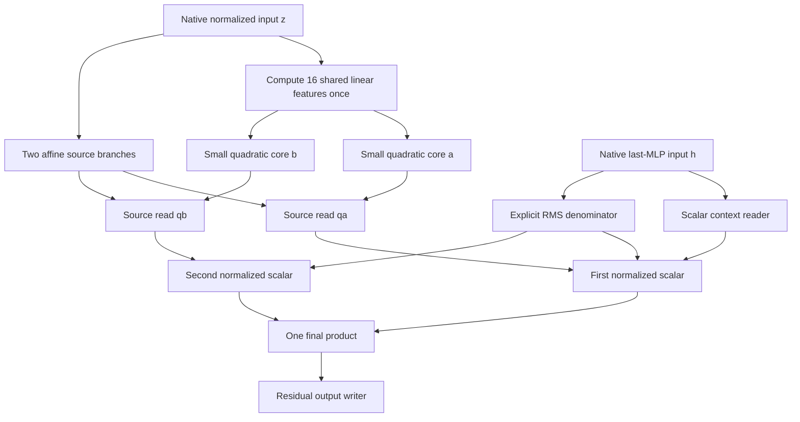

# Two quadratic readers now share an input dictionary

21 September 2026,04:31 UTC.

**We now have a concrete instance of the proposed second stage: two upstream computations reuse the same learned intermediate features.** The shared program stores23,588 scalars instead of41,508, a43.2% reduction, and passes the initial frozen source-interchange comparison. **A subsequent balanced-donor test fails the relative-fidelity tolerance on code spaced-word sites, so robustness is not established.** It retains32 source squares and one final product; this is primarily a reduction in stored coefficients and repeated dense input projections.

This builds on the continuation-related feature, not a full-model replacement. The program still takes native intermediate inputs. Its individual shared directions have not been assigned semantic meanings.

## First, test whether the quadratic readers survive recombination

The earlier source approximation matched ordinary native states fairly well, but a constant-plus-linear control was competitive. That left open whether the quadratic terms were doing useful computational work.

We paired positions with the same current token in different documents. Write the recipient's last-MLP input as

$$
h=r+m,
$$

where $m$ is the preceding MLP's scaled polynomial contribution and $r=h-m$ is the remaining recipient background. A donor supplies $m'$, giving

$$
h'=r+m'.
$$

We recompute the last MLP and its RMS denominator at $h'$. The preceding attention result remains fixed inside $r$: this is a specified recipient input-port intervention, not a full upstream edit propagated through attention.

The reference is removal of the exact native leading continuation feature in this hybrid state. We also compare **the change in its removal effect** between ordinary and hybrid states. This second quantity asks whether the small program predicts how the feature responds when source and context are recombined. It is not a claim that this feature explains the entire source-swap effect.

On the first reused panel, the covariance rank16 source approximation passed both registered tests: at most15% hybrid removal-effect error and20% change-in-removal error, in all, continuation and spaced-word cohorts in both domains. The simpler linear control did not pass the latter bar on FineWeb overall:

| Source-reader program | FineWeb change-in-removal error | Code change-in-removal error |
|---|---:|---:|
| Constant + linear | 35.56% | 18.38% |
| Isotropic rank16 | 28.72% | 7.03% |
| Covariance rank16 | **12.27%** | **8.16%** |

Lower is better. These are relative errors in vocabulary-centered logit effects. Quadratic structure helps under source/context recombination, although covariance fitting is not uniformly best in every subgroup.

## The new graph edit: share the input features

Previously, each of the two quadratic readers had its own16 input directions. We jointly approximate them using one shared input dictionary:

$$
t=P^\top z,\qquad
q_a(z)=c_a+\ell_a^\top z+t^\top G_a t,\qquad
q_b(z)=c_b+\ell_b^\top z+t^\top G_b t.
$$

Here $z$ is the normalized input to the preceding MLP, $t\in\mathbb R^{16}$ contains the shared scalar features, and $G_a,G_b$ are two small symmetric cores. Each core is evaluated through its eigen-directions as16 weighted squares. The same $t$ is computed once and used by both readers.

The resulting continuation feature is

$$
\phi=
\left(\frac{a^\top h-\tfrac12 q_a(z)}{s(h)}-\alpha\right)
\left(\frac{q_b(z)}{s(h)}-\beta\right),
\qquad y=w\phi.
$$

All centering constants are absorbed into the stored linear terms and biases. The writer $w$ is already in residual coordinates, so execution does not store the full QR map.

This is a Tucker-style shared input subspace inside a larger arithmetic graph. It uses small dense cores, not entry sparsity. Our cost counts both the shared input projection and the two small inner transforms. The distinction between low rank and entry sparsity is therefore operational: a dense core can still be evaluated cheaply through a few squares.

The subspace was obtained from the combined covariance-weighted quadratic matrices. This follows the shared-mode projection idea behind HOSVD; it does not claim a globally optimal arithmetic circuit or uniquely meaningful basis. [Kolda and Bader's tensor review](https://www.kolda.net/publication/TensorReview.pdf).

## Frozen comparison on unused FineWeb documents

We fixed the shared16 candidate using calibration data before constructing the final16 unused FineWeb rows in the current cache. The code panel was reused. The required bar was at most10% relative worsening versus the unshared covariance16 program, **and** the same absolute15% hybrid/20% change limits, for every cohort and domain.

All registered point-estimate checks pass:

| Native effect error | Unshared:41,508 scalars | Shared:23,588 scalars |
|---|---:|---:|
| FineWeb hybrid removal, all sites | 8.76% | **8.39%** |
| FineWeb change in removal, all sites | 11.29% | **10.99%** |
| FineWeb change, continuation sites | 11.51% | **11.09%** |
| FineWeb change, spaced-word sites | 15.58% | **15.42%** |
| Code hybrid removal, all sites | 5.25% | **4.62%** |
| Code change in removal, all sites | 8.16% | **8.07%** |
| Code change, spaced-word sites | **6.67%** | 7.18% |

A shared8 control is smaller but has24.80% FineWeb change error, missing the absolute20% bar. A shared32 control reproduces the unshared results exactly, checking the graph conversion and executor.

The paired recipient-document bootstrap supports the FineWeb comparisons, but not a firm population guarantee for every tolerance. In particular, the code spaced-word change-error ratio has95% interval **1.042–1.105**, crossing the1.10 comparison bar. Donors were fixed and sometimes reused; these intervals do not include donor-selection uncertainty.

## What this establishes—and what it leaves open

This is an executable, priced example of internal feature reuse that survives a controlled input recombination test. The [exported package](../../direct_tensor_match/circuits/continuation_source_shared16/README.md) contains the compact parameters and points to a standalone executor. Once native $z,h$ are supplied, no original model weights or calibration cache are needed.

It does not remove the native producers of $z,h$, establish independent-task reuse, or identify semantic meanings for the16 shared directions. The exact leading feature itself approximates only one part of the original projected operator. The earlier ordinary-state continuation CE tolerance failure remains unresolved; passing this intervention comparison does not erase it.

## Evidence and reproducibility

- [First source-interchange results](../../direct_tensor_match/MIDPOINT_SOURCE_INTERCHANGE_V1.json) and [conditional bootstrap](../../direct_tensor_match/MIDPOINT_SOURCE_INTERCHANGE_AUDIT_V1.json).
- [Shared-dictionary calibration screen and prices](../../direct_tensor_match/MIDPOINT_SOURCE_SHARED_DICTIONARY_V1.json).
- [Frozen fresh-panel plan](../../direct_tensor_match/MIDPOINT_SHARED_SOURCE_PLAN_V1.json).
- [Shared-program native results](../../direct_tensor_match/MIDPOINT_SHARED_SOURCE_NATIVE_V1.json) and [bootstrap/replay controls](../../direct_tensor_match/MIDPOINT_SHARED_SOURCE_NATIVE_AUDIT_V1.json).
- [Compact package manifest](../../direct_tensor_match/circuits/continuation_source_shared16/manifest.json) and [executor](../../direct_tensor_match/source_interface.py).

The first run captured32 reused FineWeb documents144–175 and16 stdlib snippets. The second captured16 unused FineWeb documents176–191 and the same16 code snippets. Evaluation covers positions16–255 of256-token contexts, selecting same-token donors in a different document deterministically before outcomes. The two managed jobs completed successfully in about4seconds each. Exact final-state replay was zero; source-form replay was below $4\times10^{-7}$. No fitting used either run's outcomes. The full FineWeb skip11000 cache is now used; another fresh confirmation requires a different panel.

## Donor-family redteam changes the adoption verdict

The first deterministic pairing reused one code donor site for44.0% of swaps. A frozen follow-up instead chose the least-used eligible donor, breaking ties by sequence-position distance and index. This reduced the largest code donor-site share to0.285%. No programs, thresholds or recipient rows changed.

Shared16 still meets the absolute15% hybrid/20% change limits, but fails both relative10% preservation checks on code spaced-word sites: **7.16% versus6.42%** hybrid error, and **6.89% versus6.00%** change error. Ratios are1.115 and1.148. The conditional bootstrap change-ratio interval is1.071–1.229. The failure is retained; the package is a candidate, not adopted. Shared24 is within the tolerances on this opened panel, but choosing it now requires fresh confirmation.

[Balanced-donor results](../../direct_tensor_match/MIDPOINT_BALANCED_SOURCE_NATIVE_V1.json), [bootstrap](../../direct_tensor_match/MIDPOINT_BALANCED_SOURCE_NATIVE_AUDIT_V1.json), and [donor concentration audit](../../direct_tensor_match/MIDPOINT_SOURCE_DONOR_CONCENTRATION_V1.json).

The scheduled [three-hour math/literature review](../../THREE_HOURLY_MATHEMATICAL_REVIEW_2026-09-21_0435.md) also derives common-input subspace bounds and tests whether both quadratic cores can share exactly the same squares. A generalized-eigenvalue obstruction rules out that restricted diagonal rewrite for shared16; small mixed-product blocks remain a concrete next structural possibility.
