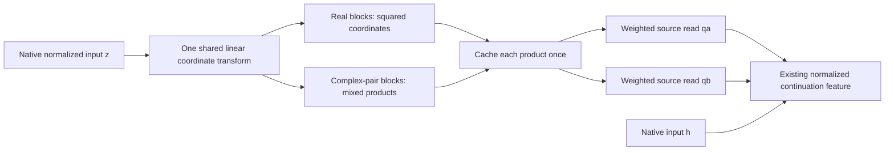

# Mixed products give an exact, smaller baseline for the original source reads

21 September 2026,04:51 UTC.

**Allowing mixed products, rather than only squares, has produced an exact numerical simplification of the original upstream source forms.** It computes the same two scalar reads with1,152 shared source products instead of4,608 native channel products. It also halves the product count relative to the stronger baseline of diagonalizing each quadratic form separately.

Native intervention replay passes. This simplifies a precise component of the continuation candidate; it does not remove its native input dependencies or establish a complete circuit.

## What function is preserved?

The preceding MLP produces a scaled polynomial contribution

$$
m_0=\lambda D[(Lz)\odot(Rz)],
$$

where $z\in\mathbb R^{1152}$ is its normalized input. The continuation feature needs two scalar reads:

$$
q_a(z)=a^\top m_0=z^\top Q_a z,
\qquad
q_b(z)=b^\top m_0=z^\top Q_b z.
$$

These $Q_a,Q_b$ are contracted directly from the original trained weights. **This experiment uses the full forms, not their low-rank approximations.** The readers $a,b$ were previously identified from a covariance-informed native output mode; that discovery history remains relevant.

The two reads feed the same downstream feature:

$$
\phi=
\left(\frac{a^\top h-\tfrac12 q_a(z)}{s(h)}-\alpha\right)
\left(\frac{q_b(z)}{s(h)}-\beta\right),
\qquad y=w\phi.
$$

The program takes native $z$ and last-MLP input $h$. It computes the RMS denominator $s(h)$ explicitly and outputs the residual-space write $y$. The upstream producers of $z,h$ remain outside the extracted interface.

## Why squares were too restrictive

The previous review found that the two small quadratic cores could not both be diagonalized using the same real change of basis. That obstructed **sharing the same set of squares**. It did not obstruct sharing more general products.

For a suitable two-dimensional block, the two forms have the structure

$$
q_a=A(u^2-v^2)+Buv,
\qquad
q_b=C(u^2-v^2)+Duv.
$$

Compute

$$
p_1=(u+v)(u-v),\qquad p_2=uv,
$$

once, then use them in both outputs. This needs two products for the block. Evaluating two separate quadratic eigendecompositions would generally use four squares.

The construction finds real one-dimensional blocks and real two-dimensional blocks associated with complex-conjugate generalized eigenvalues. It then folds the coordinate transformation into the input projection. The compiler checks reconstruction in the original coordinates and rejects unsafe or defective cases.

This exploits the fact that both input slots receive the same $z$. It is a quadratic-program representation; the product count should not be misreported as the ordinary CP rank of an unsymmetrized tensor acting on two independent inputs.

## Three exact baselines at the same interface

| Representation | Source products | Stored floating-point scalars | Stored integer indices |
|---|---:|---:|---:|
| Native channel products, with both output readers folded in | 4,608 | 10,628,354 | 0 |
| Two independent full spectral decompositions | 2,304 | 2,658,818 | 0 |
| Shared mixed-product blocks | **1,152** | **1,331,714** | 3,456 |

All three compute the same two original source reads and include the same downstream $h$ reader, residual writer and centering constants. The shared program has87.5% fewer floating-point coefficients than the native-channel representation and49.9% fewer than the independent spectral representation.

These are literal coefficient counts, not measured latency or byte savings. Verification uses float64 program coefficients; the original checkpoint and native model use different storage/execution precision. The common RMS computation adds1,152 variable squares, and the final feature adds one product, to every program. The table isolates **source products** and does not hide those shared costs inside a whole-model speed claim.

The original pair compiled into88 real one-dimensional blocks and532 two-dimensional blocks:88 + 2×532 =1,152 source products.

## Verification and retained numerical failures

Five planted cases exercise positive-definite forms, indefinite forms with real eigenvalues, a complex pair, repeated real eigenvalues, and an expected rejection of a defective pencil. All behaved as intended.

Two numerical issues were informative:

- For the smaller24-dimensional core, taking real parts of eigenvectors for a repeated eigenvalue produced duplicate directions. Recovering the real nullspace fixed the construction.
- For the full original forms, the raw pencil reconstruction had roughly $1.3\times10^{-9}$ relative error and **failed** the registered $10^{-10}$ bar. An exact signed-whitening coordinate change improved conditioning. The accepted reconstruction errors were $1.52\times10^{-11}$ and $1.67\times10^{-11}$, without changing the target or threshold.

The accepted original-source program replayed calibration scalar reads to $1.62\times10^{-12}$. On synthetic normalized inputs, the complete residual-write executor had about $2.03\times10^{-11}$ error in float64 and $1.34\times10^{-5}$ in float32. These precision results are distinct from a formal exact-arithmetic certificate.

A32-capture managed test used the existing balanced-donor panel. It compared native leading-feature removals at hybrid states and changes in removal effects. The largest relative logit-effect discrepancy was **$1.08\times10^{-5}$**, below the registered $10^{-4}$ bar. The largest mean CE disagreement was **$9.97\times10^{-8}$ nats**, below $10^{-6}$. No fitting occurred, and this is replay evidence on reused data, not fresh behavioral discovery.

## The small approximations also benefit, but their failures remain

Applying the same exact rewrite to the existing small programs gives:

| Approximate program | Before: source products | After: source products | After: floating-point scalars |
|---|---:|---:|---:|
| Shared16 | 32 | **16** | 23,076 |
| Shared24 | 32 | **24** | 32,308 |

Native summary errors and CE values replayed identically at the recorded precision. In particular, shared16 still fails the balanced-donor relative-fidelity checks on code spaced-word sites. Exact algebraic simplification does not repair approximation error or establish semantics.

The useful research consequence is a better baseline and a better search space: common squares can be unnecessarily restrictive, while small blocks of mixed products expose real reuse. The remaining questions concern how far this sharing extends across more readers, whether compact approximations preserve behavior across control families, and how to eliminate or simplify the remaining native inputs.

## Artifacts

- [Five-case compiler checks and small-program costs](../../direct_tensor_match/MIDPOINT_SOURCE_BLOCK_COMPILER_V1.json).
- [Small-program native replay](../../direct_tensor_match/MIDPOINT_BLOCK_SOURCE_REPLAY_V1.json).
- [Original-weight compiler result, including rejected attempt](../../direct_tensor_match/MIDPOINT_ORIGINAL_SOURCE_BLOCK_V1.json).
- [Independent exact baseline audit](../../direct_tensor_match/MIDPOINT_EXACT_SOURCE_BASELINES_V1.json).
- [Original-source native replay](../../direct_tensor_match/MIDPOINT_ORIGINAL_SOURCE_REPLAY_V1.json).
- [Original-source executable parameters](../../direct_tensor_match/MIDPOINT_ORIGINAL_SOURCE_BLOCK_V1.pt), [executor](../../direct_tensor_match/source_interface.py), and [block compiler](../../direct_tensor_match/quadratic_pair_blocks.py).

Both native runs used16 FineWeb documents176–191 and16 stdlib snippets already evaluated in the preceding study, with balanced same-token donors from different documents. Attention17 stayed fixed; recipient RMS and the last MLP were recomputed after source insertion. The reference is the native leading feature, not the entire original folded operator. The [previous mathematical review](../../THREE_HOURLY_MATHEMATICAL_REVIEW_2026-09-21_0435.md) records the primary-literature connection and the distinction between coefficient and functional metrics.
