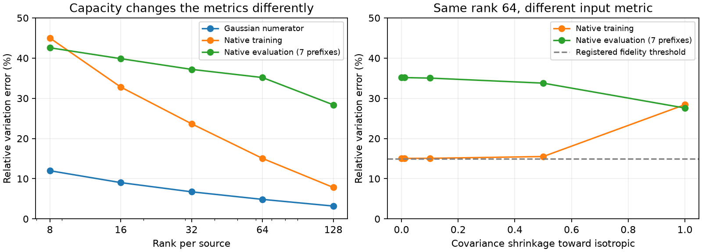

# A rank limit explains one failure; input geometry explains another concern

21 September 2026, 05:54 UTC.

**We can now rule out the requested Gaussian fitting improvement within the rank-16 family we tested.** A lower bound is 8.02% error, while the requested improvement required 7.22%. The optimized fit reaches 8.98%. This is a specific capacity limit, not a general failure of Tucker, HT or arithmetic circuits.

Increasing rank reduces Gaussian error substantially, but native evaluation improves much less. The training covariance also describes the evaluation inputs poorly. These are separate issues: a structure can be too small for its objective, and the objective's assumed input distribution can still be a poor guide to native behavior.

## What the new optimization tested

We used the same scalar component and source interface as the [previous report](research_update_2026-09-21_0534_functional_moments_and_overfitting.md):

$$
\phi(z,t,s)=
\frac{(t-\tfrac12q_a(z)-\alpha s)(q_b(z)-\beta s)}{s^2}.
$$

The two source reads $q_a,q_b$ are quadratic functions folded from trained weights. Their centered constant and linear terms remain exact; each approximate quadratic remainder has rank 16. Native $z,t,s$ remain required inputs.

This experiment optimized the numerator's **exact Gaussian expected squared error**, using the mean and covariance estimated from 24 training documents. The augmented constant coordinate equals one. Unlike the preceding empirical fit, it does not interpolate a finite collection of probe outputs. It also does not average division by a Gaussian-sampled RMS value.

Four Adam fits crossed learning rates 0.01/0.05 and spectral/1%-perturbed spectral initialization, with 400 steps each. The Gaussian objective alone selected the winner.

| Score | Initialization | Gaussian-selected fit |
|---|---:|---:|
| Gaussian numerator variation error | 9.03% | 8.98% |
| Native normalized error on seven opened, distinct evaluation prefixes | 39.87% | 40.02% |

All four fits reached essentially the same value. The registered Gaussian improvement and native fidelity predictions both **fail**. An independent dense-matrix audit reproduced the Gaussian score; the saved executable program reproduced the native score.

## A lower bound, rather than an inference from optimizer convergence

Write the two augmented quadratic factors in Gaussian coordinates as

$$
a+u^\top g+g^\top A g,
\qquad
b+v^\top g+g^\top B g,
\qquad g\sim\mathcal N(0,I).
$$

Here $u,v$ are fixed affine feature vectors. The student changes the quadratic matrices, with each restricted to rank at most $r$.

The cubic Hermite coefficient is

$$
H_3=\operatorname{Sym}(A\otimes v+B\otimes u).
$$

Hermite degrees are orthogonal under the Gaussian measure, so errors in other degrees cannot cancel cubic error. Let $P$ project perpendicular to both $u$ and $v$. Consider the cubic tensor sector with two input slots in that perpendicular space and one in the span of $u,v$. Its contribution to expected squared error is

$$
2\left[
\|v\|^2\|P\Delta A P\|_F^2
+\|u\|^2\|P\Delta B P\|_F^2
+2(u^\top v)\langle P\Delta A P,P\Delta B P\rangle_F
\right].
$$

This is a lower bound on the complete error. Completing the square bounds it using the best rank-$r$ approximation errors of $PAP$ and $PBP$, which come from their spectral tails.

For the current target:

| Source rank | Lower bound on Gaussian variation error |
|---|---:|
| 8 | 10.41% |
| 16 | **8.02%** |
| 32 | 6.04% |
| 64 | 4.35% |
| 128 | 2.87% |

The registered rank-16 target was $0.8\times9.03\%=7.22\%$, below the 8.02% lower bound. More optimizer restarts cannot achieve that target without changing this family or objective.

We independently checked the tensor-sector identity and a planted example where the bound is attained. The numerical bound applies to **fixed affine vectors, two rank-constrained quadratic factors, and this Gaussian numerator metric**. It is not a lower bound on arbitrary computation DAGs, native-function error, or semantic circuit complexity.

An earlier bound using only context directions independent of the source was valid but too weak: 0.65% at rank 16. The stronger bound above is what supports the capacity conclusion. Computed source coordinates were reorthogonalized with QR before that earlier projection calculation; the represented source matrices replayed to roughly $4\times10^{-15}$.

## More capacity does not automatically solve native fidelity

We next evaluated spectral approximations at several source ranks, without fitting to evaluation outputs:

| Rank per source | Source products | Stored scalars | Gaussian error | Native training error | Native evaluation error |
|---|---:|---:|---:|---:|---:|
| 8 | 16 | 23,060 | 11.99% | 44.99% | 42.58% |
| 16 | 32 | 41,508 | 9.03% | 32.80% | 39.87% |
| 32 | 64 | 78,404 | 6.73% | 23.66% | 37.20% |
| 64 | 128 | 152,196 | 4.86% | 15.05% | **35.17%** |
| 128 | 256 | 299,780 | 3.19% | 7.82% | **28.38%** |

The predeclared rank-64 native target of 15% fails. These are source-program costs, including the fixed downstream reader/writer and constants. They exclude native input production and the common RMS operation; they are not whole-model runtime estimates.

The inputs to the Gaussian objective are modeled from only 24 documents, or 1,536 positions, in 1,152 source dimensions. As an input-only diagnostic, we measured average squared Mahalanobis distance: the squared norm after centering and scaling by the training covariance.

Under that covariance, the evaluation-to-training ratio is **9.41**. Under a scaled identity matrix, it is **0.97**. Thus the overall input norms are similar, while their distribution across directions differs sharply from the fitted covariance geometry. This is evidence of a geometry mismatch; it does not by itself establish its cause or quantify how much larger calibration data would help.

## Does covariance shrinkage repair it?

At fixed rank 64, we replaced the metric covariance by

$$
\Sigma_\rho=(1-\rho)\Sigma+
\rho\,\frac{\operatorname{tr}(\Sigma)}{d}I,
$$

while keeping the training mean and exact centered affine branches fixed. The source product count and stored scalar count are unchanged.

| Shrinkage $\rho$ | Native training error | Native evaluation error |
|---|---:|---:|
| 0 | 15.05% | 35.17% |
| 0.01 | 15.05% | 35.16% |
| 0.1: registered primary | 15.07% | **35.04%** |
| 0.5 | 15.52% | 33.78% |
| 1: isotropic | 28.42% | **27.59%** |

The primary shrinkage prediction fails. The isotropic control transfers better on these opened rows while fitting training states worse, but still misses 15%. We should not select it from this table and call it independently confirmed.

## Redteaming the toy failures

The new Gaussian objective recovered only three of five planted structures at 400 steps. The two misses were opposite forms and forms with separated scales, even though the chosen rank could represent them exactly.

Repeating those two cases from the same seed with 2,000 steps recovered both. Direct differences of small explicit Hermite tensors gave relative errors approximately $3.2\times10^{-16}$ and $7.8\times10^{-14}$. This avoids treating numerical zeros from subtraction of nearly equal loss terms as exact recovery.

The toy misses were therefore budget-dependent optimization failures. The trained rank-16 target has an additional, independently derived capacity obstruction. Those should not be conflated.

## What changes next?

The evidence argues against spending more restarts on the same rank-16 target. It also argues against trusting a covariance estimate merely because it improves training reconstruction.

The next comparison will expand the covariance-calibration inputs while holding the executable target and source capacity fixed. A deterministic panel is prepared: the existing 24 training prefixes plus 232 additional prefixes from the available FineWeb cache. All old calibration/evaluation prefixes and additional exact duplicates are excluded before capture. No outcomes selected these inputs. They are training material, not a new evaluation claim.

The larger calibration states have not yet been captured or fitted. The seven opened evaluation prefixes remain a diagnostic; eventual adoption still requires new-document/OOD prediction and native interventions. More general graph edits, upstream input closure and reuse across components remain unresolved.

## Evidence

- [Four Gaussian fits](../../direct_tensor_match/GAUSSIAN_QUARTIC_MODE3_FIT_V1.json), [efficient-kernel check](../../direct_tensor_match/GAUSSIAN_QUARTIC_LOWRANK_CHECK_V1.json), and [dense/export/geometry audit](../../direct_tensor_match/GAUSSIAN_FIT_GEOMETRY_AUDIT_V1.json).
- [Rank bound](../../direct_tensor_match/GAUSSIAN_AFFINE_RANK_BOUND_V1.json) and [independent tensor-sector check](../../direct_tensor_match/GAUSSIAN_AFFINE_BOUND_CHECK_V1.json).
- [Capacity curve](../../direct_tensor_match/GAUSSIAN_SOURCE_CAPACITY_V1.json) and [fixed-capacity shrinkage comparison](../../direct_tensor_match/GAUSSIAN_SOURCE_SHRINKAGE_V1.json).
- [Initial toy fits](../../direct_tensor_match/GAUSSIAN_QUARTIC_TOY_FITS_V1.json) and [longer-budget direct recovery audit](../../direct_tensor_match/GAUSSIAN_QUARTIC_TOY_EXTENDED_V1.json).
- [Expanded calibration panel](../../direct_tensor_match/EXPANDED_COVARIANCE_PANEL_V1.json).

The managed Gaussian fit took about 15 seconds and made no native-model forwards. Subsequent calculations were CPU-only. Native evaluation uses the seven distinct, previously opened 64-token prefixes after excluding the duplicate documented in the preceding report. All algebra and fitting used float64. No candidate was promoted.
