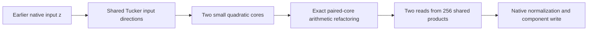

# Shared quadratic features improve one component; broad reuse remains unresolved

21 September 2026, 06:38 UTC. Follow-up to the [overall two-stage review](research_update_2026-09-21_0104_full_coverage_and_shared_baselines.md).

**The two-stage method now has a concrete local success:** a shared-input Tucker projection followed by an exact arithmetic refactoring improves one selected component at the same number of products. On two document-identified native panels, absolute fidelity limits pass, but a strict comparison against the separate-read baseline fails on code swaps. Sharing one feature bank across several components loses too much fidelity; partial sharing also misses the registered limits.

These are results for selected folded source reads, not a standalone model or semantically identified collection of circuits.

## What is being simplified?

The target uses two quadratic reads of the preceding MLP's normalized input:

$$
q_a(z)=z^\top Q_a z,\qquad q_b(z)=z^\top Q_b z.
$$

They enter a selected last-MLP component through

$$
\phi(z,t,s)=\frac{(t-\tfrac12q_a(z)-\alpha s)(q_b(z)-\beta s)}{s^2}.
$$

Here $t$ is a linear read of the later native residual input, $s$ its RMS denominator, and $\alpha,\beta$ fixed centering constants. The component writes $w\phi$ into the residual stream. Native inputs and normalization remain required.

A **separate-read baseline** approximates each quadratic form with 128 directions: 256 products total. A **shared-core program** instead chooses 256 common input directions, then expresses both forms in that space. A paired-core compiler factors the two small quadratic forms into 256 shared mixed products. Thus each read can use a rank-256 quadratic form without doubling the product count.

This is a restricted, working example of decomposition followed by graph simplification. It is not unrestricted DAG search.

## Calibration and the local improvement

Expanding the weighting sample from 24 cached chunks to 256 reduces the evaluation/training Mahalanobis-distance ratio from 9.41 to 1.27. We preserve the old mean and exact centered affine terms, changing only the quadratic weighting matrix. It is therefore a second moment around the old mean, not a newly centered covariance.

At fixed rank64 per separate source, opened native scalar error improves from 35.17% to 24.53%, still failing the 15% target. At 256 products:

| Program | Opened native scalar error | Stored floating-point coefficients |
|---|---:|---:|
| Separate rank128 reads, expanded weighting | 16.34% | 299,780 |
| Shared256, plain quadratic weighting | **11.94%** | 300,036 |
| Shared256, additional affine-sensitivity weighting | **11.20%** | 300,036 |

The shared programs additionally store 768 integer indices. Compiler and executable replay errors are below $10^{-12}$. These seven previously opened, distinct token prefixes are a screen, not independent confirmation.

## Two native panels: absolute pass, relative failure retained

Programs were frozen before the first panel. Each panel has 32 identified FineWeb documents and 16 Python standard-library files, with 256-token native contexts rather than the 64-token calibration contexts. The first code panel is reused; the second uses different files. FineWeb panels use distinct source-document IDs and hashes, one prefix per document, and explicit exclusion of known cached excerpts. This establishes separation for this extraction study, not absence from model pretraining.

**Natural** means removal of the component at the ordinary state. **Hybrid** means the same removal after a donor source contribution is substituted, retaining a specified recipient context. **Change** is hybrid minus natural effect. Final normalization and softcapping are executed. Scores use donor-eligible positions, with same-current-token donors from different identified documents/files.

The registered primary must satisfy natural/hybrid effect error at most15%, change error at most20%, and error at most1.10 times the separate baseline in every domain/cohort. Cohorts are all eligible positions, alphabetic continuation, and spaced words.

| Panel / primary | FineWeb natural: baseline → shared | FineWeb hybrid: baseline → shared | Code hybrid: baseline → shared |
|---|---:|---:|---:|
| 1: shared_affine256 | 13.57% → 9.79% | 12.19% → 8.89% | 1.97% → 2.33% |
| 2: shared_plain256 | 11.00% → 8.92% | 12.67% → 10.82% | 2.10% → 2.33% |

Panel1's primary is affine-weighted shared256. It passes every absolute gate but fails the code-hybrid relative comparison: ratio1.183. The plain shared256 control passes the first panel's point comparisons, so it was frozen as the primary for panel2, without refitting. On panel2 it passes all absolute gates but narrowly fails the same relative comparison: ratio1.11014, above1.10. We retain the failure rather than rounding it into a pass.

Paired recipient-level bootstrap95% intervals for those code-hybrid ratios are [1.092,1.296] and [1.017,1.224]. Donors remain fixed in this bootstrap; it does not include donor-selection uncertainty. The consistent FineWeb gain comes with a small code-swap tradeoff, not uniform dominance. Semantic selectivity and full upstream extraction remain unproven.

## Does one dictionary work across three components?

We next tested reuse across three native components. Each independently compiled pair has256 products, so the reference has768 products and900,108 stored floats. This is a stronger baseline than independent spectral decompositions.

For fixed product count, we represented each existing input projection as a shared bank followed by a component-specific linear transform. The common subspace was chosen from the quadratic functions themselves, avoiding arbitrary compiler scales. Centered affine branches remain exact. Primary width320 and controls256/384 were fixed before evaluation.

| Shared width | Component1 error | Component2 error | Component3 error | Stored floats |
|---|---:|---:|---:|---:|
| Separate reference | 3.06% | 2.76% | 11.94% | 900,108 |
| 256 | 5.04% | 3.19% | 20.56% | 506,892 |
| 320 | 3.81% | 3.13% | 18.64% | 629,772 |
| 384 | 3.43% | 3.05% | 15.81% | 752,652 |

The primary saves30% of floats but fails per-component fidelity. Even width384 leaves the third component above15%. Dense centered-form replay agrees below $2\times10^{-14}$, so this is an approximation failure, not an export discrepancy.

Allowing just two components to share while leaving the third private also fails. All three pairings at widths256/320 were reported; none meets the requirement that each component stay within1.10 of its separate baseline. The primary pair1+2,width256 saves18.2% of floats but raises component1 error from3.06% to4.56%. These are opened-state diagnostics, not new native intervention panels.

## Why exact linear sharing cannot fix these frozen dictionaries

For each pair, a nonsingular combination of its two small cores implies that the quadratic matrices span the entire256-dimensional input-reader subspace. Any exact common linear bank must contain the union of those subspaces.

The three exported subspaces have numerical union rank **768**, with smallest singular value0.00236 after each subspace is orthonormalized. The rank threshold was $10^{-10}$ relative to the largest singular value. No pair has an exact numerical intersection at that tolerance, although some directions are very close.

Consequently, simply changing coordinates cannot represent these frozen quadratic programs exactly through a smaller common linear bank. A dense768-wide common bank already costs as much as the three separate input matrices; adding dense per-component transforms costs more. This is a bound on this linear-bank representation, not on arbitrary sparse or nonlinear arithmetic circuits. A different jointly fitted product dictionary could still be cheaper.

## Evidence limits and next direction

The old cache emits multiple token chunks per document without preserving document identities. Historical row-separated tests are chunk-level evidence; earlier document-level claims were corrected. The new panels explicitly preserve identities. The first panel builder wrote valid artifacts but exited134 during interpreter shutdown; independent reload/hash/shape checks passed and the incident is recorded. The second builder exits normally.

The outcome argues against forcing every component through one common input subspace. The next structural alternative is to fit **shared products with distinct output weights**, allowing different components to select different products, rather than requiring all their reads to occupy one narrow bank. Such a joint third-order tensor fit can change the building blocks themselves. It must be compared at matched cost and scored per component, followed by fresh native tests if the screen passes.

### Reproduction

- [Expanded metric fit](../../direct_tensor_match/EXPANDED_SOURCE_METRIC_FIT_V1.json) and [shared-core construction](../../direct_tensor_match/SHARED_EXPANDED_SOURCE_FIT_V1.json).
- [First native panel](../../direct_tensor_match/SHARED_MODE3_FRESH_NATIVE_V1.json), [first uncertainty audit](../../direct_tensor_match/SHARED_MODE3_FRESH_AUDIT_V1.json), [second native panel](../../direct_tensor_match/SHARED_MODE3_SECOND_NATIVE_V1.json), and [second uncertainty audit](../../direct_tensor_match/SHARED_MODE3_SECOND_AUDIT_V1.json).
- [First document manifest](../../direct_tensor_match/SHARED_MODE3_FRESH_ROWS_V1.json) and [second document manifest](../../direct_tensor_match/SHARED_MODE3_SECOND_ROWS_V1.json).
- [Fixed-product common projection results](../../direct_tensor_match/MULTIMODE_PROJECTION_SHARING_V1.json), [partial-sharing results](../../direct_tensor_match/MULTIMODE_PARTIAL_SHARING_V1.json), and [exact-overlap audit](../../direct_tensor_match/MULTIMODE_EXACT_OVERLAP_V1.json).

The two native jobs made48 captures each and took about3.5seconds each after loading. Projection and overlap experiments are CPU float64 calculations. Program storage counts exclude producing native inputs and do not establish wall-clock speedups. No candidate is promoted to a complete circuit.
