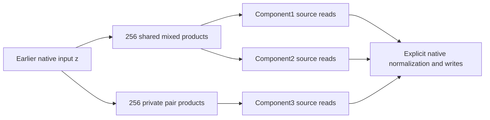

# Mixed products improve two components; graph reuse is real but fidelity remains incomplete

21 September 2026, 07:07 UTC. Follow-up to [joint square-product fitting](research_update_2026-09-21_0654_joint_products_and_readout_control.md).

**Changing the product primitive matters.** A384-product mixed-factor model improves the first two native components relative to their768-product separate baseline, at approximately the same storage. But the third component misses the fidelity target. Independent dense reconstruction reproduces the failure.

We also tested whether learned products actually need to feed multiple components. Restricting each product to one component substantially worsens the tensor fit, even with exact readout refitting. That supports computational reuse within these dictionaries; it does not identify semantic units or prove globally optimal sharing.

## Squares versus products of different features

The previous model used one learned feature twice, $(p_r^\top z)^2$. The new model allows

$$
(l_r^\top z)(r_r^\top z),
\qquad
\widehat Q_o=\frac12\sum_r w_{or}(l_rr_r^\top+r_rl_r^\top).
$$

Each product can supply any of the six quadratic source reads. These are two reads for each of three selected native components. All exact centered affine terms, the native input interface and explicit normalization remain unchanged.

An indefinite rank-two quadratic form can fit into one mixed product: $a^2-b^2=(a+b)(a-b)$. Thus384 products use768 learned input directions, matching the input-direction count of the three separate pair programs. Product count and number of stored coefficients are different costs.

## Completed trained-weight comparison

Four fits used Adam,4,000 cosine-decayed steps, learning rates0.01/0.05, and spectral/1%-perturbed spectral initialization. We paired positive and negative spectral terms into mixed products, avoiding the symmetry trap where identical left/right initialization keeps both factors tied. The weight-space objective alone selected the winner.

| Program | Source products | Stored floats | Component1 error | Component2 error | Component3 error |
|---|---:|---:|---:|---:|---:|
| Separate pair programs, common writer stored once | 768 | 897,804 | 3.06% | 2.76% | **11.94%** |
| Joint squares, previous winner | 512 | **604,428** | 3.55% | 2.49% | 17.54% |
| Joint mixed products, new winner | **384** | 898,572 | **2.48%** | **1.87%** | 19.74% |

These are scalar variation errors on seven previously opened cached prefixes. They are not fresh behavioral confirmation. The selected mixed fit has7.76% coefficient error. Its strict fidelity gate fails only on component3: the requirement is at most15% and at most1.10 times the separate baseline for every component.

The higher-rate0.05 spectral run retained its initial iterate as best. Other restarts were worse than0.01 spectral. This shows why initialization, rate and best-iterate tracking matter; it does not prove the selected fit is globally optimal.

Dense original-coordinate audits reproduce coefficient errors within $1.4\times10^{-14}$ and native scalar errors within $5\times10^{-16}$. Five planted mixed-product structures had already passed independent loss/gradient checks and random-start recovery. No native intervention test was promoted from this failed screen.

## Do the learned products actually get reused?

For each product, we measured its coefficient contribution to each output pair, after normalizing the product matrix's Frobenius norm. This removes individual factor-scale ambiguity. It remains a measure before cancellation, not semantic or causal importance.

We then assigned every product to its strongest pair, removed its edges to the other pairs, and optimally refitted the permitted readout coefficients. Product directions and product counts stayed fixed.

| Dictionary | Unrestricted readout coefficient error | One-pair-per-product error |
|---|---:|---:|
|512 squares |10.30% |33.07% |
|384 mixed products |7.76% |32.20% |

The readout least-squares systems were solved without discarding directions; normal-equation residuals are below $6\times10^{-15}$. The median effective number of pair consumers is1.45 for squares and1.34 for mixed products. These are descriptive distribution summaries, not literal fractional consumer counts.

A stronger square-dictionary control greedily removes the least costly product-to-pair edge while keeping at least one pair per product. The exact refitted loss increase from removing a coefficient group is

$$
\Delta E_i=\frac{\|w_i\|_2^2}{(K^{-1})_{ii}},
$$

where $K$ is the active product Gram matrix and $w_i$ contains that product's two output coefficients. Schur-complement updates refit after each deletion. Predicted total error agrees with final dense reconstruction to about $10^{-14}$.

This more informed private assignment improves33.07% to31.41%, still far above10.30%. Removing only128 of1,536 pair edges raises error to10.79%; forcing all512 products private raises it to31.41%. Sparsity therefore has a measurable accuracy tradeoff. This greedy search is not a certificate of the optimal private assignment or of the minimum arithmetic-circuit size.

## A graph edit that keeps all three targets

Because the mixed model is better on components1/2 and worse on3, we tested a nonuniform graph: share learned mixed products for the first two, retain the existing private pair program for the third.

We greedily removed128 of the384 learned mixed products using their exact conditional least-squares cost for the first four outputs. The resulting graph has512 products and **exactly897,804 stored floats**, matching the deduplicated separate baseline's storage.

Before continuous refitting, errors are6.64%,5.10%,11.94%. All absolute limits pass, but the relative limits fail for the first two. The unchanged third component is still scored; it has not been removed from the objective.

The next experiment implements the proposed second-stage loop directly: **edit the graph, then refit the remaining feature directions**. At each step, output coefficients are solved analytically with a tiny ridge term included in the objective. Adam adjusts the left/right directions. This is variable projection: solving the linear part exactly while optimizing the nonlinear parameters.

Envelope-gradient checks compare this method against differentiation through the linear solve. At2,000 steps, four of five planted controls recovered; the signed-output case did not. Its gradient check passed. Doubling the budget to4,000 steps from the same start still leaves2.43% error, so extra steps alone do not repair this case. Restart9473 at the same4,000-step budget recovers it to $6.7\times10^{-10}$. The miss therefore depends on initialization; both the failed original start and the successful restart are retained. The native comparison is preregistered at4,000 steps with two rates and two starts, the same component fidelity limits, and unchanged topology/cost. No success is assumed from the toy gradient checks.

## Evidence and limits

- [Mixed fits](../../direct_tensor_match/MIXED_PRODUCT_NATIVE_FIT_V1.json) and [independent audit](../../direct_tensor_match/MIXED_PRODUCT_NATIVE_AUDIT_V1.json).
- [Square reuse control](../../direct_tensor_match/SHARED_PRODUCT_REUSE_AUDIT_V1.json), [mixed reuse control](../../direct_tensor_match/MIXED_PRODUCT_REUSE_AUDIT_V1.json), and [greedy private graph](../../direct_tensor_match/GREEDY_PRIVATE_PRODUCT_GRAPH_V1.json).
- [Partial graph before refitting](../../direct_tensor_match/PARTIAL_MIXED_GRAPH_V1.json) and [standalone graph executor](../../direct_tensor_match/shared_mixed_source_graph.py).
- [Profiled-gradient and recovery checks](../../direct_tensor_match/PROFILED_MIXED_PRODUCTS_CHECK_V1.json) and [refit preregistration](../../direct_tensor_match/PROFILED_PARTIAL_GRAPH_PLAN_V1.json).

The mixed fitting job took238.3seconds, with no native-model forwards. Graph audits and pruning were CPU-only. Historical cached prefixes are not verified separate documents. The programs still need native upstream inputs, and components2/3 lack semantic identification. Useful product reuse and a cheaper program are not sufficient for circuit adoption without fresh/OOD prediction, selective intervention and composition evidence.
