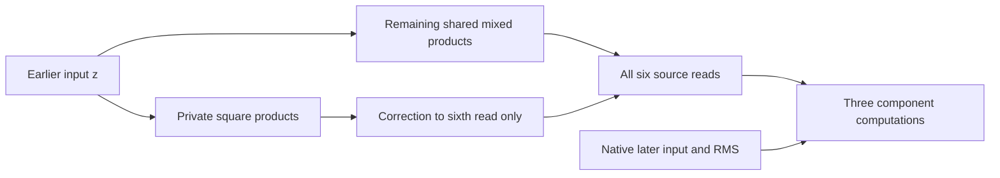

# A smaller global graph fails; a targeted private branch does not yet repair it

21 September 2026, 08:53 UTC. Follow-up to the [overall two-stage review](research_update_2026-09-21_0104_full_coverage_and_shared_baselines.md).

**Sharing products across all six source reads reduces the product count, but loses too much accuracy on the third component.** We then performed an actual second-stage graph edit: exchange some shared products for private corrections, and refit their output coefficients. That also failed the accuracy requirements at the same storage budget. The earlier partial-sharing graph remains the stronger comparison; neither is an adopted semantic circuit.

## The target and the structural change

There are three selected scalar components, each computed from two quadratic reads of the earlier MLP input z. Their native expression is

$$
\phi_j=\left(\frac{h^\top a_j-\tfrac12 q_{2j}(z)}{s(h)}-\alpha_j\right)
\left(\frac{q_{2j+1}(z)}{s(h)}-\beta_j\right),\quad j=0,1,2.
$$

Here h is the later native input, s is its RMS denominator, and the q functions are folded quadratic source reads. Both native inputs remain supplied. All six q functions remain targets; none is dropped because it has little coefficient energy.

The existing graph shares256mixed products between the first two components and keeps256private products for the third. The new graph shares383mixed products among all six reads:

$$
\widehat q(z)=W^\top\big[(L^\top z)\odot(R^\top z)\big]+Az+b.
$$

The affine terms preserve the original centered mean and linear contributions. This is a smaller conditional program, not upstream closure.

| Program | Source products | Floating coefficients |
|---|---:|---:|
| Existing partial sharing |512|897,804|
| New global sharing |383|896,262|

We fitted three output-weighting settings, each with seeds816and1816, Adam rate0.02 and2000cosine steps. Readout coefficients were solved analytically during direction fitting. Partial output balance was the registered primary. Each setting's winner was selected using its weight objective, not its native component scores. The six fits took257.62seconds.

## Completed comparison

Errors below are relative to component variation on448previously examined states. They are not fresh OOD results.

| Output weighting | Component1 | Component2 | Component3 | Least faithful original quadratic group, cosine |
|---|---:|---:|---:|---:|
| None |2.07%|2.06%|20.85%|0.687|
| Partial, primary |2.66%|2.60%|18.69%|0.895|
| Full |6.20%|4.15%|25.60%|0.981|

Every setting fails the required component accuracy. The rule retains both a15%absolute limit and a1.10-times-separate-baseline limit for each component. The original-feature0.99cosine requirement also fails. Full weighting makes the six groups more repeatable, but even its minimum agreement between the two restarts is0.98959, below0.99. That threshold is not rounded into a pass.

The export is not the explanation: independent native-factor reconstruction, source execution and centered affine/mean checks all pass below1e-8. All three conditional Jacobian metrics passed an independent autograd preflight. These derivatives hold h fixed; they are not the full upstream causal response.

## Which read is causing the failure?

Write the original two factors of one component as A and B, and their approximation errors as da and db. Then

$$
\widehat\phi-\phi=(A+\delta a)(B+\delta b)-AB
=\delta a\,B+A\,\delta b+\delta a\,\delta b.
$$

We evaluated all three terms and their signed cross contributions. For the primary global graph's third component, their individual errors are3.31%,18.96%and0.88%, while the total is18.69%. The second quadratic read is the main problem. Replacing that read with the exact original leaves3.31%error; replacing the first leaves18.96%.

An exact read is an expensive diagnostic oracle. These numbers do not constitute a free repair. The same test on the existing partial graph reduces third-component error from11.94%to5.32%when the second read is exact.

## A concrete graph edit at fixed projection cost

We removed k shared mixed products and added2kprivate squares correcting the sixth source read. A mixed product needs two dense input directions; a square needs one. Therefore this exchange preserves the number of stored projection coefficients. The private corrections use eigenvectors of the remaining quadratic coefficient residual, with signed eigenvalues; their directions are chosen from weights rather than native evaluation rows.

Primary k=16 gives367mixed products plus32private squares: **399products and896,198coefficients**. Controls used k=8and32. Private directions are physically stored once and squared; the price does not count a duplicated left/right implementation as sharing.

| Primary graph | Component1 | Component2 | Component3 |
|---|---:|---:|---:|
| Global383parent |2.66%|2.60%|18.69%|
| After targeted edit |3.81%|3.44%|17.12%|
| After exact constrained readout refit |4.39%|3.53%|17.84%|

All accuracy gates still fail. The refit optimizes the same output-weighted coefficient objective while respecting that private squares may write only to the sixth read. It solves the linear coefficient problem exactly at fixed directions. A small dense-autograd check gives maximum gradient8.53e-14; native normal-equation residuals are below1.2e-14. The first toy run caught a parenthesization/shape error before any native result; it was corrected and the control rerun. This was an implementation error, not a scientific negative result.

The coefficient refit fails to repair behavior despite passing its mathematical checks. This does not prove that the topology cannot work after jointly changing all input directions. It rejects the particular edit and fixed-direction refit tested here. None of these candidates is promoted.

## What this changes

The failure is more specific now: more global sharing does not automatically make a better circuit, output balancing does not by itself preserve the downstream product, and naive pruning by individual product energy can damage shared functions. The private residual correction helps its intended component somewhat but does not earn the loss elsewhere. The next graph search must account for those cross-output effects and refit feature directions, or use a different structural proposal; repeating a fixed-readout adjustment alone is poorly motivated.

This is still the user's two-stage direction: decomposition proposes products; graph edits change their reuse and private allocation; continuous fitting evaluates whether that structure works. The stage-two step was actually executed here, with its failure retained. General HT-derived multilevel sharing, fresh semantic manipulation and standalone extraction remain unfinished.

## Evidence

- [Registered fit](../../direct_tensor_match/GLOBAL_SOURCE_BALANCE_PLAN_V1.json), [all six fits](../../direct_tensor_match/GLOBAL_SOURCE_BALANCE_V1.json), and [independent audit](../../direct_tensor_match/GLOBAL_SOURCE_PROGRAM_AUDIT_V1.json).
- [Exact value-error decomposition](../../direct_tensor_match/GLOBAL_COMPONENT_ERROR_TERMS_V1.json).
- [Graph-edit results](../../direct_tensor_match/GLOBAL_PRIVATE_RESIDUAL_EDIT_V1.json) and [constrained refit](../../direct_tensor_match/GLOBAL_PRIVATE_READOUT_REFIT_V1.json).

All follow-up graph work ran on CPU inFP64 and reused opened states. No fresh native-model forwards, OOD success, new semantic labels, or improvement in upstream closure is claimed.
