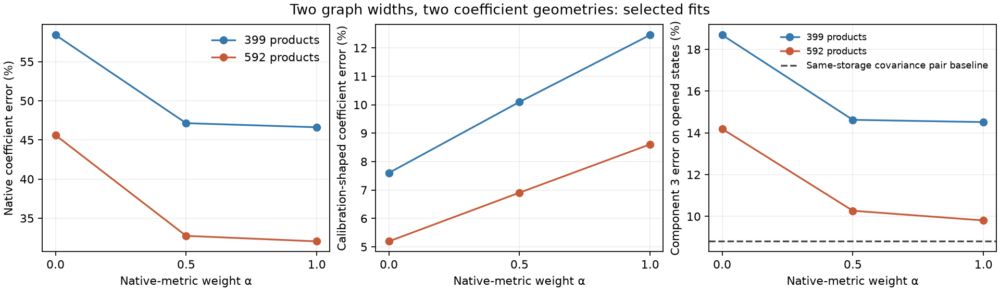

# Wider graphs and native weight fidelity help, but no candidate wins every comparison

21 September 2026, 10:33 UTC. **Increasing the graph width and giving native-coordinate coefficients more weight improves the difficult component.** The wider mixed-objective graph passes three of its four registered checks; it fails the covariance-error guard. The stronger same-storage covariance baseline still has lower third-component error. We have frozen the wider candidates for a separate fresh behavioral comparison, without treating the failed check as a pass.

**Completed controlled fit**

All 12 fits completed in 992.7 seconds. Two widths, three metric weights and two initializations were tested. Each received 1,500 cosine-scheduled Adam steps at initial rate 0.01, with exact constrained output solves. One initialization inherited earlier directions; the other used random native-coordinate directions. Each setting's winner was selected by its fitting objective, not evaluation error.

The objective is

$$
E_\alpha=\alpha E_{\mathrm{native}}+(1-\alpha)E_{\mathrm{calibration}},
$$

with equal normalization across the three source-output pairs in each geometry. Native means isotropic coefficient error in untransformed input coordinates; calibration-shaped means coefficient error after the fixed covariance transform. No empirical component-value loss was used in this run.

| Products | Native weight $\alpha$ | Native coefficient error | Calibration-shaped error | Component 3 error |
|---:|---:|---:|---:|---:|
| 399 | 0 | 58.42% | 7.60% | 18.69% |
| 399 | 0.5 | 47.15% | 10.10% | 14.62% |
| 399 | 1 | 46.62% | 12.45% | 14.52% |
| 592 | 0 | 45.61% | 5.19% | 14.19% |
| **592** | **0.5, primary** | **32.75%** | **6.91%** | **10.27%** |
| 592 | 1 | 32.04% | 8.61% | 9.81% |

The primary's complete component errors are **1.34%, 1.54%, 10.27%** on the previously opened 448 states. Its native coefficient error improves by about 28% over the same-width covariance-only control. But calibration-shaped error rises by about 33%, beyond the permitted 10%.

| Registered check | Outcome |
|---|---|
| Independent execution, coefficient metrics and physical price | Pass |
| All three component errors within absolute and original relative limits | Pass |
| Native coefficient error improves at least 20% over same-width covariance-only fit | Pass |
| Calibration-shaped coefficient error worsens at most 10% | **Fail** |

Independent dense decoding of all 12 exported programs reproduces both coefficient metrics, component values and compact execution below $1.4\times10^{-15}$. The negative covariance-guard result is retained. This is a metric tradeoff, not evidence that all fitting requirements were satisfied.

“Isotropic” describes the fitting objective. It does not make the whole pipeline data-free: the chosen component targets and mean/affine corrections retain their earlier calibration provenance.

**The stronger baselines change the interpretation**

The wider graph stores 1,342,028 floating coefficients. Separate 384-dimensional pair programs store 1,340,940, nearly the same amount, with 1,152 rather than 592 nonlinear products.

The isotropic-only graph improves all three component errors over the isotropic pair baseline: **1.34%, 1.82%, 9.81%**, compared with **1.62%, 3.06%, 11.26%**. Its two coefficient errors are also lower. However, the covariance-shaped pair baseline reaches **1.87%, 2.05%, 8.81%**: both the mixed and isotropic shared graphs remain worse on component three. The mixed graph is about 16.7% worse on that component, exceeding a 10% relative allowance against this stronger baseline.

The shared graph is therefore an interesting accuracy/structure tradeoff, not a uniform improvement over every baseline. Its dense-projection work is essentially unchanged; the [full arithmetic audit](research_update_2026-09-21_1020_cost_matched_pair_baselines.md) found no total-multiplication saving at this width. Fewer nonlinear interaction nodes and fewer total scalar operations are different claims.

**A discrete graph edit gave an honest null**

We also tested all 15 ways of partitioning the six unchanged quadratic measurements into three shared pairs at the same 384-per-pair width. Matching was chosen using coefficient error only, separately in both geometries; the three downstream component definitions did not change.

Both searches selected the original pairing: $(0,1),(2,3),(4,5)$. The next-best pairing increased coefficient error by 1.36% natively and 0.95% in calibration geometry. Thus the registered 10% improvement prediction failed: this particular regrouping offers no benefit. This finite search does not rule out other bases, widths, larger shared groups or arbitrary graph rewrites, and does not establish semantic uniqueness of the original pairing.

**What the fresh comparison tests**

All three wider objective-selected graphs and both same-storage pair baselines were frozen before collecting a sixth panel: 32 new FineWeb documents and 16 new standard-library files. Previous five panels' document identities, text hashes and code files were excluded; known cached FineWeb excerpts were checked throughout candidate documents. The resulting donor mapping contains 4,818 FineWeb and 3,212 code pairs with matching token identity across distinct documents/files.

The same 48 native captures will evaluate every candidate. Tests include removal of each component and their sum, donor-swapped later states, and the change in removal effects. The mixed graph remains primary; it must meet absolute limits and stay within 10% of **both** matched baselines. The pure objectives are reported as prespecified comparisons, not used to select a new winner after seeing the panel.

This fresh study asks whether the different weight geometries transfer to actual normalized, softcapped model behavior. It does not erase the earlier coefficient-guard failure or imply automatic adoption. Native earlier and later states remain supplied, and stable semantic units, standalone extraction and selective reuse are not yet established.

Evidence: [all fit results](../../direct_tensor_match/DUAL_GEOMETRY_SOURCE_V1.json), [independent audit](../../direct_tensor_match/DUAL_GEOMETRY_SOURCE_AUDIT_V1.json), [all 15 regroupings](../../direct_tensor_match/CROSS_COMPONENT_PAIRING_V1.json), [frozen candidates](../../direct_tensor_match/DUAL_FRESH_FREEZE_V1.json), and [fresh comparison plan](../../direct_tensor_match/DUAL_FRESH_PLAN_V1.json). No fresh-test outcome is claimed in this report.
