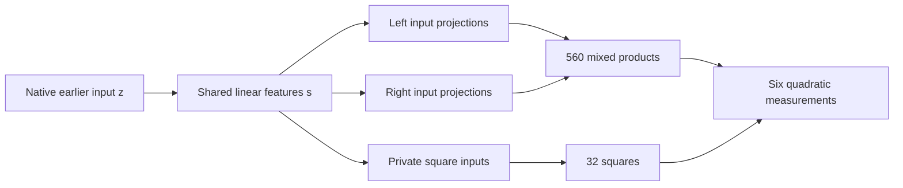

# Two structural tests: independent blocks and shared linear intermediates

21 September 2026, 10:56 UTC. **We tested two concrete ways to simplify the computation graph. Neither produced an acceptable replacement. One failure now has a capacity-versus-cost bound, so another optimizer sweep on that same layout is not justified.** These tests advance the structural search; they do not establish identified circuits.

The target remains the six quadratic measurements feeding three selected components. It is a small part of the folded last-two-MLP computation, with earlier and later native input states still supplied. The [overall review](research_update_2026-09-21_0104_full_coverage_and_shared_baselines.md) explains how this local target fits the two-stage decomposition-and-graph proposal.

**First: can the six measurements split into independent coordinate blocks?**

We asked whether an invertible change of input coordinates could turn every quadratic measurement into a sum over disjoint groups of coordinates. This is a stronger condition than merely having a small arithmetic graph. If it held, it would suggest independently executable source groups shared across outputs.

The scheduled math/literature review connected this question to simultaneous block diagonalization by congruence. A derived numerical test uses two combinations of the six source matrices and their generalized eigensystem. Five planted structures hidden by nonorthogonal coordinate changes recover the expected groups; an independent dense linear-system check agrees. A degenerate eigensystem is correctly marked inconclusive.

On the actual six forms, two fixed tests in each of two coordinate systems all yield **one connected group of dimension 1,152**. The numerical checks pass, and the result persists across three thresholds. Covariance-shaped coordinates give the same conclusion as native coordinates, as exact invertible changes should.

This argues against an exact independent-coordinate split. It is not an interval-certified impossibility proof, and it says nothing against overlapping, approximate or deeper shared computations. See the [math review](../../THREE_HOURLY_MATHEMATICAL_REVIEW_2026-09-21_1050.md) for the derivation and primary sources.

**Second: share the linear computations before multiplying**

The latest graphs save nonlinear products but spend most of their arithmetic forming dense input projections. We therefore tested a real second-stage graph edit:

$$
s=P^\top z,\qquad
\ell=A^\top s,\qquad r=B^\top s,\qquad t=C^\top s.
$$

The graph computes shared linear features $s$ once. Its original mixed products are $\ell_k r_k$; its private square products are $t_j^2$. Readout coefficients combine those products into the same six source outputs. All original component definitions and normalization operations remain.

SVD of the existing reader matrix proposes P. We then solve for the allowed product readout coefficients in the parent's fitting metric. This tests a particular shared linear layer, not arbitrary graph topology. The two linear stages are actually executed and charged; storing a dense expanded matrix and merely calling it shared would not count.

We tested 384, 448 and 512 shared linear features for each of the existing mixed, isotropic and covariance-fitted parents. The registered primary is 448 features in the mixed parent. Five planted controls pass; the full-width control reproduces the original; saved factorized programs replay their dense equivalents to approximately 1e-15. All nine fits take 19.28 seconds on CPU.

| Mixed parent and graph edit | Original | 448 shared linear features |
|---|---:|---:|
| Distinct nonlinear products | 592 | 592 |
| Stored floating coefficients | 1,342,028 | 1,047,116 |
| Source scalar multiplications | 1,331,088 | 1,036,176 |
| Component1 error | 1.34% | 7.48% |
| Component2 error | 1.54% | 4.76% |
| Component3 error | 10.27% | 22.77% |
| Native-isotropic coefficient error | 32.75% | 75.35% |
| Covariance-shaped coefficient error | 6.91% | 22.09% |

The edit saves **22.16% of the counted source multiplications** and 21.97% of stored coefficients, but fails component and metric fidelity. Its derivative errors also fail the registered comparison. Source arithmetic includes both dense projection stages, products and product readouts; common affine corrections, later-state operations and the final model are excluded equally. This is operation counting, not a measured runtime speedup.

These component measurements use the previously examined 448 states. They are diagnostics, not fresh validation. None of these edited graphs was selected for a new behavioral claim. The earlier wide parents' fresh absolute passes and relative failures remain unchanged.

**Why more optimization cannot meet this layout's full primary target**

After the failed fit, we derived a necessary bound using the target forms themselves. Let $T_o$ denote the six native source matrices, scaled so each original pair has equal coefficient weight. Define

$$
S_T=\sum_o T_oT_o^\top.
$$

If every source computation passes through an $r$-dimensional linear input bottleneck, all reconstructed quadratic matrices have their ranges in that common r-dimensional subspace. Consequently,

$$
\frac{\sum_o\|T_o-\widehat T_o\|_F^2}
{\sum_o\|T_o\|_F^2}
\geq
\frac{\sum_{i>r}\lambda_i(S_T)}{\sum_o\|T_o\|_F^2},
$$

where eigenvalues are ordered from largest to smallest. This allows even an arbitrary dense quadratic core after the bottleneck, so it is more permissive than our product graph.

For the mixed parent, staying within 10% of its native coefficient error requires **at least 631 input directions**. But the current two-stage dense-reader layout costs

$$
N_{\mathrm{multiplications}}(r)=2304r+3984.
$$

The 20% saving requirement permits **at most 460 directions**. At 631 directions, the lower-bound-compatible layout already costs 1,457,808 multiplications, exceeding the original 1,331,088. The covariance-parent and isotropic-parent versions also cannot meet their respective two-metric guards together with 20% savings in this layout.

This is stronger than “SVD picked a bad basis”: no choice of basis or optimizer can satisfy the stated combination of requirements in this dense common-bottleneck architecture. It does not rule out sparse linear maps, overlapping local dictionaries, skip connections or a different arithmetic graph. It is also a coefficient-metric bound, not a lower bound on behavioral error.

**What changes next**

We should check structural capacity against operation cost before fitting another common bottleneck. Exact disjoint blocks and a single small dense global reader dictionary are now poor routes for this target under the tested requirements. More general reuse must allow overlapping local features or a different pattern of sparse connections, while retaining per-component behavioral checks.

The full goal remains unresolved: faithful OOD behavior, extraction without native input ports, selective manipulation, reusable structure and stable feature identity still need to coincide in one simple program.

**Evidence**

- [Center screen plan](../../direct_tensor_match/NATIVE_QUADRATIC_CENTER_PLAN_V1.json), [five controls](../../direct_tensor_match/QUADRATIC_CENTER_PREFLIGHT_V1.json), [native results](../../direct_tensor_match/NATIVE_QUADRATIC_CENTER_V1.json).
- [Shared-linear edit plan](../../direct_tensor_match/SHARED_LINEAR_GRAPH_PLAN_V1.json), [five controls](../../direct_tensor_match/SHARED_LINEAR_GRAPH_PREFLIGHT_V1.json), [all nine results](../../direct_tensor_match/SHARED_LINEAR_GRAPH_V1.json).
- [Actual factorized executor](../../direct_tensor_match/shared_linear_source_graph.py), [fit implementation](../../direct_tensor_match/fit_shared_linear_graph.py), [independent saved-program and capacity audit](../../direct_tensor_match/SHARED_LINEAR_CAPACITY_V1.json).

No new text collection or model forwards were needed. Earlier data provenance and native-interface limitations still apply. Both positive instrument results and negative scientific results are retained.

**Export correction (21 September 2026, 11:09 UTC):** Selected basis slices retained unused backing storage in the serialized programs. They have been packed with every tensor value bitwise unchanged, so actual floating storage now equals the reported logical coefficient count. Reconstruction and arithmetic results are unchanged. [Packing receipt](../../direct_tensor_match/READER_GRAPH_PACKING_V1.json).
