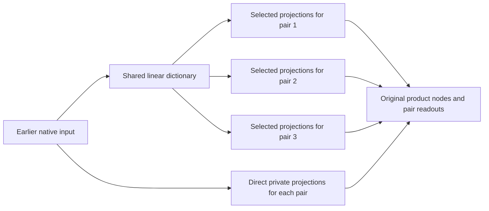

# Overlapping feature dictionaries: private paths help capacity, but this fit fails

21 September 2026, 11:09 UTC. **We tested a graph that shares selected linear features while keeping direct private paths for the remaining inputs. It saves about 26% of source arithmetic, but loses too much accuracy. Unlike the previous common-bottleneck result, this is a failed construction—not a proof that the architecture cannot work.**

This is another concrete test of the second stage in the [overall decomposition-and-graph proposal](research_update_2026-09-21_0104_full_coverage_and_shared_baselines.md). The target is still six quadratic source measurements feeding three selected components. It is not the entire MLP, and the earlier and later native states remain supplied.

**Why change the graph?**

The previous edit sent every source read through one small common linear dictionary. Its input-rank requirements conflicted with its arithmetic budget. Here, each pair of source measurements keeps a private path around the shared dictionary:

The baseline has three banks of 384 input projections. In the primary edit, 160 projections in each bank are computed using 128 shared linear features. Each bank's other 224 projections remain direct. Thus the combined input span can have dimension 800, rather than being limited to 128. A second layout uses 64 shared features for 128 projections per bank, allowing a combined span of 832. Both have the same arithmetic cost.

The shared directions come from the overlap of the baseline input subspaces. We select complete quadratic-product blocks using their individual coefficient perturbations, then jointly refit the two output coefficients per product within each pair. This selection is a weights-only heuristic; minimizing the sum of individual perturbations does not minimize the error of the whole graph. No new calibration inputs or model forwards were used.

We tested both layouts for the covariance-shaped and native-isotropic pair baselines. Five planted shared/private dictionaries recover exactly, with independent dense least-squares checks of the readout solve. Four native fits completed in 14.99 seconds on CPU.

**The primary saves arithmetic but fails reconstruction**

| Quantity | Covariance pair baseline | Shared128/private224 edit |
|---|---:|---:|
| Distinct nonlinear products | 1,152 | 1,152 |
| Floating coefficients | 1,340,940 | 996,876 |
| Source scalar multiplications | 1,330,560 | 986,496 |
| Component1 error | 1.87% | 13.62% |
| Component2 error | 2.05% | 10.41% |
| Component3 error | 8.81% | 47.90% |
| Native-isotropic coefficient error | 55.26% | 99.45% |
| Covariance-shaped coefficient error | 7.03% | 37.47% |

The registered instrument and arithmetic checks pass; component and coefficient fidelity fail. Derivative fidelity fails as well. The equal-cost 64-feature variant has third-component error 48.36%, so that alternative does not rescue the result. The native-isotropic versions also fail badly.

The literal source arithmetic includes the shared dictionary, selected projection maps, private direct projections, nonlinear products and product readouts. The same affine corrections and later-model operations are excluded from both sides. No measured runtime speedup is claimed. The graph also stores 4,608 integer index values for product instructions and the shared/private routing; the original baseline does not need the extra routing indices.

These component errors are measured on the previously examined 448 states, not a fresh panel. All three original component definitions remain; good aggregate behavior could not substitute for a failed constituent.

**Red-team: failed solver, bad input subspaces, or restrictive products?**

The normal-equation residuals are below 7e-16 for the primary, with product-Gram condition numbers around 608–1,432. Refitting reduces its covariance-shaped coefficient error from 74.72% to 37.47%. Saved graph execution matches independent dense quadratic evaluation to about 1e-15. These checks support a real approximation failure, rather than a broken solve or incorrect export.

We then relaxed the product restriction. Inside each edited pair's actual input span, we allowed an arbitrary dense quadratic core. This is a diagnostic upper bound on what those fixed subspaces can achieve, not a cheap replacement program.

| Primary covariance edit | Fixed product graph | Best dense cores in the same input spans |
|---|---:|---:|
| Covariance-shaped coefficient error | 37.47% | 13.64% |
| Component1 error | 13.62% | 4.00% |
| Component2 error | 10.41% | 3.06% |
| Component3 error | 47.90% | 14.85% |

Each pair retains a 352-dimensional input span. The large improvement from dense cores shows that the fixed product structure discards useful interactions within those spans. But even the coefficient-optimal dense cores fail the comparison against the original baseline. Thus both the chosen subspaces and the product structure need attention; changing only the readout is insufficient.

This does **not** prove a lower bound on component error for every dense core. The dense core is optimal in its specified coefficient metric, not necessarily for downstream component behavior. Nor does it show that a learned overlapping dictionary must fail: these input directions were constructed from the original subspaces rather than optimized jointly for the new graph.

**A storage bug found and corrected**

The export audit found that slices of the full basis matrices retained unused backing storage. The program's logical coefficient count and operation count were correct, but the serialized artifact contained unnecessary values. For the primary local graph, 2,176,524 floating storage slots were retained for 996,876 used coefficients.

We packed all tensors contiguously while preserving intentional sharing within each program. The packed primary now uses exactly 996,876 floating storage slots. The earlier common-linear-graph artifacts had the same issue and were packed too. Every tensor value is bitwise unchanged; no reconstruction result or pass/fail outcome changed. Constructors now copy the selected basis so future exports do not repeat this mistake. The receipt retains before/after hashes and counts.

**What this tells us about the direction**

Private paths avoid the previous global rank-versus-cost obstruction, but a plausible overlap heuristic is not enough to discover useful reusable features. The next discriminating question is whether joint fitting of the shared directions, private directions and product interactions can recover accuracy at this same cost, compared with the fixed-direction construction. It must retain the original component and metric requirements.

The broader goal remains open: these are conditional computational programs, not standalone, semantically identified circuits with validated selective manipulation and OOD reuse.

**Evidence and reproducibility**

- [Registered layouts and requirements](../../direct_tensor_match/LOCAL_SHARED_READER_PLAN_V1.json), [five planted controls](../../direct_tensor_match/LOCAL_SHARED_READER_PREFLIGHT_V1.json), [all four native results](../../direct_tensor_match/LOCAL_SHARED_READER_V1.json).
- [Executed shared/private graph](../../direct_tensor_match/local_shared_reader_graph.py), [fit and scoring implementation](../../direct_tensor_match/fit_local_shared_reader_graph.py), [dense-core diagnostic](../../direct_tensor_match/LOCAL_READER_SPAN_V1.json).
- [Storage correction receipt](../../direct_tensor_match/READER_GRAPH_PACKING_V1.json), including both artifact families and bitwise-value checks.

All percentages describe reconstruction error. The latest fresh native tests remain the earlier frozen-panel study; these exploratory graph edits do not alter its results.
