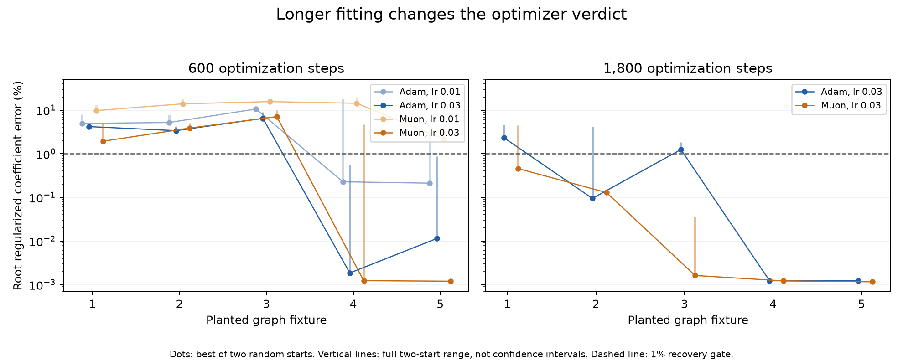

# Joint graph fitting helps substantially, but the shared computation is unstable

21 September 2026, 11:32 UTC. **Learning the shared and private directions together improves the graph dramatically. It still fails the original fidelity requirements and does not consistently beat the near-equal-cost baseline. Two starts also assign very different computations to the shared branch, despite similar overall fits.**

This is a completed test of continuous fitting after a graph edit, within the [two-stage decomposition-and-circuit direction](research_update_2026-09-21_0104_full_coverage_and_shared_baselines.md). The representation is still a restricted graph for six quadratic source measurements feeding three components; it is not an arbitrary circuit search or a standalone computation from tokens.

**What changed from the previous attempt**

Previously, we chose the input directions from an overlap heuristic and only refitted the output coefficients. This time all shared and private input directions were learned jointly:

$$
s=P^\top z,\qquad u_j=A_j^\top s,\qquad v_j=D_j^\top z.
$$

Here s contains 128 shared linear features. Each of the three component pairs forms 160 of its input projections from s through $A_j$, and 224 private projections directly from z through $D_j$. Their products feed the two quadratic measurements used by that component. Product readouts are solved analytically at each optimization step.

The graph retains 996,876 floating coefficients and 986,496 source scalar multiplications. The input directions can move, but the connections between shared/private inputs and product nodes remain fixed. Normalization and the supplied later state remain explicit.

**We selected the optimizer on planted graphs first**

Five small graphs with known parameters provide exact-capacity controls. Independent dense-loss and gradient checks pass. We then fit each target from two fully random starts using Adam or Muon, at initial rates 0.01 and 0.03, with cosine schedules.

| Setting at rate 0.03 | Targets recovered within 1% at 600 steps | At 1,800 steps |
|---|---:|---:|
| Adam | 2/5 | 3/5 |
| Muon | 2/5 | **5/5** |

Recovery means at least one of the two starts reaches the threshold. The initial 600-step study failed our registered 4-of-5 gate, so native fitting waited for the equally budgeted 1,800-step extension. Muon 0.03 won both the recovery count and aggregate error criterion. That is evidence for this topology and these schedules, not a universal optimizer ranking. The lower 0.01 rate was especially poor for Muon in the short study.

Dots show the better of two starts; vertical lines show their range, not uncertainty intervals. The plotted objective includes a tiny readout regularizer, so its near-zero floor is not an exact zero coefficient residual. The two toy studies took 39.13 and 57.68 seconds on CPU.

**The native joint fits improved, but failed the registered target**

We ran four native-weight fits: covariance-shaped and native-isotropic objectives, each from an inherited graph and a fully random graph, using 1,800 Muon steps at initial rate 0.03. All retain the same topology and cost. The four fits took 238.92 seconds through the managed GPU runner.

The primary remains the covariance-shaped fit, with its restart chosen by fitting objective. Its inherited start narrowly wins. No alternative was promoted after inspecting evaluation errors.

| Primary covariance graph | Fixed directions | Jointly learned directions |
|---|---:|---:|
| Component1 error | 13.62% | **2.41%** |
| Component2 error | 10.41% | **2.44%** |
| Component3 error | 47.90% | **13.53%** |
| Covariance-shaped coefficient error | 37.47% | **8.22%** |
| Native-isotropic coefficient error | 99.45% | **61.34%** |

Joint fitting is clearly doing useful work. Nevertheless, the original larger pair baseline gives component errors 1.87%, 2.05%, 8.81%, covariance coefficient error 7.03%, and native coefficient error 55.26%. The primary exceeds the allowed 10% relative degradation. Derivative fidelity also fails. Instrument and arithmetic checks pass; component and coefficient fidelity fail.

An independent audit reconstructs the quadratic forms directly from the product instructions, checks native component values and analytic/autodiff derivatives, verifies both coefficient metrics, and checks packed storage. Maximum replay discrepancy is below 6.3e-15. This supports an approximation failure rather than an execution bug.

**A nearly equal-cost baseline remains competitive**

We also built independent pair programs with 284 projections per pair, choosing this width from storage cost before the native comparison completed. They use 994,740 coefficients and 984,060 source multiplications, versus 996,876 and 986,496 for the graph. Their subspaces come from the mode-Gram construction and are not asserted globally optimal.

| Near-equal-cost comparison | Pair baseline | Joint shared graph |
|---|---:|---:|
| Covariance objective: component1 error | 2.81% | 2.41% |
| Covariance objective: component2 error | 2.50% | 2.44% |
| Covariance objective: component3 error | **11.34%** | 13.53% |
| Isotropic objective: component1 error | **2.04%** | 2.27% |
| Isotropic objective: component2 error | 3.54% | **3.19%** |
| Isotropic objective: component3 error | **14.58%** | 14.93% |

Both graph objectives improve their coefficient metrics relative to the corresponding near-cost baseline. Behavioral preservation is mixed. The graph also uses 1,152 nonlinear products against 852 for these smaller pair banks. Therefore it is not a uniformly simpler or more faithful replacement at this budget.

All component comparisons use the previously examined 448 states. These are diagnostics, not fresh OOD results or new native logit interventions. Earlier frozen-panel results remain unchanged.

**The shared branch is useful, but not stably identified**

A shared dictionary can be changed internally by an invertible basis transformation, with the downstream maps compensating. Five controls verify that such changes preserve execution. We therefore compared the actual quadratic function contributed by the shared branch, rather than individual basis vectors.

| Agreement between inherited and random starts | Covariance fit | Isotropic fit |
|---|---:|---:|
| Cosine of complete six-source coefficient tensors | **0.9991** | 0.9722 |
| Cosine of shared-branch coefficient tensors | **0.3273** | 0.4592 |

Each cosine uses its stated fitting geometry and equal source-pair weighting. The covariance fits agree closely overall, but distribute the work between shared and private branches very differently. This difference survives internal basis changes; it is more than a relabeling of the shared features.

Removing the centered shared-source contribution from the primary raises component errors to 7.38%, 12.78%, 98.08%. Thus the branch matters to the fitted program. However, that is conditional scalar utility on supplied states, not semantic selectivity or a standalone causal circuit. Usefulness and stable identity are separate requirements.

**A concrete next topology change**

The follow-up CPU audit found that our whole-block assignment allows no direct product between a shared and private linear input inside a quadratic source read. Each source read sums shared-only and private-only product groups. The later component multiplication still introduces interactions; this restriction concerns the source stage.

We constructed an alternative slot assignment that permits 158, 160 and 131 such cross products in the three covariance-fit pairs, at exactly the same coefficient and operation counts. Five fixed-subspace controls verify the reason to test it: a cross term xy cannot be represented as f(x)+g(y) when those input groups are fixed. This is not an impossibility theorem when directions can rotate or overlap.

The proposed wiring has not yet been fitted. It changes the graph's allowed interactions, rather than merely increasing width or weakening an accuracy threshold. It also does not automatically solve the observed identification problem.

**Evidence**

- [Initial toy study](../../direct_tensor_match/TOY_OVERLAP_OPTIMIZER_V1.json), [longer comparison](../../direct_tensor_match/TOY_OVERLAP_OPTIMIZER_V2.json), and [loss/gradient controls](../../direct_tensor_match/OVERLAP_VARPRO_PREFLIGHT_V1.json).
- [Native preregistration](../../direct_tensor_match/JOINT_OVERLAP_PLAN_V1.json), [all four fits](../../direct_tensor_match/JOINT_OVERLAP_V1.json), [independent audit](../../direct_tensor_match/JOINT_OVERLAP_AUDIT_V1.json).
- [Near-cost comparison](../../direct_tensor_match/JOINT_OVERLAP_MATCHED_COMPARISON_V1.json), [shared-function identity and removal](../../direct_tensor_match/OVERLAP_SHARED_IDENTITY_V1.json), [cross-slot topology controls and proposal](../../direct_tensor_match/OVERLAP_CROSS_SLOT_TOPOLOGY_V1.json).

The full goal remains active. No circuit adoption, standalone extraction, stable semantic feature discovery or fresh OOD improvement is claimed here.
