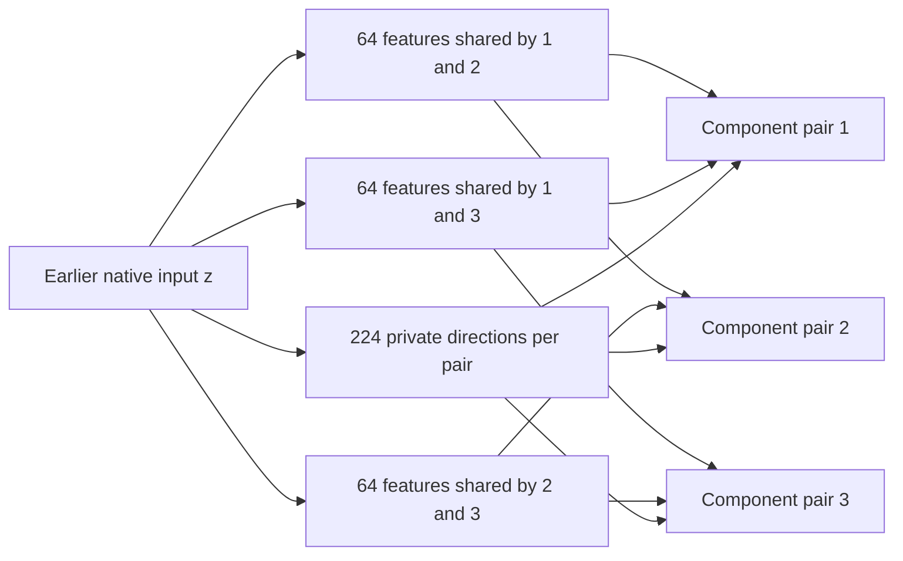

# Learning the input spaces helps, but reuse must be less restrictive

21 September 2026, 12:13 UTC. **Optimizing input subspaces separately from product wiring helped, but the native fit still fails the original fidelity requirement.** The next test changes which components share features: a feature may be reused by two components instead of being forced into a dictionary common to all three.

This continues the [two-stage direction](research_update_2026-09-21_0104_full_coverage_and_shared_baselines.md): first find useful input spaces and computations, then represent them with a cheap arithmetic graph. Current evidence concerns six quadratic reads feeding three selected components, with native intermediate inputs still supplied. It is not a full-model decomposition or an extracted circuit.

**What the completed experiment tested**

The previous graph used 128 shared input directions and 224 private directions for each component pair. Each pair therefore had a 352-dimensional input span. The sparse product wiring limited which quadratic functions it could compute in that span.

We temporarily removed that wiring restriction. For each pair, an orthonormal basis $U$ defines the best dense core directly:

$$
K_o=U^\top T_o U,\qquad \widehat T_o=U K_o U^\top.
$$

Here $T_o$ is one of the pair's two target quadratic forms in the chosen fitting coordinates. We optimized the common and private input directions while recomputing these cores exactly. This isolates input-space discovery from sparse graph fitting.

Five planted targets recovered from both random starts at the 1,800-step budget. We then ran four native-weight fits: covariance-shaped and native-isotropic losses, each with an inherited and a random start, using Muon at initial rate 0.03 with a cosine schedule. The managed run took 262.78 seconds.

**Native results: useful improvement, still a miss**

The primary is the covariance-shaped restart selected by its fitting objective; the inherited start won narrowly.

| Measurement | Previous sparse graph | Learned spans with unrestricted cores | Original larger pair baseline |
|---|---:|---:|---:|
| Covariance-shaped coefficient error | 8.224% | **7.919%** | 7.031% |
| Native-isotropic coefficient error | 61.34% | **60.19%** | 55.26% |
| Component 1 error | 2.41% | **2.35%** | 1.87% |
| Component 2 error | 2.44% | **2.10%** | 2.05% |
| Component 3 error | 13.53% | **11.14%** | 8.81% |

The original coefficient limits allow 10% relative degradation: covariance error must be at most **7.734%**, and native-isotropic error at most **60.786%**. The relaxation passes the latter but fails the former. Individual component and derivative requirements also fail.

The random covariance start reaches 7.923% coefficient error and 10.50% third-component error. It was not promoted after inspecting that better component result. The isotropic fits reach about 51.12% native coefficient error, but about 13.36–13.37% covariance error. The fitting geometry continues to change the tradeoff.

**Unrestricted cores are not a cheap replacement**

Even after computing each shared-common product only once, a direct dense-core implementation would require:

| Cost of the relaxed representation | Count |
|---|---:|
| Stored floating coefficients | 1,305,900 |
| Distinct nonlinear products | 169,872 |
| Source scalar multiplications, including projections and readouts | 1,464,240 |

The original pair baseline uses 1,330,560 source multiplications. Thus the relaxation is a diagnostic, not an adopted simplification. A second graph stage would still have to find a cheaper representation of its interactions.

The result also does not prove that this sharing layout has no better optimum. It shows that two tested starts, which succeed on the planted controls, still miss the native requirements after removing the product restriction.

**The next structural change: share with the consumers that need a feature**

One common dictionary forces all three component pairs to reserve space for the same input subspace. The alternative uses three smaller dictionaries:

$$
s_{12}=P_{12}^\top z,\qquad
s_{13}=P_{13}^\top z,\qquad
s_{23}=P_{23}^\top z.
$$

Each contains 64 linear features. Component pair 1 reads $s_{12}$ and $s_{13}$; pair 2 reads $s_{12}$ and $s_{23}$; pair 3 reads $s_{13}$ and $s_{23}$. Each also retains 224 private directions. Its total input-span dimension remains 352.

This changes where reuse is allowed. It increases the total number of shared directions from 128 to 192, while keeping the shared directions seen by each pair at 128.

There is an exact inherited initialization. Split the old common basis into equal halves $P=[A\ B]$, and set

$$
P_{12}=A,\qquad P_{13}=B,\qquad
P_{23}=\frac{A+B}{\sqrt2}.
$$

Each pair initially spans the same old common space. Subsequent optimization can move the three dictionaries independently. Five planted controls and both native-shape checks verify the initial functional equality and gradients.

A prospective sparse product graph with this layout would use **1,060,224 source multiplications**, a **20.317% reduction** from the original pair baseline, and 1,070,604 stored coefficients. This calculation retains the earlier 160 shared-derived and 224 private projections per pair. It prices only the proposed sparse architecture: **the dense-core relaxation does not inherit this low cost automatically.**

**What is registered next**

Five generic pairwise-sharing toy targets recovered within 1% from both random starts; the worst error was 0.263%. The native experiment compares:

- The old common dictionary, continued for another 1,800 steps.
- Pairwise dictionaries, initialized to exactly the same function and given the same 1,800 steps.
- A fully random pairwise start.

Both fitting geometries are included. The original coefficient limits remain fixed. The matched warm-start comparison requires at least 1% relative improvement in fitting error in both geometries. This separates the effect of the new sharing pattern from extra optimization time. No native pairwise result is available at this report revision.

**Checks, correction and evidence**

An independent CPU audit reconstructs the learned spans using SVD instead of the fitter's QR, then recomputes both coefficient errors, component values and fixed-later-state input derivatives. Metric replay discrepancies are at most approximately $1.1\times10^{-16}$.

The audit initially assumed that cached target values used recomputed RMS scales. Their producer uses saved scales, giving a small $2.73\times10^{-8}$ relative discrepancy under recomputation. Replaying with the original saved scales agrees to $1.06\times10^{-15}$. Candidate comparisons retain recomputed RMS, exactly as in previous studies. This corrects the audit reference assumption; it does not change fit results or fidelity thresholds.

- [Native relaxation results](../../direct_tensor_match/SHARED_SUBSPACE_NATIVE_V1.json), [independent audit and cost](../../direct_tensor_match/SHARED_SUBSPACE_NATIVE_AUDIT_V1.json).
- [Pairwise equality controls and prospective graph cost](../../direct_tensor_match/PAIRWISE_SUBSPACE_PREFLIGHT_V1.json), [random-start toy recovery](../../direct_tensor_match/PAIRWISE_SUBSPACE_TOY_V1.json).
- [Native pairwise preregistration](../../direct_tensor_match/PAIRWISE_SUBSPACE_NATIVE_PLAN_V1.json), [native-shape checks](../../direct_tensor_match/PAIRWISE_SUBSPACE_NATIVE_PREFLIGHT_V1.json).

Component values use the previously examined 448 states. Fresh OOD prediction, selective interventions, stable feature identity and extraction from tokens remain unestablished. The full circuit objective stays active.
