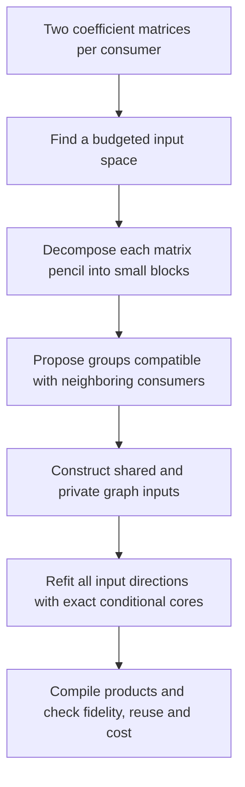

# The two stages now work on noisy planted examples; native transfer remains open

21 September 2026, 13:45 UTC. **We found a more effective way to propose shared features on the toy problems: use the algebra of pairs of quadratic forms, then refit the resulting computation graph.** This recovers examples that random joint optimization missed. A bounded version also passes the registered toy tests and is now being checked at native dimensions. No new native circuit has been accepted.

This follows the [overall trajectory](research_update_2026-09-21_0104_full_coverage_and_shared_baselines.md) and the [coordinate and shared-feature review](research_update_2026-09-21_1320_parameterization_and_shared_feature_discovery.md). The native target remains six quadratic reads feeding three selected components, not the entire folded MLP output.

**Why the previous optimization results changed our approach**

When the shared input spaces were supplied, the private-direction optimizer could recover all five planted cases. When it also had to discover the shared spaces, it recovered none. Restricting directions to supports derived from the target tensors recovered two cases but introduced singular optimization paths.

An explicit private-core amplitude penalty made all 60 fits finite. At penalty strength 0.01, Muon recovered all five cases using the better of two starts, though only seven of ten individual runs passed. The registered geometric-mean selection rule chose a weaker penalty instead, because it rewarded near-zero error on the easy cases; that chosen setting recovered only two of five. We retain both facts: the existence prediction passed, but the selected optimizer setting failed its recovery requirement. A future selection rule should require coverage before rewarding extremely small average errors.

This penalty is not our definition of sparse circuitry. It controls coefficient magnitude and cancellation. The final program still needs explicit counts of distinct computations, coefficients and arithmetic.

**The algebraic proposal: find groups first, then match who reuses them**

Each consumer needs two quadratic reads. Within that pair, a candidate representation is

$$
T_o=F\begin{bmatrix}A_o&0\\0&C_o\end{bmatrix}F^\top,
\qquad F=[P\ D],\qquad o\in\{1,2\}.
$$

Here $T_o$ is a quadratic coefficient matrix, $P$ contains shared input directions, and $D$ contains private directions. The matrices $A_o$ and $C_o$ describe the interactions within those groups.

On the pair's input support, suitable linear combinations of the two coefficient matrices form a **matrix pencil**, a generalized eigenvalue problem. For a regular, diagonalizable pencil, its real one- or two-dimensional blocks provide candidate groups of input directions. We reuse the existing pair compiler to obtain these blocks, including real representations of complex-conjugate eigenpairs.

A proposed shared group must also overlap the input spaces used by the other consumers. Combining those constraints can identify which pencil blocks belong together and which directions are actually reused.

This is a concrete version of the two-stage idea. The decomposition proposes a computation; it does not freeze the final directions. These five fixtures are instances of the same sharing architecture at different dimensions and random coefficients, not five distinct circuit architectures.

The connection to block diagonalization is established mathematics; our cross-consumer grouping rule is the tested construction here. [Fang and colleagues](https://arxiv.org/html/2503.01166v1) study simultaneous block diagonalization by congruence, and [Cai and Li](https://proceedings.mlr.press/v130/cai21a.html) study identification with a common mixing matrix. Their assumptions do not automatically establish uniqueness of our overlapping, potentially overcomplete shared dictionaries. The exact mapping and limitations are in the [mathematical note](../../direct_tensor_match/PENCIL_SHARED_DISCOVERY_NOTE_V1.md).

**What worked, and what the redteam checks rejected**

The exact algebraic search recovers the planted shared subspaces and coefficient tensors in all five cases, with coefficient error at most $4.55\times10^{-14}$. It takes about 0.03 seconds on these small problems. Fifteen tests under changes of input coordinates and output mixing also pass actual graph execution.

The exported graphs save linear projection work while keeping the same number of nonlinear products:

| Toy width | Independently compiled pairs: source multiplications | Shared graph |
|---|---:|---:|
| Small | 252 | **231** |
| Medium | 540 | **498** |
| Larger | 924 | **861** |

These are operation counts for the toy source functions, not model speedups. The baselines already compile each quadratic pair jointly; they are not deliberately duplicated factorizations.

The exact procedure is sensitive to noise. At a relative coefficient perturbation of $10^{-8}$ it still chooses a unique candidate in every case, but only three meet the registered error-amplification limits. At $10^{-4}$ it accepts no unique candidate. Exact toy recovery therefore did not establish a robust method.

We changed the proposal procedure explicitly: truncate each pair's input space to the fixed architecture budget, score approximate compatibility instead of requiring exact intersections, then refit the candidate graph. A first implementation hit a PyTorch L-BFGS gradient-layout error; that run is retained as invalid. Making the parameter and gradient buffers contiguous repaired the instrument without changing the objective or thresholds.

**The noisy two-stage result**

| Proposal search followed by local refitting | Zero-noise coefficient recovery | Coefficient fidelity at 1% noise | Shared-subspace fidelity at 1% noise |
|---|---:|---:|---:|
| Exhaustive block grouping | 5/5 | 5/5 | 4/5 |
| Bounded search, four candidates per intermediate width | 4/5 | 5/5 | 3/5 |
| Bounded search, sixteen candidates per intermediate width | **5/5** | **5/5** | **4/5** |

The noisy coefficient requirement is error no greater than twice the injected relative noise. The subspace requirement is maximum shared-projector discrepancy no greater than 0.1. Both exhaustive and sixteen-candidate searches also pass coefficient fidelity on all five cases at 0.01% noise.

For the exhaustive version at 1% noise, proposals initially have 0.86%–12.77% coefficient error; local refitting reduces them to 0.63%–0.72%. All final graphs compile and execute at the original toy graph cost. One shared-subspace discrepancy remains 0.119, above the 0.1 requirement, even though its reconstructed function is accurate.

The four-candidate search makes this distinction especially clear: one noisy case reaches 1.43% coefficient error but has shared-projector discrepancy 1.24. **Accurate function matching can coexist with substantially different internal features.** This does not establish semantic identity or selective manipulability.

**Why the bounded search matters, and what remains open**

Exhaustively grouping pencil blocks becomes infeasible at native width. The bounded method keeps at most sixteen proposals per intermediate width using an additive overlap heuristic, then evaluates complete proposals with the more accurate subspace score. Its cost grows polynomially for fixed beam width, but it has no guarantee of finding the best grouping. The four-versus-sixteen comparison shows that this choice matters.

The completed native initialization check uses the same architecture as the current cheap graph: 64 directions per reusable edge, 224 private directions per consumer pair, and 352-dimensional pair supports. Both weight-only and covariance-shaped targets are included. Both proposals pass the loss, gradient, compiler, execution and physical-cost checks. Their initial errors are worse than the inherited solutions: covariance-shaped error is 15.80% versus 7.94%, and original-coordinate error is 66.18% versus 50.05%. These are starting points, not fidelity passes. A controlled native refit is now registered: both initializations in both geometries get the same local optimizer budget, with all original component and cost requirements retained.

The full objective still requires a faithful native program, fresh/OOD prediction, stable identification, selective removal or editing, reusable components and an explicit extraction interface. The present result is a successful toy decomposition-to-graph pipeline with clear native applicability questions.

**Native follow-up: the new initialization did not win**

The four-arm comparison has completed. Refitting the inherited graph gives **7.893% covariance error**, versus **8.194%** from the algebraic proposal. The inherited initialization also wins under the original-coordinate objective. All four programs compile at the intended cost, but neither initialization meets all original fidelity requirements. The toy success therefore has not transferred into a better native circuit.

Using the remaining legal arithmetic budget for fourteen additional private directions also fails: the best covariance allocation reaches **7.808%**, still above the **7.734%** limit, and that candidate fails the strict compiler reconstruction check. Both failures remain recorded. A structural null comparison is now testing whether the native pair input spaces are more aligned than independently randomized orientations; that would be compatibility evidence, not identified semantic reuse.

[Controlled native refit](../../direct_tensor_match/PENCIL_JOINT_REFIT_V1.json), [private-capacity result](../../direct_tensor_match/PRIVATE_CAPACITY_V1.json), [structural null plan](../../direct_tensor_match/PAIR_SUPPORT_NULL_PLAN_V1.json), [three-hour math/literature review](../../THREE_HOURLY_MATHEMATICAL_REVIEW_2026-09-21_1350.md).

**Evidence**

- [Penalty sweep](../../direct_tensor_match/REGULARIZED_JOINT_TOY_V1.json) and [selection-rule audit](../../direct_tensor_match/REGULARIZED_JOINT_SELECTION_AUDIT_V1.json).
- [Exact algebraic discovery](../../direct_tensor_match/PENCIL_SHARED_DISCOVERY_V1.json), [coordinate/output and executable-cost audit](../../direct_tensor_match/PENCIL_SHARED_DISCOVERY_AUDIT_V1.json), [failed exact-noise test](../../direct_tensor_match/PENCIL_SHARED_NOISE_V1.json).
- [Corrected exhaustive two-stage result](../../direct_tensor_match/APPROXIMATE_PENCIL_TOY_V2.json), [four-candidate result](../../direct_tensor_match/APPROXIMATE_PENCIL_TOY_V4.json), [sixteen-candidate result](../../direct_tensor_match/APPROXIMATE_PENCIL_TOY_V5.json).
- [Native proposal results](../../direct_tensor_match/PENCIL_NATIVE_PROPOSAL_V1.json) and [controlled refitting plan](../../direct_tensor_match/PENCIL_JOINT_REFIT_PLAN_V1.json).
