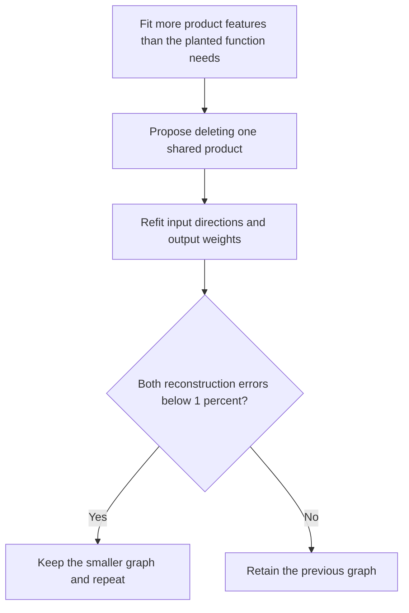

**Learning features, then simplifying their graph: latest results**

21 September 2026, 17:42 UTC.

We have now tested a concrete, restricted version of the two-stage approach on five known structures, and allowed the full last-MLP replacement to learn new input features. **The toy graph simplification works in four of five cases. The full-model candidate fits its training objectives better but performs worse on the native intervention checks. It is not adopted.**

The overall plan remains QR output reduction → decomposition proposals → arithmetic graph simplification → behavioral validation. This update concerns the quadratic full last-MLP target and small quadratic controls; it is not a completed HT or arbitrary-DAG search.

**What worked in controlled examples**

The five structures were independent products, a shared input direction, a shared output direction, squares, and exactly cancelling teacher terms. Each has a four-product representation. Products used by multiple outputs count once; input projections and output coefficients are also charged.

Random four-product fits were unreliable. With exact output-weight solves and a longer Adam schedule, eight of ten family/start cases recovered the function within1%error. Allowing six products raised this to nine of ten, with at least one success in every family. Adam performed better than Muon under these particular tested schedules; this is not a general optimizer verdict.

Starting with the wider fits, we then tested every single-product deletion and refit the surviving features. **Four of five families reached four products while preserving the error limit**, reducing stored coefficients from126to84. The difficult fifth family stayed at six products because its proposed deletions failed. We did not force a passing simplification or equate good reconstruction with unique feature identity.

This is a limited but actual decomposition-to-graph-edit experiment. The edit set currently covers product deletion plus continuous refitting, not arbitrary new intermediate nodes, cross-depth sharing or a full HT-to-DAG compiler.

**What happened on the full last MLP**

The full-layer experiment kept3686products and14,067,072stored coefficients, the same budget as the affine-corrected pruning baseline. It learned both input directions and solved output weights exactly at each step. It used historical states for its response constraint; the evaluation documents did not enter fitting or selection.

| Candidate | Covariance coefficient error | Calibration response error |
|---|---:|---:|
|Fixed products, response-refitted outputs|11.17%|3.53%|
|Learned products, inherited start|10.57%|1.88%|
|Learned products, random start|44.82%|3.54%|

The inherited start won by fitting loss. Its100-step run improved the objectives, although it missed the registered10%relative coefficient improvement. The random run shows why low calibration response error alone is not enough: its coefficient error remains much larger.

**The native tests reject the new candidate**

For these tests, we swap the preceding MLP's contribution along its direct residual path, then recompute the last MLP's input normalization and downstream output. Attention remains fixed to the recipient, so this is a specified path intervention rather than every consequence of changing the preceding MLP.

The learned program's full intervention-effect errors are11.23–20.07%, failing all four primary cohorts. The previously tracked continuation-mode response also fails on FineWeb. Its natural-input effect errors still pass the loose10%limit, but increase from4.44%to6.64%onFineWeb and2.12%to2.78%oncode relative to the original pruning baseline. Average cross-entropy damage also increases.

Export replay and mathematical implementation controls pass. One earlier toy control did contain a reference mismatch—it omitted a small regularizer used by the solver—and that was corrected without loosening the numerical tolerance. We retain both that correction and the substantive optimizer/native failures.

The current evidence therefore separates three things: fitting a function, finding a smaller executable representation, and preserving its causal behavior. We have progress on the first two in controlled examples. The native learned-direction result shows that the chosen coefficient and response objectives do not yet reliably achieve the third. More sweeps of that same objective are not the most informative next step.

[Detailed toy results](../../direct_tensor_match/LEARNED_FULL_QUADRATIC_TOY_INTERPRETATION_V1.md) · [Full-layer result and limitations](../../direct_tensor_match/LEARNED_FULL_QUADRATIC_INTERPRETATION_V1.md) · [Overall two-stage explanation](research_update_2026-09-21_0104_full_coverage_and_shared_baselines.md).
