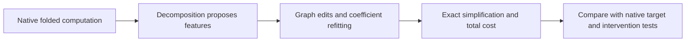

**Graph-search progress and the native capacity limit**

Updated 21 September 2026, 18:41 UTC.

We now have more of the second stage you proposed: exact functional sharing, approximate sharing followed by refitting, and replacing one intermediate with a combination of other features. Five planted examples pass for each new class of edit, including negative controls where similar-looking features must remain distinct. These are algorithm controls, not identified model circuits.

The native graph experiments have not produced a usable replacement. The strongest tested substitution plus exact readout simplification saves about 25% of products and coefficients, but retains27% calibration error relative to an already approximate program. That is insufficient.

The last step exposed an important scope issue. A small graph can approximate an old low-rank approximation while lacking the capacity to reproduce the native target.

Let a quadratic feature be a scalar function $q_i(x)$ of degree two. A pure quartic readout of $m$ such features is

$$
y_v(x)=\sum_{i\leq j}W_{vij}q_i(x)q_j(x).
$$

It has at most $m(m+1)/2$output directions. “Output rank” counts independent output patterns, not the number of input coordinates or human concepts. Singular values of the target give a lower bound on error at each output rank.

| Target being matched | Best possible error with six output directions |
|---|---:|
|Old approximate program, two cached panels|0.50% / 0.31%|
|True native quartic path, two cached panels|5.91% / 5.72%|

For the true native quartic target,1% error requires at least 414–430 output directions. Under this particular pair-product architecture, that requires at least 29 quadratic features. Those are **necessary bounds, not a guarantee that a 29-feature fit will work**. Other graph structures and skip paths have different capacity and costs.

This target is the pure degree-four MLP16→MLP17→unembedding contribution. It excludes residual/bias terms and normalization between those polynomial operations; it is not the whole model. The empirical bounds use saved native target values on 2048 rows per panel, not newly collected OOD data.

Separately, full-last-MLP experiments improved finite-source-response fitting from 4.55% to 3.26%, but still failed three of four native full-path intervention cohorts. A subsequent audit located error growth before final normalization. New pairings of the same historical states raised error to 5.22%; native matched swaps reached 7.45–15.03%. Pair overfitting explains part of the gap, not all of it.

The next decomposition should use the **native target's capacity requirements**, then apply the graph edits to that wider representation. The current tools can simplify planted programs; we have not established that they recover simple, reusable, selectively manipulable native circuits.

[Capacity derivation and receipts](../../direct_tensor_match/QUARTIC_DICTIONARY_CAPACITY_INTERPRETATION_V1.md) · [Graph substitution results](../../direct_tensor_match/DAG_DICTIONARY_SUBSTITUTION_INTERPRETATION_V1.md) · [Intervention transfer diagnostics](../../direct_tensor_match/FINITE_RESPONSE_GEOMETRY_INTERPRETATION_V1.md).
