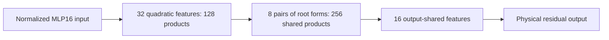

**A smaller shared arithmetic program, with model-level validation still outstanding**

21September2026,19:56UTC. This continues the [overall QR → decomposition → graph review](research_update_2026-09-21_0104_full_coverage_and_shared_baselines.md).

We now have a concrete second-stage graph simplification. Starting from32 learned quadratic features, we fit a readout with16 shared output directions. Each output direction receives a quadratic function of those features. Pairs of these functions can reuse the same products.

The resulting program uses **384 products and322,048 coefficients**, compared with **656 products and903,168 coefficients** in its unconstrained parent. All learned dense projections are counted. The graph also stores768 integer indices.

This does not mean we have identified16 semantic concepts. An output-shared feature can combine several conditions that produce the same output effect. We have not tested selective semantic removal or stable feature identity.

There were two distinct outcomes. Directly fitting eight output directions improved the fitting objective but still failed its value-fidelity limit. The16-direction secondary fit passed its specified comparisons to the parent. We then used that fixed function for a separately registered exact graph rewrite; the failed eight-direction primary remains a failure.

The rewrite initially fell back on one matrix pair and missed its product-count target. Redteaming found a numerical coordinate issue: equivalent output-pair coordinates passed the **same** reconstruction tolerance. No tolerance was loosened. The repaired graph agrees with the16-direction program to better than **0.00006% relative output error** on both opened panels.

Against the original pure quartic target, that program's value errors are about **8.28% and13.61%**. Those are polynomial-output errors, not language-model error rates. Normalization, residual cross terms, biases and attention backgrounds remain explicit outside the fitted polynomial. The next test is installation into the existing native branch-replacement interface, with cheap baselines included.

The scheduled mathematical/literature review connected the fixed-feature solver to reduced-rank ridge regression and the exact rewrite to canonical forms of real symmetric matrix pairs. It also records why HT depth results and weighted-automata recovery guarantees do not automatically establish circuit discovery here. [Mathematical review](../../THREE_HOURLY_MATHEMATICAL_REVIEW_2026-09-21_1953.md) · [Detailed results and literal prices](../../direct_tensor_match/PAIRED_ROOT_INTERPRETATION_V2.md).
