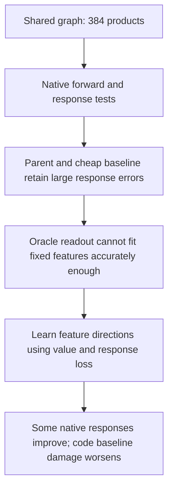

**Response-aware features help, but we still do not have a reliable replacement circuit.**

21 September 2026, 20:26 UTC. Follow-up to the [overall two-stage review](research_update_2026-09-21_0104_full_coverage_and_shared_baselines.md).

The latest work tests whether the compressed polynomial preserves changes, not just ordinary outputs. A **response** here is the difference between the final logits before and after changing the input of the pure quartic MLP16→MLP17 term. Other terms and the recipient normalization denominator stay fixed; final normalization and softcapping are evaluated. This is an internal-term intervention, not a full upstream-source swap or a semantic edit.

The 384-product graph closely preserves its 656-product parent's behavior, but does not beat the 26-product baseline. We then allowed optimal output weights with the features frozen. Even these in-sample oracle fits left 10.5–16.6% polynomial-response error in the wider dictionary. That motivated changing the features themselves.

The new matched comparison uses the same starting features, 300 Adam steps and 656 products. One fit matches ordinary values; the other also matches changes halfway toward a donor input. On the previously opened second polynomial panel, response error improves **27.69% → 21.11%**, and value error improves **13.02% → 11.85%**.

Installing those frozen programs in the model gives:

| Native response error; lower is better | Value-only fit | Response-aware fit | Cheap 26-product baseline |
|---|---:|---:|---:|
| FineWeb, halfway change | 42.35% | 34.29% | 42.55% |
| FineWeb, full change | 26.83% | 27.19% | 28.41% |
| Code, halfway change | 37.12% | 27.76% | 36.28% |
| Code, full change | 33.42% | 25.76% | 31.59% |

These errors compare logit-change vectors, normalized by the native change. They are not language-model error rates. Numerical replay and zero-change controls pass. The registered 10% absolute target still fails, as does the requirement for at least 20% improvement over the matched control in every setting.

There is also a tradeoff: code baseline CE damage rises from **0.0129 to 0.0293 nats/token**. Lower is better. Better intervention responses do not make that regression disappear. These are opened-panel diagnostics, not independent final OOD confirmation.

The optimizer controls remain informative too. Both Adam and Muon recover all five planted families from near-solution starts. At the tested 300-step budget, random-start recovery is only 1/10 for Adam and 0/10 for Muon. We have evidence for refinement, not robust discovery from scratch or uniquely meaningful features.

The next objective covers the entire interpolation path rather than one halfway point. Since the polynomial is quartic, five Gauss–Legendre points integrate its squared response error exactly. I implemented this objective and checked its values and gradients against independently expanded polynomial coefficients. Native training with it has not yet run, and its algebraic exactness does not extend through normalization or softcapping.

[Native results and execution correction](../../direct_tensor_match/RESPONSE_FEATURE_INTERCHANGE_INTERPRETATION_V2.md) · [Matched feature fits](../../direct_tensor_match/QUARTIC_RESPONSE_FEATURE_INTERPRETATION_V1.md) · [Oracle capacity diagnostic](../../direct_tensor_match/QUARTIC_RESPONSE_SPAN_INTERPRETATION_V1.md).
