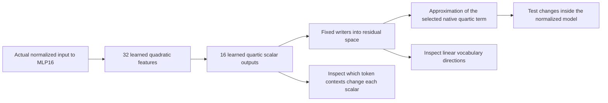

**What the shared features respond to—and what those features actually are**

Original analysis: 21 September 2026, 21:12 UTC. Rewritten 22 September 2026, 00:00 UTC with construction details and completed follow-up results. The associations below come from the original 384-product graph; later CP experiments approximate the same output projections using different internal computations.

**The object under discussion.** We are inspecting an approximation of one polynomial contribution through the **last two MLPs** of the 18-block FineWeb model. These are MLP16 and MLP17 in zero-based indexing. We are not inspecting 16 native neurons, the entire model, or a complete decomposition of both blocks.

At a single token position, let $x\in\mathbb R^{1152}$ be the actual RMS-normalized input to MLP16. Its bias-free bilinear output, with the relevant residual coefficient included, is

$$
m(x)=\lambda D_{16}[(L_{16}x)\odot(R_{16}x)].
$$

Our selected target is the term where this contribution enters **both** multiplicative input factors of MLP17:

$$
F_4(x)=D_{17}[(L_{17}m(x))\odot(R_{17}m(x))].
$$

It is degree four in $x$, hence “quartic.” The other residual contributions, cross terms with those contributions, attention, and biases are outside this selected target. Normalization and softcap remain explicit in actual model tests. The [overall contextual review](research_update_2026-09-22_0000_model_context_and_research_trajectory.md) shows the full model path and expansion.

**Sixteen scalar outputs of a replacement program.** The original fitted graph computes 32 quadratic intermediates and combines their products into 16 quartic scalars:

$$
q_i(x)=\sum_{k=1}^{4}(u_{ik}^{\top}x)(v_{ik}^{\top}x),
\qquad
h_g(x)=\sum_{i\le j}A_{gij}q_i(x)q_j(x),
\qquad
\widehat F_4(x)=\sum_{g=0}^{15}w_g h_g(x).
$$

The $q_i$ and $h_g$ are learned features of the replacement, not individual channels copied from the model. Each $h_g(x)$ is **one number at one token position**. Its writer $w_g$ is a 1,152-dimensional residual direction. The vector $U_{\rm vocab}w_g$ tells us the corresponding linear vocabulary effect before final normalization and softcap.

We imposed output rank 16 to compress an existing fitted parent. The primary directions came from a weighted SVD that used calibration values and responses in a vocabulary-error-preserving coordinate system. Thus “16” is a chosen approximation width. It is not an estimate that the model contains exactly 16 semantic concepts. The [new geometry audit](../../direct_tensor_match/SHARED_FEATURE_CONTEXT_AUDIT_V1.json) confirms 16 writer columns of length 1,152 and vocabulary-space orthogonality to about $2\times10^{-7}$.

“Shared” means many products can contribute to the same $h_g$ and therefore the same output direction. Several distinct conditions can share an effect. We should describe those conditions rather than force one semantic name onto their sum. The feature number is a zero-based index in this saved basis; changing basis or refitting can change both its index and interpretation.

**Three different questions we asked.** First, which contexts are associated with a scalar's value? Second, what does its writer do in a linear vocabulary readout? Third, does changing the corresponding computation inside the model produce the hypothesized selective effect? These require separate evidence. The first two generate a hypothesis; they do not answer the third.

**What the original inspection found.** We computed the 16 scalars on 6,144 calibration states from 96 text prefixes, using positions 0–63. For each feature, we inspected high and low standardized values from distinct prefixes and the largest positive and negative entries of its vocabulary writer. Then we evaluated selected condition scores on another 2,048 states from 32 prefixes.

A standardized value means

$$
z_g(x)=\frac{h_g(x)-\operatorname{mean}_{\rm cal}(h_g)}{
\operatorname{std}_{\rm cal}(h_g)}.
$$

It measures deviation from the calibration mean, not a probability. The large raw quartic values in the archive are numerator values before the native normalization denominator; they should not be read as literal logit changes.

| Candidate condition | Scalar score selected on calibration | Calibration AUC | Evaluation AUC | Evaluation support |
|---|---|---:|---:|---|
| Current token is a newline | Negative of feature 1 | 0.997 | 0.998 | 30 positive positions across 21 prefixes |
| Token bytes leave a pending UTF-8 sequence | Negative of feature 15 | 0.967 | 0.983 | 15 positive positions across 8 prefixes |

AUC measures ranking: roughly, how often a randomly selected positive condition receives a larger score than a negative condition. It is not the fraction of correct next-token predictions, and 0.998 AUC does not establish a causal explanation.

**Feature 1: a newline-associated scalar.** One calibration example at a strongly low value is the context ending `Friday, May 7th, 2010\n`, with standardized score about $-8.01$; the next token is `It`. Another low example ends a sentence about the United States with a newline; the next token is `Obama`. These are selected descriptive examples, not independent evidence of generalization. The evaluation AUC above is the additional condition check.

The writer contains negative entries for tokens such as ` PHOTO`, ` ACTIONS`, and ` SOFTWARE`, and positive entries for token strings such as `multipl`, `instance`, and `inventory`. A negative scalar times a negative writer entry gives a positive contribution in that linear readout. Also, “low relative to the mean” and “negative raw scalar” are different statements. We therefore should not interpret a list of top writer tokens without its sign and activation context.

Those observations suggested a hypothesis about capitalization after a newline. But the defensible descriptive label is **“a quartic scalar associated with newline positions, with this particular signed output direction.”** It is not yet “the capitalization neuron.”

**Feature 15: a possible byte-continuation association.** Some low examples end in an incomplete byte sequence that displays as the replacement character `�` when decoded separately. One is a context about an Ed Sheeran album; another begins “Continuing his special series of …”. The condition itself was defined using bytes and the UTF-8 decoding state, not merely whether the displayed text contains that replacement symbol.

The top examples are heterogeneous: another low example concerns a television service and does not obviously share that description. This is exactly why an aggregate can have several constituent conditions. Feature 14 also had visually striking byte-related examples, but the calibration-based selection chose feature 15. We should preserve that selection rule rather than relabel after seeing evaluation results.

The registered check required AUC at least 0.9 and at least 20 positive and 20 negative evaluation examples. The UTF-8 condition had only 15 positives, so it **did not pass the support requirement** despite its high AUC. The analysis excluded 64 calibration positions following an invalid-prefix event; no evaluation positions required that exclusion.

**How much is explained by the token itself?** A token-identity lookup explained about 78% of the newline feature's variation and about 30% of the UTF-8 feature's variation. About 62% of evaluation token IDs appeared in the training lookup. This is a substantial confound for interpreting the first feature as a rich contextual computation: much of its variation is predictable from the current token. It does not establish that all remaining variation is meaningful context processing.

A later comparison therefore held the newline token fixed and compared different contexts. The original small graph reproduced changes in the native projected component with 15.32% relative error and approximately 0.990 correlation. High correlation did not meet the 10% error criterion. A simple amplitude correction could not eliminate the error.

**What we actually remove in a causal test.** Let $w_1$ be the fixed writer associated with feature 1. The native branch's coefficient in that direction is measured using a vocabulary-metric reader,

$$
r_1=\frac{U_{\rm vocab}^{\top}U_{\rm vocab}w_1}
{\|U_{\rm vocab}w_1\|_2^2},
\qquad
h_1^{\rm native}(x)=r_1^{\top}F_4(x).
$$

This defines a native projected component even though $h_1$ originated as a learned approximation. Removing a fraction of $h_1^{\rm native}w_1$ is an operational intervention on that component. The implementation divides by the actual MLP17 normalization denominator, preserves the other contributions at the interface, and runs the final RMS normalization and softcap. We compare that intervention with the one produced by the replacement's predicted scalar.

Two separate questions result: **Does the replacement reproduce the native removal? Does the native removal have the proposed semantic selectivity?** Success on the first does not imply success on the second.

**What the completed follow-ups changed.** The original 384-product graph had roughly 26–31% error in the final-logit changes caused by quarter/full removal on newline positions. New, larger CP candidates learned with the mixed coefficient/Gaussian objective reduced these errors to about **5.3–7.6%** across the tested FineWeb/code newline cells and both starts. They still use the same fixed native projection as the target; they do not reuse the original graph's internal quadratic features.

Every newline cell passed 10%, but some other-token cells failed, so the registered all-cell criterion failed. These were previously opened panels, not a new untouched out-of-distribution test. The improvement means we can now imitate this particular component removal much more accurately in those settings.

The semantic hypothesis remains unsupported: the native capitalization effects also occurred away from newlines and did not behave consistently across FineWeb and code. Improving the approximation does not fix a lack of selectivity in the native component itself. We should retain the newline association as an observation and the improved removal fidelity as a separate result.

**What this report establishes.** We have two interesting associations in scalar outputs of a specific learned quartic approximation, one well-supported condition-ranking result, one under-supported byte hypothesis, and improved reproduction of a fixed component intervention. We have not shown that all 16 outputs are monosemantic, that these directions are uniquely identifiable, or that they are reusable language circuits.

**Artifacts and provenance.** The original graph is `EXPANDED_ROOT_EMPIRICAL_V1.pt`, SHA-256 `f50ab7fe62295fd338e883c486ca1d77d3dbf9d3d21883f8b7b95393bf6fb2df`. Its independently assembled scalar outputs reproduce the saved graph output exactly in the CPU float64 audit. See [all 16 feature examples and writer tokens](../../direct_tensor_match/ROOT_FEATURE_CONDITIONS_V1.json), [condition-transfer results](../../direct_tensor_match/ROOT_CONDITION_TRANSFER_V1.json), [support audit](../../direct_tensor_match/ROOT_CONDITION_SUPPORT_V1.json), [inspection implementation](../../direct_tensor_match/audit_root_feature_conditions.py), and [completed CP removal follow-up](../../direct_tensor_match/MIXED_CP_REMOVAL_INTERPRETATION_V1.md). The new overall review explains the broader decomposition trajectory and remaining limits.
