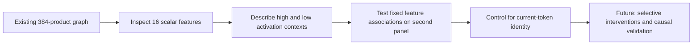

**Since the overall review: inspecting what the shared features represent**

21:12 UTC, 21 September 2026. This is a follow-up to the [overall decomposition review](research_update_2026-09-21_0104_full_coverage_and_shared_baselines.md).

**The new work is an inspection of the learned features, followed by a small transfer check.** We have not trained another decomposition or improved the circuit's intervention accuracy since the overall review. Instead, we asked whether the 16 shared output features in the existing 384-product graph correspond to describable conditions.

Two patterns stand out: newlines and unfinished UTF-8 byte sequences. The newline association transfers strongly to a second panel, but a simple current-token lookup explains much of it. The UTF-8 association also looks strong, but has too few second-panel positives to pass the registered support requirement. These are candidate descriptions, not identified causal circuits.

**Where this fits into the two-stage approach**

The existing graph first computes 32 quadratic features of the model input. It then combines their products into 16 quartic features, each with an output direction:

$$
q_i(x)=\sum_{k=1}^{4}(u_{ik}^{\top}x)(v_{ik}^{\top}x),
\qquad
h_g(x)=\sum_{i\le j}A_{gij}q_i(x)q_j(x),
\qquad
\widehat F(x)=\sum_{g=1}^{16}w_g h_g(x).
$$

Here $q_i$ is a quadratic scalar computation, $h_g$ is a quartic scalar computation, and $w_g$ is its residual-stream output direction. The graph compiler shares products when evaluating the $h_g$. The present analysis inspects these scalar values and their output directions; it does not change the graph.

**What the inspection found**

I inspected high- and low-activation contexts from distinct prefixes, along with vocabulary directions obtained by applying the unembedding to each $w_g$. Reassembling all 16 features and their writers reproduced the existing graph exactly in the CPU check.

Several extremes occurred at newlines, quotation boundaries, number punctuation and partially emitted Unicode characters. These conditions are more concrete than a broad semantic label, but top examples alone can be misleading. The vocabulary directions are also measured before final normalization and softcapping; they are not the actual nonlinear logit changes caused by removing a feature.

For the follow-up, I defined two observable conditions:

- **Newline:** the current token's bytes contain a newline.
- **Pending UTF-8:** after consuming the token prefix, a strict byte decoder is waiting for more bytes to complete a character. A tokenizer can divide one character across tokens; this is not necessarily malformed text.

For each condition, I selected the single feature and sign with the best calibration AUC, then evaluated that same feature and sign on the existing second panel. AUC measures how well the scalar ranks positive examples above negative ones: 0.5 is chance ranking and 1 is perfect ranking. It does not measure causal importance or classification accuracy at a fixed threshold.

| Condition | Selected scalar | Calibration AUC | Second-panel AUC | Second-panel positives |
|---|---|---:|---:|---:|
| Newline | Negative of feature 1 | 0.997 | **0.998** | 30 across 21 prefixes |
| Pending UTF-8 | Negative of feature 15 | 0.967 | **0.983** | 15 across 8 prefixes |

Feature numbers are zero-based identifiers in this particular fitted basis. They are not stable names across refits or equivalent basis rotations. Feature 15 was selected using all calibration examples; a different feature, 14, had visually striking UTF-8 extremes in the initial inspection. This illustrates why we should not select a feature from a few impressive examples alone.

The registered joint transfer test required AUC at least 0.90 and at least 20 positives and negatives for each condition. **It fails because the UTF-8 second-panel support is only 15.** The newline condition individually meets those numerical requirements. The second panel was already used in earlier research, so this is not untouched OOD confirmation.

**The current-token control changes the interpretation**

A feature that identifies a newline might mostly reflect the current token, rather than a contextual computation discovered by the hierarchy. To check this, I used calibration data to assign each token ID its mean feature value. This predictor sees only the current token, with a global-mean fallback for unseen IDs.

On the second panel, that lookup explains approximately **78% of the newline-associated feature's variation**. The pending-UTF-8 feature gives **30%**. About 62% of second-panel positions have token IDs seen in calibration.

These are feature-value $R^2$ scores, not the AUC scores above. The result makes a token-linked interpretation plausible for the newline feature. The unexplained variation does not establish contextual reasoning: finite samples, unseen tokens and nonlinear token effects can also limit the lookup. Likewise, detecting a pending byte sequence is not evidence of a high-level semantic concept.

**What remains true from the previous result**

The arithmetic compression remains useful: 656 products became 384, with stored floating-point coefficients falling from 903,168 to 322,048. The sharing compiler preserves the fitted function very accurately. However, the fitted function still has roughly **19–29% error in the tested native intervention responses**, and the code cross-entropy comparison misses its allowed margin. Today's feature associations do not repair or override those failures.

The next useful question is whether changing one of these computations causes the predicted output effect selectively, including in contexts with the same current token. That would begin distinguishing a reusable causal computation from a scalar that merely reports an input property. It requires actual removal/swap tests and control behaviors; neither has been established for these features.

**Evidence and reproduction**

The frozen program is `EXPANDED_ROOT_EMPIRICAL_V1.pt`, SHA-256 beginning `f50ab7fe62295fd3`. Analysis used CPU float64, 6,144 calibration states and 2,048 second-panel states, all at positions 0–63 of cached prefixes. Calibration selected the feature and sign; no coefficients were refitted. Root/readout replay discrepancy was zero on both panels. The UTF-8 analysis excluded 64 calibration positions after an invalid prefix-decoding event; the second panel had none. The support audit checked how positives were distributed across prefixes.

[Feature inventory and contexts](../../direct_tensor_match/ROOT_FEATURE_CONDITIONS_V1.json) · [Registered diagnostic](../../direct_tensor_match/ROOT_CONDITION_TRANSFER_PLAN_V1.md) · [All feature scores and controls](../../direct_tensor_match/ROOT_CONDITION_TRANSFER_V1.json) · [Prefix-support audit](../../direct_tensor_match/ROOT_CONDITION_SUPPORT_V1.json) · [Analysis code](../../direct_tensor_match/audit_root_condition_transfer.py) · [Earlier native intervention results](../../direct_tensor_match/EXPANDED_ROOT_NATIVE_V1.json).
