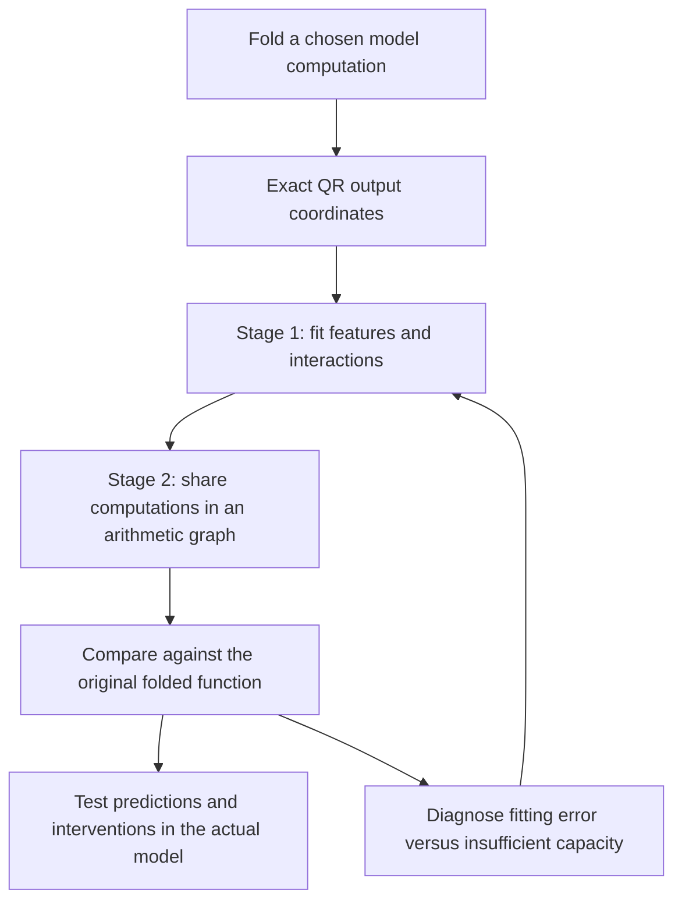

**What changed after the two-stage decomposition proposal**

21 September 2026, 22:13 UTC. This update follows the overall review rewritten at 21:08 and the feature inspection at 21:12 on 21 September. It covers completed experiments through the 22:02 capacity analysis. It concerns the decomposition work; other research in this folder has separate scopes.

**We have made the failure more understandable, but have not yet found a faithful replacement circuit.** The two-stage idea remains: discover computations with a structured tensor decomposition, then simplify their arithmetic graph by sharing intermediate values. Since the last explanation, we tested whether the smaller graph's features have meaningful effects, tried better fitting objectives, implemented exact weight-based feature optimization, and measured a structural limit on the graph's capacity.

The strongest new result is that **the existing 384-product program is too small to meet the 10% target in our measured tensor-contraction test—even with a perfect optimizer.** Separately, optimization still struggles on some small problems where we know an exact solution exists. Both issues matter. This is more specific than saying “Tucker or HT failed.”

**Where QR, decomposition and graph simplification stand**

For one bilinear MLP, the folded function is

$$
F(x)=UD[(Lx)\odot(Rx)].
$$

Here $x$ is the 1,152-dimensional input; $L$ and $R$ each produce 4,608 scalar projections; $\odot$ multiplies corresponding projections; $D$ writes the products back into the residual stream; and $U$ maps that stream to vocabulary outputs.

The existing implementation uses thin QR of the unembedding:

$$
U=Q R_U,\qquad Q^\top Q=I,\qquad C=R_U D.
$$

We can fit $C[(Lx)\odot(Rx)]$ in 1,152 output coordinates and restore vocabulary outputs with $Q$. This preserves Euclidean error exactly. It is an output-coordinate reduction, not a reduction in the number of products. The recent work has not changed this step.

A single bilinear layer has an **order-three tensor**: one output index and two input indices. Substituting two pure bilinear layers produces a **degree-four polynomial** and an **order-five tensor**: one output index and four input indices. Tensor order counts indices; polynomial degree counts input factors.

The latest experiments concern a smaller, explicitly scoped target: **the pure quartic branch through MLP16 and MLP17, projected onto 16 fixed output readouts**. Indices are zero-based. Those readouts were selected using data. This is a further restriction beyond exact QR; it does not preserve all output directions. Residual cross terms, attention, normalization and softcapping are not absorbed into this quartic tensor. Model-level tests retain the actual normalization and softcap explicitly.

The working hierarchy computes

$$
q_i(x)=\sum_{k=1}^{4}(u_{ik}^{\top}x)(v_{ik}^{\top}x),
\qquad
h_g(x)=\sum_{i\le j}A_{gij}q_i(x)q_j(x),
\qquad
\widehat F(x)=\sum_{g=1}^{16}w_g h_g(x).
$$

There are 32 quadratic features $q_i$, 16 quartic features $h_g$, and fixed residual output directions $w_g$. The sharing compiler reduced a 656-product parent to **384 products**, with stored floating-point coefficients falling from **903,168 to 322,048**. That earlier result still stands. The compiler reproduces its fitted input function accurately; it cannot repair errors already present in that function.

HT organizes tensor slots in a tree. Our shared graph can reuse intermediate computations across consumers. We have structured fits, several graph edits and specialized sharing machinery; **we do not yet have the complete general-purpose arithmetic-DAG search described in your proposal**. A DAG is a directed acyclic graph in which an intermediate is computed once and can have multiple consumers.

**1. The interesting feature associations did not become selective circuits**

The previous update reported a very strong association between one learned feature and newline tokens. We subsequently asked two harder questions.

First, does the feature predict changes between contexts containing the **same current token**? A token lookup alone predicts no change. The learned feature captured genuine contextual variation, with correlation **0.990**, but its relative response error on the second panel was **15.32%**, missing the 10% target. Removing any one prefix from the analysis still left error above 10%.

Second, does removing the component produce a predictable, selective behavioral effect? We compared removing the learned scalar contribution with removing the original quartic function's projection onto the same output direction. We evaluated the actual final logits and a contrast between uppercase- and lowercase-initial vocabulary tokens.

The learned removal had **roughly 12–31% logit-response error** across the tested conditions. Every condition failed the 10% criterion. The effect was not sufficiently concentrated after newlines, and its pattern differed between FineWeb and code. Thus the earlier newline association did not establish a capitalization circuit. The original projection is itself defined using the learned output direction; it is an operational reference, not a uniquely identified native semantic unit.

[Same-token comparison](../../direct_tensor_match/ROOT_MATCHED_READER_INTERPRETATION_V1.md) · [Removal experiment](../../direct_tensor_match/ROOT_CASE_ABLATION_INTERPRETATION_V1.md).

**2. We found why a good scalar fit could still produce a poor intervention**

Errors matter more at states where the downstream model is sensitive to the component. On FineWeb newline positions, ordinary scalar error was only **5.34%**, while quarter-strength removal produced **26.08%** logit-response error.

Let $t(x)$ be the original projected scalar, $h(x)$ its approximation, and $J(x)$ the derivative of final logits with respect to that scalar contribution, including the actual normalization and softcap. A local response-aware error is

$$
E_{\mathrm{sensitivity}}=
\sqrt{\frac{\sum_x (h(x)-t(x))^2\|J(x)\|_2^2}
{\sum_x t(x)^2\|J(x)\|_2^2}}.
$$

That metric predicted **24.89%**, much closer to the measured 26.08%. It explains how ordinary scalar reconstruction hid consequential mistakes. It remains a local approximation; stronger removals add nonlinear error.

We then fitted readouts and feature directions using these sensitivity weights. Calibration improved, but transfer did not: mean per-feature weighted error fell from **22.24% to 6.14%** on calibration and changed from **47.32% to 49.23%** on the second panel. Optimizing the average across features also traded accuracy away from the previously highlighted newline feature. Better training loss did not establish better component prediction.

This is related to your request for data-informed geometry, but it is not simply inserting an input covariance matrix. Input covariance, coefficient weighting and state-dependent downstream sensitivity define different objectives. For quartic function error, second moments alone do not determine the required eighth moments of actual inputs.

[Sensitivity diagnosis](../../direct_tensor_match/ROOT_REMOVAL_GEOMETRY_INTERPRETATION_V1.md) · [Feature-fitting results](../../direct_tensor_match/SENSITIVE_ROOT_FEATURE_FIT_INTERPRETATION_V1.md).

**3. Synthetic probes exposed overfitting; exact weight matching removed that ambiguity**

We also trained on inputs sampled from a standard Gaussian, with targets generated directly from the original weights. This tests the polynomial away from observed text states. It is not a language-model OOD evaluation.

| Fitting objective | Gaussian training error | Fresh Gaussian error |
|---|---:|---:|
| Synthetic function values only | 3.53% | 94.50% |
| Synthetic values plus text-sensitive fitting | 4.72% | 95.24% |

These fits nearly interpolated the training probes without recovering the function. A simple 33-product radial baseline achieved **87.40%** fresh error, outperforming both 384-product fits. All remain poor approximations. Numerical replay checks passed, and an overwhelming ridge penalty did not explain the gap.

This made your distinction especially important: **matching a finite set of weight-generated outputs is not the same as directly matching coefficient tensors.**

We therefore implemented an exact coefficient objective for learning the feature directions. Let $\phi_i$ denote a candidate quartic basis polynomial, $H_g$ the original tensor for output readout $g$, and $C_{gi}$ its learned readout coefficient. Define

$$
K_{ij}=\langle\phi_i,\phi_j\rangle_F,
\qquad
X_{gi}=\langle H_g,\phi_i\rangle_F.
$$

The inner products are of fully input-symmetrized coefficient tensors. They are computed through the weight factors without storing the enormous tensors. With ridge coefficient $\rho$, optimize

$$
\mathcal L(C,\theta)=
\operatorname{tr}(CKC^\top)-2\langle C,X\rangle_F
+\rho\|C\|_F^2,
\qquad C=X(K+\rho I)^{-1}.
$$

The feature directions are $\theta$; $K$ and $X$ depend on them. We solve the readout exactly at each step and optimize the directions. The omitted teacher norm is constant, so it does not change the optimum. It does prevent interpreting the raw objective as a normalized reconstruction error.

**This direct weight-based optimization works numerically and improved the fit, but the result is still very inaccurate.** In a 25-step pilot:

| Diagnostic | Initial exact-readout fit | After feature optimization |
|---|---:|---:|
| Error on 4,096 independently sampled coefficient entries | 99.90% | 98.47% |
| Error on 1,024 Gaussian inputs | 99.89% | 96.35% |
| Aggregate scalar error on the opened text panel | 50.48% | 57.70% |

The coefficient-entry diagnostic is sampled; it is not an exact full-tensor relative-error certificate. The inherited data-fitted program had **8.13%** error on that text diagnostic, so changing the objective involved a substantial tradeoff. The negative regularized objective increased about 10.9-fold in magnitude; that does **not** mean reconstruction error fell 10.9-fold.

The optimization loss uses weights alone, but the initialization and fixed output readouts remain data-informed. This is not yet random-start, end-to-end weights-only discovery.

[Probe fits and simple baselines](../../direct_tensor_match/HYBRID_ROOT_FEATURE_INTERPRETATION_V1.md) · [Exact native fitting and controls](../../direct_tensor_match/EXACT_ROOT_FEATURE_NATIVE_INTERPRETATION_V1.md).

**4. We can now distinguish an optimization problem from a capacity problem**

**Optimization remains difficult.** In five planted structural families—independent products, shared inputs, shared outputs, squares and cancellation—the known solutions replay accurately. Yet after 1,000 scheduled steps and two starts per family, Adam reached below 1% error in only **1 of 10** runs and Muon in **2 of 10**. Adam had the better median error, **4.75% versus 8.64%**. There is no universal winner in this test, and a short unsuccessful native fit cannot establish nonexistence of a simpler circuit.

**The current architecture also has a provable bottleneck.** Its 32 quadratic features, each with four products of two linear projections, can access at most

$$
32\times4\times2=256
$$

independent input directions. Every later graph operation still depends on those same directions.

We measured the original quartic tensor by fixing three input slots at independently drawn vectors and retaining its exact linear dependence on the remaining slot. Pooling 512 such contractions gives a finite test of which input directions the target needs. An eigenvalue calculation bounds the best possible reconstruction by any restricted input span:

| Allowed input directions | Best possible relative-error lower bound in this test |
|---|---:|
| 256: current hierarchy's maximum | **58.58%** |
| 768: upper limit for a general 384-product arithmetic DAG | **23.46%** |
| Directions necessary to reach 10% | **1,044** |

Why does the broader DAG have a bound too? After absorbing linear operations into the operands, each variable multiplication introduces at most two new linear directions of the original input. A division-free arithmetic DAG with $N_\times$ products therefore has quartic input dependence of dimension at most $2N_\times$, even with arbitrary reuse. The measured requirement of 1,044 directions implies **at least 522 products**. That is necessary, not sufficient.

These are exact bounds **for this finite contraction test**. We do not have a certificate transferring its spectrum to the full coefficient Frobenius norm, text error or intervention error. Independent sketches gave similar spectra but poorly transferring optimal subspaces; spectral agreement alone did not establish convergence.

This rules out continuing to demand 10% in this test at 384 products. It does not rule out Tucker, HT, larger shared graphs, or small circuits for more restricted behaviors.

[Capacity measurement, proof and limitations](../../direct_tensor_match/QUARTIC_SLOT_CAPACITY_INTERPRETATION_V1.md).

**What this changes about the next experiment**

The two-stage proposal survives, but we need a stage-one candidate that captures enough of the original computation before simplifying it further.

One proposed comparison is a **512-term quartic CP model**. Here CP means a sum of products of four learned linear forms:

$$
\widehat F(x)=\sum_{a=1}^{512}c_a
\prod_{s=1}^{4}(p_{as}^{\top}x).
$$

It can access the full 1,152-dimensional input space and costs **1,536 variable products**, before any reuse discovered later. Its straightforward representation uses **2,385,920 floating-point coefficients**, including the same fixed 16-direction writer. This is more expensive than the current graph but cheaper by these counts than evaluating the original projected two-MLP branch: **9,216 products and 26,634,240 coefficients**. These are arithmetic/storage counts, not measured runtime speedups.

**This larger CP comparison has not been run.** It removes the present input-span obstruction, but could still fail because CP is an inefficient representation of reusable structure or because optimization gets stuck. A wider hierarchy is another option. Neither option has earned a success claim.

The practical advance since your last message is a better diagnosis: graph sharing works for the fitted program; feature association does not guarantee selective causality; sampled fitting can overfit badly; exact tensor optimization is available; and the old global accuracy/budget combination is structurally impossible in the measured test. Faithful prediction, selective manipulation, stable feature identity and reusable causal composition remain open.

**Reproduction and interpretation notes**

- **Error convention:** percentages are relative norm errors unless explicitly described otherwise. A zero prediction has 100% error. Mean per-feature relative error and aggregate output error weight features differently and should not be compared as one metric.
- **Data:** the feature-fitting experiments use 6,144 calibration states and 2,048 second-panel states, from the first 64 positions of cached prefixes. These are already opened panels, not untouched OOD validation. Example conditions are a current token containing a newline byte and a prefix ending partway through a UTF-8 character; actual ranked contexts are in the [feature inventory](../../direct_tensor_match/ROOT_FEATURE_CONDITIONS_V1.json).
- **Intervention:** the removal screen uses 16 FineWeb and 16 code prefixes, positions 16–254. Original projected and learned components are each removed from the same original final residual, with the actual MLP17 denominator fixed. All other terms remain present; final RMSNorm and softcapping execute normally. This is not removal of the entire two-block computation.
- **Fitting:** sensitivity and hybrid pilots use 100 Adam steps; the exact coefficient pilot uses 25. The exact pilot uses ridge $10^{-6}$ and took 115.54 seconds, with 13.784 GB peak allocated GPU memory. No convergence claim follows from this short run.
- **Controls:** dense small-tensor values and gradients were checked across five families; profiled versus fully differentiated readout gradients agree within $3\times10^{-11}$. The native capacity map agrees with automatic differentiation within $4.75\times10^{-15}$; its FP32/FP64 discrepancy is about $5.6\times10^{-7}$.
- **Correction retained:** the first sensitivity-readout run used the wrong default normalization epsilon after a precision conversion. The corrected run preserves the native epsilon and gives the same substantive failure. Passing replay controls does not prove global optimization succeeded.
- **Execution pointers:** [exact objective implementation](../../direct_tensor_match/exact_root_tensor_objective.py), [exact fit settings](../../direct_tensor_match/EXACT_ROOT_FEATURE_NATIVE_PLAN_V1.md), [longer optimizer controls](../../direct_tensor_match/EXACT_ROOT_RECOVERY_TOYS_V2.json), and [pooled capacity receipt](../../direct_tensor_match/QUARTIC_GATE_CAPACITY_AUDIT_V1.json).
