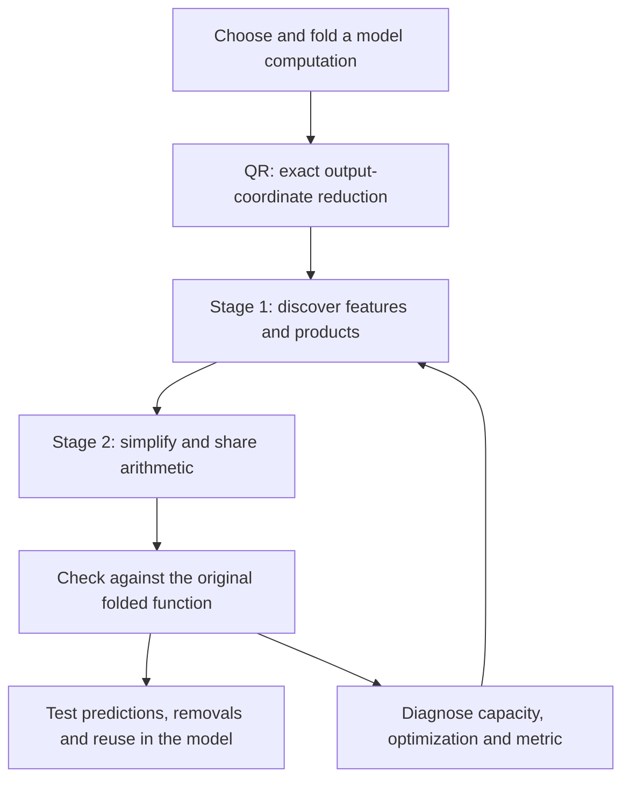

**What the new decomposition experiments taught us**

2026-09-21 2309 UTC. This follows the [22:13 explanation](research_update_2026-09-21_2213_what_changed_after_shared_graph.md), which ended with a proposed larger baseline. That baseline and a wider shared hierarchy have now run. This report covers completed results through the 23:01 research handoff; the next constrained native fit has no result in this snapshot.

**We now have better evidence about the representation and the fitting objective, but still do not have a faithful, simpler causal circuit.** Larger decompositions removed the previous narrow-input bottleneck without solving reconstruction. The strongest positive result came from including the activation mean and covariance: text-state error fell from roughly 40% to 10%. However, that fit became worse at matching the global coefficient tensor, and its component-response tests still failed.

The two-stage proposal remains the direction. Most recent work has concentrated on making stage one produce a sufficiently faithful function for stage two to simplify.

**Where the original plan stands**

For a bilinear MLP, folding the output projection and unembedding gives

$$
F(x)=UD[(Lx)\odot(Rx)].
$$

Here $x$ is the input state, $L$ and $R$ form scalar input projections, $\odot$ multiplies corresponding projections, $D$ writes their products into the residual stream, and $U$ maps that stream to vocabulary logits.

The implementation uses $U=QR_U$, with $Q^\top Q=I$, then folds $R_UD$. We fit in the smaller output coordinates and restore vocabulary outputs with $Q$. This is exact for Euclidean output error; QR itself does not remove products or discover features. It serves the same output-coordinate purpose as your proposed QR of $UD$.

A **joint order-three tensor** contains one output index and two input indices. It describes the whole quadratic interaction, rather than independently compressing $L$, $R$ and $D$. Folding through a second pure bilinear layer creates a **degree-four polynomial**, represented by an **order-five tensor**: one output index and four input indices.

The recent runs fit **the pure quartic branch through MLP16 and MLP17, in 16 fixed output readouts**. Layer numbers are zero-based. Those readouts were selected using data. This is a restricted target, beyond the lossless QR reduction: it is not the full vocabulary-output tensor or the complete two-block computation. Residual cross terms and attention are outside this target. Normalization and softcapping remain explicit in model-level tests.

**Tucker** uses learned input/output bases and an interaction core. **Hierarchical Tucker, or HT,** organizes interactions through a tree over tensor slots. An **arithmetic DAG** permits an intermediate calculation to feed multiple later calculations. The earlier specialized compiler reduced a fitted parent from 656 to 384 products by sharing computations. That result remains valid, but the fitted function had fidelity gaps.

We have structured decompositions and specialized graph simplification. **We have not implemented the complete unrestricted graph-edit search from your proposal.** In particular, the new hierarchy below uses a fixed, seeded connection pattern; it does not yet discover its topology by alternating additions, merges, deletions and refitting.

**What ran after the previous explanation**

We compared two larger representations, both fitted directly against the original weights.

The first is **CP**, a sum of products of four learned linear forms:

$$
\widehat F(x)=\sum_{a=1}^{512}c_a
(p_{a1}^{\top}x)(p_{a2}^{\top}x)(p_{a3}^{\top}x)(p_{a4}^{\top}x).
$$

Each $c_a$ is a vector of 16 output coefficients. This has 512 quartic terms and costs 1,536 variable multiplications. It can access all 1,152 input directions, unlike the previous narrow hierarchy.

The second is a **shared quadratic-feature hierarchy**:

$$
q_i(x)=\sum_{k=1}^{4}(u_{ik}^{\top}x)(v_{ik}^{\top}x),
\qquad
\widehat F(x)=\sum_{(i,j)\in\mathcal S}c_{ij}q_i(x)q_j(x).
$$

It has 144 quadratic features and 512 selected pairs: all 144 squares, plus 368 seeded off-diagonal pairs. Each quadratic feature and selected product is computed once and shared across output readouts. It costs 1,088 products, including the products inside the quadratic features.

For the same target and evaluation panels:

| Representation | Products | Stored float coefficients | Coefficient-entry error | Standard-Gaussian error | Text-state error |
|---|---:|---:|---:|---:|---:|
| Flat CP, two starts | 1,536 | 2,385,920 | 97.78–97.90% | 98.88–98.98% | 39.03–40.87% |
| Shared hierarchy, two starts | 1,088 | 1,353,728 | 96.92–97.22% | 91.50–91.56% | 63.82–65.66% |

Errors are relative norm errors; zero prediction gives 100%. **Coefficient-entry error is measured on sampled entries, not certified full-tensor Frobenius error.** Gaussian error measures function values on fresh synthetic inputs. Text-state error measures the 16 scalar outputs on an already opened text panel, not vocabulary logits or language-model loss.

The hierarchy uses about 29% fewer products and 43% fewer float coefficients than CP, and does better on the coefficient and Gaussian diagnostics. CP does better on text. Neither is accurate globally. Training budgets were unequal: CP used 400 Muon steps and about 260 seconds; the hierarchy used 100 steps and about 883 seconds. A cheaper executable representation was more expensive to fit here.

[CP result](../../direct_tensor_match/QUARTIC_CP512_NATIVE_V2.json) · [Hierarchy interpretation](../../direct_tensor_match/SPARSE_QUARTIC_BANK_INTERPRETATION_V1.md).

**Did the paper's weight-based optimization help? Yes, but it did not by itself recover the circuit.**

We can now compute exact candidate self-inner-products and candidate–teacher cross-inner-products through the weight factors. This avoids materializing the huge tensor and avoids learning only a finite list of sampled outputs. Given fixed feature directions, the output coefficients are solved by linear algebra; the feature directions are optimized separately.

The omitted teacher self-norm is constant during fitting, so its absence does not change the optimizer. It does mean that a large improvement in the raw objective is not a measured proportional reduction in normalized tensor error.

The new toy controls also clarify the optimizer question. Across five planted families—independent products, shared inputs, shared outputs, squares and cancellation—with two starts each, the wider CP setting reached below 1% reconstruction error in **10/10 Muon runs and 8/10 Adam runs**. Widening a separate shared-hierarchy toy setting improved Muon from **1/10 to 10/10**. Thus spare capacity can help optimization even when the smaller model can represent the answer exactly. These are specific small tests, not a universal optimizer ranking or a guarantee for the native model.

The previous narrow representation had a measured capacity obstruction. The larger fits remove that particular obstruction, but their failure can still reflect an inefficient representation, nonconvex optimization, or both. It would be incorrect to conclude that Tucker/HT in general cannot represent the target.

**The largest change came from what “match” means**

Let $H$ be the teacher's quartic coefficient tensor and $\widehat H$ the candidate's. Two different losses are

$$
E_{\mathrm{coeff}}=\|\operatorname{Sym}(H-\widehat H)\|_F^2,
\qquad
E_{\mu,\Sigma}=\mathbb E_{x\sim\mathcal N(\mu,\Sigma)}
\|F(x)-\widehat F(x)\|_2^2.
$$

$\operatorname{Sym}$ averages over input-slot permutations, which describe the same repeated-input polynomial. The second loss weights functional errors by a chosen Gaussian input distribution. For quartics, its lifted metric involves eighth-order input moments. The input covariance $\Sigma$ helps construct that metric under a Gaussian assumption; it is not itself the entire matrix $M$ on quartic tensor coordinates.

We kept the CP feature directions fixed and refitted only their output coefficients using exact Gaussian contractions. The calibration statistics came from 6,144 input states; we did not fit the corresponding empirical output values in these readout experiments.

| Readout fitting objective | Text-state error, two starts | What it showed |
|---|---:|---|
| Coefficient matching | 40.87%, 39.03% | Starting point |
| Standard Gaussian: zero mean, identity covariance | 302.74%, 276.71% | Better synthetic fit can seriously damage text fit |
| Zero mean, calibration covariance | 54.67%, 52.93% | Covariance alone did not help this comparison |
| Calibration mean and covariance | **9.60%, 10.33%** | Including the actual mean made a large difference |
| Zero mean, calibration raw second moment | 15.00%, 15.23% | Matching second moments is not equivalent to matching mean and covariance |

The calibration mean accounts for about **68.6% of average input squared norm**. Centering therefore changes the reference distribution substantially. Exact Gaussian integration removes finite-probe interpolation as an explanation, but a Gaussian remains an approximation to the activation distribution.

The positive result has two important limits. First, the shifted-Gaussian fit worsened coefficient-entry error to roughly **127%**, worse than zero prediction on that diagnostic. Second, the older, data-fitted 384-product program already had **8.13%** text-state error. The new result demonstrates useful data-informed weight matching; it does not beat that cheaper program on aggregate text fidelity.

[Gaussian law comparison and interpretation](../../direct_tensor_match/GAUSSIAN_CP_DATA_READOUT_INTERPRETATION_V1.md).

**Does the improved text fit give us better components? Only partly.**

We rechecked the previously highlighted newline-associated component. “Same-token response” means predicting how its value changes between contexts with the same current token. “Sensitivity-weighted error” gives greater weight to mistakes where the actual downstream logits are more sensitive to that scalar contribution.

| Program | Same-token response error | Sensitivity-weighted error |
|---|---:|---:|
| Older 384-product program | 15.32% | 14.54% |
| Shifted-Gaussian CP, first start | 13.11% | 20.43% |
| Shifted-Gaussian CP, second start | 15.53% | 21.82% |

One start improves the contextual response, but neither reaches 10%, and both worsen the sensitivity-weighted measure. These are local diagnostics, not a new successful finite-removal experiment. The earlier removal failures remain unresolved. Output sharing also still does not guarantee that a learned feature has one semantic meaning.

The positive and negative results both received numerical checks: small dense tensors and independent Gaussian quadrature agree with the contraction formulas and gradients; saved models replay accurately; the native same-token reference was independently checked. These controls make a simple formula or export bug less likely. They do not establish global optimization or semantic identification.

[Component checks](../../direct_tensor_match/GAUSSIAN_CP_COMPONENT_TRANSFER_V1.json).

**What the next test is meant to resolve**

The next implemented experiment fits the shifted-Gaussian objective while limiting how much the coefficient objective may deteriorate:

$$
\min_C L_{\mathrm{Gaussian}}(C)
\quad\text{subject to}\quad
L_{\mathrm{coeff}}(C)-L_{\mathrm{coeff}}(C_0)\le b.
$$

$C$ is the output readout, $C_0$ its coefficient-optimal value for the fixed features, and $b$ an explicit deterioration budget. Both objectives include the stated ridge penalty. The budget is relative to the captured coefficient score, **not a percentage of the unknown full teacher norm**.

For fixed features this is a convex problem. The solver passed 25 small independent comparisons. The native experiment is preregistered, but no native result is included here. It asks whether this particular feature dictionary can deliver a useful compromise, before we spend more computation learning new directions or changing graph topology. It cannot establish an optimum over all arithmetic DAGs.

The research question is now more precise: **can we learn and share features that preserve both the relevant function and its consequential responses, rather than improving one evaluation by sacrificing another?** That is the missing bridge between the decomposition and the reusable circuit we want.

[Next experiment and fixed criteria](../../direct_tensor_match/COEFFICIENT_GUARDED_NATIVE_PLAN_V1.md).

**Reproduction and scope notes**

- Completed native comparisons use two starts per representation. CP uses 512 terms; the hierarchy uses 144 quadratic features with four products each and 512 fixed pairs. The shared hierarchy additionally stores 1,024 integer indices. Float counts include the common output writer.
- Diagnostics use 4,096 sampled coefficient entries, 1,024 standard-Gaussian inputs and 2,048 opened text states. Calibration uses 6,144 states. These panels are not untouched OOD confirmation. Same-token checks use 30 directed comparisons representing 20 unordered pairs, not 30 independent samples.
- The relevant model interface is the normalized MLP16 input and the pure MLP16-to-MLP17 quartic contribution. The 16 readouts remain fixed and data-informed. A representative component condition is a current token containing a newline; this is an association being tested, not an established semantic label.
- Pure coefficient fits learn directions from the original weights with ridge $10^{-6}$. Gaussian readout fits freeze those directions and use calibration input statistics only. They do not add the original residual, attention or mixed-degree terms to the fitted quartic.
- The mathematical/literature review was completed at 22:53, with a separate 22:58 addendum. Its useful consequences were the constrained-readout derivation and a check that removing the small ridge cannot substantially rescue these fixed-feature fits in their own Gaussian norms. [Review](../../THREE_HOURLY_MATHEMATICAL_REVIEW_2026-09-21_2253.md) · [Addendum](../../REVIEW_ADDENDUM_2026-09-21_2258.md).
- A fresh CPU comparison for this report preserves all four larger-model runs and their five cost/error measures. No run dominates all the others on all five measures; this is a descriptive tradeoff, not a statistical conclusion. [Comparison receipt](../../direct_tensor_match/REPORT_COST_TRADEOFF_2026-09-21_2309.json).
