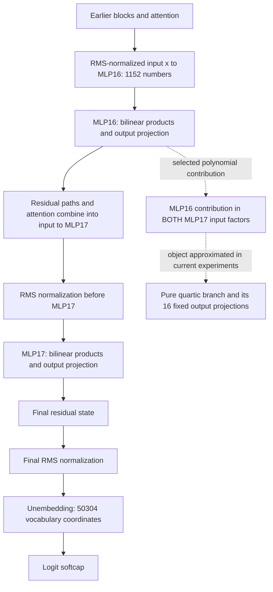
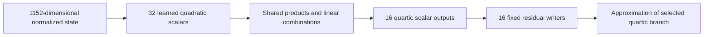

**What we are decomposing, what the 16 features mean, and what has happened**

Written 22 September 2026, 00:00 UTC. This is a contextual review of completed work through the shared-Gaussian readout and finite-removal experiments. The next Gaussian-guided graph-support exchange has passed its CPU preparation checks but has not produced a native result at this cutoff.

**The main result so far.** We can construct smaller arithmetic programs for a selected computation through the final two MLPs, and we now have better approximations of some of its effects inside the running model. We have not yet recovered a small, stable, reusable semantic circuit. The strongest recent improvement comes from combining weight-derived matching with a Gaussian distribution fitted to real hidden-state means and covariances. Pure coefficient matching alone has remained poor at the tested sizes.

The previous reports skipped an essential distinction: the **model computation**, the **approximation of that computation**, and the **features inside the approximation** are three different objects. Here is how they fit together.

**Start with the actual model.** The FineWeb model has 18 blocks, a 1,152-dimensional residual stream, 4,608 multiplicative channels in each bilinear MLP, and 50,304 vocabulary coordinates. We use zero-based block numbering: MLP16 and MLP17 are the seventeenth and eighteenth MLPs, the last two in the network. At one token position, the polynomial part of an MLP is

$$
B_\ell(x)=D_\ell[(L_\ell x)\odot(R_\ell x)].
$$

Here $L_\ell,R_\ell$ each map 1,152 coordinates to 4,608 scalars. The elementwise product multiplies corresponding scalars. $D_\ell$ maps the resulting 4,608 products back to a 1,152-dimensional residual contribution. Earlier attention and MLP computations determine the input state; they are not being decomposed in the current experiment.

The dashed route identifies a term in the computation, not an extra route added to the model.

**Exactly which term are we fitting?** Let $x$ be the actual normalized input to MLP16. Let $\lambda$ denote the relevant learned residual coefficient entering the final block. Define the bias-free contribution

$$
m(x)=\lambda D_{16}[(L_{16}x)\odot(R_{16}x)].
$$

If we write the pre-normalization input to MLP17 as $b+m(x)$, then $b$ collects everything else at that interface. Expanding the bilinear numerator gives

$$
\begin{aligned}
B_{17}(b+m)
={}&D_{17}[(L_{17}b)\odot(R_{17}b)]\\
&+D_{17}[(L_{17}b)\odot(R_{17}m)
 +(L_{17}m)\odot(R_{17}b)]\\
&+\underbrace{D_{17}[(L_{17}m)\odot(R_{17}m)]}_{F_4(x):\ \text{selected pure quartic branch}}.
\end{aligned}
$$

This is a decomposition at an interface; $b$ is not asserted to be independent of $x$. The current target $F_4$ is the final line. Because $m$ is quadratic in $x$, $F_4$ is quartic in $x$. Its coefficients form an order-five tensor: one output index and four input indices. The earlier single-MLP target was quadratic and had an order-three tensor: one output index and two input indices.

We have **not** replaced the entire last two blocks with this quartic. Residual paths, the cross terms above, attention, biases, normalization, and softcapping remain outside this selected polynomial. In native interventions we retain the actual MLP17 normalization denominator and the actual final normalization and softcap. We hold the other contributions fixed at that interface when testing a branch removal.

**Where the unembedding QR fits.** Write the unembedding as $U_{\rm vocab}=QR_U$, with $Q^\top Q=I$. Then

$$
\|U_{\rm vocab}v\|_2=\|R_Uv\|_2.
$$

The implementation factors the unembedding first and folds $R_U$ into the MLP output projection. This lets us measure pre-final-normalization vocabulary-space error in 1,152 coordinates instead of 50,304. It is a lossless coordinate reduction for this linear metric. It is not a discovery of 16 features, nor does it reduce the number of nonlinear products. Final normalization and softcap still make actual logit effects state-dependent.

**What are the 16 shared output features?** They belong to a learned approximation of $F_4$, not to an existing layer with 16 neurons. The original interpretable candidate has

$$
\begin{aligned}
q_i(x)&=\sum_{k=1}^{4}(u_{ik}^{\top}x)(v_{ik}^{\top}x),
&&i=1,\ldots,32,\\
h_g(x)&=\sum_{i\le j}A_{gij}q_i(x)q_j(x),
&&g=0,\ldots,15,\\
\widehat F_4(x)&=\sum_{g=0}^{15}w_g h_g(x).
\end{aligned}
$$

Each $q_i$ is a learned scalar quadratic intermediate. Each $h_g$ is a learned scalar quartic output of this replacement program. Each $w_g\in\mathbb R^{1152}$ is a fixed direction in the residual stream—a **writer**, because multiplying it by $h_g$ specifies what the feature contributes to that stream. The corresponding linear vocabulary direction is $U_{\rm vocab}w_g$.

| Object | How many? | What it belongs to |
|---|---:|---|
| Native multiplicative MLP channels | 4,608 per MLP | Original trained model |
| Input coordinates $x$ | 1,152 | Normalized state entering MLP16 |
| Learned quadratic intermediates $q_i$ | 32 in the original small candidate | Replacement program |
| Learned quartic scalar outputs $h_g$ | 16 | Replacement program |
| Residual writer vectors $w_g$ | 16 vectors of length 1,152 | Fixed output basis selected for that candidate |
| Vocabulary effects $U_{\rm vocab}w_g$ | 16 vectors of length 50,304 | Linear readout of those writers |

“Shared output” means multiple input products can contribute to the same scalar $h_g$ and therefore the same output direction $w_g$. It does not mean we discovered 16 universal language concepts, 16 attention heads, or 16 token classes. A feature can combine several unrelated conditions that happen to have similar output effects.

**Why specifically 16?** We chose it as a compression rank. Starting from a fitted 32-quadratic dictionary, we selected 16 output directions using a weighted singular-value decomposition in the QR output coordinates. The primary selection metric combines calibration values and finite responses of that existing approximation. Thus the directions are data-informed, and the rank-16 choice compresses a fitted parent—not an exact SVD of the full native quartic tensor. An earlier eight-direction candidate was insufficient; 16 preserved the parent more successfully. This establishes neither that 16 is minimal nor that the true branch has rank 16.

The [construction code](../../../bilinear_quotient/ops/run_expanded_root_compression_v1.py) and [projection implementation](../../direct_tensor_match/weighted_output_projection.py) make this explicit. A new CPU audit confirms the saved writer has shape $1152\times16$, and its vocabulary directions are orthonormal to about $2.0\times10^{-7}$ maximum entry error. They are not orthonormal in the ordinary residual-space metric. See [audit](../../direct_tensor_match/SHARED_FEATURE_CONTEXT_AUDIT_V1.json).

The graph compiler rewrote the candidate from 656 to 384 variable-variable products while retaining its fitted function to numerical tolerance. It also reduced stored floating coefficients from 903,168 to 322,048, plus 768 indices. These counts include linear coefficients; “384 products” does not mean 384 total machine instructions. An exact rewrite of an approximation remains an approximation of the model.

**How this relates to your two-stage proposal.** Stage one discovers useful factors and intermediates by fitting a tensor representation. Stage two converts them into a graph, shares computations, changes connections, and refits. We have implemented meaningful pieces of both stages: learned input directions, output-sharing quadratic forms, paired-form compilation, planted sharing controls, and later discrete product-support exchanges. We do not yet have a successful unrestricted arithmetic-program search that produces validated circuits from this target.

Tucker shares an input dictionary and connects it through a core. A hierarchy computes intermediate features before further products. Standard HT groups tensor slots in a tree; a reusable arithmetic DAG can share one intermediate across branches. Our shared quadratic dictionaries are a particular hierarchy/DAG family, not a claim that ordinary HT automatically performs arbitrary graph optimization.

**What happened after the small graph.** There were four important developments.

1. **We separated architectural limits from fitting failures.** Small planted examples exposed sensitivity to width, initialization, optimizer and learning rate. For one five-family, two-restart CP control, increasing spare rank and using the tested larger learning rate gave Muon 10/10 recoveries below 1% error and Adam 8/10. Other control families behaved differently. On native weights, finite contraction tests also showed that a narrow input span cannot recover the selected global polynomial accurately. That is evidence against a particular budget, not proof that Tucker or HT is intrinsically unsuitable.

2. **We implemented weight-derived losses that do not need an expanded tensor.** Student self-inner-products and teacher–student cross-inner-products allow direct optimization from the factors. This removed an important failure mode of finite synthetic-probe training: a candidate could fit its training probes well and fail on fresh ones. Exact coefficient fitting still gave roughly 97–98% sampled relative coefficient error for the tested larger native candidates. Better loss computation did not make the global polynomial small.

3. **The distribution used to judge functional error mattered enormously.** Isotropic Gaussian fitting, a centered empirical covariance, and the empirical mean plus covariance gave very different results. Refitting a fixed CP dictionary under the mean-plus-covariance Gaussian reduced text-state error from roughly 40% to roughly 10%. Covariance alone did not do that. This uses data information about hidden states, while target values and contractions still come from weights. A quartic squared-error metric involves moments up to degree eight; the Gaussian assumption supplies those moments. An input covariance is not, by itself, the entire lifted feature metric.

4. **Joint feature learning improved particular native effects, at a larger cost.** Starting from the Gaussian-informed fit and then moving the input directions produced the strongest current CP candidates. The shared hierarchy also improved when its readout used the same Gaussian information, but it remains worse on the component tests.

**The current comparison.** These text-state errors compare the same 16 fixed scalar output projections on the opened evaluation panel. They are not whole-model logit errors or full-tensor Frobenius errors. Ranges show the two tested starts where applicable.

| Candidate | Variable-variable products | Stored floating coefficients | Relative error on 16 text-state outputs |
|---|---:|---:|---:|
| Original empirical shared graph | 384 | 322,048 | 8.13% |
| Larger CP, coefficient-only fit | 1,536 | 2,385,920 | 39.03–40.87% |
| CP, guarded Gaussian readout | 1,536 | 2,385,920 | 9.79–10.03% |
| CP, joint mixed-objective feature learning | 1,536 | 2,385,920 | **6.32–6.59%** |
| Wider shared hierarchy, coefficient-guided graph edits | 1,088 | 1,353,728 | 64.09–65.67% |
| Same hierarchy, guarded Gaussian readout | 1,088 | 1,353,728 | 20.00–21.06% |
| Same hierarchy, unconstrained Gaussian readout | 1,088 | 1,353,728 | 13.00–14.57% |

The unconstrained hierarchy achieves better text fidelity by allowing much worse coefficient matching: sampled relative coefficient error rises above 280%. That is a tradeoff, not an all-purpose improvement. Conversely, the 384-product graph remains an important small empirical baseline. Its 8.13% error here should not be confused with its earlier 13.61% error on the full quartic output: those use different targets and denominators.

The newer CP and hierarchy models retain the same 16 output targets so comparisons are meaningful. Their internal factors are different. A “term 1” in a new CP fit is not the original shared feature $h_1$.

**What happened to the interesting newline feature?** The original graph's $h_1$ is strongly associated with the current token being a newline. That gave us an operational component to investigate: the native quartic branch projected onto the corresponding fixed writer. The [rewritten feature-conditions report](research_update_2026-09-21_2112_shared_feature_conditions.md) explains the association, writer and intervention separately.

The newer CP approximations now reproduce removal of that native projection much better on newline positions: actual final-logit change errors are about **5.3–7.6%**, versus roughly **26–31%** for the original small graph. We tested quarter and full removal on previously opened FineWeb and code panels. Every newline cell was below 10%; other-token cells still included failures, and the registered across-all-cells criterion failed.

This is progress in executing a specified component intervention. It does not establish a capitalization circuit. The native component's capitalization effects were not sufficiently selective or consistent across domains. A strong newline association and an accurate replacement can coexist with an incorrect semantic interpretation.

**What remains open.** Coefficient fidelity across general inputs is poor; several intervention criteria fail; the best recent candidate is larger than the original graph; and different fits do not recover reliably identical internal units. Recently, changing just 16 root-product choices in the wider hierarchy improved its coefficient capture only slightly. A CPU oracle also showed that one fixed 512-product dictionary cannot reach the desired sensitivity error even with an evaluation-informed optimal readout. This motivates changing the dictionary, not simply fitting its output weights longer. That oracle is a finite-panel diagnostic, not a theorem about all possible DAGs.

The next prepared experiment changes root-product choices using the mixed Gaussian/weight metric. Beyond that, the research question remains the one you proposed: can continuous feature learning and discrete algebraic reuse jointly produce a smaller program that survives new contexts, selective interventions and composition? We have evidence that the metric and feature dictionary matter, and one improved intervention approximation. We do not yet have the complete circuit result.

**Result sources.** The numerical comparisons come from [CP weight fitting](../../direct_tensor_match/QUARTIC_CP512_NATIVE_V2.json), [guarded readouts](../../direct_tensor_match/COEFFICIENT_GUARDED_NATIVE_V1.json), [joint CP learning](../../direct_tensor_match/MIXED_CP_FEATURES_INTERPRETATION_V1.md), [native removals](../../direct_tensor_match/MIXED_CP_REMOVAL_INTERPRETATION_V1.md), [graph-support edits](../../direct_tensor_match/SPARSE_SUPPORT_EXCHANGE_INTERPRETATION_V1.md), and [shared Gaussian readouts](../../direct_tensor_match/SHARED_GAUSSIAN_READOUT_INTERPRETATION_V1.md). The [fixed-dictionary capacity audit](../../direct_tensor_match/SHARED_RESPONSE_CAPACITY_V1.json) separates an output-refitting limit from a failure of all larger architectures.
